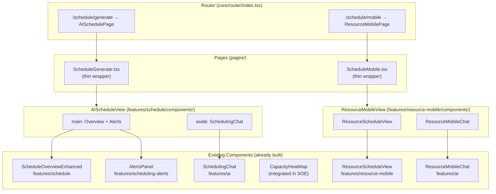
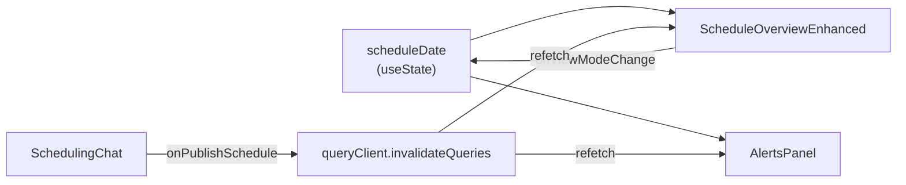

# Design Document: AI Scheduling Page Routing

## Overview

This feature composes existing, already-built AI scheduling components into two new page views and registers them with the router. No new components are created — this is purely a composition and routing concern.

The two pages are:

1. **AI Schedule Admin Page** (`/schedule/generate`) — Replaces the current `ScheduleGeneratePage` wrapper. Composes `ScheduleOverviewEnhanced` (with integrated `CapacityHeatMap`), `AlertsPanel`, and `SchedulingChat` into a sidebar layout where the chat is a persistent right panel and the overview + alerts fill the main content area.

2. **Resource Mobile Page** (`/schedule/mobile`) — New route. Composes `ResourceScheduleView` and `ResourceMobileChat` in a mobile-first stacked layout for field technicians.

Both pages follow the project's thin page-wrapper pattern: a page file in `frontend/src/pages/` imports and renders a composed view from the feature layer. The router lazy-loads these pages using the existing `lazy(() => import(...))` pattern within the `ProtectedLayoutWrapper`.

Key design decisions:
- **Shared `scheduleDate` state via `useState`** — The admin page manages a single `scheduleDate` state passed to both `ScheduleOverviewEnhanced` and `AlertsPanel`. No global state or context needed since the state is local to one page.
- **Error boundary isolation** — `SchedulingChat` errors do not crash the overview/alerts. A React error boundary wraps the chat sidebar so the main content remains functional.
- **CSS Grid for admin layout** — The admin page uses a CSS grid with `grid-template-columns: 1fr 380px` to create the main content area and fixed-width chat sidebar.
- **No Layout changes** — The "Generate Routes" nav item already points to `/schedule/generate` and will continue to work. No sidebar navigation changes needed.

## Architecture



### Admin Page Layout Structure

```
┌─────────────────────────────────────────────────────────────┐
│ Layout (sidebar nav + header — already exists)              │
│ ┌─────────────────────────────────────────────────────────┐ │
│ │ AIScheduleView  [data-testid="ai-schedule-page"]        │ │
│ │ CSS Grid: 1fr 380px                                     │ │
│ │ ┌───────────────────────────┐ ┌───────────────────────┐ │ │
│ │ │ <main>                    │ │ <aside>               │ │ │
│ │ │                           │ │                       │ │ │
│ │ │ ScheduleOverviewEnhanced  │ │ SchedulingChat        │ │ │
│ │ │ (with CapacityHeatMap)    │ │ (persistent sidebar)  │ │ │
│ │ │                           │ │                       │ │ │
│ │ │ ─────────────────────     │ │                       │ │ │
│ │ │                           │ │                       │ │ │
│ │ │ AlertsPanel               │ │                       │ │ │
│ │ │ (date-filtered)           │ │                       │ │ │
│ │ │                           │ │                       │ │ │
│ │ └───────────────────────────┘ └───────────────────────┘ │ │
│ └─────────────────────────────────────────────────────────┘ │
└─────────────────────────────────────────────────────────────┘
```

### Mobile Page Layout Structure

```
┌───────────────────────────┐
│ Layout (header)           │
│ ┌───────────────────────┐ │
│ │ ResourceMobileView    │ │
│ │ [data-testid=         │ │
│ │  "resource-mobile-    │ │
│ │   page"]              │ │
│ │                       │ │
│ │ ResourceScheduleView  │ │
│ │ (daily route cards)   │ │
│ │                       │ │
│ │ ─────────────────     │ │
│ │                       │ │
│ │ ResourceMobileChat    │ │
│ │ (field assistant)     │ │
│ │                       │ │
│ └───────────────────────┘ │
└───────────────────────────┘
```

## Components and Interfaces

### New Files

All new files are thin composition layers. No new business logic or API calls.

#### 1. `frontend/src/features/schedule/components/AIScheduleView.tsx`

The composed admin page view. Manages shared state and wires component props.

```typescript
interface AIScheduleViewProps {}

// Internal state:
// - scheduleDate: string (ISO date, defaults to today)
// - Derived week title, days array, etc. from scheduleDate

// Component composition:
// - ScheduleOverviewEnhanced: receives schedule data props + onViewModeChange callback
// - AlertsPanel: receives scheduleDate prop for date-filtered alerts
// - SchedulingChat: receives onPublishSchedule callback to refresh overview data
// - ErrorBoundary wraps SchedulingChat to isolate chat failures
```

Props wiring:
- `ScheduleOverviewEnhanced` — receives `weekTitle`, `resources`, `days`, `cells`, `capacityData` from TanStack Query hooks, and `onViewModeChange` to update the date range
- `AlertsPanel` — receives `scheduleDate` as ISO string for date filtering
- `SchedulingChat` — receives `onPublishSchedule` callback that triggers query invalidation on the schedule data

#### 2. `frontend/src/features/resource-mobile/components/ResourceMobileView.tsx`

The composed mobile page view.

```typescript
interface ResourceMobileViewProps {}

// Component composition:
// - ResourceScheduleView: renders with default params (current day)
// - ResourceMobileChat: renders below the schedule view
```

#### 3. `frontend/src/pages/ScheduleGenerate.tsx` (modified)

Updated to import `AIScheduleView` instead of `ScheduleGenerationPage`.

```typescript
// Before:
import { ScheduleGenerationPage } from '@/features/schedule';
export function ScheduleGeneratePage() {
  return <ScheduleGenerationPage />;
}

// After:
import { AIScheduleView } from '@/features/schedule';
export function ScheduleGeneratePage() {
  return <AIScheduleView />;
}
```

#### 4. `frontend/src/pages/ScheduleMobile.tsx` (new)

New thin page wrapper for the resource mobile view.

```typescript
import { ResourceMobileView } from '@/features/resource-mobile';
export function ScheduleMobilePage() {
  return <ResourceMobileView />;
}
```

#### 5. `frontend/src/core/router/index.tsx` (modified)

Add lazy import for `ScheduleMobilePage` and register the `/schedule/mobile` route. The existing `/schedule/generate` route already exists and will render the updated `ScheduleGeneratePage`.

```typescript
// New lazy import:
const ScheduleMobilePage = lazy(() =>
  import('@/pages/ScheduleMobile').then((m) => ({
    default: m.ScheduleMobilePage,
  }))
);

// New route (added after the existing /schedule/generate route):
{
  path: 'schedule/mobile',
  element: <ScheduleMobilePage />,
}
```

### Modified Files (exports only)

#### 6. `frontend/src/features/schedule/index.ts`

Add `AIScheduleView` to the components export list.

#### 7. `frontend/src/features/resource-mobile/index.ts`

Add `ResourceMobileView` to the components export list.

### Data Flow

#### Admin Page Data Flow



1. `AIScheduleView` holds `scheduleDate` state (defaults to today's ISO date)
2. `scheduleDate` is passed to `ScheduleOverviewEnhanced` (for grid data) and `AlertsPanel` (for date filtering)
3. When the user changes the week/view in `ScheduleOverviewEnhanced`, the `onViewModeChange` callback updates `scheduleDate`
4. When `SchedulingChat`'s "Publish Schedule" button is clicked, `onPublishSchedule` triggers `queryClient.invalidateQueries` on schedule and alert query keys, causing both components to refetch

#### Mobile Page Data Flow

1. `ResourceMobileView` renders `ResourceScheduleView` with no params (defaults to current day)
2. `ResourceMobileChat` is independent — it manages its own chat session state internally
3. Both components fetch their own data via their internal TanStack Query hooks

### Error Boundary Strategy

The admin page wraps `SchedulingChat` in a React error boundary:

```typescript
<ErrorBoundary fallback={<ChatErrorFallback />}>
  <SchedulingChat onPublishSchedule={handlePublishSchedule} />
</ErrorBoundary>
```

If the chat crashes, the fallback renders a simple "Chat unavailable" message with a retry button. The `ScheduleOverviewEnhanced` and `AlertsPanel` continue rendering normally since they are outside the error boundary.

The mobile page does not need an error boundary since both components are vertically stacked and a crash in either would be visible. Standard TanStack Query error states handle API failures.

## Data Models

No new data models are introduced. This feature composes existing components that already have their own data fetching via TanStack Query hooks:

- `ScheduleOverviewEnhanced` — data provided by parent via props (resources, days, cells, capacityData). The parent `AIScheduleView` will use existing hooks (`useWeeklySchedule`, `useScheduleCapacity`, etc.) to fetch and transform this data.
- `AlertsPanel` — internally uses `useAlerts({ schedule_date, status: 'active' })` hook
- `SchedulingChat` — internally uses `useSchedulingChat()` mutation hook
- `ResourceScheduleView` — internally uses `useResourceSchedule(params)` hook
- `ResourceMobileChat` — internally uses `useSchedulingChat()` mutation hook

### Shared State Shape

The only new state is the `scheduleDate` managed by `AIScheduleView`:

```typescript
const [scheduleDate, setScheduleDate] = useState<string>(
  new Date().toISOString().split('T')[0] // "2025-03-15"
);
```

This is a plain ISO date string passed as a prop to child components. No new types, contexts, or stores are needed.


## Correctness Properties

*A property is a characteristic or behavior that should hold true across all valid executions of a system — essentially, a formal statement about what the system should do. Properties serve as the bridge between human-readable specifications and machine-verifiable correctness guarantees.*

### Property 1: Admin Page Composition Structure

*For any* render of `AIScheduleView`, the resulting DOM SHALL contain:
- A root element with `data-testid="ai-schedule-page"`
- A `<main>` landmark element containing both `[data-testid="schedule-overview-enhanced"]` and `[data-testid="alerts-panel"]`, with the alerts panel appearing after the overview in document order
- An `<aside>` landmark element containing `[data-testid="scheduling-chat"]`
- A visually hidden `<h1>` heading element for screen reader navigation

**Validates: Requirements 1.1, 1.2, 1.3, 6.1, 6.3, 6.4**

### Property 2: Shared Schedule Date Propagation

*For any* ISO date string set as the `scheduleDate` state in `AIScheduleView`, both the `ScheduleOverviewEnhanced` component and the `AlertsPanel` component SHALL receive that same date value as a prop, ensuring date-synchronized display.

**Validates: Requirements 1.6, 5.2**

### Property 3: Date Context Update on View Change

*For any* view mode change triggered in `ScheduleOverviewEnhanced` (day, week, or month), the `AIScheduleView` SHALL update its `scheduleDate` state, and the updated date SHALL propagate to the `AlertsPanel` component.

**Validates: Requirements 5.3**

### Property 4: Mobile Page Composition Structure

*For any* render of `ResourceMobileView`, the resulting DOM SHALL contain:
- A root element with `data-testid="resource-mobile-page"`
- `[data-testid="resource-schedule-view"]` appearing before `[data-testid="resource-mobile-chat"]` in document order (vertically stacked)

**Validates: Requirements 3.1, 3.2, 6.2**

### Property 5: Chat Error Isolation

*For any* error thrown by the `SchedulingChat` component, the `AIScheduleView` SHALL continue rendering both `[data-testid="schedule-overview-enhanced"]` and `[data-testid="alerts-panel"]` without disruption. The error SHALL be contained within the `<aside>` boundary.

**Validates: Requirements 5.5**

## Error Handling

### Admin Page (`AIScheduleView`)

| Error Source | Handling | User Experience |
|---|---|---|
| `SchedulingChat` throws/crashes | React ErrorBoundary wraps the `<aside>`. Fallback shows "Chat unavailable" with retry button. | Overview + alerts continue working. Chat panel shows fallback. |
| `ScheduleOverviewEnhanced` data fetch fails | TanStack Query `error` state handled inside the component (existing behavior). | Component shows its own error state. Chat and alerts unaffected. |
| `AlertsPanel` data fetch fails | TanStack Query `error` state handled inside the component (existing behavior — shows "Failed to load alerts. Retrying…"). | Alerts show error message. Overview and chat unaffected. |
| `scheduleDate` is invalid | Default to today's date. The `useState` initializer uses `new Date().toISOString().split('T')[0]`. | Always starts with a valid date. |

### Mobile Page (`ResourceMobileView`)

| Error Source | Handling | User Experience |
|---|---|---|
| `ResourceScheduleView` data fetch fails | Handled internally (shows "Failed to load schedule"). | Chat still usable. |
| `ResourceMobileChat` mutation fails | Handled internally (shows error alert). | Schedule view unaffected. |

No new error types or error handling infrastructure is needed. All components already handle their own API errors via TanStack Query's built-in error states.

## Testing Strategy

### Unit Tests (Vitest + React Testing Library)

Unit tests verify specific rendering examples and edge cases:

1. **AIScheduleView renders all three child components** — Render with mocked query data, assert all three `data-testid` values are present in the DOM.
2. **AIScheduleView passes scheduleDate to AlertsPanel** — Render, verify AlertsPanel receives the current date prop.
3. **AIScheduleView error boundary catches chat crash** — Mock SchedulingChat to throw, verify overview and alerts still render, verify fallback message appears.
4. **ResourceMobileView renders schedule and chat** — Render with mocked data, assert both `data-testid` values present.
5. **ScheduleGeneratePage renders AIScheduleView** — Verify the thin wrapper renders the composed view.
6. **ScheduleMobilePage renders ResourceMobileView** — Verify the thin wrapper renders the composed view.
7. **Router includes /schedule/generate route** — Verify route config contains the path.
8. **Router includes /schedule/mobile route** — Verify route config contains the path.

### Property-Based Tests (fast-check)

Property-based tests use `fast-check` (the standard PBT library for TypeScript/Vitest) to verify universal properties across generated inputs. Each test runs a minimum of 100 iterations.

Each property test MUST reference its design document property with a comment tag:
- **Feature: ai-scheduling-page-routing, Property 1: Admin page composition structure**
- **Feature: ai-scheduling-page-routing, Property 2: Shared schedule date propagation**
- **Feature: ai-scheduling-page-routing, Property 3: Date context update on view change**
- **Feature: ai-scheduling-page-routing, Property 4: Mobile page composition structure**
- **Feature: ai-scheduling-page-routing, Property 5: Chat error isolation**

Property test approach:

- **Property 1 (Admin composition)**: Generate random schedule data (resources, days, cells, capacity arrays) via `fc.record` arbitraries. For each generated dataset, render `AIScheduleView` with mocked query hooks returning that data. Assert the DOM structure invariants (main, aside, testids, h1).

- **Property 2 (Date propagation)**: Generate random ISO date strings via `fc.date()` mapped to ISO format. For each date, set it as the scheduleDate state and verify both child components receive it as a prop.

- **Property 3 (Date update on view change)**: Generate random sequences of view mode changes (`fc.array(fc.constantFrom('day', 'week', 'month'))`). For each sequence, simulate the view mode changes and verify the AlertsPanel's scheduleDate prop updates after each change.

- **Property 4 (Mobile composition)**: Generate random resource schedule data. For each dataset, render `ResourceMobileView` with mocked hooks and assert the DOM ordering invariant.

- **Property 5 (Error isolation)**: Generate random Error objects (`fc.string().map(msg => new Error(msg))`). For each error, mock SchedulingChat to throw that error, render AIScheduleView, and verify overview + alerts testids remain in the DOM.

### Test File Locations

Following the project's co-located test pattern:

- `frontend/src/features/schedule/components/AIScheduleView.test.tsx` — Unit + property tests for admin page
- `frontend/src/features/resource-mobile/components/ResourceMobileView.test.tsx` — Unit + property tests for mobile page
- `frontend/src/pages/ScheduleGenerate.test.tsx` — Thin wrapper test
- `frontend/src/pages/ScheduleMobile.test.tsx` — Thin wrapper test
