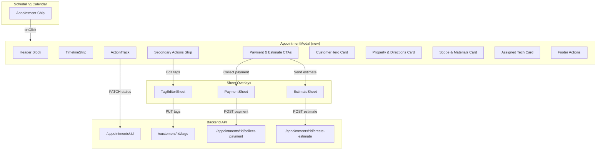
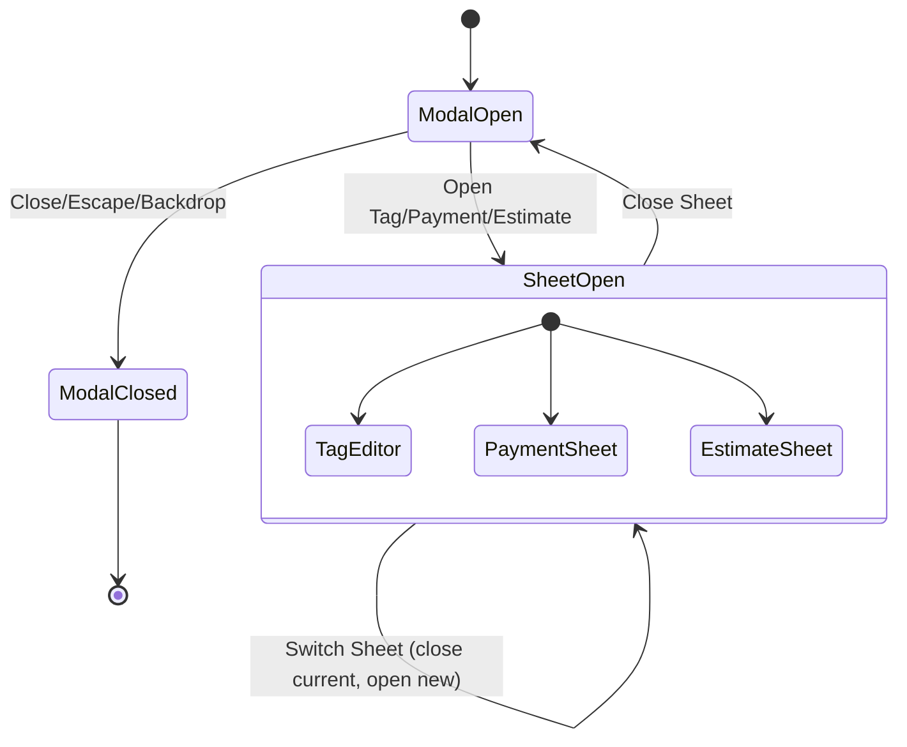

# Design Document: Combined Appointment Modal

## Overview

The Combined Appointment Modal replaces the existing `AppointmentDetail.tsx` (~941 lines) with a high-fidelity, design-spec-driven modal that consolidates the entire on-site appointment workflow into a single interface. The modal is opened from the scheduling calendar when staff tap an appointment chip.

**Key capabilities:**
- 4-step visual timeline (Booked → En route → On site → Done) with timestamps
- 3-card action track for status progression with optimistic updates
- Customer hero card with tags row, phone, email, and history
- Customer tags management via a dedicated sheet editor (tags are customer-scoped, not appointment-scoped)
- Maps-app picker (Apple Maps / Google Maps) for directions
- Payment collection and estimate creation via sheet overlays reusing existing hooks
- All existing functionality preserved: communication timeline, reschedule banners, no-reply review, opt-out badge, cancel dialog, edit flow, no-show, duration metrics

**Backend additions:**
- New `customer_tags` table with UUID PK, customer FK, label, tone, source, created_at
- New `GET /api/v1/customers/{id}/tags` and `PUT /api/v1/customers/{id}/tags` endpoints
- Alembic migration for the new table

**What this design does NOT change:**
- The scheduling calendar view that opens the modal
- The payment/estimate flow logic (reused as-is via existing hooks)
- The customer profile page (tags will appear there too, using the same Tag chip component)
- Backend appointment status transition logic (existing mutations are reused)

---

## Architecture

### High-Level Data Flow



### State Management Architecture

The modal uses a combination of:
1. **TanStack Query** for server state (appointment data, customer data, tags, timeline)
2. **Local React state** for UI state (which sheet is open, maps popover, tag editor draft)
3. **Optimistic updates** for status transitions and tag saves



### Component Tree

```
AppointmentModal (Dialog root)
├── ModalHeader
│   ├── StatusBadge
│   ├── MetaChips (property type, appointment ID)
│   ├── JobTitle (H1)
│   ├── ScheduleLine (date/time)
│   └── CloseButton
├── RescheduleBanner (conditional)
├── NoReplyBanner (conditional)
├── TimelineStrip
│   └── TimelineDot × 4
├── ActionTrackSection
│   ├── ActionTrack
│   │   └── ActionCard × 3
│   └── SecondaryActionsStrip
│       └── LinkButton × 4 (Add photo, Notes, Review, Edit tags)
├── PaymentEstimateCTAs
│   ├── CollectPaymentButton
│   └── SendEstimateButton
├── CustomerHero
│   ├── HeroHeader (avatar, name, history)
│   ├── TagsRow → TagChip × N
│   ├── PhoneRow
│   └── EmailRow
├── PropertyDirectionsCard
│   ├── AddressBlock
│   ├── GetDirectionsButton
│   └── MapsPickerPopover (conditional)
├── ScopeMaterialsCard
├── AssignedTechCard
├── CommunicationTimeline (existing)
├── DurationMetrics (conditional, completed only)
├── ModalFooter
│   ├── EditButton
│   ├── NoShowButton
│   └── CancelButton
└── SheetOverlay (conditional, one at a time)
    ├── TagEditorSheet
    ├── PaymentSheet (existing flow, new wrapper)
    └── EstimateSheet (existing flow, new wrapper)
```

---

## Components and Interfaces

### New Components to Create

| Component | File | Purpose |
|---|---|---|
| `AppointmentModal` | `AppointmentModal.tsx` | Root modal container, replaces `AppointmentDetail.tsx` |
| `ModalHeader` | `AppointmentModal/ModalHeader.tsx` | Status badge, meta chips, title, schedule, close button |
| `TimelineStrip` | `AppointmentModal/TimelineStrip.tsx` | 4-dot connected timeline with timestamps |
| `ActionTrack` | `AppointmentModal/ActionTrack.tsx` | 3-card status progression (On my way / Job started / Job complete) |
| `ActionCard` | `AppointmentModal/ActionCard.tsx` | Individual action card (active/disabled/done states) |
| `SecondaryActionsStrip` | `AppointmentModal/SecondaryActionsStrip.tsx` | Add photo, Notes, Review, Edit tags buttons |
| `CustomerHero` | `AppointmentModal/CustomerHero.tsx` | Customer avatar, name, history, tags, phone, email |
| `PropertyDirectionsCard` | `AppointmentModal/PropertyDirectionsCard.tsx` | Address + Get directions button |
| `MapsPickerPopover` | `AppointmentModal/MapsPickerPopover.tsx` | Apple Maps / Google Maps selection popover |
| `ScopeMaterialsCard` | `AppointmentModal/ScopeMaterialsCard.tsx` | Job scope, duration, staff, priority, materials |
| `AssignedTechCard` | `AppointmentModal/AssignedTechCard.tsx` | Tech name, route, reassign button |
| `ModalFooter` | `AppointmentModal/ModalFooter.tsx` | Edit, No show, Cancel actions |
| `TagChip` | `shared/components/TagChip.tsx` | Reusable tag pill (static + removable variants) |
| `TagEditorSheet` | `AppointmentModal/TagEditorSheet.tsx` | Full tag editor with current/suggested/custom |
| `SheetContainer` | `shared/components/SheetContainer.tsx` | Reusable 560px sheet overlay with grab handle, header, body, footer |
| `LinkButton` | `AppointmentModal/LinkButton.tsx` | 44px min-height button with icon + label, design-spec styling |
| `PaymentSheetWrapper` | `AppointmentModal/PaymentSheetWrapper.tsx` | Wraps existing PaymentCollector in SheetContainer |
| `EstimateSheetWrapper` | `AppointmentModal/EstimateSheetWrapper.tsx` | Wraps existing EstimateCreator in SheetContainer |

### Existing Components to Reuse (unchanged)

| Component | Current Location | Usage |
|---|---|---|
| `AppointmentCommunicationTimeline` | `schedule/components/` | Rendered inside modal body |
| `CancelAppointmentDialog` | `schedule/components/` | Opened from footer Cancel button |
| `AppointmentForm` | `schedule/components/` | Opened from footer Edit button |
| `SendConfirmationButton` | `schedule/components/` | Shown for draft appointments |
| `OptOutBadge` | `shared/components/` | Shown when customer opted out |
| `PaymentCollector` | `schedule/components/` | Reused inside PaymentSheetWrapper |
| `EstimateCreator` | `schedule/components/` | Reused inside EstimateSheetWrapper |

### Existing Hooks to Reuse

| Hook | File | Usage |
|---|---|---|
| `useAppointment` | `useAppointments.ts` | Fetch appointment detail |
| `useAppointmentTimeline` | `useAppointmentTimeline.ts` | Fetch communication timeline |
| `useMarkAppointmentEnRoute` | `useAppointmentMutations.ts` | Step 0→1 transition |
| `useMarkAppointmentArrived` | `useAppointmentMutations.ts` | Step 1→2 transition |
| `useMarkAppointmentCompleted` | `useAppointmentMutations.ts` | Step 2→3 transition |
| `useMarkAppointmentNoShow` | `useAppointmentMutations.ts` | No-show action |
| `useCancelAppointment` | `useAppointmentMutations.ts` | Cancel action |
| `useCollectPayment` | `useAppointmentMutations.ts` | Payment collection |
| `useCreateEstimateFromAppointment` | `useAppointmentMutations.ts` | Estimate creation |
| `useRescheduleFromRequest` | `useAppointmentMutations.ts` | Reschedule handling |

### New Hooks to Create

| Hook | File | Purpose |
|---|---|---|
| `useCustomerTags` | `schedule/hooks/useCustomerTags.ts` | `GET /customers/{id}/tags` query |
| `useSaveCustomerTags` | `schedule/hooks/useCustomerTags.ts` | `PUT /customers/{id}/tags` mutation with optimistic update |
| `useModalState` | `schedule/hooks/useModalState.ts` | Local state: `openSheet`, `mapsPopover`, step derivation |

### New Backend Components

| Component | File | Purpose |
|---|---|---|
| `CustomerTag` model | `models/customer_tag.py` | SQLAlchemy model for `customer_tags` table |
| `CustomerTagRepository` | `repositories/customer_tag_repository.py` | CRUD operations for tags |
| `CustomerTagService` | `services/customer_tag_service.py` | Business logic: diff-based save, system tag protection |
| Tag schemas | `schemas/customer_tag.py` | Pydantic request/response schemas |
| Tag API endpoints | `api/v1/customers.py` (extend) | `GET` and `PUT` tag endpoints on existing customer router |
| Alembic migration | `migrations/versions/xxx_add_customer_tags.py` | Create `customer_tags` table |

### Key Interfaces

```typescript
// Frontend types (new)
type TagTone = 'neutral' | 'blue' | 'green' | 'amber' | 'violet';
type TagSource = 'manual' | 'system';

interface CustomerTag {
  id: string;
  label: string;
  tone: TagTone;
  source: TagSource;
  created_at: string;
}

interface TagSaveRequest {
  tags: Array<{ label: string; tone: TagTone }>;
}

interface TagSaveResponse {
  tags: CustomerTag[];
  system_tags_preserved: number;
}

// Modal state
type OpenSheet = null | 'payment' | 'estimate' | 'tags';

interface ModalState {
  openSheet: OpenSheet;
  mapsPopoverOpen: boolean;
}

// Step derivation (pure function, no state)
type Step = 0 | 1 | 2 | 3;

function deriveStep(status: AppointmentStatus): Step | null {
  switch (status) {
    case 'confirmed':
    case 'scheduled': return 0;
    case 'en_route': return 1;
    case 'in_progress': return 2;
    case 'completed': return 3;
    default: return null; // pending, draft, cancelled, no_show
  }
}
```

---

## Data Models

### New: `customer_tags` Table

```sql
CREATE TABLE customer_tags (
    id          UUID PRIMARY KEY DEFAULT gen_random_uuid(),
    customer_id UUID NOT NULL REFERENCES customers(id) ON DELETE CASCADE,
    label       VARCHAR(32) NOT NULL,
    tone        VARCHAR(10) NOT NULL CHECK (tone IN ('neutral', 'blue', 'green', 'amber', 'violet')),
    source      VARCHAR(10) NOT NULL CHECK (source IN ('manual', 'system')) DEFAULT 'manual',
    created_at  TIMESTAMPTZ NOT NULL DEFAULT now(),
    UNIQUE (customer_id, label)
);

CREATE INDEX idx_customer_tags_customer_id ON customer_tags(customer_id);
```

### SQLAlchemy Model

```python
# src/grins_platform/models/customer_tag.py
class CustomerTag(Base):
    __tablename__ = "customer_tags"

    id: Mapped[UUID] = mapped_column(PGUUID(as_uuid=True), primary_key=True, server_default=func.gen_random_uuid())
    customer_id: Mapped[UUID] = mapped_column(PGUUID(as_uuid=True), ForeignKey("customers.id", ondelete="CASCADE"), nullable=False)
    label: Mapped[str] = mapped_column(String(32), nullable=False)
    tone: Mapped[str] = mapped_column(String(10), nullable=False)
    source: Mapped[str] = mapped_column(String(10), nullable=False, default="manual")
    created_at: Mapped[datetime] = mapped_column(DateTime(timezone=True), nullable=False, server_default=func.now())

    customer: Mapped["Customer"] = relationship("Customer", back_populates="tags")

    __table_args__ = (
        UniqueConstraint("customer_id", "label", name="uq_customer_tags_customer_label"),
        CheckConstraint("tone IN ('neutral', 'blue', 'green', 'amber', 'violet')", name="ck_customer_tags_tone"),
        CheckConstraint("source IN ('manual', 'system')", name="ck_customer_tags_source"),
    )
```

### Pydantic Schemas

```python
# src/grins_platform/schemas/customer_tag.py
class TagTone(str, Enum):
    NEUTRAL = "neutral"
    BLUE = "blue"
    GREEN = "green"
    AMBER = "amber"
    VIOLET = "violet"

class TagSource(str, Enum):
    MANUAL = "manual"
    SYSTEM = "system"

class CustomerTagResponse(BaseModel):
    model_config = ConfigDict(from_attributes=True)
    id: UUID
    label: str
    tone: TagTone
    source: TagSource
    created_at: datetime

class TagInput(BaseModel):
    label: str = Field(min_length=1, max_length=32)
    tone: TagTone

class CustomerTagsUpdateRequest(BaseModel):
    tags: list[TagInput] = Field(max_length=50)

class CustomerTagsUpdateResponse(BaseModel):
    tags: list[CustomerTagResponse]
    system_tags_preserved: int
```

### API Contract

**GET /api/v1/customers/{customer_id}/tags**

Response `200 OK`:
```json
[
  { "id": "uuid", "label": "Repeat customer", "tone": "green", "source": "manual", "created_at": "2025-01-15T..." },
  { "id": "uuid", "label": "Overdue balance", "tone": "amber", "source": "system", "created_at": "2025-01-10T..." }
]
```

**PUT /api/v1/customers/{customer_id}/tags**

Request:
```json
{
  "tags": [
    { "label": "Repeat customer", "tone": "green" },
    { "label": "Dog on property", "tone": "amber" }
  ]
}
```

Response `200 OK`:
```json
{
  "tags": [
    { "id": "uuid", "label": "Repeat customer", "tone": "green", "source": "manual", "created_at": "..." },
    { "id": "uuid", "label": "Dog on property", "tone": "amber", "source": "manual", "created_at": "..." },
    { "id": "uuid", "label": "Overdue balance", "tone": "amber", "source": "system", "created_at": "..." }
  ],
  "system_tags_preserved": 1
}
```

**Behavior:** The PUT endpoint performs a diff against existing manual tags. System tags (`source = "system"`) are never deleted by this endpoint — they are preserved and returned in the response. The endpoint validates label length (1–32 chars) and tone values. Duplicate labels within the request are rejected with `422`.

### Relationship Addition to Customer Model

Add to `Customer` model in `models/customer.py`:
```python
tags: Mapped[list["CustomerTag"]] = relationship(
    "CustomerTag",
    back_populates="customer",
    cascade="all, delete-orphan",
    lazy="selectin",
)
```

### Alembic Migration

Migration file: `migrations/versions/xxx_add_customer_tags_table.py`
- Creates `customer_tags` table with all columns, constraints, and index
- Adds the relationship to Customer (no schema change needed, just ORM)

---

## Correctness Properties

*A property is a characteristic or behavior that should hold true across all valid executions of a system — essentially, a formal statement about what the system should do. Properties serve as the bridge between human-readable specifications and machine-verifiable correctness guarantees.*

### Property 1: Status badge renders correct color and aria-label for all statuses

*For any* valid appointment status that maps to a visible badge (`confirmed`, `scheduled`, `en_route`, `in_progress`, `completed`), the status badge SHALL render with the design-spec color (blue for scheduled/en_route, orange for in_progress, green for completed) AND include `aria-label="Status: [status text]"` with the correct human-readable text.

**Validates: Requirements 2.1, 18.1**

### Property 2: Pending and draft statuses hide workflow UI

*For any* appointment with status `pending` or `draft`, the modal SHALL NOT render the TimelineStrip, the ActionTrack, or the status badge pill. All other modal sections (customer hero, property card, scope card, footer) SHALL still render.

**Validates: Requirements 2.6, 4.8, 16.2**

### Property 3: Timeline dots render correctly for all step values

*For any* step value in {0, 1, 2, 3}, each of the four timeline dots SHALL render in exactly one of three states: (a) completed (filled dark, white checkmark) if dot index < step, (b) current (filled dark, blue inner dot, outer ring) if dot index == step and step < 3, (c) inactive (white fill, gray border) if dot index > step. Additionally, reached steps SHALL display their timestamp and unreached steps SHALL display "—".

**Validates: Requirements 3.2, 3.3, 3.4, 3.5, 3.6**

### Property 4: Action cards render correct state for all step values

*For any* step value in {0, 1, 2, 3}, each of the three action cards SHALL render in exactly one of three states: (a) done (white bg, green border, checkmark, timestamp) if the card's step has been completed, (b) active (stage color fill, white text) if the card is the current action, (c) disabled (opacity 0.4, cursor not-allowed) if the card's prerequisite step has not been reached.

**Validates: Requirements 4.2, 4.3, 4.4**

### Property 5: Single-sheet exclusivity

*For any* sequence of sheet-open operations (tags, payment, estimate), at most one sheet SHALL be open at any time. Opening a new sheet SHALL close the previously open sheet. The `openSheet` state SHALL always be one of `null | 'tags' | 'payment' | 'estimate'`.

**Validates: Requirements 6.4**

### Property 6: Terminal statuses hide footer actions

*For any* appointment in a terminal state (`completed`, `cancelled`, `no_show`), the modal footer containing Edit, No show, and Cancel buttons SHALL NOT render.

**Validates: Requirements 11.5**

### Property 7: Tag label uniqueness per customer (backend)

*For any* customer and any two tags with the same label (case-sensitive), the database SHALL reject the second insertion with a unique constraint violation. The `(customer_id, label)` pair SHALL be unique across all rows in `customer_tags`.

**Validates: Requirements 12.2**

### Property 8: Tag save performs diff and preserves system tags (backend)

*For any* customer with an existing set of tags (including zero or more system tags), when a PUT request is sent with a new list of manual tags, the response SHALL contain: (a) all tags from the request (newly inserted or already existing), AND (b) all pre-existing system tags (`source = "system"`) regardless of whether they appeared in the request. No system tag SHALL be deleted by the PUT endpoint.

**Validates: Requirements 12.5, 12.6**

### Property 9: Tag input validation rejects invalid data (backend)

*For any* tag with a label shorter than 1 character, longer than 32 characters, or with a tone value not in {`neutral`, `blue`, `green`, `amber`, `violet`}, the PUT endpoint SHALL return a 422 validation error and make no changes to the database.

**Validates: Requirements 12.7**

### Property 10: Suggested tags exclude already-applied tags

*For any* set of current customer tags, the Tag Editor's suggested tags section SHALL display only tags whose labels do not match any label in the current tag set. The intersection of suggested tag labels and current tag labels SHALL be empty.

**Validates: Requirements 13.5**

### Property 11: Status-to-step mapping is deterministic and correct

*For any* valid appointment status, the `deriveStep` function SHALL return: 0 for `confirmed`/`scheduled`, 1 for `en_route`, 2 for `in_progress`, 3 for `completed`, and `null` for `pending`/`draft`/`cancelled`/`no_show`. The function SHALL be pure (same input always produces same output).

**Validates: Requirements 16.1**

### Property 12: Step transitions are strictly linear

*For any* sequence of step advancement operations on an appointment, the step value SHALL only increase by exactly 1 per transition (0→1→2→3). No transition SHALL skip a step or reverse direction. The mutation called SHALL correspond to the transition: `useMarkAppointmentEnRoute` for 0→1, `useMarkAppointmentArrived` for 1→2, `useMarkAppointmentCompleted` for 2→3.

**Validates: Requirements 16.3, 16.4**

### Property 13: Tone-to-color mapping is complete and correct

*For any* valid tone value in {`neutral`, `blue`, `green`, `amber`, `violet`}, the TagChip component SHALL render with the exact text color, background color, and border color specified in the design token palette (§7.1). No tone value SHALL produce undefined or fallback colors.

**Validates: Requirements 17.2, 17.5**

### Property 14: Maps URL generation produces valid URLs for all addresses

*For any* non-empty address string, selecting Apple Maps SHALL produce a URL matching `https://maps.apple.com/?daddr=<encoded>` (or `maps://?daddr=<encoded>`), and selecting Google Maps SHALL produce a URL matching `https://www.google.com/maps/dir/?api=1&destination=<encoded>`. The address SHALL be properly URI-encoded. When lat/lng coordinates are available, Google Maps SHALL prefer `destination=<lat>,<lng>`.

**Validates: Requirements 8.6, 8.7**

### Property 15: Tag chip remove button has correct aria-label

*For any* tag with label L rendered in removable mode, the remove button SHALL have `aria-label="Remove tag: L"` where L is the exact tag label string.

**Validates: Requirements 18.4, 13.12**

---

## Error Handling

### Frontend Error Handling

| Scenario | Behavior |
|---|---|
| Appointment fetch fails | Show error state with "Error loading appointment" message and retry option |
| Status transition mutation fails (optimistic) | Revert step/timeline/action track to previous state, show error toast |
| Tag save fails | Show toast "Couldn't save tags — try again", restore previous tag state in Customer Hero |
| Payment sheet error | Handled by existing PaymentCollector error handling |
| Estimate sheet error | Handled by existing EstimateCreator error handling |
| Customer data fetch fails | Show modal with available appointment data, hide customer-dependent sections |
| Maps URL fails to open | Graceful degradation — URL is handed to OS, no app-level error |
| Network offline during tag save | Toast "Couldn't save tags — try again", draft state preserved in editor |

### Backend Error Handling

| Scenario | HTTP Status | Response |
|---|---|---|
| Customer not found (GET/PUT tags) | 404 | `{ "detail": "Customer not found: {id}" }` |
| Invalid tag label (empty, >32 chars) | 422 | Pydantic validation error |
| Invalid tone value | 422 | Pydantic validation error |
| Duplicate label in request | 422 | `{ "detail": "Duplicate tag labels in request" }` |
| Unique constraint violation (race condition) | 409 | `{ "detail": "Tag label already exists for this customer" }` |
| Database error | 500 | `{ "detail": "Internal server error" }` |

### Optimistic Update Strategy

1. **Status transitions (Action Track):**
   - On tap: immediately update local step state, timeline, and action card visuals
   - Call mutation in background
   - On success: TanStack Query invalidates and reconciles
   - On failure: revert local state to previous step, show error toast

2. **Tag saves (Tag Editor):**
   - On "Save tags": immediately update Customer Hero tags row, close sheet
   - Call PUT endpoint in background
   - On success: invalidate customer queries so other views refresh
   - On failure: revert tags row to previous state, show error toast, reopen sheet

---

## Testing Strategy

### Frontend Unit Tests (Vitest + React Testing Library)

Test each new component in isolation:

| Component | Key Tests |
|---|---|
| `AppointmentModal` | Renders all sections, opens/closes correctly, ARIA attributes, focus management |
| `TimelineStrip` | Dot states for each step value, timestamp display, responsive behavior |
| `ActionTrack` | Card states for each step, tap handlers call correct mutations, disabled states |
| `ActionCard` | Active/disabled/done rendering, accessible labels |
| `TagChip` | All 5 tone colors, static vs removable, aria-label on remove, nowrap |
| `TagEditorSheet` | Current tags display, suggested filtering, add/remove draft, save flow, system tag protection |
| `MapsPickerPopover` | URL generation for both map apps, ARIA roles, keyboard navigation |
| `SheetContainer` | Grab handle, header, scrollable body, sticky footer, back/close buttons |
| `CustomerHero` | Avatar, name, tags row, phone/email links, zero-tags hiding |
| `PropertyDirectionsCard` | Address display, Get directions button, popover trigger |
| `ModalHeader` | Status badge colors, meta chips, title, close button |
| `ModalFooter` | Edit/No show/Cancel buttons, hidden for terminal states |
| `LinkButton` | Default/active/destructive variants, 44px hit target |
| `deriveStep` | All status → step mappings, null for non-workflow statuses |

### Backend Unit Tests (pytest, `@pytest.mark.unit`)

| Test File | Key Tests |
|---|---|
| `test_customer_tag_model.py` | Model creation, field validation, relationship to Customer |
| `test_customer_tag_service.py` | Diff logic, system tag preservation, validation, duplicate detection |
| `test_customer_tag_api.py` | GET/PUT endpoints, error responses, auth requirements |

### Backend Functional Tests (`@pytest.mark.functional`)

| Test | Description |
|---|---|
| `test_tag_lifecycle` | Create tags → read → update (add/remove) → read → verify diff |
| `test_system_tag_protection` | Create system tag → PUT without it → verify preserved |
| `test_unique_constraint` | Create tag → create duplicate → verify 409/422 |
| `test_cascade_delete` | Create customer with tags → delete customer → verify tags gone |
| `test_tag_validation` | Invalid labels, invalid tones, empty request → verify 422 |

### Backend Integration Tests (`@pytest.mark.integration`)

| Test | Description |
|---|---|
| `test_tags_in_appointment_detail` | Create customer with tags → create appointment → fetch appointment detail → verify tags present via customer relationship |
| `test_tag_update_propagation` | Update tags → fetch appointment → verify new tags reflected |

### Property-Based Tests (Hypothesis for backend, fast-check for frontend)

**Backend (Hypothesis):**

Each property test runs minimum 100 iterations.

| Property | Test |
|---|---|
| Property 7: Tag uniqueness | Generate random (customer_id, label) pairs, insert, attempt duplicate, verify constraint |
| Property 8: System tag preservation | Generate random tag sets with system tags, PUT new manual tags, verify system tags preserved |
| Property 9: Validation | Generate random invalid labels/tones, verify 422 rejection |
| Property 11: Status-to-step mapping | Generate all valid statuses, verify deterministic mapping |
| Property 12: Step linearity | Generate random step sequences, verify only +1 transitions |
| Property 13: Tone-to-color mapping | Generate all valid tones, verify correct color triplet |

Tag format: `# Feature: appointment-modal-combined, Property {N}: {property_text}`

**Frontend (fast-check):**

| Property | Test |
|---|---|
| Property 1: Status badge | Generate valid statuses, verify color + aria-label |
| Property 3: Timeline dots | Generate step values 0-3, verify dot states |
| Property 4: Action card states | Generate step values 0-3, verify card states |
| Property 5: Sheet exclusivity | Generate random sheet-open sequences, verify single open |
| Property 10: Suggested tag filtering | Generate random tag sets, verify no overlap with suggestions |
| Property 14: Maps URL generation | Generate random addresses, verify URL format |
| Property 15: Tag remove aria-label | Generate random tag labels, verify aria-label format |

### E2E Testing (Vercel Deploy + agent-browser)

After all code changes are complete:

1. **Deploy** frontend to Vercel, wait for successful build
2. **Validate modal rendering**: Navigate to schedule page → open appointment → verify header, timeline, action track, customer hero, property card, scope card, footer → screenshot to `e2e-screenshots/appointment-modal/`
3. **Validate tag editor**: Open Edit tags sheet → add suggested tag → remove tag → verify save behavior → screenshot
4. **Validate maps picker**: Tap Get directions → verify popover with Apple/Google options → screenshot
5. **Validate responsive**: Set viewport to 375×812 → verify bottom sheet rendering → screenshot
6. **Check console**: Verify zero JS errors and uncaught exceptions during all interactions

### Test Commands

```bash
# Backend
uv run pytest -m unit -v -k "customer_tag"
uv run pytest -m functional -v -k "tag"
uv run pytest -m integration -v -k "tag"
uv run pytest -m unit -v -k "pbt_appointment_modal"

# Frontend
npm test -- --run AppointmentModal
npm test -- --run TagChip
npm test -- --run TagEditorSheet
npm test -- --run TimelineStrip
npm test -- --run ActionTrack
npm test -- --run MapsPickerPopover
```

