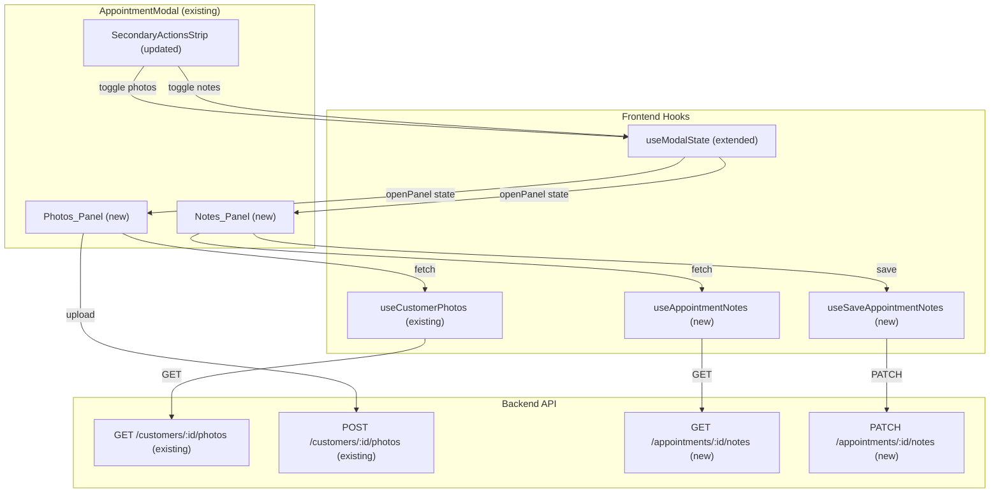
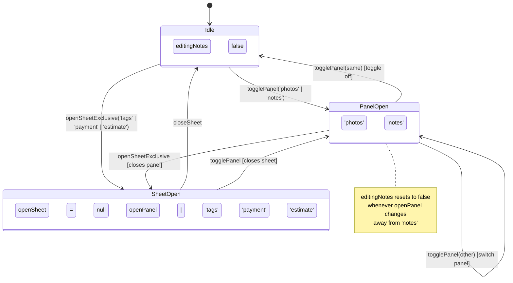

# Design Document: Appointment Modal V2

## Overview

The Appointment Modal V2 adds three targeted enhancements to the existing fully-implemented appointment modal (`appointment-modal-combined` spec). These are purely additive changes — no existing functionality is modified or removed.

**V2 Enhancements:**

1. **Inline "See attached photos" panel** — A collapsible panel below the secondary action row showing customer photos across all jobs, with "Upload photo · camera roll" and "Take photo" CTAs. Uses the existing `CustomerPhoto` model and `GET/POST /customers/:id/photos` endpoints.

2. **Inline "See attached notes" panel** — A collapsible panel with a single centralized Internal Notes body (view + edit modes). Replaces the concept of multi-author threads with one shared note per appointment. Requires a new `appointment_notes` table, model, repository, service, and API endpoints.

3. **"Send Review Request" rename** — The v1 "Review" button text changes to "Send Review Request".

**What this design does NOT change:**
- The existing modal structure, layout, or component hierarchy
- The existing `CustomerPhoto` model, photo upload endpoints, or photo service
- The existing tag editor, payment sheet, estimate sheet, or any v1 sheet overlays
- Backend appointment status transition logic
- The scheduling calendar view

**Key architectural decisions:**
- The two inline panels (`photos` and `notes`) are **mutually exclusive** — opening one closes the other. This is managed by a new `openPanel` state in `useModalState`.
- Panels and sheets coexist: opening a panel closes any open sheet, and vice versa.
- The notes backend uses a simple upsert pattern (one row per appointment) rather than a thread/comment model.
- Photos reuse the existing `CustomerPhoto` infrastructure entirely — no new backend work for photos.

---

## Architecture

### High-Level Data Flow



### State Management Architecture

The `useModalState` hook is extended with two new fields alongside the existing `openSheet`:



### Updated Component Tree (v2 additions marked with ★)

```
AppointmentModal (existing)
├── ModalHeader (existing)
├── RescheduleBanner (existing, conditional)
├── NoReplyBanner (existing, conditional)
├── TimelineStrip (existing)
├── ActionTrack (existing)
├── SecondaryActionsStrip (★ updated)
│   ├── V2LinkBtn ★ "See attached photos" (blue accent, count badge, chevron)
│   ├── V2LinkBtn ★ "See attached notes" (amber accent, count badge, chevron)
│   ├── LinkButton "Send Review Request" (★ renamed from "Review")
│   └── LinkButton "Edit tags" (existing)
├── Photos_Panel ★ (conditional: openPanel === 'photos')
│   ├── PanelHeader (blue border, photo icon, count chip, "From customer file")
│   ├── UploadCTAs (Upload photo · camera roll + Take photo)
│   ├── PhotoStrip (horizontal scroll, PhotoCard × N, AddMoreTile)
│   └── PanelFooter (hint text + "View all (N)" button)
├── Notes_Panel ★ (conditional: openPanel === 'notes')
│   ├── NotesHeader ("INTERNAL NOTES" eyebrow + Edit affordance)
│   ├── NotesViewMode (body text, min-height 80px)
│   └── NotesEditMode (textarea + Cancel/Save Notes buttons)
├── PaymentEstimateCTAs (existing)
├── CustomerHero (existing)
├── PropertyDirectionsCard (existing)
├── ScopeMaterialsCard (existing)
├── AssignedTechCard (existing)
├── CommunicationTimeline (existing)
├── DurationMetrics (existing, conditional)
├── ModalFooter (existing)
└── SheetOverlays (existing: TagEditorSheet, PaymentSheet, EstimateSheet)
```

---

## Components and Interfaces

### New Components to Create

| Component | File | Purpose |
|---|---|---|
| `V2LinkBtn` | `AppointmentModal/V2LinkBtn.tsx` | Accent-tinted toggle button with count badge and chevron |
| `PhotosPanel` | `AppointmentModal/PhotosPanel.tsx` | Inline expansion panel for customer photos |
| `PhotoCard` | `AppointmentModal/PhotoCard.tsx` | Individual photo card in the horizontal strip |
| `NotesPanel` | `AppointmentModal/NotesPanel.tsx` | Inline expansion panel for internal notes (view + edit) |

### Existing Components to Modify

| Component | File | Change |
|---|---|---|
| `SecondaryActionsStrip` | `AppointmentModal/SecondaryActionsStrip.tsx` | Replace "Add photo" and "Notes" LinkButtons with V2LinkBtn; rename "Review" to "Send Review Request" |
| `AppointmentModal` | `AppointmentModal/AppointmentModal.tsx` | Wire `openPanel` state, render Photos_Panel and Notes_Panel conditionally, pass photo/note counts to SecondaryActionsStrip |
| `useModalState` | `hooks/useModalState.ts` | Add `openPanel`, `editingNotes`, `togglePanel()`, `setEditingNotes()`, mutual exclusivity with sheets |

### New Hooks to Create

| Hook | File | Purpose |
|---|---|---|
| `useAppointmentNotes` | `hooks/useAppointmentNotes.ts` | `GET /appointments/:id/notes` TanStack Query hook |
| `useSaveAppointmentNotes` | `hooks/useAppointmentNotes.ts` | `PATCH /appointments/:id/notes` mutation with optimistic update |

### New Backend Components

| Component | File | Purpose |
|---|---|---|
| `AppointmentNote` model | `models/appointment_note.py` | SQLAlchemy model for `appointment_notes` table |
| `AppointmentNoteRepository` | `repositories/appointment_note_repository.py` | Get/upsert operations for notes |
| `AppointmentNoteService` | `services/appointment_note_service.py` | Business logic: get, save, validation |
| Note schemas | `schemas/appointment_note.py` | Pydantic request/response schemas |
| Note API endpoints | `api/v1/appointments.py` (extend) | `GET` and `PATCH` notes endpoints on existing appointment router |
| Alembic migration | `migrations/versions/xxx_add_appointment_notes.py` | Create `appointment_notes` table |

### Key Interfaces

```typescript
// ── V2LinkBtn Props ──
interface V2LinkBtnProps {
  children: React.ReactNode;
  icon: React.ReactNode;
  accent: 'blue' | 'amber';
  open: boolean;
  count?: number;
  onClick: () => void;
  'aria-label'?: string;
}

// ── Updated SecondaryActionsStrip Props ──
interface SecondaryActionsStripProps {
  // Existing
  tagsOpen: boolean;
  onEditTags: () => void;
  onReview?: () => void;
  // New v2
  photosOpen: boolean;
  notesOpen: boolean;
  photoCount: number;
  noteCount: number;
  onTogglePhotos: () => void;
  onToggleNotes: () => void;
}

// ── PhotosPanel Props ──
interface PhotosPanelProps {
  customerId: string;
  appointmentId: string;
  jobId?: string;
}

// ── NotesPanel Props ──
interface NotesPanelProps {
  appointmentId: string;
  editing: boolean;
  onSetEditing: (editing: boolean) => void;
}

// ── useModalState return type (extended) ──
type ModalSheet = 'payment' | 'estimate' | 'tags';
type OpenPanel = 'photos' | 'notes' | null;

interface ModalStateReturn {
  // Existing
  openSheet: ModalSheet | null;
  mapsPopoverOpen: boolean;
  setMapsPopoverOpen: (open: boolean) => void;
  openSheetExclusive: (sheet: ModalSheet) => void;
  closeSheet: () => void;
  // New v2
  openPanel: OpenPanel;
  editingNotes: boolean;
  togglePanel: (panel: 'photos' | 'notes') => void;
  setEditingNotes: (editing: boolean) => void;
}

// ── Appointment Notes API types ──
interface AppointmentNotesResponse {
  appointment_id: string;
  body: string;
  updated_at: string;
  updated_by: { id: string; name: string; role: string } | null;
}

interface AppointmentNotesSaveRequest {
  body: string;
}
```

---

## Data Models

### New: `appointment_notes` Table

```sql
CREATE TABLE appointment_notes (
    id              UUID PRIMARY KEY DEFAULT gen_random_uuid(),
    appointment_id  UUID NOT NULL UNIQUE REFERENCES appointments(id) ON DELETE CASCADE,
    body            TEXT NOT NULL DEFAULT '',
    updated_at      TIMESTAMPTZ NOT NULL DEFAULT now(),
    updated_by_id   UUID REFERENCES staff(id) ON DELETE SET NULL
);

CREATE UNIQUE INDEX idx_appointment_notes_appointment_id ON appointment_notes(appointment_id);
```

**Design rationale:** One-to-one relationship with appointments (enforced by UNIQUE on `appointment_id`). The `body` is plain text (no markdown rendering needed). `updated_by_id` tracks the last editor for audit purposes. Cascade delete ensures notes are cleaned up when an appointment is deleted.

### SQLAlchemy Model

```python
# src/grins_platform/models/appointment_note.py
"""Appointment notes model for centralized internal notes.

Validates: Appointment Modal V2 Req 5.1
"""

from datetime import datetime
from typing import TYPE_CHECKING
from uuid import UUID

from sqlalchemy import DateTime, ForeignKey, Text
from sqlalchemy.dialects.postgresql import UUID as PGUUID
from sqlalchemy.orm import Mapped, mapped_column, relationship
from sqlalchemy.sql import func

from grins_platform.database import Base

if TYPE_CHECKING:
    from grins_platform.models.appointment import Appointment
    from grins_platform.models.staff import Staff


class AppointmentNote(Base):
    """Single centralized internal note per appointment.

    Replaces the v1 multi-author thread pattern with one shared body.

    Validates: Appointment Modal V2 Req 5.1, 5.2
    """

    __tablename__ = "appointment_notes"

    id: Mapped[UUID] = mapped_column(
        PGUUID(as_uuid=True),
        primary_key=True,
        server_default=func.gen_random_uuid(),
    )
    appointment_id: Mapped[UUID] = mapped_column(
        PGUUID(as_uuid=True),
        ForeignKey("appointments.id", ondelete="CASCADE"),
        nullable=False,
        unique=True,
    )
    body: Mapped[str] = mapped_column(
        Text,
        nullable=False,
        server_default="",
    )
    updated_at: Mapped[datetime] = mapped_column(
        DateTime(timezone=True),
        nullable=False,
        server_default=func.now(),
    )
    updated_by_id: Mapped[UUID | None] = mapped_column(
        PGUUID(as_uuid=True),
        ForeignKey("staff.id", ondelete="SET NULL"),
        nullable=True,
    )

    # Relationships
    appointment: Mapped["Appointment"] = relationship(
        "Appointment",
        lazy="selectin",
    )
    updated_by: Mapped["Staff | None"] = relationship(
        "Staff",
        lazy="selectin",
    )

    def __repr__(self) -> str:
        return (
            f"<AppointmentNote(id={self.id}, "
            f"appointment_id={self.appointment_id}, "
            f"body_len={len(self.body)})>"
        )
```

### Pydantic Schemas

```python
# src/grins_platform/schemas/appointment_note.py
"""Pydantic schemas for appointment notes.

Validates: Appointment Modal V2 Req 5.3, 10.1–10.6
"""

from datetime import datetime
from uuid import UUID

from pydantic import BaseModel, ConfigDict, Field


class NoteAuthorResponse(BaseModel):
    """Author info for the last editor."""

    model_config = ConfigDict(from_attributes=True)

    id: UUID
    name: str
    role: str


class AppointmentNotesResponse(BaseModel):
    """Response for GET /appointments/:id/notes."""

    model_config = ConfigDict(from_attributes=True)

    appointment_id: UUID
    body: str
    updated_at: datetime
    updated_by: NoteAuthorResponse | None = None


class AppointmentNotesSaveRequest(BaseModel):
    """Request for PATCH /appointments/:id/notes."""

    body: str = Field(max_length=50_000)
```

### API Contract

**GET /api/v1/appointments/{appointment_id}/notes**

Response `200 OK`:
```json
{
  "appointment_id": "uuid",
  "body": "Gate code 4521#. Dog is friendly but barks...",
  "updated_at": "2025-06-15T14:30:00Z",
  "updated_by": { "id": "uuid", "name": "Viktor K.", "role": "tech" }
}
```

When no notes record exists:
```json
{
  "appointment_id": "uuid",
  "body": "",
  "updated_at": "2025-06-15T14:30:00Z",
  "updated_by": null
}
```

**PATCH /api/v1/appointments/{appointment_id}/notes**

Request:
```json
{ "body": "Gate code 4521#. Dog is friendly but barks. Updated info..." }
```

Response `200 OK`:
```json
{
  "appointment_id": "uuid",
  "body": "Gate code 4521#. Dog is friendly but barks. Updated info...",
  "updated_at": "2025-06-15T14:35:00Z",
  "updated_by": { "id": "uuid", "name": "Admin User", "role": "admin" }
}
```

**Behavior:** The PATCH endpoint performs an upsert — creates the notes record if it doesn't exist, updates if it does. Sets `updated_at` to `now()` and `updated_by_id` to the current authenticated user's staff ID. Validates body length ≤ 50,000 characters.

### Repository Pattern

```python
# src/grins_platform/repositories/appointment_note_repository.py
class AppointmentNoteRepository(LoggerMixin):
    DOMAIN = "database"

    def __init__(self, session: AsyncSession) -> None:
        super().__init__()
        self.session = session

    async def get_by_appointment_id(
        self, appointment_id: UUID
    ) -> AppointmentNote | None:
        """Return the note for an appointment, or None."""
        ...

    async def upsert(
        self,
        appointment_id: UUID,
        body: str,
        updated_by_id: UUID | None,
    ) -> AppointmentNote:
        """Create or update the note for an appointment."""
        ...
```

### Service Pattern

```python
# src/grins_platform/services/appointment_note_service.py
class AppointmentNoteService(LoggerMixin):
    DOMAIN = "appointment_notes"

    def __init__(self, repo: AppointmentNoteRepository) -> None:
        super().__init__()
        self.repo = repo

    async def get_notes(
        self, appointment_id: UUID
    ) -> AppointmentNotesResponse:
        """Get notes for an appointment. Returns empty body if none exist."""
        ...

    async def save_notes(
        self,
        appointment_id: UUID,
        body: str,
        updated_by_id: UUID | None,
    ) -> AppointmentNotesResponse:
        """Upsert notes for an appointment."""
        ...
```

### Alembic Migration

Migration file: `migrations/versions/xxx_add_appointment_notes_table.py`
- Creates `appointment_notes` table with all columns, constraints, and unique index
- No data migration needed (new table, no existing data to transform)


---

## Correctness Properties

*A property is a characteristic or behavior that should hold true across all valid executions of a system — essentially, a formal statement about what the system should do. Properties serve as the bridge between human-readable specifications and machine-verifiable correctness guarantees.*

### Property 1: Notes body round-trip

*For any* valid string body of length 0 to 50,000 characters (including empty strings, strings with unicode, newlines, and special characters), saving the body via `PATCH /appointments/:id/notes` then reading via `GET /appointments/:id/notes` SHALL return the identical body string.

**Validates: Requirements 5.5, 10.3, 15.1**

### Property 2: Notes upsert idempotence

*For any* valid body string, saving the same body twice via `PATCH /appointments/:id/notes` SHALL produce the same `body` value in the response (the body content is unchanged; `updated_at` may differ). Formally: if `save(body)` produces response R1 and `save(body)` again produces R2, then `R1.body == R2.body`.

**Validates: Requirements 15.2**

### Property 3: Notes body validation rejects oversized input

*For any* string with length exceeding 50,000 characters, the `PATCH /appointments/:id/notes` endpoint SHALL return HTTP 422 Unprocessable Entity and SHALL NOT modify the existing notes record in the database.

**Validates: Requirements 5.6, 10.5, 15.3**

### Property 4: Panel mutual exclusivity

*For any* sequence of `togglePanel` calls with arguments drawn from `{'photos', 'notes'}`, at most one panel SHALL be open at any time. After each call, `openPanel` SHALL be either `null` or the panel that was just toggled open. If the same panel is toggled twice consecutively, it SHALL close (return to `null`). If a different panel is toggled, the previous panel SHALL close and the new one SHALL open.

**Validates: Requirements 2.4, 2.5, 3.5, 15.4**

### Property 5: editingNotes auto-reset invariant

*For any* sequence of `togglePanel`, `openSheetExclusive`, and `setEditingNotes` calls, whenever `openPanel` is not `'notes'`, `editingNotes` SHALL be `false`. This invariant SHALL hold after every state transition in the sequence.

**Validates: Requirements 3.6, 7.3, 15.5**

### Property 6: Sheet-panel mutual exclusivity

*For any* sequence of `openSheetExclusive` and `togglePanel` calls, `openSheet` and `openPanel` SHALL never both be non-null simultaneously. Opening a sheet SHALL close any open panel, and opening a panel SHALL close any open sheet.

**Validates: Requirements 7.4, 7.5**

### Property 7: V2LinkBtn accent map correctness

*For any* valid accent value in `{'blue', 'amber'}` and any open state `{true, false}`, the V2LinkBtn SHALL render with the correct color triplet:
- When `open=true`: background, text color, and border color SHALL match the accent's tinted values (blue: `#DBEAFE`/`#1D4ED8`/`#1D4ED8`; amber: `#FEF3C7`/`#B45309`/`#B45309`).
- When `open=true`: the count badge SHALL use the accent color as background with white text.
- When `open=false`: the button SHALL use white background, `#374151` text, `#E5E7EB` border; the badge SHALL use `#F3F4F6` background with `#4B5563` text.

**Validates: Requirements 1.3, 1.5, 11.1**

---

## Error Handling

### Frontend Error Handling

| Scenario | Behavior |
|---|---|
| Notes fetch fails (`GET /appointments/:id/notes`) | Show empty notes panel with "Unable to load notes" message and retry button |
| Notes save fails (`PATCH /appointments/:id/notes`) | Show error toast "Couldn't save notes — try again", remain in edit mode with draft content preserved |
| Photo list fetch fails (`GET /customers/:id/photos`) | Show empty photos panel with "Unable to load photos" message |
| Photo upload fails (`POST /customers/:id/photos`) | Remove optimistic placeholder card, show error toast "Photo upload failed" |
| Photo upload exceeds size limit (413) | Show error toast "Photo too large — max 10 MB" |
| Photo upload unsupported format (415) | Show error toast "Unsupported format — use JPEG, PNG, or HEIC" |
| Network offline during notes save | Toast "Couldn't save notes — try again", draft state preserved in textarea |
| Network offline during photo upload | Remove placeholder, toast "Upload failed — check your connection" |

### Backend Error Handling

| Scenario | HTTP Status | Response |
|---|---|---|
| Appointment not found (GET/PATCH notes) | 404 | `{ "detail": "Appointment not found: {id}" }` |
| Body exceeds 50,000 characters | 422 | Pydantic validation error |
| Unauthenticated request | 401 | `{ "detail": "Not authenticated" }` |
| Database error during upsert | 500 | `{ "detail": "Internal server error" }` |

### Optimistic Update Strategy

**Notes save:**
1. On "Save Notes" tap: immediately update the cached notes body in TanStack Query, switch to view mode
2. Call `PATCH /appointments/:id/notes` in background
3. On success: invalidate notes query for reconciliation
4. On failure: revert cached body to previous value, switch back to edit mode with draft content, show error toast

**Photo upload:**
1. On file selection: create optimistic placeholder cards with progress indicators, prepend to photo strip
2. Call `POST /customers/:id/photos` per file
3. On success per file: replace placeholder with real photo data from response
4. On failure per file: remove that placeholder, show error toast
5. After all uploads: invalidate customer photos query so count badge updates

---

## Testing Strategy

### Frontend Unit Tests (Vitest + React Testing Library)

| Component | Key Tests |
|---|---|
| `V2LinkBtn` | Default state rendering, open state with blue accent, open state with amber accent, count badge display (open + closed styles), chevron direction (up/down), `aria-expanded` attribute, click handler, keyboard activation (Enter/Space) |
| `PhotosPanel` | Header rendering (icon, label, count chip, "From customer file"), upload CTA buttons with correct attributes, photo strip with cards, "Add more" trailing tile, footer with hint and "View all" button, file input triggers |
| `PhotoCard` | Image rendering, caption + date display, dimensions (180px wide), border-radius |
| `NotesPanel` | View mode (eyebrow, body text, Edit affordance), edit mode transition (textarea pre-fill, cursor at end), Cancel discards changes, Save Notes triggers mutation, Escape cancels, ⌘+Enter/Ctrl+Enter saves, error toast on save failure |
| `SecondaryActionsStrip` (updated) | Four buttons present with correct labels, V2LinkBtn for photos/notes with count badges, "Send Review Request" text (not "Review"), "Edit tags" unchanged, panel toggle callbacks |
| `useModalState` (extended) | Initial state (`openPanel: null`, `editingNotes: false`), `togglePanel` toggles on/off, panel mutual exclusivity, `editingNotes` auto-reset when leaving notes, sheet-panel mutual exclusivity, `setEditingNotes` function |
| `useAppointmentNotes` | Query key structure, fetch on mount, default empty body for missing notes |
| `useSaveAppointmentNotes` | Mutation call, optimistic update, cache invalidation on success, revert on failure |

### Backend Unit Tests (pytest, `@pytest.mark.unit`)

| Test File | Key Tests |
|---|---|
| `test_appointment_note_model.py` | Model creation, field defaults (empty body), relationship to Appointment, `__repr__` |
| `test_appointment_note_service.py` | `get_notes` (existing record, no record → empty body), `save_notes` (create new, update existing), body length validation, `updated_by_id` tracking |
| `test_appointment_note_api.py` | GET (existing notes, no notes, invalid appointment → 404), PATCH (create, update, validation errors → 422, auth required) |

### Backend Functional Tests (`@pytest.mark.functional`)

| Test | Description |
|---|---|
| `test_notes_lifecycle` | Create appointment → save notes → read → update notes → read → verify body changed and `updated_by` updated |
| `test_notes_cascade_delete` | Create appointment with notes → delete appointment → verify notes are gone |
| `test_notes_upsert_creates_on_first_save` | New appointment → PATCH notes → verify record created |
| `test_notes_empty_body_allowed` | PATCH with empty string body → verify accepted and stored |

### Backend Integration Tests (`@pytest.mark.integration`)

| Test | Description |
|---|---|
| `test_notes_accessible_from_appointment` | Create appointment → save notes → fetch appointment detail → verify notes data is accessible |
| `test_notes_auth_required` | Call PATCH without auth → verify 401 |

### Property-Based Tests

**Backend (Hypothesis):**

Each property test runs minimum 100 iterations. Tag format: `# Feature: appointment-modal-v2, Property {N}: {property_text}`

| Property | Test | Library |
|---|---|---|
| Property 1: Notes body round-trip | Generate random strings (0–50,000 chars, including unicode, newlines, special chars). PATCH then GET, verify body matches exactly. | Hypothesis `text(max_size=50_000)` |
| Property 2: Notes upsert idempotence | Generate random body. Save twice. Verify `R1.body == R2.body`. | Hypothesis `text(max_size=50_000)` |
| Property 3: Notes body validation | Generate strings with length 50,001–100,000. PATCH, verify 422. | Hypothesis `text(min_size=50_001, max_size=100_000)` |

**Frontend (fast-check):**

| Property | Test | Library |
|---|---|---|
| Property 4: Panel mutual exclusivity | Generate random sequences of `togglePanel('photos')` and `togglePanel('notes')` calls. After each call, verify at most one panel is open. | fast-check `array(oneof(constant('photos'), constant('notes')))` |
| Property 5: editingNotes auto-reset | Generate random sequences of `togglePanel`, `openSheetExclusive`, `setEditingNotes(true)`. After each transition, verify: if `openPanel !== 'notes'` then `editingNotes === false`. | fast-check `array(oneof(...))` |
| Property 6: Sheet-panel mutual exclusivity | Generate random sequences of `openSheetExclusive` and `togglePanel` calls. After each call, verify `openSheet` and `openPanel` are never both non-null. | fast-check `array(oneof(...))` |
| Property 7: V2LinkBtn accent map | Generate all combinations of accent (`'blue'`, `'amber'`) × open (`true`, `false`). Render V2LinkBtn, verify correct color classes. | fast-check `record({ accent: oneof(...), open: boolean() })` |

### E2E Testing (Vercel Deploy + agent-browser)

After all code changes are complete:

1. **Deploy** frontend to Vercel, wait for successful build
2. **Photos panel**: Navigate to schedule → open appointment modal → tap "See attached photos" → verify panel opens with header, upload CTAs, photo strip → verify chevron flips up → verify notes panel is closed → screenshot to `e2e-screenshots/appointment-modal-v2/`
3. **Notes panel**: Tap "See attached notes" → verify panel opens with "INTERNAL NOTES" eyebrow and Edit affordance → tap Edit → verify textarea with Cancel and Save Notes buttons → verify photos panel is closed → screenshot
4. **Mutual exclusivity**: Open photos panel → tap "See attached notes" → verify photos closes and notes opens → screenshot
5. **Send Review Request**: Verify "Send Review Request" label is displayed (not "Review") → screenshot
6. **Responsive**: Set viewport to 375×812 → verify panels render correctly in mobile bottom sheet → screenshot
7. **Console check**: Verify zero JS errors and uncaught exceptions during all v2 interactions

### Test Commands

```bash
# Backend
uv run pytest -m unit -v -k "appointment_note"
uv run pytest -m functional -v -k "notes"
uv run pytest -m integration -v -k "notes"
uv run pytest -m unit -v -k "pbt_appointment_modal_v2"

# Frontend
cd frontend
npm test -- --run V2LinkBtn
npm test -- --run PhotosPanel
npm test -- --run PhotoCard
npm test -- --run NotesPanel
npm test -- --run SecondaryActionsStrip
npm test -- --run useModalState
npm test -- --run useAppointmentNotes
```
