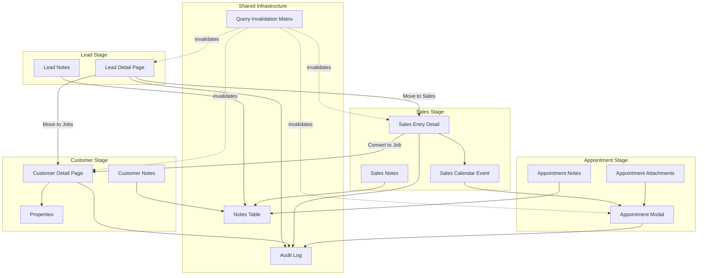
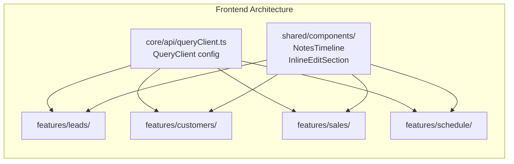
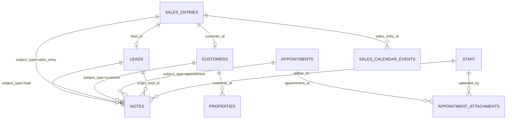

# Design Document: April 16th Fixes & Enhancements

## Overview

This design covers 16 requirements spanning bug fixes, UI enhancements, and new features across the Grins Platform CRM. The changes touch both the Python/FastAPI backend and the React/TypeScript frontend, affecting Lead, Customer, Sales Entry, and Appointment workflows.

The core themes are:
1. **Cleanup** — Remove legacy action buttons and status paths that contradict the canonical customer lifecycle (Lead → Sales → Customer via routing actions only).
2. **Universal Editability** — Every field visible on a detail page becomes admin-editable inline, with PATCH-to-source-of-truth semantics and TCPA audit logging for consent fields.
3. **Unified Notes Timeline** — A new `notes` table with cross-stage threading (`origin_lead_id`) so notes follow the lead → sales entry → customer → appointment chain.
4. **Bug Fixes** — Customer create enum mismatch (`LeadSource` → `LeadSourceExtended`), customer search unmount/remount cycle, and export button wiring.
5. **Cache Invalidation** — Cross-feature `invalidateQueries` matrix so every mutation refreshes all affected views.
6. **Calendar Enrichment** — Customer context block, file attachments (`appointment_attachments` table), and notes integration on appointment modals.



## Architecture

### Backend Changes

The backend changes follow the existing vertical-slice architecture at `src/grins_platform/`:

1. **Models** — New `Note` model (`models/note.py`), new `AppointmentAttachment` model (`models/appointment_attachment.py`). Extend existing `Lead`, `Customer`, `SalesEntry` models with relationship declarations.
2. **Schemas** — Extend `LeadUpdate` with missing patchable fields (`sms_consent`, `email_marketing_consent`, `terms_accepted`, `lead_source`, `source_site`, `source_detail`, `last_contacted_at`). Migrate `CustomerCreate`/`CustomerUpdate` to use `LeadSourceExtended`. Add `is_priority`, `is_red_flag`, `is_slow_payer` to `CustomerCreate`. New schemas for notes CRUD and appointment attachments.
3. **API Endpoints** — New notes endpoints under `/api/v1/{leads,sales,customers}/{id}/notes` and `/api/v1/notes/{id}`. New attachment endpoints under `/api/v1/appointments/{id}/attachments`. Add auth guard to export endpoint. Add status validation to lead PATCH.
4. **Services** — `NoteService` for cross-stage note operations. `AppointmentAttachmentService` reusing the existing S3 presign pipeline. Extend `LeadService` with `last_contacted_at` auto-stamp logic and status validation. Extend `AuditService` for TCPA logging.
5. **Migrations** — Alembic migrations for `notes` table, `appointment_attachments` table, and any column additions.

### Frontend Changes

Frontend changes follow the VSA pattern at `frontend/src/features/`:

1. **Leads** — Delete `EstimateCreator.tsx` and `ContractCreator.tsx` from `leads/components/`. Refactor `LeadDetail.tsx` to remove legacy buttons/statuses, add inline-edit sections. New `NotesTimeline` component in `shared/components/`.
2. **Customers** — Add inline-edit sections to `CustomerDetail.tsx`. Fix `CustomerForm.tsx` error handling and enum alignment. Fix `CustomerList.tsx` search state hoisting and `keepPreviousData`. Wire export button.
3. **Sales** — Add inline-edit sections to sales entry detail. Wire bidirectional notes.
4. **Schedule/Sales Calendar** — Enrich appointment modals with customer context block, file upload, and notes timeline slice.
5. **Shared** — `NotesTimeline` component, `InlineEditSection` pattern component, `invalidateAfterLeadRouting` helper, `useFileUpload` hook.



## Components and Interfaces

### Backend Components

#### 1. Note Model & Service

```python
# src/grins_platform/models/note.py
class Note(Base):
    __tablename__ = "notes"
    id: UUID (pk)
    subject_type: str  # 'lead' | 'sales_entry' | 'customer' | 'appointment'
    subject_id: UUID
    author_id: UUID (fk → staff)
    body: str (text)
    origin_lead_id: UUID | None (fk → leads)  # cross-stage threading
    origin_appointment_id: UUID | None (fk → appointments)
    is_system: bool  # stage-transition notes
    is_deleted: bool  # soft-delete
    created_at: datetime
    updated_at: datetime
```

```python
# src/grins_platform/services/note_service.py
class NoteService:
    async def list_notes(subject_type, subject_id) -> list[NoteResponse]
        # Returns merged timeline: direct notes + notes linked via origin_lead_id
    async def create_note(subject_type, subject_id, body, author_id) -> NoteResponse
    async def update_note(note_id, body, actor_id) -> NoteResponse
    async def delete_note(note_id, actor_id) -> None  # soft-delete
    async def create_stage_transition_note(from_type, from_id, to_type, to_id, actor_id)
```

#### 2. Appointment Attachment Model & Service

```python
# src/grins_platform/models/appointment_attachment.py
class AppointmentAttachment(Base):
    __tablename__ = "appointment_attachments"
    id: UUID (pk)
    appointment_id: UUID (fk → appointments)
    appointment_type: str  # 'job' | 'estimate'
    file_key: str
    file_name: str
    file_size: int
    content_type: str
    uploaded_by: UUID (fk → staff)
    created_at: datetime
```

#### 3. API Endpoints

**Notes API:**
- `GET /api/v1/leads/{id}/notes` — merged timeline for lead
- `POST /api/v1/leads/{id}/notes` — create note on lead
- `GET /api/v1/sales/{id}/notes` — merged timeline for sales entry
- `POST /api/v1/sales/{id}/notes` — create note on sales entry
- `GET /api/v1/customers/{id}/notes` — merged timeline for customer
- `POST /api/v1/customers/{id}/notes` — create note on customer
- `PATCH /api/v1/notes/{id}` — edit note (author or admin only)
- `DELETE /api/v1/notes/{id}` — soft-delete note

**Appointment Attachments API:**
- `GET /api/v1/appointments/{id}/attachments` — list attachments
- `POST /api/v1/appointments/{id}/attachments` — upload (presign + finalize)
- `DELETE /api/v1/appointments/{id}/attachments/{attachment_id}` — delete

**Customer Export (extended):**
- `POST /api/v1/customers/export?format=xlsx` — XLSX export with auth guard

#### 4. Schema Extensions

```python
# LeadUpdate additions:
sms_consent: bool | None
email_marketing_consent: bool | None
terms_accepted: bool | None
lead_source: LeadSourceExtended | None
source_site: str | None
source_detail: str | None
last_contacted_at: datetime | None
phone: str | None
email: str | None
situation: LeadSituation | None

# LeadUpdate status validation:
# Reject any status not in {'new', 'contacted'} with 422 + lead_status_deprecated

# CustomerCreate additions:
is_priority: bool = False
is_red_flag: bool = False
is_slow_payer: bool = False
lead_source: LeadSourceExtended | None  # migrated from LeadSource

# CustomerUpdate additions:
# Ensure all customer fields are patchable including flags, status, lead_source
```

### Frontend Components

#### 1. InlineEditSection Pattern

A reusable pattern (not necessarily a single component) for flipping a read-only section into an edit form:

```typescript
// Pattern used across LeadDetail, CustomerDetail, SalesEntryDetail
interface InlineEditSectionProps {
  title: string;
  fields: FieldConfig[];
  onSave: (data: Record<string, unknown>) => Promise<void>;
  testIdPrefix: string;
}
// Each section: Edit button → form mode → Save/Cancel → PATCH mutation → toast → invalidate
```

#### 2. NotesTimeline Component

```typescript
// frontend/src/shared/components/NotesTimeline.tsx
interface NotesTimelineProps {
  subjectType: 'lead' | 'sales_entry' | 'customer' | 'appointment';
  subjectId: string;
  readOnly?: boolean;  // for appointment modal slice
  maxEntries?: number; // for appointment modal truncation
}
// Renders: author, timestamp, body, stage tag per entry, newest-first
// "Add note" form at top when not readOnly
```

#### 3. Query Invalidation Helpers

```typescript
// frontend/src/shared/utils/invalidationHelpers.ts
export function invalidateAfterLeadRouting(
  queryClient: QueryClient,
  target: 'jobs' | 'sales'
): void;

export function invalidateAfterCustomerMutation(
  queryClient: QueryClient,
  customerId: string
): void;

// Centralizes the cross-feature invalidation matrix
```

#### 4. Customer Context Block (Appointment Modal)

```typescript
// Rendered at top of AppointmentForm / SalesCalendar edit dialog
interface CustomerContextBlockProps {
  customer: CustomerSummary;
  property: PropertySummary | null;
  warnings: { dogs: boolean; redFlag: boolean; slowPayer: boolean; priority: boolean };
  sourceLink: { label: string; href: string };
}
```


## Data Models

### New Tables

#### `notes` Table

| Column | Type | Constraints | Description |
|--------|------|-------------|-------------|
| `id` | UUID | PK, default `gen_random_uuid()` | Primary key |
| `subject_type` | VARCHAR(20) | NOT NULL | `lead`, `sales_entry`, `customer`, `appointment` |
| `subject_id` | UUID | NOT NULL | FK to the subject record |
| `author_id` | UUID | FK → `staff.id` | Note author |
| `body` | TEXT | NOT NULL | Note content |
| `origin_lead_id` | UUID | FK → `leads.id`, NULLABLE | Cross-stage threading link |
| `origin_appointment_id` | UUID | FK → `appointments.id`, NULLABLE | Appointment origin link |
| `is_system` | BOOLEAN | NOT NULL, default FALSE | Stage-transition system notes |
| `is_deleted` | BOOLEAN | NOT NULL, default FALSE | Soft-delete flag |
| `created_at` | TIMESTAMPTZ | NOT NULL, default `now()` | Creation timestamp |
| `updated_at` | TIMESTAMPTZ | NOT NULL, default `now()` | Last update timestamp |

Indexes: `idx_notes_subject` on `(subject_type, subject_id)`, `idx_notes_origin_lead` on `origin_lead_id`, `idx_notes_created_at` on `created_at`.

Cross-stage query pattern: To get the merged timeline for a sales entry that originated from a lead, query `WHERE (subject_type='sales_entry' AND subject_id=:sales_id) OR origin_lead_id=:lead_id`, ordered by `created_at DESC`.

#### `appointment_attachments` Table

| Column | Type | Constraints | Description |
|--------|------|-------------|-------------|
| `id` | UUID | PK, default `gen_random_uuid()` | Primary key |
| `appointment_id` | UUID | NOT NULL | FK to appointment (job or estimate) |
| `appointment_type` | VARCHAR(20) | NOT NULL | `job` or `estimate` |
| `file_key` | VARCHAR(500) | NOT NULL | S3 object key |
| `file_name` | VARCHAR(255) | NOT NULL | Original filename |
| `file_size` | INTEGER | NOT NULL | File size in bytes |
| `content_type` | VARCHAR(100) | NOT NULL | MIME type |
| `uploaded_by` | UUID | FK → `staff.id` | Uploader |
| `created_at` | TIMESTAMPTZ | NOT NULL, default `now()` | Upload timestamp |

Index: `idx_appointment_attachments_appointment` on `(appointment_type, appointment_id)`.

### Modified Tables / Schemas

#### `LeadUpdate` Schema (Pydantic)

Add the following optional fields that are currently missing:
- `sms_consent: bool | None`
- `email_marketing_consent: bool | None`
- `terms_accepted: bool | None`
- `lead_source: LeadSourceExtended | None`
- `source_site: str | None`
- `source_detail: str | None`
- `last_contacted_at: datetime | None`
- `phone: str | None`
- `email: EmailStr | None`
- `situation: LeadSituation | None`

Add a validator on `status` that rejects any value not in `{'new', 'contacted'}` with a `lead_status_deprecated` error code.

Add a validator on `last_contacted_at` that rejects future timestamps and timestamps before the lead's `created_at`.

#### `CustomerCreate` Schema (Pydantic)

- Change `lead_source` type from `LeadSource` to `LeadSourceExtended`
- Add `is_priority: bool = False`
- Add `is_red_flag: bool = False`
- Add `is_slow_payer: bool = False`

#### `CustomerUpdate` Schema (Pydantic)

- Change `lead_source` type from `LeadSource` to `LeadSourceExtended`
- Ensure all customer fields are present as optional patchable fields: `first_name`, `last_name`, `phone`, `email`, `status`, `is_priority`, `is_red_flag`, `is_slow_payer`, `sms_opt_in`, `email_opt_in`, `lead_source`, `lead_source_details`, `custom_flags`

#### Frontend Enum Alignment

`CustomerForm.tsx` `LEAD_SOURCES` array must match `LeadSourceExtended` exactly:
- Remove `facebook`, `nextdoor`, `repeat`
- Add `social_media` (replaces facebook/nextdoor)
- Keep `referral` (absorbs repeat)
- Keep `yard_sign`, `other`
- Add remaining `LeadSourceExtended` members: `google_form`, `phone_call`, `text_message`, `google_ad`, `qr_code`, `email_campaign`, `text_campaign`

#### `VALID_TRANSITIONS` Map (Frontend)

```typescript
const VALID_TRANSITIONS: Record<string, string[]> = {
  new: ['contacted'],
  contacted: ['new'],
  qualified: [],    // legacy — no transitions
  converted: [],    // legacy — no transitions
  lost: [],         // legacy — no transitions
  spam: [],         // legacy — no transitions
};
```

### Entity Relationship Additions




## Correctness Properties

*A property is a characteristic or behavior that should hold true across all valid executions of a system — essentially, a formal statement about what the system should do. Properties serve as the bridge between human-readable specifications and machine-verifiable correctness guarantees.*

### Property 1: Lead field edit round-trip

*For any* valid lead and any valid combination of patchable fields (phone, email, situation, source_site, lead_source, source_detail, intake_tag, notes, sms_consent, email_marketing_consent, terms_accepted), PATCHing the lead and then GETting it should return the updated values unchanged.

**Validates: Requirements 2.1, 2.2, 2.3, 2.4, 2.5, 2.9**

### Property 2: Customer field edit round-trip

*For any* valid customer and any valid combination of patchable fields (first_name, last_name, phone, email, status, is_priority, is_red_flag, is_slow_payer, sms_opt_in, email_opt_in, lead_source, lead_source_details), PATCHing the customer and then GETting it should return the updated values unchanged.

**Validates: Requirements 5.1, 5.4, 5.6, 5.7, 5.8, 5.14**

### Property 3: Primary property address edit round-trip

*For any* customer with a primary property and any valid address fields (address, city, state, zip_code), PATCHing the primary property and then GETting the customer should reflect the updated address in the primary address block.

**Validates: Requirements 5.2, 5.11, 5.13**

### Property 4: TCPA audit logging on consent toggle

*For any* consent field toggle (lead: sms_consent, email_marketing_consent, terms_accepted; customer: sms_opt_in, email_opt_in) where the new value differs from the old value, the system should create an audit log entry capturing the actor, subject, field name, old value, new value, and timestamp.

**Validates: Requirements 2.7, 5.5, 5.9**

### Property 5: Lead status restriction

*For any* lead status value not in the set {`new`, `contacted`}, a PATCH request setting that status should be rejected with HTTP 422 and a `lead_status_deprecated` error code. Conversely, for any status in {`new`, `contacted`}, the PATCH should succeed.

**Validates: Requirements 3.6, 3.8**

### Property 6: Legacy lead status rendering

*For any* lead with a legacy status value (`qualified`, `converted`, `lost`, `spam`), the Lead Detail Page should render an "Archived" badge without crashing, and the VALID_TRANSITIONS map should return an empty array for that status.

**Validates: Requirements 3.4**

### Property 7: Notes creation round-trip

*For any* valid note body and any subject type (lead, sales_entry, customer, appointment), creating a note via POST and then listing notes via GET should return the created note with matching body, author, and subject.

**Validates: Requirements 4.3, 4.7**

### Property 8: Cross-stage note visibility

*For any* lead with N notes that is routed via Move to Sales or Move to Jobs, the resulting sales entry or customer timeline should contain all N original lead notes (with stage tags) plus a system stage-transition note, for a total of at least N+1 notes.

**Validates: Requirements 4.4, 4.5, 4.6, 4.8, 12.5, 12.6, 12.7**

### Property 9: Notes timeline ordering

*For any* set of notes returned by a timeline GET endpoint, the notes should be ordered by `created_at` descending (newest first).

**Validates: Requirements 4.2**

### Property 10: Customer create with LeadSourceExtended and flags round-trip

*For any* valid LeadSourceExtended value and any boolean combination of (is_priority, is_red_flag, is_slow_payer), creating a customer with those values and then GETting it should return the same values. For any value NOT in LeadSourceExtended, customer create should return 422.

**Validates: Requirements 6.1, 6.4, 6.5**

### Property 11: Customer search text retention

*For any* non-empty search query typed into the customer search input, after the customer list refetches and re-renders, the search input should still contain the original query text.

**Validates: Requirements 7.4**

### Property 12: Cross-feature cache invalidation

*For any* mutation in the invalidation matrix (useMoveToJobs, useMoveToSales, useMarkContacted, useCreateCustomer, useUpdateCustomer, useRecordPayment, job lifecycle mutations, sales-pipeline transitions), the mutation's onSuccess handler should call invalidateQueries on every query key specified in the matrix for that mutation.

**Validates: Requirements 9.1, 9.2**

### Property 13: Appointment customer context completeness

*For any* appointment (job or estimate class) with a linked customer and property, the appointment modal should display all required context fields: customer name, phone, primary address, job type, last_contacted_at, is_priority badge, dogs_on_property warning, gate_code, access_instructions, is_red_flag pill, and is_slow_payer pill.

**Validates: Requirements 10.1, 10.10**

### Property 14: Appointment attachment upload round-trip

*For any* file with size ≤ 25 MB and any MIME type, uploading it to an appointment via POST and then listing attachments via GET should return the uploaded file with matching file_name, file_size, and content_type. Files exceeding 25 MB should be rejected.

**Validates: Requirements 10.5, 10.7**

### Property 15: Attachment preview type by MIME

*For any* attachment, the rendered preview should match the content type: image/* → thumbnail with click-to-enlarge, application/pdf → file-icon tile with filename, all others → file-icon tile with filename and extension.

**Validates: Requirements 10.6**

### Property 16: Sales entry source-of-truth patching

*For any* customer-sourced field (name, phone) edited from a Sales Entry Detail Page, the underlying Customer row should be updated, and a subsequent GET of the customer should reflect the new value.

**Validates: Requirements 12.1, 12.2**

### Property 17: Last contacted auto-stamp on status transition

*For any* lead transitioning to `contacted` status, `last_contacted_at` should be set to approximately the current timestamp. If `contacted_at` is null, it should also be set. If `contacted_at` is already set, it should remain unchanged.

**Validates: Requirements 13.1, 13.2, 13.3**

### Property 18: Last contacted manual edit validation

*For any* datetime value submitted as `last_contacted_at` on a lead PATCH: if the value is in the future or before the lead's `created_at`, the request should be rejected with 422. If the value is a valid timezone-aware ISO-8601 datetime within the valid range, the request should succeed.

**Validates: Requirements 13.5, 13.6**

### Property 19: Exactly one primary property per customer

*For any* customer with one or more properties, exactly one property should have `is_primary = true`. After any property operation (add, edit, delete, set-as-primary), this invariant should hold.

**Validates: Requirements 5.10**

### Property 20: Customer export completeness

*For any* set of N customers in the database, the XLSX export should contain exactly N data rows, each including all specified columns (name, phone, email, lead_source, status, primary address, is_priority, is_red_flag, is_slow_payer, created_at, last_contacted_at), regardless of any active list filters.

**Validates: Requirements 15.3, 15.5, 15.10**

## Error Handling

### Backend Error Handling

| Error Condition | HTTP Status | Error Code | Response Body |
|----------------|-------------|------------|---------------|
| PATCH lead with deprecated status | 422 | `lead_status_deprecated` | `{"detail": "Status must be 'new' or 'contacted'. Legacy statuses are read-only."}` |
| PATCH lead with future `last_contacted_at` | 422 | `validation_error` | `{"detail": "last_contacted_at cannot be in the future"}` |
| PATCH lead with `last_contacted_at` before `created_at` | 422 | `validation_error` | `{"detail": "last_contacted_at cannot be before lead creation date"}` |
| Customer create with invalid `lead_source` | 422 | `validation_error` | Pydantic validation error for `lead_source` field |
| Delete only property with active jobs | 409 | `property_deletion_blocked` | `{"detail": "Cannot delete the only property for a customer with active jobs"}` |
| Edit note by non-author non-admin | 403 | `forbidden` | `{"detail": "Only the original author or an admin can edit this note"}` |
| Attachment exceeds 25 MB | 413 | `file_too_large` | `{"detail": "File size exceeds 25 MB limit"}` |
| Export endpoint without auth | 401 | `not_authenticated` | `{"detail": "Not authenticated"}` |
| Duplicate phone on customer create | 400 | `duplicate_customer` | `{"detail": "A customer with this phone number already exists"}` |

### Frontend Error Handling

- All mutation `catch` blocks use `getErrorMessage(err)` to extract and display server error messages in toast notifications (fixes the empty `catch {}` pattern in `CustomerForm.tsx`).
- Failed inline edits revert the UI to the pre-edit state and show a destructive toast with the server error message.
- File upload failures (size, network) show a toast with the specific error.
- Export failures show a toast with the server error message.

### Graceful Degradation

- Legacy lead statuses (`qualified`, `converted`, `lost`, `spam`) render as "Archived" badges — no crash, no data loss.
- If a customer has no primary property, the address block shows an "Add primary property" affordance instead of crashing.
- If the notes table is empty for an entity, the NotesTimeline renders an empty state with the "Add note" form.
- If appointment context data is partially unavailable (e.g., no property linked), the context block renders available fields and omits missing ones.

## Testing Strategy

### Dual Testing Approach

This feature set requires both unit tests and property-based tests:

- **Unit tests** verify specific examples, edge cases, error conditions, and UI rendering.
- **Property-based tests** verify universal properties across randomly generated inputs.

### Property-Based Testing Configuration

- **Library**: `hypothesis` (Python backend), `fast-check` (TypeScript frontend)
- **Minimum iterations**: 100 per property test
- **Tag format**: `Feature: april-16th-fixes-enhancements, Property {number}: {property_text}`
- Each correctness property above MUST be implemented by a SINGLE property-based test

### Backend Tests

**Unit tests** (`src/grins_platform/tests/unit/`):
- `test_pbt_april_16th.py` — Property-based tests for Properties 1, 2, 4, 5, 6, 7, 8, 9, 10, 14, 17, 18, 19, 20
- Schema validation tests for `LeadUpdate`, `CustomerCreate`, `CustomerUpdate` with edge cases
- `NoteService` unit tests for CRUD operations and cross-stage queries
- `AppointmentAttachmentService` unit tests for upload/delete
- Audit log creation tests for consent toggles and status changes
- `last_contacted_at` auto-stamp logic tests

**Functional tests** (`src/grins_platform/tests/functional/`):
- Lead inline edit workflow: edit → save → verify persisted
- Customer inline edit workflow including property management
- Notes timeline: create on lead → route to sales → verify merged timeline
- Customer create with all LeadSourceExtended values
- Customer export XLSX generation and content verification
- Appointment attachment upload/list/delete cycle

**Integration tests** (`src/grins_platform/tests/integration/`):
- Full lead lifecycle: create → edit → mark contacted → move to sales → verify notes carry forward
- Cross-feature cache invalidation: move to jobs → verify job list updated
- Sales entry edit → verify customer row updated → verify customer detail reflects change
- Export with auth guard: unauthenticated → 401, authenticated → 200 with valid XLSX

### Frontend Tests

**Component tests** (Vitest + React Testing Library):
- `LeadDetail.test.tsx` — Only 4 action buttons render; status dropdown has 2 options; legacy statuses show "Archived"; inline edit sections render and save
- `CustomerDetail.test.tsx` — All inline edit sections render; property management CRUD; primary property switching
- `CustomerForm.test.tsx` — Error messages display on failure; LEAD_SOURCES matches LeadSourceExtended
- `CustomerList.test.tsx` — Search text retained across refetch; export button triggers download
- `NotesTimeline.test.tsx` — Renders notes newest-first; stage tags display correctly; add note form works
- `AppointmentForm.test.tsx` / `SalesCalendar.test.tsx` — Customer context block renders; file upload works; notes slice displays

**Property-based tests** (fast-check):
- Properties 3, 11, 12, 13, 15, 16 (frontend-observable properties)

### Test Data Generators

**Backend (Hypothesis strategies)**:
- `lead_field_updates()` — generates valid partial lead update dicts
- `customer_field_updates()` — generates valid partial customer update dicts
- `note_bodies()` — generates valid note text
- `lead_source_extended_values()` — generates valid LeadSourceExtended enum values
- `datetime_in_range(start, end)` — generates timezone-aware datetimes within a range
- `file_metadata()` — generates file name, size (0–25MB), and MIME type combinations

**Frontend (fast-check arbitraries)**:
- `fcLeadFieldUpdate` — generates valid lead field update objects
- `fcCustomerFieldUpdate` — generates valid customer field update objects
- `fcSearchQuery` — generates non-empty search strings
- `fcFileMetadata` — generates file metadata with various MIME types
