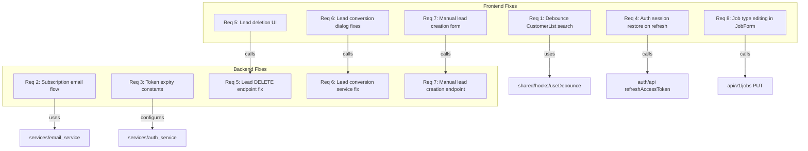

# Design Document: ASAP Platform Fixes

## Overview

This design addresses 8 high-priority fixes and enhancements across the Grins Platform. The fixes span the frontend (React 19 / TypeScript / TanStack Query) and backend (FastAPI / SQLAlchemy / PostgreSQL), touching customer search, subscription management, authentication, CRM lead operations, and job management.

The changes are scoped as targeted, surgical fixes to existing components rather than architectural overhauls. Each fix is isolated to its vertical slice, minimizing cross-feature risk.

## Architecture

The platform follows a vertical-slice architecture:

```
Frontend (React 19 + Vite)          Backend (FastAPI)
─────────────────────────           ─────────────────
features/customers/                 api/v1/customers.py
features/leads/                     api/v1/leads.py
features/jobs/                      api/v1/jobs.py
features/auth/                      services/auth_service.py
features/portal/                    api/v1/checkout.py
shared/hooks/useDebounce.ts         services/lead_service.py
                                    services/job_service.py
                                    services/checkout_service.py
```

All fixes follow the existing patterns: TanStack Query for data fetching, React Hook Form + Zod for forms, toast notifications for feedback, and LoggerMixin for backend logging.



## Components and Interfaces

### Requirement 1: Debounce Customer Search

**Current state:** `CustomerList.tsx` passes `searchQuery` directly to `useCustomers()` on every keystroke. A `CustomerSearch` component with debounce exists but is not used in `CustomerList`.

**Fix:** Replace the inline `<Input>` search in `CustomerList.tsx` with the existing `CustomerSearch` component (which already uses `useDebounce(value, 300)`), and reset pagination to page 1 when the debounced value changes.

**Affected files:**
- `frontend/src/features/customers/components/CustomerList.tsx` — replace inline search with `CustomerSearch`, add pagination reset on search change

### Requirement 2: Subscription Management Email Flow

**Current state:** The portal endpoints handle estimate/invoice viewing via tokens. Subscription management uses Stripe's Customer Portal URL stored in config. The email flow for subscription management login needs to be verified and potentially fixed.

**Fix:** Add/fix a subscription management endpoint that:
1. Accepts an email, looks up the Stripe customer
2. Sends a login email with a Stripe Customer Portal session URL
3. Returns appropriate error messages for unknown emails
4. Provides a resend mechanism

**Affected files:**
- `src/grins_platform/api/v1/checkout.py` — add `POST /manage-subscription` endpoint
- `src/grins_platform/services/checkout_service.py` — add `create_portal_session` method
- `src/grins_platform/services/email_service.py` — add subscription management email template
- `frontend/src/features/portal/components/` — fix subscription management UI

### Requirement 3: Extend Authentication Session Duration

**Current state:** `ACCESS_TOKEN_EXPIRE_MINUTES = 15` and `REFRESH_TOKEN_EXPIRE_DAYS = 7` in `auth_service.py`.

**Fix:** Update constants:
- `ACCESS_TOKEN_EXPIRE_MINUTES = 60` (was 15)
- `REFRESH_TOKEN_EXPIRE_DAYS = 30` (was 7)
- Update cookie `max-age` in the auth endpoint response to match

**Affected files:**
- `src/grins_platform/services/auth_service.py` — update token expiry constants
- `src/grins_platform/api/v1/auth.py` — update cookie max-age values

### Requirement 4: Persist Authentication Across Page Refresh

**Current state:** `AuthProvider.tsx` already attempts session restoration on mount via `restoreSession()` which calls `authApi.refreshAccessToken()`. The `isLoading` state starts as `true` and is set to `false` after the attempt.

**Fix:** Verify the existing implementation works correctly. The `ProtectedRoute` component needs to show a loading indicator while `isLoading` is true instead of redirecting to login. This may already be implemented — verify and fix if needed.

**Affected files:**
- `frontend/src/features/auth/components/ProtectedRoute.tsx` — ensure loading state is handled
- `frontend/src/features/auth/components/AuthProvider.tsx` — verify session restore logic

### Requirement 5: Fix Lead Deletion

**Current state:** `LeadDetail.tsx` likely has a delete button but may have issues with the API call or error handling. The backend `delete_lead` method exists in `lead_service.py`.

**Fix:**
1. Ensure the DELETE endpoint in `api/v1/leads.py` works correctly
2. Add a confirmation dialog before deletion in `LeadDetail.tsx`
3. Add optimistic removal from the leads list after successful deletion
4. Add error handling with retry option

**Affected files:**
- `frontend/src/features/leads/components/LeadDetail.tsx` — add confirmation dialog, fix delete handler
- `frontend/src/features/leads/hooks/` — add/fix `useDeleteLead` mutation hook
- `src/grins_platform/api/v1/leads.py` — verify DELETE endpoint

### Requirement 6: Fix Lead-to-Customer Conversion

**Current state:** `ConvertLeadDialog.tsx` exists with job description field. The backend `convert_lead` in `lead_service.py` uses `data.job_description or default_description` which falls back to default when user provides empty string. The dialog doesn't hide the job description field when toggle is off, and doesn't remove the lead from the list after conversion.

**Fix:**
1. Backend: Use `data.job_description if data.job_description is not None else default_description` to respect user input
2. Frontend: Hide job description field when `createJob` is off
3. Frontend: Don't send `job_description` when `createJob` is off
4. Frontend: Invalidate leads query after successful conversion to remove from list
5. Frontend: Handle already-converted error

**Affected files:**
- `src/grins_platform/services/lead_service.py` — fix job description fallback logic
- `frontend/src/features/leads/components/ConvertLeadDialog.tsx` — fix form behavior
- `frontend/src/features/leads/hooks/` — ensure mutation invalidates leads list

### Requirement 7: Add Manual Lead Creation

**Current state:** `LeadsList.tsx` has no "Add Lead" button. The backend has `submit_lead` and `create_from_call` endpoints but no general manual creation endpoint.

**Fix:**
1. Add a `CreateLeadDialog` component with form fields: name, phone, email, address, city, state, zip, situation, notes
2. Add "Add Lead" button to `LeadsList.tsx` header
3. Backend: add/use a manual lead creation endpoint (or reuse `create_from_call` with appropriate source)
4. Validate minimum required fields (name, phone)

**Affected files:**
- `frontend/src/features/leads/components/CreateLeadDialog.tsx` — new component
- `frontend/src/features/leads/components/LeadsList.tsx` — add "Add Lead" button
- `frontend/src/features/leads/hooks/` — add `useCreateLead` mutation
- `src/grins_platform/api/v1/leads.py` — add/verify manual creation endpoint
- `src/grins_platform/schemas/leads.py` — add manual lead creation schema

### Requirement 8: Enable Job Type Editing

**Current state:** `JobForm.tsx` uses `<Select defaultValue={field.value}>` for job type. The `defaultValue` prop on Radix Select doesn't update when the form resets for editing. The `JobUpdate` type already includes `job_type`.

**Fix:** Change the Select component to use `value={field.value}` instead of `defaultValue={field.value}` so it reflects the current form state when editing an existing job.

**Affected files:**
- `frontend/src/features/jobs/components/JobForm.tsx` — fix Select to use controlled `value` prop

## Data Models

### Existing Models (no changes needed)

The existing `Lead`, `Customer`, `Job`, and `Staff` SQLAlchemy models support all required operations. No schema migrations are needed.

### Schema Additions

**Manual Lead Creation Schema** (new):
```python
class ManualLeadCreate(BaseModel):
    name: str                          # required
    phone: str                         # required
    email: str | None = None
    address: str | None = None
    city: str | None = None
    state: str | None = None
    zip_code: str | None = None
    situation: LeadSituation = "exploring"
    notes: str | None = None
```

**Subscription Management Request** (new):
```python
class SubscriptionManageRequest(BaseModel):
    email: str
```

### Token Expiry Configuration Changes

| Setting | Current | New |
|---------|---------|-----|
| ACCESS_TOKEN_EXPIRE_MINUTES | 15 | 60 |
| REFRESH_TOKEN_EXPIRE_DAYS | 7 | 30 |
| Cookie max-age (access) | 900s | 3600s |
| Cookie max-age (refresh) | 604800s | 2592000s |


## Correctness Properties

*A property is a characteristic or behavior that should hold true across all valid executions of a system — essentially, a formal statement about what the system should do. Properties serve as the bridge between human-readable specifications and machine-verifiable correctness guarantees.*

### Property 1: Debounce reduces API call frequency

*For any* sequence of N keystrokes typed into the customer search field within a 300ms window, the number of API requests issued should be strictly less than N.

**Validates: Requirements 1.1, 1.2**

### Property 2: Search change resets pagination

*For any* customer search state with page > 1, when the debounced search query changes to a different value, the resulting page parameter should be 1.

**Validates: Requirements 1.3**

### Property 3: Invalid email returns subscription-not-found error

*For any* email address that does not match an active Stripe subscription, the manage-subscription endpoint should return an error response indicating no subscription was found.

**Validates: Requirements 2.2**

### Property 4: Token expiry meets minimum thresholds

*For any* user ID and role, a newly created access token should have an expiration at least 60 minutes from issuance, and a newly created refresh token should have an expiration at least 30 days from issuance. The cookie max-age should match the token expiration in seconds.

**Validates: Requirements 3.1, 3.2, 3.4**

### Property 5: Refresh token validity determines session outcome

*For any* valid (non-expired) refresh token, calling the refresh endpoint should return a new access token. *For any* expired or malformed refresh token, the refresh endpoint should reject the request.

**Validates: Requirements 4.2, 4.3**

### Property 6: Lead deletion removes the record

*For any* lead that exists in the database, calling delete on that lead should result in the lead no longer being retrievable.

**Validates: Requirements 5.1**

### Property 7: Lead conversion preserves user-provided job description

*For any* lead and any non-empty user-provided job description string, converting the lead with `create_job=True` should produce a job whose description exactly matches the user-provided string, not a default value.

**Validates: Requirements 6.1**

### Property 8: Lead conversion updates status to converted

*For any* lead with status other than "converted", successfully converting it should change its status to "converted".

**Validates: Requirements 6.2**

### Property 9: Lead conversion without job creates customer only

*For any* lead converted with `create_job=False`, the conversion should create a customer record and return `job_id=None`.

**Validates: Requirements 6.3**

### Property 10: Already-converted leads are rejected

*For any* lead whose status is already "converted", attempting conversion again should raise a `LeadAlreadyConvertedError`.

**Validates: Requirements 6.4**

### Property 11: Manual lead creation requires name and phone

*For any* lead creation request where name is empty or phone is empty, the system should reject the request with a validation error. *For any* request with non-empty name and non-empty phone, the system should accept it.

**Validates: Requirements 7.3**

### Property 12: Manual lead creation round trip

*For any* valid manual lead data (non-empty name and phone), creating the lead and then retrieving it should return a lead with matching name, phone, email, and other provided fields.

**Validates: Requirements 7.4**

### Property 13: Job type update persists

*For any* existing job and any valid job type value from the allowed set (spring_startup, summer_tuneup, winterization, repair, diagnostic, installation, landscaping), updating the job's type and then retrieving it should reflect the new job type.

**Validates: Requirements 8.1, 8.3**

## Error Handling

| Scenario | Frontend Behavior | Backend Behavior |
|----------|------------------|-----------------|
| Customer search API failure | Show error message via `ErrorMessage` component, allow retry | Return 500 with error detail |
| Subscription email - unknown email | Display "no subscription found" message | Return 404 with descriptive message |
| Subscription email - send failure | Display error toast, show "Resend" button | Return 500, log error |
| Token refresh failure | Redirect to login page, clear auth state | Return 401 |
| Lead deletion - not found | Display error toast | Return 404 `LeadNotFoundError` |
| Lead deletion - network error | Display error toast with retry option | N/A (network level) |
| Lead conversion - already converted | Display error toast "Lead already converted" | Return 409 `LeadAlreadyConvertedError` |
| Lead conversion - missing name | Disable submit button, show validation error | Return 422 validation error |
| Manual lead creation - missing required fields | Show inline validation errors, preserve form data | Return 422 validation error |
| Manual lead creation - API failure | Show error toast, preserve form data | Return 500, log error |
| Job type update - API failure | Show error toast, revert to previous value | Return 500, log error |

All backend errors use structured logging via `LoggerMixin` with the pattern `{domain}.{action}.{status}`.

## Testing Strategy

### Property-Based Testing

Library: **Hypothesis** (Python, already in use — see `.hypothesis/` directory)

Each correctness property above will be implemented as a single Hypothesis test with `@settings(max_examples=100)`. Tests will be tagged with comments referencing the design property:

```python
# Feature: asap-platform-fixes, Property 4: Token expiry meets minimum thresholds
@given(user_id=st.uuids(), role=st.sampled_from(["admin", "technician", "office"]))
@settings(max_examples=100)
def test_token_expiry_meets_minimum_thresholds(user_id, role):
    ...
```

Property tests focus on backend logic:
- Properties 4, 5: Token generation and validation (auth_service)
- Properties 6, 7, 8, 9, 10: Lead operations (lead_service)
- Properties 11, 12: Manual lead creation (lead_service)
- Properties 13: Job type update (job_service)

Frontend properties (1, 2, 3) will be tested via Vitest with `fast-check`:
- Properties 1, 2: Debounce behavior with simulated timing

### Unit Tests (Vitest + pytest)

Frontend unit tests (Vitest + React Testing Library):
- `CustomerList.test.tsx` — debounce integration, pagination reset
- `ConvertLeadDialog.test.tsx` — job description field visibility toggle, form submission
- `CreateLeadDialog.test.tsx` — form validation, required fields
- `JobForm.test.tsx` — job type select controlled value when editing
- `AuthProvider.test.tsx` — session restore, loading state
- `ProtectedRoute.test.tsx` — loading indicator during auth check

Backend unit tests (pytest):
- `test_auth_service.py` — token expiry values, refresh flow
- `test_lead_service.py` — delete, convert, manual create
- `test_checkout_service.py` — subscription management email flow

### Functional Tests (pytest, real DB)

- Lead CRUD lifecycle: create manual lead → list → convert → verify status
- Job type update: create job → update type → verify persistence
- Auth token refresh: authenticate → wait → refresh → verify new token

### Integration Tests

- E2E browser tests via `agent-browser` for critical user flows
- Subscription email flow with mocked Stripe API

## Regression Testing Strategy

Since the ASAP fixes touch auth, CRM leads, customers, and jobs simultaneously, regression testing is critical to ensure no existing functionality breaks.

### Risk Analysis by Change Area

| Change | Risk Area | What Could Break |
|--------|-----------|-----------------|
| Auth token duration (Req 3) | Every authenticated route | Agreement flow, scheduling, invoicing, dashboard — any feature behind auth |
| Auth session restore (Req 4) | Page refresh behavior | Users could get stuck on loading or incorrectly redirected |
| Customer search debounce (Req 1) | Customer list rendering | Customer detail navigation, pagination, customer editing |
| Lead deletion (Req 5) | Lead data integrity | Google Sheets poller, lead-to-estimate flow, lead SMS |
| Lead conversion fix (Req 6) | Lead-to-customer pipeline | Customer creation, job creation from leads, estimate flow |
| Manual lead creation (Req 7) | Lead list, lead schemas | Existing lead sources (Google Sheets, phone), lead filtering |
| Job type editing (Req 8) | Job form, job list | Job creation from lead conversion, scheduling, job status flow |
| Work Request tab removal | Navigation, routing | Direct URL access, sidebar rendering |

### Regression Test Layers

**Layer 1: Existing Test Suite Gate (automated, mandatory)**
Run the full existing test suite before and after changes. Zero new failures allowed.
- `uv run pytest -v` — all backend tests (unit + functional + integration)
- `npm test` — all frontend Vitest tests
- Any new test failure that wasn't failing before the changes must be fixed before merging.

**Layer 2: Cross-Feature Integration Tests (new, backend)**
Write a dedicated regression test file `tests/integration/test_asap_regression.py` that verifies cross-feature interactions:
- Auth changes don't break: customer API, lead API, job API, invoice API, schedule API, agreement API
- Lead service changes don't break: Google Sheets poller lead creation, lead-to-estimate flow, lead SMS deferred processing
- Customer search changes don't break: customer detail retrieval, customer update, property listing

**Layer 3: E2E Browser Regression (agent-browser)**
Run the existing E2E test scripts against the modified platform to verify user-facing flows:
- `scripts/e2e/test-customers.sh` — customer list, search, detail, edit
- `scripts/e2e/test-leads.sh` — lead list, detail, conversion
- `scripts/e2e/test-jobs.sh` — job list, detail, editing
- `scripts/e2e/test-dashboard.sh` — dashboard loads with auth
- `scripts/e2e/test-agreement-flow.sh` — agreement flow (OFF-LIMITS for modification but must still work)
- `scripts/e2e/test-session-persistence.sh` — auth persistence across refresh
- `scripts/e2e/test-navigation-security.sh` — all routes accessible with auth, blocked without
- `scripts/e2e/test-schedule.sh` — scheduling still works with auth changes
- `scripts/e2e/test-invoices.sh` — invoice operations still work
- `scripts/e2e/test-invoice-portal.sh` — portal access still works

**Layer 4: Smoke Test Checklist (manual verification via agent-browser)**
After all automated tests pass, run a quick smoke test hitting each major page:
1. Login → Dashboard loads
2. Navigate to Customers → search works, click customer → detail loads
3. Navigate to Leads → list loads, click lead → detail loads
4. Navigate to Jobs → list loads, click job → detail loads, edit job type
5. Navigate to Schedule → calendar renders
6. Navigate to Invoices → list loads
7. Navigate to Sales → estimates load
8. Navigate to Accounting → page loads
9. Navigate to Marketing → page loads
10. Navigate to Settings → page loads
11. Refresh page → session persists (no re-login)
12. Navigate to /work-requests → redirects to leads
