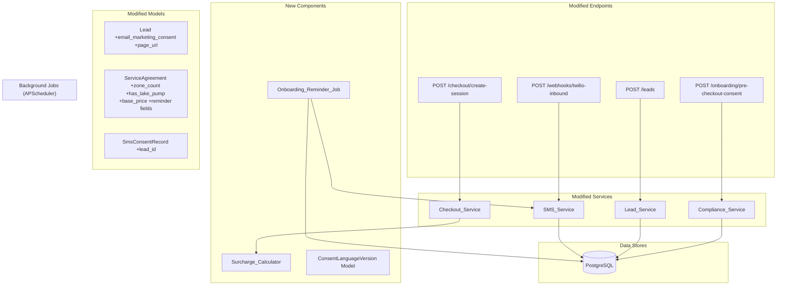
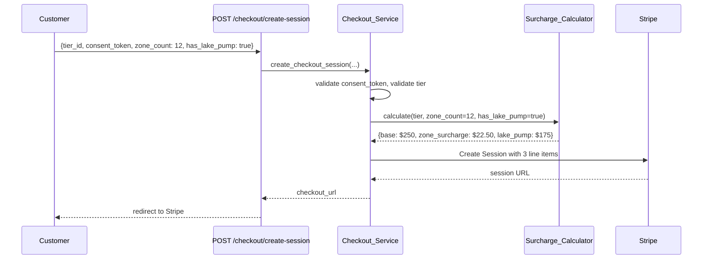
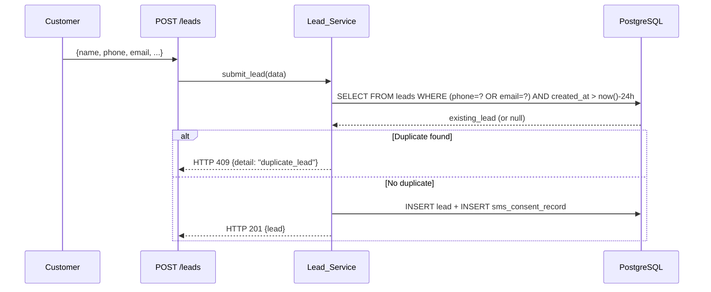
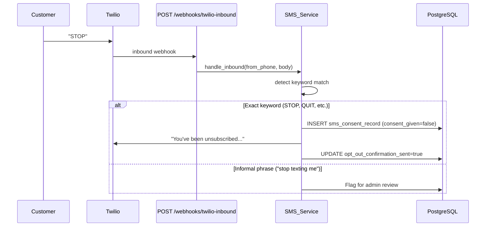
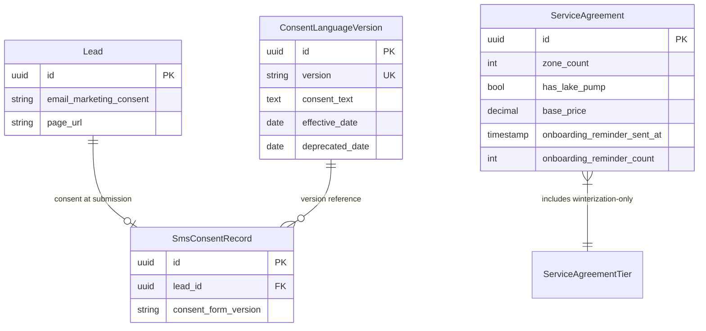

# Design Document — Backend-Frontend Integration Gaps

## Overview

This design addresses 11 integration gaps between the existing `service-package-purchases` backend spec and the Phase One Frontend spec. The changes span TCPA compliance fixes, new model fields, pricing surcharge logic, a new winterization-only tier, duplicate lead detection, SMS opt-out processing, time-window enforcement, onboarding reminders, and a consent language version registry.

### Key Design Decisions

1. **TCPA-first consent fix**: The current `process_pre_checkout_consent` rejects requests when `sms_consent=false`. This violates TCPA by conditioning purchase on SMS consent. The fix removes `sms_consent` from the validation gate — only `terms_accepted` is required. An `SmsConsentRecord` is still created regardless (with `consent_given=false` for declinations) to maintain the audit trail.

2. **Surcharge_Calculator as a pure utility**: Zone count and lake pump surcharges are computed by a stateless function with no DB access. This makes it trivially testable via property-based tests and reusable across checkout and webhook contexts.

3. **Winterization-Only as a tier variant, not a new model**: The two new winterization-only tiers are seeded as `ServiceAgreementTier` records with a `winterization-only-` slug prefix. The `Job_Generator` and `Surcharge_Calculator` branch on slug prefix to apply different rates and job schedules.

4. **Duplicate lead detection via indexed query**: Duplicates are detected by querying `leads` for matching `phone` OR `email` within the last 24 hours using existing indexes. No new table or Redis cache needed — the query is fast with the existing `idx_leads_phone` and `idx_leads_created_at` indexes plus a new composite index.

5. **STOP keyword processing with exact-match auto-opt-out and informal-match admin flagging**: Exact TCPA keywords (STOP, QUIT, CANCEL, UNSUBSCRIBE, END, REVOKE) trigger automatic opt-out. Informal phrases ("stop texting me", "take me off the list") are flagged for admin review rather than auto-processed, reducing false positives.

6. **SMS time window via `zoneinfo` (stdlib)**: Central Time enforcement uses Python 3.9+ `zoneinfo.ZoneInfo("America/Chicago")` — no `pytz` dependency needed. Messages outside 8 AM–9 PM CT are queued for next-day 8 AM delivery.

7. **Onboarding reminder job follows existing APScheduler pattern**: The new `remind_incomplete_onboarding` job is registered alongside existing background jobs in `background_jobs.py` and uses the same `BackgroundScheduler` singleton.

8. **Consent language version registry is append-only**: The `consent_language_versions` table uses `deprecated_date` instead of deletion. Version validation on `SmsConsentRecord` creation logs a warning for unknown versions but does not block the consent flow.

## Architecture



### Request Flow: Surcharge Calculation in Checkout



### Request Flow: Duplicate Lead Detection



### SMS Opt-Out Processing Flow




## Components and Interfaces

### Modified Backend Components

#### 1. Compliance_Service (`services/compliance_service.py` — modified)

**Change**: Fix `process_pre_checkout_consent` to only require `terms_accepted=true`. Remove `sms_consent` from the validation gate.

Current behavior (broken):
```python
# CURRENT — rejects if sms_consent=false (TCPA violation)
if not sms_consent:
    missing.append("sms_consent")
if not terms_accepted:
    missing.append("terms_accepted")
```

New behavior:
```python
# FIXED — only terms_accepted is required
if not terms_accepted:
    raise ConsentValidationError(["terms_accepted"])

# Always create SmsConsentRecord regardless of consent value
sms_record = await self.create_sms_consent(
    phone=phone,
    consent_given=sms_consent,  # true or false — both recorded
    method=consent_method,
    language_shown=consent_language,
    token=consent_token,
    ip_address=ip_address,
    user_agent=user_agent,
)
```

**New method**: `validate_consent_language_version(version: str) -> bool`
- Queries `consent_language_versions` table for the given version
- Returns `True` if version exists and `deprecated_date` is NULL
- Logs warning if version not found or deprecated, but does not raise
- Called during `SmsConsentRecord` creation when `consent_form_version` is provided

**New parameter on `process_pre_checkout_consent`**: `email_marketing_consent: bool = False`
- Stored in Stripe session metadata via the consent_token linkage
- Not validated — purely informational at this stage

#### 2. Checkout_Service (`services/checkout_service.py` — modified)

**Change**: Accept `zone_count` and `has_lake_pump` on `create_checkout_session`. Use `Surcharge_Calculator` to compute additional line items.

New signature:
```python
async def create_checkout_session(
    self,
    tier_id: UUID,
    package_type: str,
    consent_token: UUID,
    *,
    zone_count: int = 1,
    has_lake_pump: bool = False,
    email_marketing_consent: bool = False,
    utm_params: dict[str, str] | None = None,
    success_url: str = "",
    cancel_url: str = "",
) -> str:
```

Processing changes:
1. After tier validation, call `Surcharge_Calculator.calculate(tier_slug, package_type, zone_count, has_lake_pump)` to get surcharge breakdown
2. Build Stripe line items: base tier price (from `stripe_price_id`) + zone surcharge (ad-hoc `price_data`) + lake pump surcharge (ad-hoc `price_data`) — only non-zero surcharges included
3. Store `zone_count`, `has_lake_pump`, `email_marketing_consent` in session metadata and subscription metadata

#### 3. Lead_Service (`services/lead_service.py` — modified)

**Changes**:

a) **Duplicate detection** in `submit_lead()`:
- Before creating a lead, query for existing leads with matching `phone` OR `email` (if provided) created within the last 24 hours
- If found, raise `DuplicateLeadError` → HTTP 409 with `{"detail": "duplicate_lead", "message": "..."}`
- Query uses existing `idx_leads_phone` index + new composite index `idx_leads_email_created_at`

b) **SmsConsentRecord creation** in `submit_lead()`:
- After creating the Lead, create an `SmsConsentRecord` with:
  - `consent_given` = lead's `sms_consent` value
  - `consent_method` = `"lead_form"`
  - `customer_id` = NULL
  - `lead_id` = newly created lead's ID
  - `consent_ip_address`, `consent_user_agent`, `consent_form_version` from request if provided

c) **New fields on lead creation**: Accept `email_marketing_consent`, `page_url`, `consent_ip`, `consent_user_agent`, `consent_language_version`

d) **Lead-to-customer conversion** in `convert_lead()`:
- If lead has `email_marketing_consent=true`, set customer's `email_opt_in=true`, `email_opt_in_at=now()`, `email_opt_in_source="lead_form"`
- Update existing `SmsConsentRecord` (by `lead_id`) to set `customer_id` to the new customer's ID

#### 4. SMS_Service (`services/sms_service.py` — modified)

**Changes**:

a) **STOP keyword processing** in `handle_inbound()`:
- Exact keyword match (case-insensitive, full body or standalone word): STOP, QUIT, CANCEL, UNSUBSCRIBE, END, REVOKE
- On match: create `SmsConsentRecord` with `consent_given=false`, `opt_out_method="text_stop"`, `opt_out_timestamp=now()`
- Send confirmation: "You've been unsubscribed from Grins Irrigation texts. Reply START to re-subscribe."
- Set `opt_out_confirmation_sent=true`

b) **Informal opt-out flagging**:
- Phrases: "stop texting me", "take me off the list", "no more texts", "opt out", "don't text me"
- Flag for admin review (log + create admin notification) — do NOT auto-process

c) **Consent check before sending** — new method `check_sms_consent(phone: str) -> bool`:
- Query most recent `SmsConsentRecord` for the phone number ordered by `created_at DESC`
- Return `consent_given` value from the most recent record
- Called before every automated SMS send

d) **Time window enforcement** — new method `enforce_time_window(phone: str, message: str, message_type: str) -> datetime | None`:
- Check current time in `America/Chicago` timezone using `zoneinfo.ZoneInfo`
- If between 8:00 AM and 9:00 PM CT: return `None` (send immediately)
- Otherwise: compute next 8:00 AM CT, log deferral, return scheduled datetime
- Applied to all automated messages; skipped for admin-initiated manual messages

#### 5. Job_Generator (`services/job_generator.py` — modified)

**Change**: Add winterization-only tier support.

New tier mapping entry:
```python
_WINTERIZATION_ONLY_JOBS: list[tuple[str, str, int, int]] = [
    ("fall_winterization", "Fall system winterization and blowout", 10, 10),
]
```

Detection: Check if `tier.slug.startswith("winterization-only-")` to route to the winterization-only job list.

### New Backend Components

#### 6. Surcharge_Calculator (`services/surcharge_calculator.py` — new)

A pure, stateless utility for computing zone count and lake pump surcharges. No DB access, no side effects.

```python
@dataclass(frozen=True)
class SurchargeBreakdown:
    base_price: Decimal
    zone_surcharge: Decimal
    lake_pump_surcharge: Decimal

    @property
    def total(self) -> Decimal:
        return self.base_price + self.zone_surcharge + self.lake_pump_surcharge


class SurchargeCalculator:
    """Pure utility — no DB access, no side effects."""

    # Rate table: (tier_category, package_type) → (zone_rate, lake_pump_rate)
    RATES: dict[tuple[str, str], tuple[Decimal, Decimal]] = {
        ("standard", "residential"): (Decimal("7.50"), Decimal("175.00")),
        ("standard", "commercial"): (Decimal("10.00"), Decimal("200.00")),
        ("winterization-only", "residential"): (Decimal("5.00"), Decimal("75.00")),
        ("winterization-only", "commercial"): (Decimal("10.00"), Decimal("100.00")),
    }
    ZONE_THRESHOLD = 10  # surcharge applies at 10+ zones

    @staticmethod
    def calculate(
        tier_slug: str,
        package_type: str,
        zone_count: int,
        has_lake_pump: bool,
        base_price: Decimal,
    ) -> SurchargeBreakdown:
        """Compute surcharges. Pure function."""
        tier_category = (
            "winterization-only"
            if tier_slug.startswith("winterization-only-")
            else "standard"
        )
        key = (tier_category, package_type.lower())
        zone_rate, lake_pump_rate = SurchargeCalculator.RATES.get(
            key, (Decimal("0"), Decimal("0"))
        )

        zone_surcharge = (
            zone_rate * (zone_count - 9)
            if zone_count >= SurchargeCalculator.ZONE_THRESHOLD
            else Decimal("0")
        )
        lake_pump_surcharge = lake_pump_rate if has_lake_pump else Decimal("0")

        return SurchargeBreakdown(
            base_price=base_price,
            zone_surcharge=zone_surcharge,
            lake_pump_surcharge=lake_pump_surcharge,
        )
```

#### 7. Onboarding_Reminder_Job (`services/onboarding_reminder_job.py` — new)

Daily background job registered with the existing `BackgroundScheduler`.

```python
class OnboardingReminderJob(LoggerMixin):
    DOMAIN = "onboarding"

    async def run(self) -> None:
        """Query incomplete onboarding and send reminders at T+24h, T+72h, T+7d."""
```

Logic:
1. Query `ServiceAgreement` where `status IN ('active', 'pending')` AND `property_id IS NULL`
2. For each agreement, compute hours since `created_at`
3. **T+24h** (reminder_count=0): Send SMS reminder with onboarding link, increment `onboarding_reminder_count`, set `onboarding_reminder_sent_at`
4. **T+72h** (reminder_count=1): Send second SMS reminder
5. **T+7d** (reminder_count=2): Create admin notification (no SMS)
6. All SMS sends gated on `SMS_Service.check_sms_consent(phone)` and `SMS_Service.enforce_time_window()`

Registered in `background_jobs.py`:
```python
scheduler.add_job(
    remind_incomplete_onboarding_job,
    trigger="cron",
    hour=10,  # 10 AM UTC ≈ morning CT
    id="remind_incomplete_onboarding",
    replace_existing=True,
)
```

#### 8. ConsentLanguageVersion Model + Repository

New model for the append-only consent language version registry. See Data Models section for schema.

Repository: `ConsentLanguageVersionRepository` with:
- `get_by_version(version: str) -> ConsentLanguageVersion | None`
- `get_active_version() -> ConsentLanguageVersion | None` — returns the latest non-deprecated version
- `create(version, consent_text, effective_date) -> ConsentLanguageVersion`
- No `update` or `delete` methods (append-only)

### Modified API Endpoints

#### `POST /api/v1/onboarding/pre-checkout-consent` (modified)

Request schema changes:
- `sms_consent`: remains required, but `false` is now accepted without error
- `email_marketing_consent`: new optional field (boolean, default `false`)

Response: unchanged (`{ consent_token: UUID }`)

#### `POST /api/v1/checkout/create-session` (modified)

Request schema changes:
- `zone_count`: new required field (integer, min 1)
- `has_lake_pump`: new optional field (boolean, default `false`)
- `email_marketing_consent`: new optional field (boolean, default `false`)

Response: unchanged (`{ checkout_url: str }`)

#### `POST /api/v1/leads` (modified)

Request schema changes:
- `email_marketing_consent`: new optional field (boolean, default `false`)
- `page_url`: new optional field (string, max 2048 chars)
- `consent_ip`: new optional field (string)
- `consent_user_agent`: new optional field (string)
- `consent_language_version`: new optional field (string)

New error response:
- HTTP 409: `{"detail": "duplicate_lead", "message": "A request with this contact information was recently submitted. We'll be in touch soon."}`

#### `POST /api/v1/webhooks/twilio-inbound` (new or modified)

Receives inbound SMS from Twilio. Routes to `SMS_Service.handle_inbound()`.

Request: Twilio webhook format (`From`, `Body`, `MessageSid`)
Response: TwiML or HTTP 200


## Data Models

### New Tables

#### `consent_language_versions` (Append-Only Registry)

| Column | Type | Constraints | Notes |
|--------|------|-------------|-------|
| id | UUID | PK, default gen_random_uuid() | |
| version | VARCHAR(20) | UNIQUE, NOT NULL | e.g., "v1.0" |
| consent_text | TEXT | NOT NULL | Full TCPA disclosure text |
| effective_date | DATE | NOT NULL | When this version became active |
| deprecated_date | DATE | nullable | Set when superseded by a new version |
| created_at | TIMESTAMP(tz) | NOT NULL, default now() | |

Seed data (1 record via migration):
- version: `"v1.0"`
- consent_text: Current TCPA-compliant disclosure text
- effective_date: migration date
- deprecated_date: NULL

Constraints: No UPDATE or DELETE operations at the application level. Old versions are deprecated by setting `deprecated_date`.

### Modified Tables

#### `leads` — New Columns

| Column | Type | Constraints | Notes |
|--------|------|-------------|-------|
| email_marketing_consent | BOOLEAN | NOT NULL, default false | Req 2.1 — set false for existing rows |
| page_url | VARCHAR(2048) | nullable | Req 5.1 — set NULL for existing rows |

New index: `idx_leads_email_created_at` on `(email, created_at)` for duplicate detection queries.

#### `service_agreements` — New Columns

| Column | Type | Constraints | Notes |
|--------|------|-------------|-------|
| zone_count | INTEGER | nullable | Req 3.13 — number of irrigation zones |
| has_lake_pump | BOOLEAN | NOT NULL, default false | Req 3.13 — lake pump surcharge flag |
| base_price | DECIMAL(10,2) | nullable | Req 3.14 — tier base price before surcharges |
| onboarding_reminder_sent_at | TIMESTAMP(tz) | nullable | Req 10.6 — last reminder timestamp |
| onboarding_reminder_count | INTEGER | NOT NULL, default 0 | Req 10.6 — number of reminders sent |

#### `sms_consent_records` — New Column

| Column | Type | Constraints | Notes |
|--------|------|-------------|-------|
| lead_id | UUID | FK → leads.id, nullable | Req 7.2 — links consent to lead before customer exists |

New index: `ix_sms_consent_records_lead_id` on `lead_id`.

### New Seed Data (Migration)

#### Winterization-Only Tiers (2 records in `service_agreement_tiers`)

| Name | Slug | Package Type | Annual Price | Included Services | Display Order |
|------|------|-------------|-------------|-------------------|---------------|
| Winterization Only Residential | winterization-only-residential | RESIDENTIAL | $80.00 | `[{"service_type": "fall_winterization", "frequency": 1, "description": "Fall system winterization and blowout"}]` | 7 |
| Winterization Only Commercial | winterization-only-commercial | COMMERCIAL | $100.00 | `[{"service_type": "fall_winterization", "frequency": 1, "description": "Fall system winterization and blowout"}]` | 8 |

Both seeded with `is_active=true`, `stripe_product_id=NULL`, `stripe_price_id=NULL` (populated via environment-specific configuration after Stripe Products/Prices are created).

### Entity Relationship Diagram (Changes Only)



### Migration Strategy

Migrations are created via Alembic and executed in order:

1. **Migration 1**: Add `email_marketing_consent` (BOOLEAN, default false) and `page_url` (VARCHAR(2048), nullable) to `leads`. Add composite index `idx_leads_email_created_at`.
2. **Migration 2**: Add `zone_count` (INTEGER, nullable), `has_lake_pump` (BOOLEAN, default false), `base_price` (DECIMAL(10,2), nullable), `onboarding_reminder_sent_at` (TIMESTAMP, nullable), `onboarding_reminder_count` (INTEGER, default 0) to `service_agreements`.
3. **Migration 3**: Add `lead_id` (UUID, FK → leads.id, nullable) to `sms_consent_records`. Add index `ix_sms_consent_records_lead_id`.
4. **Migration 4**: Create `consent_language_versions` table. Seed v1.0 record.
5. **Migration 5**: Seed 2 winterization-only tier records into `service_agreement_tiers`.


## Correctness Properties

*A property is a characteristic or behavior that should hold true across all valid executions of a system — essentially, a formal statement about what the system should do. Properties serve as the bridge between human-readable specifications and machine-verifiable correctness guarantees.*

### Property 1: Pre-checkout consent only requires terms_accepted

*For any* pre-checkout consent request with `terms_accepted=false`, the Compliance_Service should reject the request with a validation error, regardless of the `sms_consent` value. Conversely, *for any* request with `terms_accepted=true`, the service should accept the request regardless of the `sms_consent` value.

**Validates: Requirements 1.1, 1.2**

### Property 2: SmsConsentRecord mirrors sms_consent value

*For any* pre-checkout consent request where `terms_accepted=true`, the created `SmsConsentRecord` should have `consent_given` equal to the request's `sms_consent` value (true or false).

**Validates: Requirements 1.3, 1.4**

### Property 3: Lead field persistence round-trip

*For any* valid lead creation request with random `email_marketing_consent` (boolean) and `page_url` (string up to 2048 chars), the stored Lead record should have `email_marketing_consent` and `page_url` matching the submitted values.

**Validates: Requirements 2.2, 5.2**

### Property 4: Email marketing consent carries over on lead conversion

*For any* Lead with `email_marketing_consent=true` that is converted to a Customer, the resulting Customer should have `email_opt_in=true`, `email_opt_in_source="lead_form"`, and `email_opt_in_at` set to a non-null timestamp.

**Validates: Requirements 2.3**

### Property 5: Surcharge_Calculator zone surcharge formula

*For any* tier category (standard or winterization-only), package type (residential or commercial), and zone count (integer ≥ 1), the computed zone surcharge should equal `rate × max(0, zone_count - 9)` where `rate` is looked up from the rate table for that tier category and package type. When `zone_count < 10`, the zone surcharge should be exactly zero.

**Validates: Requirements 3.2, 3.3, 3.6, 3.7, 3.10**

### Property 6: Surcharge_Calculator lake pump surcharge

*For any* tier category and package type, when `has_lake_pump=true` the lake pump surcharge should equal the rate from the rate table for that combination. When `has_lake_pump=false`, the lake pump surcharge should be exactly zero.

**Validates: Requirements 3.4, 3.5, 3.8, 3.9**

### Property 7: Surcharge_Calculator total is sum of parts

*For any* valid inputs to the Surcharge_Calculator, the `total` property of the returned `SurchargeBreakdown` should equal `base_price + zone_surcharge + lake_pump_surcharge`.

**Validates: Requirements 3.2, 3.3, 3.4, 3.5, 3.6, 3.7, 3.8, 3.9, 3.10**

### Property 8: Winterization-only tier generates exactly 1 job

*For any* ServiceAgreement linked to a winterization-only tier, the Job_Generator should create exactly 1 job with `job_type="fall_winterization"`, `target_start_date` of October 1, and `target_end_date` of October 31.

**Validates: Requirements 4.2**

### Property 9: Duplicate lead detection within 24-hour window

*For any* two lead submissions with matching phone number or email address where the second submission occurs within 24 hours of the first, the second submission should be rejected (HTTP 409) and the total lead count should not increase.

**Validates: Requirements 6.1, 6.2, 6.3, 6.4**

### Property 10: SmsConsentRecord created at lead submission

*For any* lead creation, an `SmsConsentRecord` should be created with `consent_given` matching the lead's `sms_consent` value, `consent_method="lead_form"`, `customer_id=NULL`, `lead_id` matching the new lead's ID, and consent metadata fields (`consent_ip_address`, `consent_user_agent`, `consent_form_version`) matching the request values when provided.

**Validates: Requirements 7.1, 7.3, 7.4**

### Property 11: SmsConsentRecord customer_id updated on lead conversion

*For any* Lead with an associated `SmsConsentRecord` that converts to a Customer, the existing `SmsConsentRecord`'s `customer_id` should be updated to the new Customer's ID (no duplicate record created).

**Validates: Requirements 7.5**

### Property 12: Exact opt-out keyword triggers automatic opt-out

*For any* inbound SMS message whose body (case-insensitive, trimmed) matches one of STOP, QUIT, CANCEL, UNSUBSCRIBE, END, or REVOKE as the entire body or as a standalone word, the SMS_Service should create an `SmsConsentRecord` with `consent_given=false`, `opt_out_method="text_stop"`, and `opt_out_confirmation_sent=true`.

**Validates: Requirements 8.1, 8.2, 8.3, 8.4**

### Property 13: Informal opt-out language flags for admin review

*For any* inbound SMS message containing informal opt-out phrases (e.g., "stop texting me", "take me off the list") but not containing an exact keyword match, the SMS_Service should flag the message for admin review and should NOT create an opt-out `SmsConsentRecord`.

**Validates: Requirements 8.5**

### Property 14: Consent check blocks sending to opted-out numbers

*For any* phone number whose most recent `SmsConsentRecord` has `consent_given=false`, the SMS_Service should skip sending automated SMS messages to that number.

**Validates: Requirements 8.6**

### Property 15: SMS time window enforcement

*For any* timestamp in Central Time (America/Chicago) that falls before 8:00 AM or after 9:00 PM, the SMS_Service should defer the message to the next day at 8:00 AM CT. *For any* timestamp between 8:00 AM and 9:00 PM CT (inclusive of 8:00 AM, exclusive of 9:00 PM), the message should be sent immediately.

**Validates: Requirements 9.2**

### Property 16: Manual messages bypass time window

*For any* admin-initiated manual SMS message, the time window restriction should not apply regardless of the current time.

**Validates: Requirements 9.5**

### Property 17: Onboarding reminder scheduling

*For any* ServiceAgreement with `property_id=NULL` and status in (ACTIVE, PENDING), the reminder action should be: send SMS at T+24h if `reminder_count=0`, send SMS at T+72h if `reminder_count=1`, create admin notification at T+7d if `reminder_count=2`. No action should be taken if the elapsed time has not reached the next threshold.

**Validates: Requirements 10.2, 10.3, 10.4**

### Property 18: Consent version validation is non-blocking

*For any* `consent_form_version` string provided during `SmsConsentRecord` creation, the Compliance_Service should validate it against the `consent_language_versions` table. If the version does not exist or is deprecated, the service should log a warning but still create the `SmsConsentRecord` successfully.

**Validates: Requirements 11.4, 11.5**

## Error Handling

### Compliance_Service Errors

| Error | HTTP Status | Trigger | Response |
|-------|-------------|---------|----------|
| `ConsentValidationError` | 422 | `terms_accepted=false` on pre-checkout | `{"detail": "consent_validation_failed", "missing_fields": ["terms_accepted"]}` |
| Consent version warning | N/A (non-blocking) | Unknown or deprecated `consent_form_version` | Log warning, proceed with record creation |

### Checkout_Service Errors

| Error | HTTP Status | Trigger | Response |
|-------|-------------|---------|----------|
| `ConsentTokenNotFoundError` | 422 | consent_token not found | `{"detail": "consent_token_not_found"}` |
| `ConsentTokenExpiredError` | 422 | consent_token > 2 hours old | `{"detail": "consent_token_expired"}` |
| `TierNotFoundError` | 404 | tier_id not found | `{"detail": "tier_not_found"}` |
| `TierInactiveError` | 422 | tier is inactive | `{"detail": "tier_inactive"}` |
| `TierNotConfiguredError` | 503 | tier has no stripe_price_id | `{"detail": "stripe_not_configured"}` |
| Validation error | 422 | `zone_count < 1` | Standard Pydantic validation error |

### Lead_Service Errors

| Error | HTTP Status | Trigger | Response |
|-------|-------------|---------|----------|
| `DuplicateLeadError` | 409 | Phone or email matches lead within 24h | `{"detail": "duplicate_lead", "message": "A request with this contact information was recently submitted. We'll be in touch soon."}` |
| Validation error | 422 | Missing required fields | Standard Pydantic validation error |

### SMS_Service Errors

| Error | HTTP Status | Trigger | Response |
|-------|-------------|---------|----------|
| `SMSOptInError` | N/A (internal) | Consent check fails | Message skipped, logged |
| Time window deferral | N/A (internal) | Outside 8AM-9PM CT | Message queued, logged with original and scheduled times |
| Twilio API failure | N/A (internal) | Twilio send fails | Logged, message record updated with error |

### Onboarding_Reminder_Job Errors

| Error | Handling | Trigger |
|-------|----------|---------|
| SMS send failure | Log error, continue to next agreement | Twilio failure or consent check failure |
| DB query failure | Log error, job exits | Database connection issue |

All errors follow the existing `LoggerMixin` pattern with structured logging: `self.log_failed("operation", error=e)` or `self.log_rejected("operation", reason="...")`.

## Testing Strategy

### Testing Framework

- **Unit tests**: `pytest` with `@pytest.mark.unit` — all dependencies mocked
- **Property-based tests**: `hypothesis` library (already in use in the project)
- **Functional tests**: `pytest` with `@pytest.mark.functional` — real DB
- **Integration tests**: `pytest` with `@pytest.mark.integration` — full system

### Property-Based Testing Configuration

- Library: **Hypothesis** (Python)
- Minimum iterations: **100 per property** (via `@settings(max_examples=100)`)
- Each property test must reference its design document property via comment tag
- Tag format: `# Feature: backend-frontend-integration-gaps, Property {number}: {title}`
- Each correctness property is implemented by a SINGLE property-based test

### Test Plan by Component

#### Surcharge_Calculator (Pure Utility — Highest PBT Value)

Property tests (Properties 5, 6, 7):
- Generate random `(tier_category, package_type, zone_count, has_lake_pump, base_price)` tuples
- Verify zone surcharge formula, lake pump surcharge lookup, and total = sum of parts
- Edge cases via generators: zone_count=1, zone_count=9, zone_count=10, zone_count=100+

Unit tests:
- Specific examples for each tier/package combination with known expected values
- Edge case: zone_count=0 should raise ValueError (or be rejected by schema)

#### Compliance_Service (TCPA Fix)

Property tests (Properties 1, 2):
- Generate random `(sms_consent, terms_accepted)` boolean pairs
- Verify: rejected iff `terms_accepted=false`; SmsConsentRecord.consent_given == sms_consent

Property test (Property 18):
- Generate random version strings
- Verify: unknown versions log warning but don't block

Unit tests:
- Specific example: `sms_consent=false, terms_accepted=true` → accepted (the key TCPA fix)
- Specific example: `sms_consent=false, terms_accepted=false` → rejected

#### Lead_Service (Duplicate Detection + Consent Records)

Property tests (Properties 3, 9, 10):
- Generate random lead data with varying `email_marketing_consent`, `page_url`
- Generate duplicate submission scenarios with matching phone/email within 24h window
- Verify SmsConsentRecord creation with correct field values

Property test (Properties 4, 11):
- Generate leads with random `email_marketing_consent` values, convert to customer
- Verify email opt-in carry-over and SmsConsentRecord customer_id update

Unit tests:
- Duplicate detection: same phone within 24h → 409
- Duplicate detection: same email within 24h → 409
- Duplicate detection: same phone after 24h → allowed
- Duplicate detection: different phone and email → allowed

#### SMS_Service (STOP Keywords + Time Window)

Property tests (Properties 12, 13):
- Generate random messages with exact keywords (various casing, whitespace)
- Generate messages with informal phrases but no exact keywords
- Verify correct routing (auto-opt-out vs admin flag)

Property test (Property 14):
- Generate phone numbers with various consent histories
- Verify send/skip decision based on most recent record

Property tests (Properties 15, 16):
- Generate random `datetime` values across all hours
- Verify deferral logic for automated messages
- Verify no deferral for manual messages

Unit tests:
- Each exact keyword individually
- Informal phrases: "stop texting me", "take me off the list", "no more texts"
- Time window boundaries: 7:59 AM CT (defer), 8:00 AM CT (send), 8:59 PM CT (send), 9:00 PM CT (defer)

#### Job_Generator (Winterization-Only)

Property test (Property 8):
- Generate winterization-only agreements with random customer/property data
- Verify exactly 1 job with correct type and dates

Unit tests:
- Winterization-only residential → 1 job
- Winterization-only commercial → 1 job
- Existing tiers still generate correct job counts (regression)

#### Onboarding_Reminder_Job

Property test (Property 17):
- Generate agreements with random `created_at` timestamps and `reminder_count` values
- Verify correct action (SMS, admin notification, or no action) based on elapsed time

Unit tests:
- Agreement at T+23h, reminder_count=0 → no action
- Agreement at T+24h, reminder_count=0 → SMS reminder
- Agreement at T+72h, reminder_count=1 → second SMS
- Agreement at T+7d, reminder_count=2 → admin notification
- Agreement with property_id set → skipped

### Test File Locations

| Component | Test File |
|-----------|-----------|
| Surcharge_Calculator | `tests/unit/test_surcharge_calculator.py` |
| Compliance_Service (TCPA fix) | `tests/unit/test_compliance_tcpa_fix.py` |
| Lead_Service (duplicates + consent) | `tests/unit/test_lead_duplicate_detection.py` |
| SMS_Service (STOP + time window) | `tests/unit/test_sms_opt_out.py` |
| Job_Generator (winterization) | `tests/unit/test_job_generator_winterization.py` |
| Onboarding_Reminder_Job | `tests/unit/test_onboarding_reminders.py` |
| Consent version validation | `tests/unit/test_consent_version.py` |
| API integration | `tests/integration/test_integration_gaps_api.py` |

