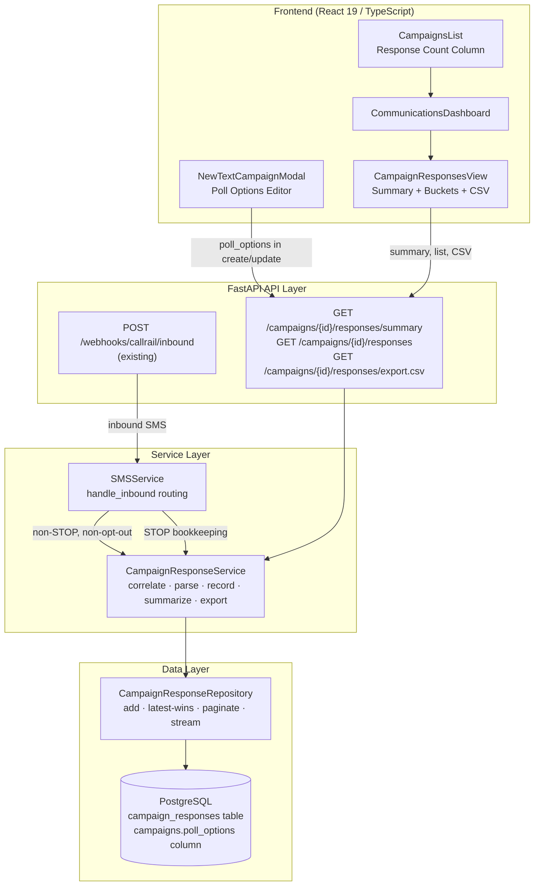
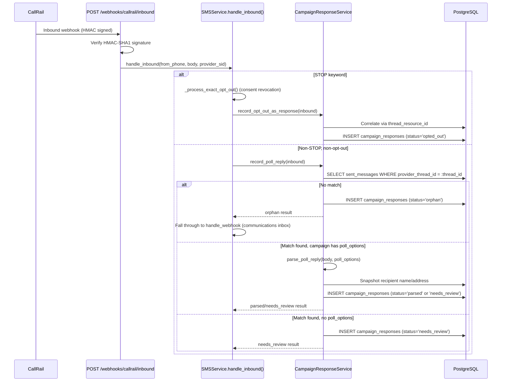

# Design Document — CallRail Scheduling Poll & Response Collection

**Status:** Design phase
**Last updated:** 2026-04-09
**Parent spec:** `.kiro/specs/callrail-sms-integration/` (Phase 0–3 complete)

## Overview

This design extends the existing CallRail SMS integration to support scheduling poll campaigns — a one-shot outbound poll with 2–5 numbered date-range options, inbound reply parsing, response storage, and CSV export. The feature layers on top of the already-complete provider abstraction, outbound campaign worker, inbound webhook route, and HMAC signature verification.

The immediate business driver is texting ~300 existing customers with scheduling options, collecting their digit-reply preferences, and exporting results as CSV for manual appointment booking. No auto-scheduling.

### Key Design Decisions

1. **Thread-based correlation, not phone-based** — CallRail masks `source_number` in inbound webhooks (only last 4 digits visible). Correlation uses `thread_resource_id` from the webhook payload matched against `sent_messages.provider_thread_id`. This is strictly better: no time-window ambiguity, no phone-normalization drift, works even if the customer record is deleted.

2. **Always-insert, latest-wins deduplication** — Every inbound reply inserts a new `campaign_responses` row. Duplicates are resolved at read time via `DISTINCT ON (campaign_id, phone) ORDER BY received_at DESC`. Full audit trail preserved.

3. **Snapshot-at-receive-time** — `recipient_name` and `recipient_address` are captured when the reply arrives, not joined on read. Later customer edits don't alter historical records.

4. **Simple digit parser, no NLP** — Strip whitespace/punctuation, accept single digit `1`–`5` or `"Option N"` format. Everything else → `needs_review`. Deliberately refuses ambiguous inputs like `"2 or 3"`.

5. **STOP dual-recording** — STOP replies continue through the existing consent revocation path AND insert a `campaign_responses` row with `status='opted_out'` for per-campaign bookkeeping. The two operations are independent — consent revocation is never blocked by a bookkeeping failure.

6. **Orphan replies recorded in both tables** — Replies that can't be correlated to any campaign get a `campaign_responses` row with `status='orphan'` AND fall through to the generic communications inbox. This ensures the "all responses" CSV includes them without cross-table joins.

7. **Streaming CSV export** — Rows fetched in batches of 100 to avoid loading all responses into memory. Browser downloads via native `<a href download>` anchor, not JS blob.

8. **Single Alembic migration** — The `poll_options` column addition and `campaign_responses` table creation share one migration file for atomic rollback.

## Architecture

### System Architecture



### Inbound Reply Flow



### Package Structure (New Files)

```
src/grins_platform/
├── models/
│   └── campaign_response.py              # CampaignResponse ORM model
├── schemas/
│   └── campaign_response.py              # PollOption, CampaignResponseOut, Summary, Bucket, CsvRow
├── repositories/
│   └── campaign_response_repository.py   # Data access with latest-wins queries
├── services/
│   └── campaign_response_service.py      # Correlator, parser, recorder, summarizer
├── migrations/versions/
│   └── <ts>_add_poll_options_and_responses.py  # Single migration
└── tests/
    ├── unit/
    │   └── test_campaign_response_service.py
    └── integration/
        └── test_campaign_poll_responses_flow.py

frontend/src/features/communications/
├── components/
│   ├── CampaignResponsesView.tsx         # Summary + buckets + drill-down
│   └── PollOptionsEditor.tsx             # 2–5 option rows with date pickers
├── hooks/
│   └── useCampaignResponses.ts           # React Query hooks for response endpoints
└── types/
    └── (extend campaign.ts with PollOption, CampaignResponseRow, etc.)
```

### Modified Files

| File | Change |
|------|--------|
| `models/campaign.py` | Add `poll_options: Mapped[dict \| None]` JSONB column |
| `schemas/campaign.py` | Extend `CampaignCreate`/`CampaignUpdate` with `poll_options` |
| `services/sms_service.py` | Add poll-reply branch in `handle_inbound()`, STOP bookkeeping call |
| `api/v1/campaigns.py` | Add 3 response endpoints (summary, list, CSV export) |
| `frontend/.../MessageComposer.tsx` | Render PollOptionsEditor, update preview + segment counter |
| `frontend/.../CommunicationsDashboard.tsx` | Route to CampaignResponsesView for poll campaigns |
| `frontend/.../CampaignsList.tsx` | Show response count column for poll campaigns |
| `frontend/.../types/campaign.ts` | Add PollOption, response types |

## Components and Interfaces

### CampaignResponseService

File: `src/grins_platform/services/campaign_response_service.py`

```python
class CampaignResponseService(LoggerMixin):
    DOMAIN = "campaign_response"

    def __init__(self, session: AsyncSession):
        self.session = session
        self.repo = CampaignResponseRepository(session)

    async def correlate_reply(
        self, thread_resource_id: str
    ) -> CorrelationResult:
        """Match inbound SMS to a campaign via thread_resource_id.

        Queries sent_messages WHERE provider_thread_id = :thread_id
        AND delivery_status = 'sent' ORDER BY created_at DESC LIMIT 1.
        Returns the matched Campaign + SentMessage, or null result.
        """
        ...

    def parse_poll_reply(
        self, body: str, poll_options: list[dict]
    ) -> ParseResult:
        """Parse reply text into an option selection.

        Rules (in order):
        1. Strip whitespace + punctuation (. , ! ) )
        2. Single digit 1-5 matching a valid key → parsed
        3. "option N" (case-insensitive) with valid digit → parsed
        4. Everything else → needs_review
        """
        ...

    async def record_poll_reply(
        self, inbound: InboundSMS
    ) -> CampaignResponse:
        """Orchestrate correlation → parsing → snapshot → insert.

        Returns a CampaignResponse row with the appropriate status.
        Called from SMSService.handle_inbound() for non-STOP replies.
        """
        ...

    async def record_opt_out_as_response(
        self, inbound: InboundSMS
    ) -> None:
        """Record a STOP reply as a campaign_responses bookkeeping row.

        Called from SMSService after consent revocation succeeds.
        Independent operation — failure here does not block consent.
        """
        ...

    async def get_response_summary(
        self, campaign_id: UUID
    ) -> CampaignResponseSummary:
        """Return per-option bucket counts using latest-wins query."""
        ...

    async def iter_csv_rows(
        self, campaign_id: UUID, option_key: str | None = None
    ) -> AsyncIterator[CampaignResponseCsvRow]:
        """Stream CSV rows in batches of 100."""
        ...
```

### CorrelationResult and ParseResult

```python
@dataclass(frozen=True)
class CorrelationResult:
    campaign: Campaign | None
    sent_message: SentMessage | None

@dataclass(frozen=True)
class ParseResult:
    ok: bool
    option_key: str | None = None
    option_label: str | None = None
```

### CampaignResponseRepository

File: `src/grins_platform/repositories/campaign_response_repository.py`

```python
class CampaignResponseRepository:
    def __init__(self, session: AsyncSession):
        self.session = session

    async def add(self, row: CampaignResponse) -> CampaignResponse:
        """Insert a new campaign_responses row."""
        ...

    async def get_latest_for_campaign(
        self, campaign_id: UUID
    ) -> list[CampaignResponse]:
        """DISTINCT ON (campaign_id, phone) ORDER BY received_at DESC."""
        ...

    async def list_for_campaign(
        self,
        campaign_id: UUID,
        option_key: str | None = None,
        status: str | None = None,
        page: int = 1,
        page_size: int = 20,
    ) -> list[CampaignResponse]:
        """Paginated list with latest-wins applied before pagination."""
        ...

    async def iter_for_export(
        self, campaign_id: UUID, option_key: str | None = None
    ) -> AsyncIterator[CampaignResponse]:
        """Stream rows in batches of 100 for CSV export."""
        ...

    async def count_by_status_and_option(
        self, campaign_id: UUID
    ) -> dict[str, int]:
        """Grouped counts for the summary endpoint."""
        ...
```

### API Endpoints

| Method | Path | Auth | Description |
|--------|------|------|-------------|
| GET | `/v1/campaigns/{id}/responses/summary` | Manager/Admin | `CampaignResponseSummary` with bucket counts |
| GET | `/v1/campaigns/{id}/responses` | Manager/Admin | Paginated `CampaignResponseOut` list, filterable by `option_key` and `status` |
| GET | `/v1/campaigns/{id}/responses/export.csv` | Manager/Admin | Streaming CSV download with `Content-Disposition` header |

### SMSService.handle_inbound() — Updated Routing

```python
async def handle_inbound(self, from_phone, body, provider_sid, *, thread_id=None):
    body_stripped = body.strip()
    body_lower = body_stripped.lower()

    # 1. Exact STOP keyword (existing)
    if body_lower in EXACT_OPT_OUT_KEYWORDS:
        result = await self._process_exact_opt_out(from_phone, body_lower)
        # NEW: bookkeeping row in campaign_responses
        if thread_id:
            await self._response_service.record_opt_out_as_response(
                InboundSMS(from_phone=from_phone, body=body,
                           provider_sid=provider_sid, thread_id=thread_id)
            )
        return result

    # 2. Informal opt-out (existing)
    if self._matches_informal_opt_out(body_lower):
        return await self._flag_informal_opt_out(from_phone, body_stripped)

    # 3. NEW: poll reply — correlate + parse via thread_resource_id
    if thread_id:
        poll_row = await self._response_service.record_poll_reply(
            InboundSMS(from_phone=from_phone, body=body,
                       provider_sid=provider_sid, thread_id=thread_id)
        )
        if poll_row.status in ("parsed", "needs_review"):
            return {"success": True, "campaign_response_id": str(poll_row.id),
                    "status": poll_row.status}
        # orphan → fall through to generic handler

    # 4. Fallback: generic inbound handler (existing)
    return await self.handle_webhook(from_phone, body, provider_sid)
```

### Frontend — PollOptionsEditor Component

Rendered inside `MessageComposer` when the "Collect poll responses" toggle is enabled:

- Editable list of 2–5 option rows
- Each row: label input (auto-generated as `"Week of {start_date}"`), two date pickers, remove button
- Remove button disabled at count == 2; "Add option" disabled at count == 5
- Live preview of the numbered options block appended to the message body
- Segment counter updated to include the rendered options

### Frontend — CampaignResponsesView Component

Rendered when a poll campaign is selected in the campaign list:

```
┌─────────────────────────────────────────────────────┐
│  Responses for "Spring Scheduling 2026"             │
│  Sent: 300    Replied: 47    Parsed: 42    Review: 3│
│                                    [Export all CSV]  │
├─────────────────────────────────────────────────────┤
│  Option 1 — Week of Apr 13         18   [View] [CSV]│
│  Option 2 — Week of Apr 20         14   [View] [CSV]│
│  Option 3 — Week of Apr 27         10   [View] [CSV]│
│  Needs review                       3   [View]      │
│  Opted out                          2   [View]      │
└─────────────────────────────────────────────────────┘
```

Click `[View]` → drill-down table with columns: Name, Phone, Raw Reply, Received At.
Click `[CSV]` → browser download via `<a href="/api/v1/campaigns/{id}/responses/export.csv?option_key=N" download>`.

## Data Models

### New Column: `campaigns.poll_options`

```sql
ALTER TABLE campaigns ADD COLUMN poll_options JSONB NULL;
```

- `NULL` = standard (non-poll) campaign, no behavior change
- When populated, contains an array of 2–5 `PollOption` objects:

```json
[
  {"key": "1", "label": "Week of Apr 13", "start_date": "2026-04-13", "end_date": "2026-04-19"},
  {"key": "2", "label": "Week of Apr 20", "start_date": "2026-04-20", "end_date": "2026-04-26"},
  {"key": "3", "label": "Week of Apr 27", "start_date": "2026-04-27", "end_date": "2026-05-03"}
]
```

Validation enforced in Pydantic (not DB CHECK): 2–5 entries, sequential keys `"1"`–`"5"`, `end_date >= start_date`, label 1–120 chars.

### New Table: `campaign_responses`

```sql
CREATE TABLE campaign_responses (
    id                    UUID PRIMARY KEY DEFAULT gen_random_uuid(),
    campaign_id           UUID NULL REFERENCES campaigns(id) ON DELETE SET NULL,
    sent_message_id       UUID NULL REFERENCES sent_messages(id) ON DELETE SET NULL,
    customer_id           UUID NULL REFERENCES customers(id) ON DELETE SET NULL,
    lead_id               UUID NULL REFERENCES leads(id) ON DELETE SET NULL,

    phone                 VARCHAR(32) NOT NULL,            -- E.164
    recipient_name        VARCHAR(200) NULL,               -- snapshot at reply time
    recipient_address     TEXT NULL,                        -- snapshot at reply time
    selected_option_key   VARCHAR(8) NULL,                 -- "1".."5" or NULL
    selected_option_label TEXT NULL,                        -- "Week of Apr 20" snapshot

    raw_reply_body        TEXT NOT NULL,                    -- verbatim, always stored
    provider_message_id   VARCHAR(100) NULL,                -- CallRail resource_id

    status                VARCHAR(20) NOT NULL,
    received_at           TIMESTAMPTZ NOT NULL,
    created_at            TIMESTAMPTZ NOT NULL DEFAULT NOW(),

    CONSTRAINT ck_campaign_responses_status CHECK (
        status IN ('parsed', 'needs_review', 'opted_out', 'orphan')
    )
);

CREATE INDEX ix_campaign_responses_campaign_id ON campaign_responses(campaign_id);
CREATE INDEX ix_campaign_responses_phone_received_at ON campaign_responses(phone, received_at DESC);
CREATE INDEX ix_campaign_responses_status ON campaign_responses(status);
```

**Design rationale:**
- All FKs are `ON DELETE SET NULL` — audit data outlives deleted entities
- `phone` is the only required identifier — ad-hoc inbounds with no customer/lead match still land here
- `raw_reply_body NOT NULL` — always keep verbatim text regardless of parse outcome
- Snapshot fields (`recipient_name`, `recipient_address`, `selected_option_label`) captured at receive time, not joined on read

### Status Values

| Status | Meaning | Creation Path |
|--------|---------|---------------|
| `parsed` | Reply mapped to a valid poll option key | Parser success |
| `needs_review` | Campaign matched but reply couldn't be parsed to a valid option | Parser failure or non-poll campaign |
| `opted_out` | STOP keyword reply, bookkeeping for per-campaign opt-out count | STOP path + bookkeeping insert |
| `orphan` | No campaign matched via thread_resource_id. `campaign_id` is NULL | Correlator found nothing |

### Latest-Wins Query

```sql
SELECT DISTINCT ON (campaign_id, phone) *
FROM campaign_responses
WHERE campaign_id = :cid
ORDER BY campaign_id, phone, received_at DESC;
```

Used for: summary counts, per-option bucket lists, CSV export. All historical rows preserved for audit.

### Pydantic Schemas

File: `src/grins_platform/schemas/campaign_response.py`

```python
class PollOption(BaseModel):
    key: Literal["1", "2", "3", "4", "5"]
    label: str = Field(..., min_length=1, max_length=120)
    start_date: date
    end_date: date

    @model_validator(mode="after")
    def _check_date_order(self) -> "PollOption":
        if self.end_date < self.start_date:
            raise ValueError("end_date must be on or after start_date")
        return self

class CampaignResponseOut(BaseModel):
    id: UUID
    campaign_id: UUID | None
    phone: str
    recipient_name: str | None
    recipient_address: str | None
    selected_option_key: str | None
    selected_option_label: str | None
    raw_reply_body: str
    status: str
    received_at: datetime

class CampaignResponseBucket(BaseModel):
    option_key: str | None
    option_label: str | None
    count: int
    status: str  # 'parsed', 'needs_review', 'opted_out'

class CampaignResponseSummary(BaseModel):
    campaign_id: UUID
    total_sent: int
    total_replied: int
    buckets: list[CampaignResponseBucket]

class CampaignResponseCsvRow(BaseModel):
    first_name: str
    last_name: str
    phone: str
    selected_option_label: str
    raw_reply: str
    received_at: datetime
```

### ORM Model

File: `src/grins_platform/models/campaign_response.py`

```python
class CampaignResponse(Base):
    __tablename__ = "campaign_responses"

    id: Mapped[UUID] = mapped_column(PGUUID(as_uuid=True), primary_key=True,
                                      server_default=func.gen_random_uuid())
    campaign_id: Mapped[UUID | None] = mapped_column(
        PGUUID(as_uuid=True), ForeignKey("campaigns.id", ondelete="SET NULL"), nullable=True)
    sent_message_id: Mapped[UUID | None] = mapped_column(
        PGUUID(as_uuid=True), ForeignKey("sent_messages.id", ondelete="SET NULL"), nullable=True)
    customer_id: Mapped[UUID | None] = mapped_column(
        PGUUID(as_uuid=True), ForeignKey("customers.id", ondelete="SET NULL"), nullable=True)
    lead_id: Mapped[UUID | None] = mapped_column(
        PGUUID(as_uuid=True), ForeignKey("leads.id", ondelete="SET NULL"), nullable=True)

    phone: Mapped[str] = mapped_column(String(32), nullable=False)
    recipient_name: Mapped[str | None] = mapped_column(String(200), nullable=True)
    recipient_address: Mapped[str | None] = mapped_column(Text, nullable=True)
    selected_option_key: Mapped[str | None] = mapped_column(String(8), nullable=True)
    selected_option_label: Mapped[str | None] = mapped_column(Text, nullable=True)

    raw_reply_body: Mapped[str] = mapped_column(Text, nullable=False)
    provider_message_id: Mapped[str | None] = mapped_column(String(100), nullable=True)

    status: Mapped[str] = mapped_column(String(20), nullable=False)
    received_at: Mapped[datetime] = mapped_column(DateTime(timezone=True), nullable=False)
    created_at: Mapped[datetime] = mapped_column(
        DateTime(timezone=True), nullable=False, server_default=func.now())

    # Relationships
    campaign: Mapped["Campaign | None"] = relationship("Campaign", lazy="selectin")
    sent_message: Mapped["SentMessage | None"] = relationship("SentMessage", lazy="selectin")
    customer: Mapped["Customer | None"] = relationship("Customer", lazy="selectin")
    lead: Mapped["Lead | None"] = relationship("Lead", lazy="selectin")
```

### CSV Export Name Split Logic

For the CSV `first_name` / `last_name` columns:
- **Customer** → use `customer.first_name` / `customer.last_name` directly
- **Lead** → split `recipient_name` snapshot on first whitespace: `first = tokens[0]`, `last = " ".join(tokens[1:])` (handles `"Maria De La Cruz"` → `first="Maria"`, `last="De La Cruz"`)
- **No match** → empty strings


## Correctness Properties

*A property is a characteristic or behavior that should hold true across all valid executions of a system — essentially, a formal statement about what the system should do. Properties serve as the bridge between human-readable specifications and machine-verifiable correctness guarantees.*

### Property 1: PollOption validation round-trip

*For any* valid `PollOption` with a key in `"1"`–`"5"`, a label of 1–120 characters, and `end_date >= start_date`, serializing to JSON and deserializing back through the Pydantic validator should produce an equivalent `PollOption`. Conversely, *for any* `PollOption` where `end_date < start_date`, the validator should reject it. *For any* list of `PollOption` objects, the list validator should accept only lists of 2–5 entries with sequential keys starting from `"1"`.

**Validates: Requirements 1.1, 1.2, 1.3, 15.1**

### Property 2: Reply parser valid-key round-trip

*For any* poll campaign with N options (2 ≤ N ≤ 5) and *for any* valid option key K in that campaign's `poll_options`, calling `parse_poll_reply(K, poll_options)` should return a `parsed` result with `option_key == K`. This should also hold when K is wrapped in whitespace, trailing punctuation, or prefixed with `"Option "` (case-insensitive).

**Validates: Requirements 4.1, 4.2, 4.3, 17.5**

### Property 3: Reply parser idempotence

*For any* reply body string and *for any* set of poll options, calling `parse_poll_reply(body, options)` twice with the same inputs should produce identical results. Formally: `parse_poll_reply(body, options) == parse_poll_reply(body, options)`.

**Validates: Requirements 17.4**

### Property 4: Reply parser rejects unrecognized input

*For any* string that is not a single digit `1`–`5` (after stripping whitespace and punctuation) and does not match the `"Option N"` pattern with a valid digit, `parse_poll_reply` should return a `needs_review` result with `option_key == None`.

**Validates: Requirements 4.5**

### Property 5: Thread-based correlation correctness

*For any* set of `sent_messages` rows with various `provider_thread_id` values and delivery statuses, calling `correlate_reply(thread_resource_id)` should return the most recently created `SentMessage` where `provider_thread_id` matches the input AND `delivery_status == 'sent'`. If no such row exists, the result should be null.

**Validates: Requirements 3.2, 3.3, 3.5, 19.3**

### Property 6: Response status mapping

*For any* inbound reply, the `status` field on the resulting `CampaignResponse` row should be:
- `'orphan'` when the correlator finds no matching campaign
- `'needs_review'` when the correlator finds a non-poll campaign (null `poll_options`)
- `'parsed'` when the correlator finds a poll campaign and the parser succeeds
- `'needs_review'` when the correlator finds a poll campaign and the parser fails

**Validates: Requirements 5.1, 5.2, 5.3, 5.4**

### Property 7: Append-only audit trail with raw body preservation

*For any* sequence of N inbound replies to the same campaign from the same phone, the `campaign_responses` table should contain exactly N rows for that (campaign, phone) pair, each with `raw_reply_body` equal to the verbatim inbound text. No rows are ever deleted or updated by subsequent replies.

**Validates: Requirements 2.5, 5.6, 8.1, 8.4**

### Property 8: Latest-wins deduplication

*For any* campaign with multiple replies from the same phone, the latest-wins query (`DISTINCT ON (campaign_id, phone) ORDER BY received_at DESC`) should return exactly one row per phone — the row with the most recent `received_at` timestamp. The total number of rows returned should equal the number of distinct phones that replied.

**Validates: Requirements 8.2, 8.3, 10.3, 11.6**

### Property 9: Summary bucket counts match latest-wins data

*For any* campaign with responses, the `CampaignResponseSummary.buckets` should have counts that sum to `total_replied`, and each bucket's count should equal the number of latest-wins rows with that `(status, selected_option_key)` combination.

**Validates: Requirements 9.2, 9.3, 14.5**

### Property 10: CSV export content and filtering

*For any* campaign with responses, the CSV export should contain one row per latest-wins response with columns `first_name`, `last_name`, `phone`, `selected_option_label`, `raw_reply`, `received_at`. When an `option_key` filter is provided, only rows matching that key should appear. When no filter is provided, all latest-wins rows should appear.

**Validates: Requirements 11.2, 11.3, 11.4**

### Property 11: Lead name split for CSV

*For any* recipient name string, splitting on first whitespace should produce `first_name = tokens[0]` and `last_name = " ".join(tokens[1:])`. For single-token names, `last_name` should be empty. For empty/null names, both should be empty strings.

**Validates: Requirements 11.7**

### Property 12: STOP bookkeeping independence

*For any* STOP reply that correlates to a campaign via `thread_resource_id`, the system should create a `campaign_responses` row with `status='opted_out'`. A failure to insert this bookkeeping row should not prevent the consent revocation from completing.

**Validates: Requirements 6.2, 6.4**

### Property 13: Routing — parsed/needs_review replies don't duplicate to communications

*For any* inbound reply where `record_poll_reply()` returns a `CampaignResponse` with `status` in (`parsed`, `needs_review`), the reply should NOT also be written to the generic communications table. Orphan replies (`status='orphan'`) should be written to both `campaign_responses` and the communications table.

**Validates: Requirements 7.2, 7.3, 7.4**

## Error Handling

### Inbound Webhook Errors

| Error | HTTP Status | Behavior |
|-------|-------------|----------|
| Invalid HMAC signature | 403 Forbidden | Log `campaign.webhook.signature_invalid`, reject payload |
| Malformed JSON body | 400 Bad Request | Log `campaign.webhook.parse_error`, reject |
| Missing `thread_resource_id` | 200 OK | Process as orphan — still record in `campaign_responses` |
| Missing `content` field | 200 OK | Record with empty `raw_reply_body` (NOT NULL constraint requires at least `""`) |
| DB insert failure | 500 Internal | Log error, return 500 — CallRail will retry |

### Correlation Errors

| Error | Behavior |
|-------|----------|
| No matching `sent_message` for thread_id | Return orphan result, insert `campaign_responses` with `status='orphan'` |
| Matched `sent_message` has `delivery_status='failed'` | Excluded from match — treated as no match |
| Matched campaign has been deleted | `campaign_id` is NULL due to `ON DELETE SET NULL` — treated as orphan |

### Parser Errors

| Error | Behavior |
|-------|----------|
| Empty reply body | `needs_review` — parser returns needs_review for empty/whitespace strings |
| Digit outside option range | `needs_review` — e.g., `"6"` for a 3-option campaign |
| Ambiguous multi-digit | `needs_review` — e.g., `"2 or 3"` |
| Unicode digits | `needs_review` — e.g., `"２"` (fullwidth digit) |

### API Endpoint Errors

| Error | HTTP Status | Behavior |
|-------|-------------|----------|
| Campaign not found | 404 Not Found | Standard error response |
| Unauthorized (not Manager/Admin) | 403 Forbidden | Standard RBAC rejection |
| Invalid `option_key` filter | 422 Unprocessable Entity | Pydantic validation error |
| CSV export with no data | 200 OK | Return CSV with header row only |

### STOP Bookkeeping Errors

The consent revocation and campaign_responses bookkeeping are wrapped in independent try/except blocks. If the bookkeeping insert fails (e.g., DB constraint violation), the consent revocation still completes. The bookkeeping failure is logged as `campaign.response.bookkeeping_failed` at WARNING level but does not propagate to the caller.

## Testing Strategy

### Dual Testing Approach

This feature uses both unit tests and property-based tests for comprehensive coverage:

- **Unit tests**: Specific examples, edge cases, parametrized parser inputs, integration flows
- **Property tests**: Universal properties across all valid inputs using Hypothesis

Both are complementary — unit tests catch concrete bugs at specific values, property tests verify general correctness across the input space.

### Property-Based Testing Configuration

- **Library**: Hypothesis (already in the project's test dependencies)
- **Minimum iterations**: 100 per property test (via `@settings(max_examples=100)`)
- **Tag format**: Each test includes a comment referencing the design property:
  ```python
  # Feature: callrail-scheduling-poll, Property 2: Reply parser valid-key round-trip
  ```
- **Each correctness property is implemented by a single property-based test**

### Unit Tests

File: `src/grins_platform/tests/unit/test_campaign_response_service.py`

**`parse_poll_reply` — parametrized tests:**
- Valid single digits: `"1"`, `"2"`, `"3"` → parsed
- Digits with whitespace/punctuation: `" 2 "`, `"2."`, `"2!"`, `"2)"` → parsed
- `"Option N"` format: `"Option 2"`, `"option 2"`, `"OPTION 2"` → parsed
- Out-of-range digits: `"6"` for a 3-option campaign → needs_review
- Empty string → needs_review
- Whitespace only → needs_review
- Ambiguous: `"2 or 3"` → needs_review
- Non-digit text: `"yes"`, `"the 20th works"` → needs_review
- Unicode digits: `"２"` → needs_review
- Spelled out: `"Option One"` → needs_review

**`correlate_reply` — unit tests:**
- Happy path: matching thread_resource_id with `delivery_status='sent'` → returns campaign + sent_message
- No matching sent_message → null result
- Matched sent_message with `delivery_status='failed'` → excluded, null result
- Multiple sent_messages with same thread_id → returns most recent

**`record_poll_reply` — unit tests:**
- Orphan (no campaign match) → `status='orphan'`, `campaign_id=NULL`
- Non-poll campaign match → `status='needs_review'`
- Poll campaign + parsed reply → `status='parsed'`, correct option key and label
- Poll campaign + unparseable reply → `status='needs_review'`, `selected_option_key=NULL`
- STOP bookkeeping → `status='opted_out'`

### Property-Based Tests

File: `src/grins_platform/tests/unit/test_pbt_campaign_poll.py`

| Test | Property | Validates |
|------|----------|-----------|
| `test_poll_option_validation_roundtrip` | Property 1 | Req 1.1, 1.2, 1.3, 15.1 |
| `test_reply_parser_valid_key_roundtrip` | Property 2 | Req 4.1, 4.2, 4.3, 17.5 |
| `test_reply_parser_idempotence` | Property 3 | Req 17.4 |
| `test_reply_parser_rejects_unrecognized` | Property 4 | Req 4.5 |
| `test_thread_correlation_correctness` | Property 5 | Req 3.2, 3.3, 3.5, 19.3 |
| `test_response_status_mapping` | Property 6 | Req 5.1, 5.2, 5.3, 5.4 |
| `test_append_only_audit_trail` | Property 7 | Req 2.5, 5.6, 8.1, 8.4 |
| `test_latest_wins_deduplication` | Property 8 | Req 8.2, 8.3, 10.3, 11.6 |
| `test_summary_bucket_counts` | Property 9 | Req 9.2, 9.3, 14.5 |
| `test_csv_export_content_and_filtering` | Property 10 | Req 11.2, 11.3, 11.4 |
| `test_lead_name_split` | Property 11 | Req 11.7 |

### Integration Tests

File: `src/grins_platform/tests/integration/test_campaign_poll_responses_flow.py`

1. **Full webhook-to-response flow**: Create poll campaign → process recipient via NullProvider → synthesize inbound webhook with body `"2"` → POST to webhook endpoint with valid HMAC → verify `campaign_responses` row with `status='parsed'`, `selected_option_key='2'`

2. **Summary endpoint**: Multiple replies → `GET /campaigns/{id}/responses/summary` → verify correct bucket counts

3. **CSV export**: `GET /campaigns/{id}/responses/export.csv` → verify CSV content, column headers, and `Content-Disposition` filename

4. **STOP dual-recording**: STOP reply → verify both `SmsConsentRecord` created AND `campaign_responses` row with `status='opted_out'`

5. **Latest-wins deduplication**: Two replies from same phone → verify only most recent appears in summary and CSV export
