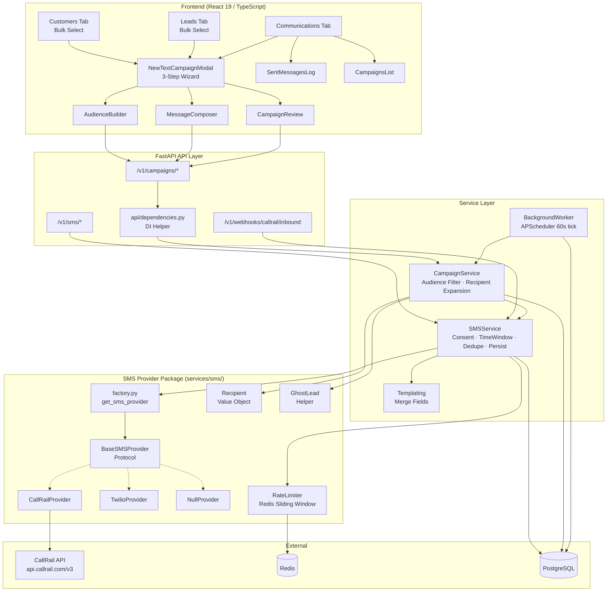
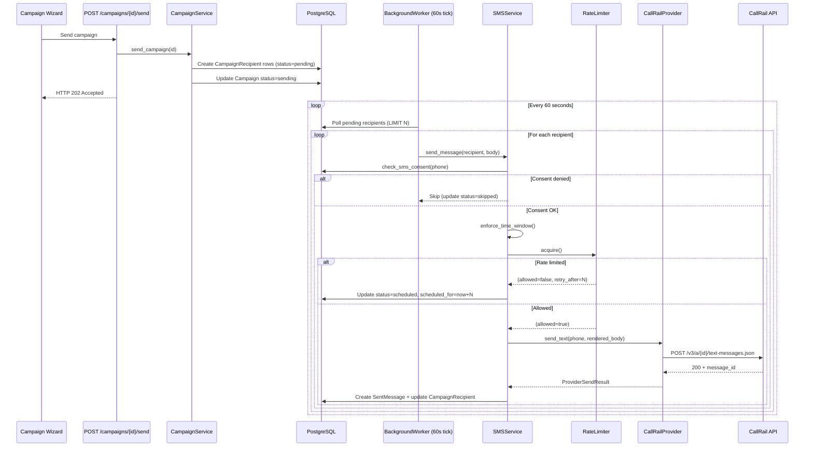

# Design Document — CallRail SMS Integration

**Status:** Phase 0 + Phase 0.5 complete — policy decisions locked — cleared to begin Phase 1
**Last updated:** 2026-04-07 (added sections for state machines, permissions, operational concerns, UX specs, compliance details, external config, Phase 0.5 API contract)

## Overview

This design transforms the Grins Irrigation Platform's SMS subsystem from a hard-wired Twilio stub into a pluggable, provider-agnostic architecture with CallRail as the first real provider. The integration spans 7 independently shippable phases: provider abstraction (Strategy pattern), CallRail HTTP client, unified Recipient model, rate limit tracker (reads CallRail headers), background campaign worker with state machine, 3-step campaign wizard UI, and bulk-select entry points on the Customers/Leads tabs.

The immediate business driver is sending throttled outreach SMS to ~300 existing customers/leads/ad-hoc phones for job scheduling. The longer-term goal is making CallRail the SMS backbone for all platform communications — appointment reminders, confirmations, campaigns, and one-off blasts — while preserving the ability to swap to Twilio via a single env var change.

### Key Design Decisions

1. **Strategy Pattern for providers** — `BaseSMSProvider` Protocol with `CallRailProvider`, `TwilioProvider`, `NullProvider`. Runtime selection via `SMS_PROVIDER` env var. Zero business-logic changes on swap.
2. **Unified Recipient value object** — Frozen dataclass that normalizes customers, leads, and ad-hoc phones into a single type. Eliminates source-specific branching in all send paths.
3. **Ghost leads for ad-hoc phones** — Unmatched CSV phones auto-create `Lead` rows with `lead_source='campaign_import'`. Preserves the `SentMessage` check constraint without schema migration.
4. **Rate limit tracker (not a limiter)** — Reads CallRail's `x-rate-limit-*` response headers, caches in Redis 120s, defers new sends at `hourly_remaining <= 5`. No sliding-window math on our side. *(Simplified 2026-04-07 from a Redis sliding-window counter after Phase 0.5 confirmed CallRail returns authoritative rate-limit state on every response.)*
5. **APScheduler interval job for campaign drip** — 60-second tick with explicit state machine (`pending → sending → sent/failed/cancelled`), orphan recovery after 5 min, `FOR UPDATE SKIP LOCKED` for concurrent-worker safety. DB-persistent state via `delivery_status`. Proper ARQ queue deferred to follow-up.
6. **Consent centralization + type-scoping** — ALL send paths go through `check_sms_consent(phone, consent_type)` on `SmsConsentRecord`. Three types: `marketing`/`transactional`/`operational`. Hard-STOP precedence. Fixes B2 + S11.
7. **Staff attestation for ad-hoc CSV** — CSV upload UI requires a checkbox; backend auto-creates `SmsConsentRecord` rows with `consent_method='csv_upload_staff_attestation'` and the staff user ID. Fixes S10.
8. **Campaign-scoped dedupe** — `send_message()` accepts an optional `campaign_id` parameter. When set, the dedupe check is scoped to `(recipient, campaign_id)` instead of `(customer_id, message_type)`. Fixes B4 silent blocking of back-to-back campaigns.
9. **RBAC with 50-recipient threshold** — Admin/Manager/Technician tiers. Manager can send campaigns up to 49 recipients; 50+ requires Admin. CSV upload is Admin-only. Enforced via FastAPI dependencies.
10. **`sent` is terminal** — CallRail does not emit delivery status callbacks (verified 2026-04-07). UI labels "Sent" not "Delivered". No `delivered` state exists.
11. **CallRail response is conversation-oriented, not message-oriented** — Top-level `id` is the conversation ID (e.g., `"k8mc8"`); individual messages have no per-message ID. `SentMessage` stores both `provider_conversation_id` and `provider_thread_id`.
12. **Provider-side idempotency is NOT relied upon** — CallRail's `Idempotency-Key` header behavior is inconclusive. The state machine (point 5) is the sole double-send protection.

### Blockers Addressed

| ID | Issue | Resolution |
|----|-------|------------|
| B1 | `CampaignService` never receives `SMSService` | DI helper `get_campaign_service()` in `api/dependencies.py` |
| B2 | Campaign sends bypass `SmsConsentRecord` | Centralize consent in `SMSService`; remove `sms_opt_in` override |
| B3 | `POST /sms/send-bulk` blocks HTTP thread | Refactor to enqueue + return 202; background worker drains |
| **B4** | 24h dedupe silently blocks back-to-back campaigns | Add `campaign_id` parameter to `send_message()`; scope dedupe to `(recipient, campaign_id)` when set |

### Structural Gaps Addressed

| ID | Gap | Resolution |
|----|-----|------------|
| S1 | No provider abstraction | `services/sms/` package with Strategy pattern |
| S2 | ~~No outbound rate limiter~~ → Rate limit tracker | Read CallRail `x-rate-limit-*` response headers; cache in Redis 120s (simplified 2026-04-07) |
| S3 | Background jobs not worker-safe | APScheduler interval job with DB-persistent state + state machine |
| S4 | No CallRail inbound webhook | `POST /webhooks/callrail/inbound` route with HMAC signature verification + idempotency dedupe |
| S5 | Audience filter nearly empty | Extended `_filter_recipients()` with multi-source UNION |
| S6 | No merge-field templating | `templating.py` with `str.format_map()` |
| S7 | No bulk-select on Customers list | TanStack Table row-selection + bulk-action bar |
| S8 | No compose UI on Communications tab | 3-step wizard modal |
| S9 | Services only accept Customers | Unified `Recipient` dataclass + ghost lead helper |
| **S10** | Ad-hoc CSV uploads have no real consent gate | Staff attestation model — checkbox + auto-created `SmsConsentRecord` rows |
| **S11** | `consent_type` ignored by check | Three types (marketing/transactional/operational); type-scoped `check_sms_consent(phone, type)` with hard-STOP precedence |
| **S12** | ~~No delivery status webhook~~ → Resolved | CallRail doesn't expose delivery callbacks (verified 2026-04-07); `sent` is terminal; UI labels "Sent" not "Delivered" |
| **S13** | Recipient state machine undefined → double-send risk | Explicit `pending → sending → sent/failed/cancelled` with `sending_started_at`, orphan recovery after 5 min, `FOR UPDATE SKIP LOCKED` claim |

## Architecture

### System Architecture



### Request Flow — Campaign Send



### Package Structure

```
src/grins_platform/services/sms/
├── __init__.py              # Public exports
├── base.py                  # BaseSMSProvider Protocol + ProviderSendResult, InboundSMS
├── callrail_provider.py     # CallRailProvider (httpx.AsyncClient)
├── twilio_provider.py       # TwilioProvider (ports current stub)
├── null_provider.py         # NullProvider (in-memory recording for tests)
├── factory.py               # get_sms_provider() reads SMS_PROVIDER env
├── rate_limit_tracker.py    # Reads CallRail response headers, caches in Redis 120s
├── templating.py            # render_template(body, context) merge-field util
├── recipient.py             # Recipient frozen dataclass + factory methods
├── ghost_lead.py            # create_or_get(phone, first_name, last_name) with row-level lock
├── consent.py               # check_sms_consent(phone, consent_type) type-scoped
├── state_machine.py         # RecipientState enum + transition() validator + orphan recovery
├── segment_counter.py       # GSM-7 vs UCS-2 detection, segment count
└── phone_normalizer.py      # E.164 normalizer + area code → timezone lookup
```

```
frontend/src/features/communications/
├── components/
│   ├── CommunicationsDashboard.tsx  (EDIT — add Campaigns tab + New Campaign button)
│   ├── CommunicationsQueue.tsx      (existing)
│   ├── SentMessagesLog.tsx          (existing)
│   ├── NewTextCampaignModal.tsx     (NEW — 3-step wizard)
│   ├── AudienceBuilder.tsx          (NEW — multi-source recipient picker)
│   ├── MessageComposer.tsx          (NEW — template + preview)
│   ├── CampaignReview.tsx           (NEW — review + schedule)
│   └── CampaignsList.tsx            (NEW — campaign list with progress)
├── hooks/
│   ├── useCreateCampaign.ts         (NEW)
│   ├── useSendCampaign.ts           (NEW)
│   ├── useAudiencePreview.ts        (NEW)
│   ├── useAudienceCsv.ts            (NEW)
│   └── useCampaignProgress.ts       (NEW)
├── api/
│   ├── communicationsApi.ts         (existing)
│   └── campaignsApi.ts              (NEW)
└── types/
    ├── index.ts                     (existing)
    └── campaign.ts                  (NEW)
```

## Components and Interfaces

### BaseSMSProvider Protocol (`base.py`)

```python
from dataclasses import dataclass
from typing import Protocol, runtime_checkable

@dataclass(frozen=True)
class ProviderSendResult:
    """Result from a provider send_text call."""
    provider_message_id: str
    status: str  # "sent", "queued", "failed"
    raw_response: dict | None = None

@dataclass(frozen=True)
class InboundSMS:
    """Parsed inbound SMS from any provider."""
    from_phone: str       # E.164
    body: str
    provider_sid: str
    to_phone: str | None = None

@runtime_checkable
class BaseSMSProvider(Protocol):
    @property
    def provider_name(self) -> str: ...

    async def send_text(self, to: str, body: str) -> ProviderSendResult: ...

    async def verify_webhook_signature(
        self, headers: dict, raw_body: bytes
    ) -> bool: ...

    def parse_inbound_webhook(self, payload: dict) -> InboundSMS: ...
```

### CallRailProvider (`callrail_provider.py`)

```python
class CallRailProvider:
    """Async HTTP client for CallRail SMS API."""

    provider_name = "callrail"

    def __init__(self) -> None:
        self.api_key = os.environ["CALLRAIL_API_KEY"]
        self.account_id = os.environ["CALLRAIL_ACCOUNT_ID"]
        self.company_id = os.environ["CALLRAIL_COMPANY_ID"]
        self.tracking_number = os.environ["CALLRAIL_TRACKING_NUMBER"]
        self.base_url = "https://api.callrail.com/v3"
        self._client = httpx.AsyncClient(
            base_url=self.base_url,
            headers={"Authorization": f'Token token="{self.api_key}"'},
            timeout=30.0,
        )

    async def send_text(self, to: str, body: str) -> ProviderSendResult:
        """POST /v3/a/{account_id}/text-messages.json"""
        ...

    async def list_tracking_numbers(self) -> list[dict]:
        """GET /v3/a/{account_id}/trackers.json"""
        ...

    async def verify_webhook_signature(self, headers, raw_body) -> bool: ...
    def parse_inbound_webhook(self, payload: dict) -> InboundSMS: ...
```

Typed exceptions: `CallRailAuthError` (401), `CallRailRateLimitError` (429), `CallRailValidationError` (400/422).

### Provider Factory (`factory.py`)

```python
def get_sms_provider() -> BaseSMSProvider:
    """Read SMS_PROVIDER env var, return the matching provider instance."""
    provider_name = os.getenv("SMS_PROVIDER", "callrail")
    match provider_name:
        case "callrail": return CallRailProvider()
        case "twilio":   return TwilioProvider()
        case "null":     return NullProvider()
        case _:          raise ValueError(f"Unknown SMS provider: {provider_name}")
```

### Recipient Value Object (`recipient.py`)

```python
from dataclasses import dataclass
from typing import Literal
from uuid import UUID

SourceType = Literal["customer", "lead", "ad_hoc"]

@dataclass(frozen=True)
class Recipient:
    """Unified target for all SMS sends."""
    phone: str                          # E.164
    source_type: SourceType
    customer_id: UUID | None = None
    lead_id: UUID | None = None
    first_name: str | None = None
    last_name: str | None = None

    @classmethod
    def from_customer(cls, customer) -> "Recipient":
        return cls(
            phone=customer.phone,
            source_type="customer",
            customer_id=customer.id,
            first_name=customer.first_name,
            last_name=customer.last_name,
        )

    @classmethod
    def from_lead(cls, lead) -> "Recipient":
        return cls(
            phone=lead.phone,
            source_type="lead",
            lead_id=lead.id,
            first_name=lead.first_name,
            last_name=lead.last_name,
        )

    @classmethod
    def from_adhoc(cls, phone: str, lead_id: UUID,
                   first_name: str | None = None,
                   last_name: str | None = None) -> "Recipient":
        return cls(
            phone=phone,
            source_type="ad_hoc",
            lead_id=lead_id,
            first_name=first_name,
            last_name=last_name,
        )
```

### Rate Limit Tracker (`rate_limit_tracker.py`) — simplified 2026-04-07

Phase 0.5 confirmed that CallRail returns authoritative rate-limit state on every response via `x-rate-limit-*` headers. We do NOT maintain our own sliding window — we mirror CallRail's counters.

```python
@dataclass(frozen=True)
class RateLimitState:
    provider: str
    account_id: str
    hourly_used: int
    hourly_allowed: int
    daily_used: int
    daily_allowed: int
    fetched_at: datetime

@dataclass(frozen=True)
class RateLimitResult:
    allowed: bool
    retry_after_seconds: int = 0
    state: RateLimitState | None = None

class SMSRateLimitTracker:
    """Reads CallRail response headers, caches state in Redis for cross-worker visibility."""

    KEY_PREFIX = "sms:rl"
    CACHE_TTL_SECONDS = 120
    BLOCK_THRESHOLD = 5   # refuse new sends when remaining <= 5

    def __init__(self, redis_client, provider_name: str, account_id: str):
        self.redis = redis_client
        self.provider_name = provider_name
        self.account_id = account_id
        self.key = f"{self.KEY_PREFIX}:{provider_name}:{account_id}"
        self._in_memory: RateLimitState | None = None  # fallback if Redis is down

    async def update_from_headers(self, headers: dict[str, str]) -> None:
        """Called by CallRailProvider after every response."""
        state = RateLimitState(
            provider=self.provider_name,
            account_id=self.account_id,
            hourly_used=int(headers["x-rate-limit-hourly-used"]),
            hourly_allowed=int(headers["x-rate-limit-hourly-allowed"]),
            daily_used=int(headers["x-rate-limit-daily-used"]),
            daily_allowed=int(headers["x-rate-limit-daily-allowed"]),
            fetched_at=datetime.now(timezone.utc),
        )
        self._in_memory = state
        try:
            await self.redis.set(self.key, json.dumps(asdict(state), default=str), ex=self.CACHE_TTL_SECONDS)
        except RedisError:
            # Fall back to in-memory copy only
            logger.warning("sms.rate_limit.redis_unavailable")

    async def check(self) -> RateLimitResult:
        """Consult cached state before claiming next recipient."""
        state = await self._read_state()
        if state is None:
            # No prior send observed — allow optimistically; CallRail will 429 if wrong
            return RateLimitResult(allowed=True)
        hourly_remaining = state.hourly_allowed - state.hourly_used
        daily_remaining = state.daily_allowed - state.daily_used
        if hourly_remaining <= self.BLOCK_THRESHOLD:
            return RateLimitResult(allowed=False, retry_after_seconds=self._seconds_until_next_hour(), state=state)
        if daily_remaining <= self.BLOCK_THRESHOLD:
            return RateLimitResult(allowed=False, retry_after_seconds=self._seconds_until_next_day(), state=state)
        return RateLimitResult(allowed=True, state=state)
```

**Redis unavailable:** Falls back to `_in_memory` copy. Accept up to one worker's-worth of over-aggression until the next successful response refreshes the value. No hard fail — CallRail will itself return 429 if we truly overrun.

### Templating (`templating.py`)

```python
class SafeDict(dict):
    """Dict that returns empty string for missing keys."""
    def __missing__(self, key: str) -> str:
        return ""

def render_template(body: str, context: dict[str, str]) -> str:
    """Render merge fields in body using context. Missing keys → empty string."""
    return body.format_map(SafeDict(context))
```

Supported merge fields: `{first_name}`, `{last_name}`. No Jinja, no conditionals, no loops.

### Ghost Lead Helper (`ghost_lead.py`)

```python
async def create_or_get(
    session: AsyncSession,
    phone: str,
    first_name: str | None = None,
    last_name: str | None = None,
) -> Lead:
    """Find existing Lead by E.164 phone, or create a ghost lead.

    Ghost leads have lead_source='campaign_import', status='new',
    sms_consent=false, source_site='campaign_csv_import'.
    """
    normalized = normalize_to_e164(phone)
    existing = await _find_lead_by_phone(session, normalized)
    if existing:
        return existing
    return await _create_ghost_lead(session, normalized, first_name, last_name)
```

### SMSService Refactored Signature

```python
class SMSService(LoggerMixin):
    DOMAIN = "sms"

    def __init__(self, session: AsyncSession, provider: BaseSMSProvider | None = None):
        self.session = session
        self.provider = provider or get_sms_provider()

    async def send_message(
        self,
        recipient: Recipient,
        message: str,
        message_type: str,
        consent_type: Literal["marketing", "transactional", "operational"] = "transactional",
        campaign_id: UUID | None = None,   # B4 fix: when set, dedupe scope becomes (recipient, campaign_id)
        job_id: UUID | None = None,
        appointment_id: UUID | None = None,
    ) -> dict[str, Any]:
        # 1. Consent check (phone-keyed, type-scoped, hard-STOP precedence) — S11 fix
        # 2. Campaign-scoped dedupe when campaign_id set — B4 fix
        # 3. Time window enforcement
        # 4. Rate limit tracker check (reads cached CallRail headers)
        # 5. Template rendering (if merge fields present)
        # 6. Provider dispatch via self.provider.send_text()
        # 7. Update rate limit tracker from response headers
        # 8. Persist SentMessage with customer_id OR lead_id from Recipient,
        #    + campaign_id if set, + provider_conversation_id + provider_thread_id
        ...
```

**Call-site mapping for existing SMS paths:**
- Appointment confirmation/reminder/on-the-way/completion → `consent_type='transactional'`
- Invoice and payment reminder notifications → `consent_type='transactional'`
- Campaign sends (from `CampaignService`) → `consent_type='marketing'` + `campaign_id` set
- STOP confirmation reply → `consent_type='operational'`
- Manual one-off send from admin UI → `consent_type='transactional'` (treated as EBR)

### DI Helper (`api/dependencies.py`)

```python
async def get_campaign_service(
    db: AsyncSession = Depends(get_db),
) -> CampaignService:
    """Wire SMSService and EmailService into CampaignService. Fixes B1."""
    provider = get_sms_provider()
    sms_service = SMSService(db, provider=provider)
    email_service = EmailService(db)
    campaign_repo = CampaignRepository(db)
    return CampaignService(
        campaign_repository=campaign_repo,
        sms_service=sms_service,
        email_service=email_service,
    )
```

### Target Audience JSON Schema

```json
{
  "customers": {
    "sms_opt_in": true,
    "ids_include": ["uuid1", "uuid2"],
    "cities": ["Edina", "Eden Prairie"],
    "last_service_between": ["2025-04-01", "2025-10-31"],
    "tags_include": ["spring-cleanup"],
    "lead_source": "website",
    "is_active": true,
    "no_appointment_in_days": 90
  },
  "leads": {
    "sms_consent": true,
    "ids_include": ["uuid3"],
    "statuses": ["new", "contacted", "qualified"],
    "lead_source": "website",
    "intake_tag": "irrigation",
    "action_tags_include": ["follow-up"],
    "cities": ["Edina"],
    "created_between": ["2025-01-01", "2025-12-31"]
  },
  "ad_hoc": {
    "csv_upload_id": "upload-uuid"
  }
}
```

Validated via Pydantic models: `CustomerAudienceFilter`, `LeadAudienceFilter`, `AdHocAudienceFilter`, composed into `TargetAudience`.

### Frontend — Campaign Wizard (3-Step Modal)

The `NewTextCampaignModal` uses shadcn `Dialog` + `react-hook-form` + `zod` validation:

- **Step 1 — AudienceBuilder**: Three additive source panels (Customers, Leads, Ad-hoc CSV). Each panel has search/filter + multi-select table. Running total shows "X customers + Y leads + Z ad-hoc = N total (M after consent filter)". Live preview via `POST /campaigns/audience/preview`. Dedupe warning for cross-source phone collisions.
- **Step 2 — MessageComposer**: Template textarea with merge-field insertion buttons. Character counter + SMS segment count. Live preview with "Grins Irrigation:" prefix and STOP footer.
- **Step 3 — CampaignReview**: Final recipient count, estimated completion time (recipients ÷ 140/hr), send now vs schedule. Confirm creates `Campaign` + `CampaignRecipient` rows and enqueues background job.

### API Endpoints (New/Modified)

| Method | Path | Description | Phase |
|--------|------|-------------|-------|
| POST | `/v1/webhooks/callrail/inbound` | CallRail inbound SMS webhook (HMAC + idempotency dedupe) | 1 |
| POST | `/v1/campaigns/audience/preview` | Preview audience count + breakdown | 4 |
| POST | `/v1/campaigns/audience/csv` | Upload CSV, stage, return breakdown (staff attestation required) | 4 |
| POST | `/v1/campaigns/{id}/send` | Enqueue campaign (returns 202) | 3 |
| POST | `/v1/campaigns/{id}/cancel` | Cancel campaign in progress (transitions `pending` to `cancelled`) | 3 |
| POST | `/v1/campaigns/{id}/retry-failed` | Retry failed recipients as a new batch | 5 |
| GET | `/v1/campaigns/worker-health` | Worker health + rate limit snapshot | 3 |
| POST | `/v1/sms/send-bulk` | Enqueue bulk send (returns 202) | 3 |

**NOT created (Phase 0.5 finding):** `POST /v1/webhooks/callrail/delivery-status` was originally planned but removed after Phase 0.5 confirmed CallRail does not emit delivery status callbacks.

## Data Models

### Existing Models (Reused)

**SentMessage** — Already has `customer_id`, `lead_id`, `job_id`, `appointment_id` FKs with check constraint `customer_id IS NOT NULL OR lead_id IS NOT NULL`. The `twilio_sid` column is repurposed for CallRail (rename deferred to Phase 7). `delivery_status` enum: pending, scheduled, sent, failed, cancelled (**NOT `delivered`** — Phase 0.5 confirmed no delivery callbacks). `message_type` includes `'campaign'`.

**Campaign** — `target_audience` JSONB field stores the multi-source audience filter. `status`: draft, sending, completed, cancelled, partial_failed. `scheduled_at` for future sends.

**CampaignRecipient** — Has both `customer_id` and `lead_id` FKs. `delivery_status`: `pending`, `sending`, `sent`, `failed`, `cancelled` (state machine — see §14). `sent_at`, `error_message`.

**SmsConsentRecord** — Phone-keyed (`phone_number` in E.164). INSERT-ONLY audit trail. `consent_given` boolean. `consent_type` column now used (see S11). Has both `customer_id` and `lead_id` FKs.

**Lead** — Existing model. Ghost leads created with `lead_source='campaign_import'`, `status='new'`, `sms_consent=false`, `source_site='campaign_csv_import'`.

### Phase 1 Migrations (Required)

All migrations are nullable / non-breaking so the Twilio provider remains unaffected:

| Table | Column | Type | Purpose |
|---|---|---|---|
| `campaign_recipients` | `sending_started_at` | TIMESTAMPTZ, nullable, indexed | State machine (S13) + orphan recovery |
| `sms_consent_records` | `created_by_staff_id` | UUID, nullable, FK `staff.id`, indexed | CSV attestation audit trail (S10) |
| `sent_messages` | `campaign_id` | UUID, nullable, FK `campaigns.id`, indexed | B4 dedupe scoping |
| `sent_messages` | `provider_conversation_id` | VARCHAR(50), nullable | CallRail conversation ID (e.g., `"k8mc8"`) |
| `sent_messages` | `provider_thread_id` | VARCHAR(50), nullable | CallRail `sms_thread.id` |

### New Data Structures (In-Code Only)

| Structure | Type | Location | Purpose |
|-----------|------|----------|---------|
| `Recipient` | Frozen dataclass | `services/sms/recipient.py` | Unified SMS target |
| `ProviderSendResult` | Frozen dataclass | `services/sms/base.py` | Provider response (includes `provider_conversation_id`, `provider_thread_id`) |
| `InboundSMS` | Frozen dataclass | `services/sms/base.py` | Parsed inbound webhook |
| `RateLimitState` | Frozen dataclass | `services/sms/rate_limit_tracker.py` | CallRail rate limit snapshot |
| `RateLimitResult` | Frozen dataclass | `services/sms/rate_limit_tracker.py` | Allowed + retry_after |
| `RecipientState` | Enum | `services/sms/state_machine.py` | pending/sending/sent/failed/cancelled |
| `ConsentType` | Literal | `services/sms/consent.py` | marketing/transactional/operational |
| `TargetAudience` | Pydantic model | `schemas/campaign.py` | Audience filter validation |
| `CustomerAudienceFilter` | Pydantic model | `schemas/campaign.py` | Customer filter fields |
| `LeadAudienceFilter` | Pydantic model | `schemas/campaign.py` | Lead filter fields |
| `AdHocAudienceFilter` | Pydantic model | `schemas/campaign.py` | Ad-hoc CSV filter |

### Phase 7 Migration (cosmetic cleanup)

Rename `sent_messages.twilio_sid` → `provider_message_id`. Non-breaking — column is nullable and the application code already treats it as a generic provider ID. The new `provider_conversation_id` and `provider_thread_id` columns are the primary cross-reference going forward.

## Correctness Properties

*A property is a characteristic or behavior that should hold true across all valid executions of a system — essentially, a formal statement about what the system should do. Properties serve as the bridge between human-readable specifications and machine-verifiable correctness guarantees.*

### Property 1: NullProvider records all sends

*For any* sequence of `send_text(to, body)` calls to a `NullProvider`, the provider's recorded sends list should contain every call with matching `to` and `body` values, and the list length should equal the number of calls made.

**Validates: Requirements 1.9**

### Property 2: CallRail send_text payload structure

*For any* valid E.164 phone number and non-empty message body, calling `CallRailProvider.send_text(to, body)` should produce an HTTP POST to `/v3/a/{account_id}/text-messages.json` with a JSON body containing `company_id`, `tracking_number`, `customer_phone_number` equal to `to`, and `content` equal to `body`.

**Validates: Requirements 2.3**

### Property 3: Rate limiter dual-window enforcement

*For any* sequence of `acquire()` calls to the rate limiter, the number of allowed calls within any 1-hour sliding window should never exceed 150, and the number of allowed calls within any 24-hour sliding window should never exceed 1,000. When a call is denied, `retry_after_seconds` should be a positive integer.

**Validates: Requirements 3.1, 3.4, 3.5, 3.7**

### Property 4: Rate limiter key isolation

*For any* two distinct `(provider_name, account_id)` pairs, sends counted against one pair should not affect the available capacity of the other pair.

**Validates: Requirements 3.3, 17.2**

### Property 5: Recipient factory correctness

*For any* Customer object, `Recipient.from_customer(customer)` should produce a Recipient with `source_type="customer"`, `customer_id=customer.id`, `lead_id=None`, and `phone=customer.phone`. *For any* Lead object, `Recipient.from_lead(lead)` should produce a Recipient with `source_type="lead"`, `lead_id=lead.id`, `customer_id=None`, and `phone=lead.phone`. *For any* ad-hoc phone with a ghost lead ID, `Recipient.from_adhoc(phone, lead_id)` should produce a Recipient with `source_type="ad_hoc"` and `lead_id` set.

**Validates: Requirements 4.2, 4.3, 4.4**

### Property 6: SentMessage FK from Recipient source_type

*For any* Recipient, when a SentMessage is created from that Recipient, if `source_type="customer"` then `customer_id` should be set and `lead_id` should be None; if `source_type` is `"lead"` or `"ad_hoc"` then `lead_id` should be set. In all cases, the check constraint `customer_id IS NOT NULL OR lead_id IS NOT NULL` should be satisfied.

**Validates: Requirements 4.6, 5.3**

### Property 7: Ghost lead creation invariants

*For any* phone number not matching an existing Customer or Lead, `create_or_get(phone, first_name, last_name)` should create a Lead with `lead_source='campaign_import'`, `status='new'`, `sms_consent=false`, and `source_site='campaign_csv_import'`, with the phone normalized to E.164.

**Validates: Requirements 5.1, 5.4**

### Property 8: Ghost lead phone deduplication (idempotence)

*For any* phone number, calling `create_or_get(phone, ...)` twice should return the same Lead ID both times, and the total number of Lead rows with that phone should be exactly 1.

**Validates: Requirements 5.2**

### Property 9: Universal phone-keyed consent check

*For any* Recipient (customer, lead, or ad-hoc) whose phone has an `SmsConsentRecord` with `consent_given=false`, calling `SMSService.send_message(recipient, ...)` should refuse to send regardless of the value of `Customer.sms_opt_in` or `Lead.sms_consent` on the source model.

**Validates: Requirements 7.1, 7.3, 7.4, 11.6, 5.5**

### Property 10: Inbound webhook parsing

*For any* valid CallRail inbound SMS payload, `parse_inbound_webhook(payload)` should produce an `InboundSMS` with `from_phone` in E.164 format, non-empty `body`, and a `provider_sid`. The resulting `InboundSMS` should be processable by `SMSService.handle_inbound()` identically to a Twilio-sourced inbound.

**Validates: Requirements 9.2, 9.4, 9.5**

### Property 11: Background worker respects rate limits

*For any* set of N pending `CampaignRecipient` rows, the background worker should never send more than 150 messages in any 1-hour window, even across multiple 60-second ticks.

**Validates: Requirements 8.2, 10.2**

### Property 12: Worker resumability

*For any* campaign with some recipients in `delivery_status='sent'` and others in `delivery_status='pending'`, restarting the worker should resume processing only the pending recipients without re-sending to already-sent recipients.

**Validates: Requirements 10.4, 21.1**

### Property 13: Worker honors scheduled_at

*For any* Campaign with `scheduled_at` set to a future timestamp, the background worker should not process any of its recipients until the current time is at or past `scheduled_at`.

**Validates: Requirements 10.6**

### Property 14: Time window enforcement

*For any* automated SMS send attempted outside the 8AM–9PM Central Time window, the system should defer the send to 8AM CT the next day by setting `scheduled_for` accordingly, rather than dispatching immediately.

**Validates: Requirements 10.7, 11.5**

### Property 15: Outbound message formatting

*For any* outbound SMS message body, the final content sent to the provider should start with the "Grins Irrigation:" sender prefix and should contain at least one of the approved STOP keywords (STOP, CANCEL, UNSUBSCRIBE, QUIT, END).

**Validates: Requirements 11.2, 11.3**

### Property 16: STOP keyword consent revocation

*For any* inbound SMS whose body contains a STOP keyword (case-insensitive: STOP, CANCEL, UNSUBSCRIBE, QUIT, END), the system should create an `SmsConsentRecord` row with `consent_given=false` for that phone number.

**Validates: Requirements 11.4**

### Property 17: CSV row parsing

*For any* valid CSV with columns `phone`, `first_name`, `last_name`, the CSV blast script should parse every row and produce a Recipient for each row with the correct field values.

**Validates: Requirements 12.1**

### Property 18: Dry-run zero sends

*For any* set of CSV recipients, running the blast script in dry-run mode should result in zero calls to the SMS provider's `send_text()` method, while still producing a printed preview for every recipient.

**Validates: Requirements 12.3**

### Property 19: Send persistence round-trip

*For any* successful SMS send, a `SentMessage` row should be created with `provider_message_id` matching the provider's returned message ID, `recipient_phone` matching the Recipient's phone, and `delivery_status='sent'`.

**Validates: Requirements 2.9, 12.7**

### Property 20: Phone normalization to E.164

*For any* valid US phone number in formats like `(952) 529-3750`, `952-529-3750`, `9525293750`, or `+19525293750`, normalization should produce the E.164 format `+19525293750`. *For any* string that cannot be interpreted as a valid phone number, normalization should raise an error or return a failure indicator.

**Validates: Requirements 20.1, 12.9, 20.3**

### Property 21: Audience filter correctness

*For any* `target_audience` filter and a set of Customer and Lead records in the database, `_filter_recipients()` should return only recipients that match ALL specified filter criteria for their source type. No recipient that fails any filter criterion should appear in the result.

**Validates: Requirements 13.1, 13.3, 13.4, 13.8**

### Property 22: Audience deduplication — customer wins

*For any* set of recipients where the same E.164 phone number appears in both the customers and leads sources, the deduplicated result should contain exactly one Recipient for that phone with `source_type="customer"`.

**Validates: Requirements 13.6**

### Property 23: Target audience schema validation

*For any* `target_audience` dict with invalid field types or unknown keys, Pydantic validation should reject it with a descriptive error. *For any* valid `target_audience` dict conforming to the schema, validation should pass.

**Validates: Requirements 13.7**

### Property 24: Template rendering with safe defaults

*For any* template string containing merge fields and *any* context dict, `render_template(body, context)` should replace all keys present in context with their values, and replace all keys absent from context with empty string (never raising `KeyError`).

**Validates: Requirements 14.1, 14.2**

### Property 25: SMS segment count

*For any* message text, the SMS segment count should equal `ceil(len(text) / 160)` for GSM-7 encoded messages (or `ceil(len(text) / 70)` for UCS-2 if non-GSM characters are present).

**Validates: Requirements 15.9**

### Property 26: Campaign time estimate

*For any* positive recipient count N, the estimated completion time should equal `N / 140` hours (rounded up to the nearest minute).

**Validates: Requirements 15.11**

### Property 27: Consent field mapping

*For any* Customer with `sms_opt_in=X` and *for any* Lead with `sms_consent=Y`, when building Recipient objects, the consent boolean used for filtering should be `X` for customers and `Y` for leads — the naming asymmetry should be invisible to downstream code.

**Validates: Requirements 19.1**

### Property 28: Exponential backoff on retry

*For any* failed send attempt with retry count `n`, the backoff delay should be at least `base_delay * 2^n` seconds, ensuring each successive retry waits longer than the previous one.

**Validates: Requirements 21.2**

### Property 29: CampaignRecipient status tracking

*For any* send attempt (success or failure), the corresponding `CampaignRecipient` row should have its `delivery_status` updated to reflect the outcome (`sent`, `failed`, or `skipped`), and on failure, `error_message` should be non-empty.

**Validates: Requirements 21.4**

### Property 30: Campaign completion detection

*For any* Campaign where all `CampaignRecipient` rows have a terminal `delivery_status` (sent, failed, or skipped), the Campaign's `status` should be updated to `'completed'`.

**Validates: Requirements 21.5**

## Error Handling

### Provider Errors

| Error | Source | Handling |
|-------|--------|----------|
| `CallRailAuthError` (401) | Invalid API key | Log critical, fail the send, do NOT retry (auth won't self-heal). Alert admin. |
| `CallRailRateLimitError` (429) | Rate limit exceeded | Respect `retry_after` header. Set `delivery_status='scheduled'`, `scheduled_for=now+retry_after`. Worker picks up on next tick. |
| `CallRailValidationError` (400/422) | Bad payload | Log error with payload details. Set `delivery_status='failed'`, `error_message` from response. Do NOT retry (payload won't change). |
| `httpx.TimeoutException` | Network timeout | Retry up to 3 times with exponential backoff (2s, 4s, 8s). After max retries, set `delivery_status='failed'`. |
| `httpx.ConnectError` | Network unreachable | Same as timeout — retry with backoff, then fail. |

### Consent Errors

| Scenario | Handling |
|----------|----------|
| `SmsConsentRecord` opt-out exists | Refuse send immediately. Set `CampaignRecipient.delivery_status='skipped'`. Log as `sms.consent.denied`. |
| Phone not in E.164 format | Attempt normalization. If normalization fails, skip recipient, set `delivery_status='failed'`, `error_message='invalid_phone_format'`. |

### Campaign Errors

| Scenario | Handling |
|----------|----------|
| Campaign not found | Return 404 from API. |
| Campaign already sent | Raise `CampaignAlreadySentError`, return 409. |
| No recipients after filtering | Raise `NoRecipientsError`, return 422 with message explaining all recipients were filtered out (consent, dedupe). |
| Worker crash mid-campaign | On restart, worker resumes from DB state. Recipients with `delivery_status='pending'` are re-processed. Already-sent recipients are skipped. |
| Rate limiter Redis unavailable | Fall back to in-memory counter with conservative limits (100/hr). Log warning. |

### Webhook Errors

| Scenario | Handling |
|----------|----------|
| Invalid webhook signature | Return 403. Log `webhook.signature.invalid` with request metadata (no body content). |
| Malformed webhook payload | Return 400. Log `webhook.payload.invalid`. |
| STOP keyword processing failure | Log error, but still return 200 to CallRail (prevent retries). Queue for manual review. |

### CSV Script Errors

| Scenario | Handling |
|----------|----------|
| Invalid CSV format | Exit with error message listing invalid rows. |
| Un-normalizable phone | Skip row, log to stdout, continue processing remaining rows. |
| Provider error during live run | Log error, continue with next recipient. Summary at end shows success/fail counts. |

## Testing Strategy

### Testing Framework

- **Backend**: pytest + Hypothesis (property-based testing library for Python)
- **Frontend**: Vitest + React Testing Library
- **Property tests**: Minimum 100 iterations per property via Hypothesis `@settings(max_examples=100)`

### Dual Testing Approach

Unit tests and property-based tests are complementary:
- **Unit tests**: Specific examples, edge cases, error conditions, integration points
- **Property tests**: Universal properties across all valid inputs via randomized generation

### Property-Based Testing Configuration

- Library: **Hypothesis** (already in use — `.hypothesis/` directory exists in project root)
- Each property test must run minimum 100 iterations
- Each property test must be tagged with a comment referencing the design property
- Tag format: `# Feature: callrail-sms-integration, Property {number}: {property_text}`
- Each correctness property is implemented by a SINGLE property-based test

### Test Organization

```
src/grins_platform/tests/
├── unit/
│   ├── test_sms_providers.py          # Provider Protocol conformance, factory
│   ├── test_recipient.py              # Recipient factories, ghost lead
│   ├── test_rate_limiter.py           # Sliding window logic
│   ├── test_templating.py             # Merge-field rendering
│   ├── test_phone_normalization.py    # E.164 normalization
│   └── test_pbt_callrail_sms.py      # ALL property-based tests (Properties 1-30)
├── functional/
│   ├── test_sms_send_flow.py          # Full send path: consent → rate limit → provider → persist
│   ├── test_campaign_send_flow.py     # Campaign create → enqueue → worker drain → completion
│   ├── test_audience_filter.py        # Multi-source filter with real DB
│   └── test_csv_blast.py             # CSV script dry-run and live mode
└── integration/
    ├── test_callrail_integration.py   # CallRail API integration (sandbox)
    ├── test_webhook_integration.py    # Inbound webhook end-to-end
    └── test_campaign_worker.py        # Background worker with real Redis + DB
```

### Unit Test Focus

- Provider Protocol conformance (all 3 providers satisfy `BaseSMSProvider`)
- Factory returns correct provider for each env var value
- Recipient factory methods produce correct field values
- Ghost lead creation and deduplication
- Rate limiter window arithmetic
- Template rendering with missing keys
- Phone normalization edge cases (international, short, malformed)
- CallRail error mapping (401 → AuthError, 429 → RateLimitError, etc.)
- Consent check logic (opt-out overrides model field)
- Campaign completion detection

### Functional Test Focus

- Full SMS send path: Recipient → consent check → time window → rate limit → provider → SentMessage
- Campaign lifecycle: create → filter audience → enqueue → worker processes → completion
- Mixed-source audience: 1 customer + 1 lead + 1 ad-hoc → 3 SentMessage rows with correct FKs
- Consent bypass fix (B2): customer with opt-out SmsConsentRecord is skipped by campaign
- DI fix (B1): CampaignService receives non-None sms_service
- Bulk send returns 202 (B3 fix)

### Frontend Test Focus

- Campaign wizard step navigation
- AudienceBuilder panel switching and running total
- MessageComposer character count and segment calculation
- CampaignReview time estimate calculation
- Bulk-select checkbox column on CustomerList and LeadsList
- Form validation (empty message, no recipients)

### Integration Test Focus

- CallRail API sandbox: send text, verify response structure
- Inbound webhook: POST payload → handle_inbound → SmsConsentRecord created
- Background worker: 200 synthetic recipients, verify throttle stays under 150/hr
- Rate limit tracker: header parsing, Redis cache, fallback to in-memory on Redis down
- Mixed audience end-to-end: 1 customer + 1 lead + 1 ad-hoc CSV → 3 SentMessage rows with correct FKs + `campaign_id` + `provider_conversation_id` + `provider_thread_id`, 1 ghost lead, 1 staff-attested SmsConsentRecord
- Orphan recovery: set a recipient to `sending` with old timestamp, restart worker, verify transition to `failed`
- Race conditions: concurrent CSV uploads (ghost lead dedupe via row-level lock), concurrent workers (`FOR UPDATE SKIP LOCKED`)
- Permission enforcement: Technician/Manager/Admin boundaries for create, send, CSV upload, cancel
- Webhook idempotency: replay same inbound payload, verify single side effect
- B4 regression: two different campaigns to same recipient within 24h both succeed; same campaign twice blocked by state machine

---

## Phase 0.5 Verified CallRail API Contract (2026-04-07)

This section captures the exact request/response shape observed during the Phase 0.5 live smoke test. Phase 1 code must implement against this contract, not the public docs (which are incomplete).

### Send Endpoint (verified)

```
POST https://api.callrail.com/v3/a/ACC019c31a27df478178fe0f381d863bf7d/text-messages.json

Headers:
  Authorization: Token token="<api_key>"
  Content-Type: application/json

Body (exact field names):
{
  "company_id": "COM019c31a27f5b732b9d214e04eaa3061f",
  "tracking_number": "+19525293750",
  "customer_phone_number": "+19527373312",
  "content": "Grins Irrigation: ... Reply STOP to opt out."
}

Response: HTTP 200 (not 201)
```

**Critical fields:**
- `tracking_number` is an E.164 phone number, **NOT** a tracker ID
- `customer_phone_number` must be E.164
- `content` is plain text; recommend staying under 1600 characters

### Response Body Shape (conversation-oriented)

The response is the **entire conversation object** with the new message prepended to `recent_messages[]`:

```json
{
  "id": "k8mc8",
  "initial_tracker_id": "TRK019c5f8c1c3279f98b678fb73d04887e",
  "current_tracker_id": "TRK019c5f8c1c3279f98b678fb73d04887e",
  "customer_name": "DMITRI RAKITIN",
  "customer_phone_number": "+19527373312",
  "initial_tracking_number": "+19525293750",
  "current_tracking_number": "+19525293750",
  "last_message_at": "2026-04-07T22:25:04.953-04:00",
  "state": "active",
  "formatted_customer_phone_number": "952-737-3312",
  "formatted_initial_tracking_number": "952-529-3750",
  "company_time_zone": "America/Indiana/Knox",
  "tracker_name": "Website",
  "company_name": "Grin's Irrigation & Landscaping",
  "company_id": "COM019c31a27f5b732b9d214e04eaa3061f",
  "recent_messages": [
    {
      "direction": "outgoing",
      "content": "...",
      "created_at": "2026-04-07T22:25:04.953-04:00",
      "sms_thread": { "id": "SMT019d69f77fb472829bfb403cc4104584", "notes": null, "tags": [], "value": null, "lead_qualification": null },
      "type": "sms",
      "media_urls": []
    }
  ]
}
```

### Critical Findings

**1. No per-message ID.** Conversation has a top-level `id` (`"k8mc8"`) and each conversation has a shared `sms_thread.id` (`"SMT019..."`), but individual messages have NO unique identifier. `SentMessage` stores BOTH IDs as cross-reference. Message disambiguation within a conversation relies on `created_at` timestamp.

**2. Rate limit state in response headers.** Every response includes:
```
x-rate-limit-hourly-allowed: 150
x-rate-limit-hourly-used: 1
x-rate-limit-daily-allowed: 1000
x-rate-limit-daily-used: 1
```
This is the source of truth for rate limiting. We do NOT maintain our own sliding window.

**3. No delivery status callbacks.** Response has no `status`, `delivery_status`, or `callback_url` field. `sent` is terminal.

**4. Idempotency-Key header: inconclusive.** Sent key was not echoed back. Do NOT rely on provider-side dedupe.

**5. Observed latency:** ~275 ms CallRail-side, ~606 ms total round-trip.

**6. Useful response headers to log:**
- `x-request-id` (e.g., `9871dfb3-c9f3-419a-a181-364cdf6309b1`) — capture per send for CallRail support
- `x-runtime` — CallRail processing time
- `etag` — present on reads, not useful for POSTs

### ProviderSendResult from CallRail

```python
ProviderSendResult(
    provider_message_id=conversation_id,        # top-level "id"
    provider_conversation_id=conversation_id,   # same as provider_message_id for CallRail
    provider_thread_id=sms_thread_id,           # recent_messages[0].sms_thread.id
    status="sent",
    raw_response=response_json,
    request_id=response.headers["x-request-id"],
)
```

### Webhook signature mechanism — STILL TO VERIFY

Phase 0.5 did not include an inbound test (requires ngrok). `CallRailProvider.verify_webhook_signature()` must be implemented against CallRail's documented webhook format, then verified during Phase 1 smoke testing with a real STOP reply. If the documented format is unclear, coordinate with CallRail support.

---

## State Machines

### CampaignRecipient Lifecycle

```
                        ┌─────────────┐
                        │   pending   │  ← initial state on creation
                        └──────┬──────┘
                               │ worker picks (FOR UPDATE SKIP LOCKED)
                               ▼
                        ┌─────────────┐
                        │   sending   │  ← sending_started_at set; provider API called
                        └──┬────┬─────┘
                           │    │
              success ┌────┘    └────┐ error
                      ▼              ▼
              ┌─────────────┐ ┌─────────────┐
              │    sent     │ │   failed    │  ← error_message populated
              └─────────────┘ └─────────────┘
                  (terminal)

       At any time from pending or interrupted sending:
       ┌──────────────┐
       │   cancelled  │  ← via POST /campaigns/{id}/cancel
       └──────────────┘
```

**`sent` is terminal.** CallRail does not provide delivery status callbacks (Phase 0.5 verified), so there is no `delivered` state.

**Allowed transitions:**

| From | To | Trigger |
|---|---|---|
| `pending` | `sending` | Worker picks recipient (with `FOR UPDATE SKIP LOCKED`) |
| `pending` | `cancelled` | Campaign cancelled by staff |
| `sending` | `sent` | Provider returned 200 |
| `sending` | `failed` | Provider error / consent denied / time-window blocked |
| `sending` | `cancelled` | Rare — admin force-cancel during processing |
| `sending` | `failed` (`worker_interrupted`) | Orphan recovery — stuck >5 min |
| `failed` | `pending` | Manual retry (creates NEW row; original stays failed for audit) |

**Forbidden transitions** (raise `InvalidStateTransitionError`):
- `sent` → anything
- `cancelled` → anything

### Campaign Lifecycle

```
draft → scheduled → sending → sent
   └──────────────────────── cancelled
                         └── partial_failed  ← some recipients failed
```

- `draft` — being composed; freely editable
- `scheduled` — has `scheduled_at` in the future; frozen for edits
- `sending` — worker actively dequeuing recipients
- `sent` — all recipients in terminal states, at least one `sent`, no `failed`
- `partial_failed` — all recipients in terminal states, at least one `failed`
- `cancelled` — user-initiated stop; any remaining `pending` → `cancelled`

`sent` vs `partial_failed` is **derived on query** rather than stored, to avoid the "delivery callback arrives after we marked done" race (which is moot since we don't have delivery callbacks, but the derivation is cleaner anyway).

### Orphan Recovery Query

Runs on every worker startup AND on each interval tick before claiming new work:

```sql
UPDATE campaign_recipients
SET delivery_status = 'failed',
    error_message = 'worker_interrupted',
    sent_at = NULL
WHERE delivery_status = 'sending'
  AND sending_started_at < now() - interval '5 minutes';
```

Interrupted recipients surface in the "Failed" filter of the campaign detail view with a distinct reason. Staff can retry them with a single click.

### Concurrent Worker Claim

```sql
SELECT id FROM campaign_recipients
WHERE delivery_status = 'pending'
  AND campaign_id IN (SELECT id FROM campaigns WHERE status='sending' AND scheduled_at <= now())
ORDER BY created_at
LIMIT 2   -- ~2 per 60s tick to stay under 140/hr effective
FOR UPDATE SKIP LOCKED;
```

`FOR UPDATE SKIP LOCKED` ensures two concurrent workers never claim the same row, preventing double-send.

---

## Permission Matrix (RBAC)

All SMS- and campaign-related API routes enforce permissions via FastAPI dependency functions in `api/dependencies.py`.

| Action | Admin | Manager | Technician |
|---|:-:|:-:|:-:|
| View SentMessagesLog | ✅ | ✅ | ❌ |
| View CommunicationsQueue | ✅ | ✅ | ✅ |
| Mark inbound as addressed | ✅ | ✅ | ✅ |
| View Campaigns list | ✅ | ✅ | ❌ |
| View campaign detail | ✅ | ✅ | ❌ |
| Create campaign (draft) | ✅ | ✅ | ❌ |
| Edit draft campaign | ✅ | ✅ (own drafts) | ❌ |
| Upload CSV audience file | ✅ | ❌ | ❌ |
| Provide CSV staff attestation | ✅ | ❌ | ❌ |
| Send campaign <50 recipients | ✅ | ✅ | ❌ |
| Send campaign ≥50 recipients | ✅ | ❌ | ❌ |
| Schedule campaign for future | ✅ | ✅ (<50 recipients) | ❌ |
| Cancel campaign in progress | ✅ | ✅ (own campaigns) | ❌ |
| Retry failed recipients | ✅ | ✅ | ❌ |
| Delete campaign (soft) | ✅ | ❌ | ❌ |
| Change SMS provider env var | ✅ (infra-level) | ❌ | ❌ |
| View audit log | ✅ | ❌ | ❌ |
| Access worker health endpoint | ✅ | ✅ | ❌ |

**Threshold rationale:** Managers self-serve most tactical outreach. Campaigns reaching 50+ people (~ the entire active-customer base for a weekly nudge) require Admin sign-off for blast-radius and compliance review.

### Dependency functions (`api/dependencies.py`)

```python
def require_admin(user: User = Depends(get_current_user)) -> User:
    if user.role != "admin":
        raise HTTPException(403, "Admin required")
    return user

def require_admin_or_manager(user: User = Depends(get_current_user)) -> User:
    if user.role not in ("admin", "manager"):
        raise HTTPException(403, "Admin or Manager required")
    return user

async def require_campaign_send_authority(
    campaign_id: UUID,
    db: AsyncSession = Depends(get_db),
    user: User = Depends(get_current_user),
) -> User:
    """Enforces <50 vs ≥50 recipient threshold on send."""
    recipient_count = await count_recipients(db, campaign_id)
    if recipient_count >= 50 and user.role != "admin":
        raise HTTPException(403, "Admin required for campaigns ≥50 recipients")
    if user.role not in ("admin", "manager"):
        raise HTTPException(403, "Admin or Manager required")
    return user
```

Every new endpoint listed in §API Endpoints attaches the correct dependency. Route tests include a 403 case per unauthorized role.

---

## External Configuration & Deployment

### Environment Variables (full list)

| Variable | Purpose | Required | Default |
|---|---|:-:|---|
| `SMS_PROVIDER` | `callrail` / `twilio` / `null` | ✅ | `callrail` |
| `CALLRAIL_API_KEY` | REST API token | ✅ (if provider=callrail) | — |
| `CALLRAIL_ACCOUNT_ID` | Account-scope identifier | ✅ | — |
| `CALLRAIL_COMPANY_ID` | Company-scope identifier | ✅ | — |
| `CALLRAIL_TRACKING_NUMBER` | Sender number in E.164 | ✅ | — |
| `CALLRAIL_TRACKER_ID` | Tracker identifier (for logs) | recommended | — |
| `CALLRAIL_WEBHOOK_SECRET` | HMAC secret for inbound webhooks | ✅ | — |
| `TWILIO_ACCOUNT_SID` / `TWILIO_AUTH_TOKEN` / `TWILIO_PHONE_NUMBER` | Twilio fallback | optional | — |
| `SMS_SENDER_PREFIX` | Literal prefix prepended to every message | optional | `"Grins Irrigation: "` |
| `SMS_TIME_WINDOW_TIMEZONE` | IANA TZ | optional | `America/Chicago` |
| `SMS_TIME_WINDOW_START` | Start hour (0–23) | optional | `8` |
| `SMS_TIME_WINDOW_END` | End hour (0–23) | optional | `21` |

**Removed after Phase 0.5** (CallRail dictates via headers):
- ~~`CALLRAIL_DELIVERY_WEBHOOK_ENABLED`~~ — no delivery callbacks
- ~~`SMS_RATE_LIMIT_HOURLY`~~ / ~~`SMS_RATE_LIMIT_DAILY`~~ — read from response headers

### CallRail Dashboard Configuration (manual, per environment)

Someone (Admin) must log into CallRail → Account Settings → Integrations → Webhooks and paste the inbound webhook URL. Not automated. Must be done once per environment plus whenever hostname changes.

| Environment | Inbound SMS webhook URL |
|---|---|
| Local dev | `https://<ngrok-subdomain>.ngrok.io/api/v1/webhooks/callrail/inbound` |
| Staging | `https://staging.grinsirrigation.com/api/v1/webhooks/callrail/inbound` |
| Production | `https://app.grinsirrigation.com/api/v1/webhooks/callrail/inbound` |

`CALLRAIL_WEBHOOK_SECRET` must be pasted into the dashboard's webhook signing config AND stored in the matching `.env`. Runbook: `deployment-instructions/callrail-webhook-setup.md` (to be created in Phase 1).

### Webhook Idempotency

CallRail may retry on 5xx or timeouts. Handlers MUST be idempotent:
- Dedupe key: `sms:webhook:processed:{provider}:{conversation_id}:{created_at_epoch}`
- Redis set with 24h TTL
- Flow: verify signature → `SADD` dedupe key → if returns 0, skip + return 200 → otherwise process
- Redis down: still process, log warning (prefer occasional duplicate to missed opt-out)

---

## Operational Concerns

### Structured Log Events

All emitted via `LoggerMixin`. Phone numbers masked to last 4 digits (`+1XXX***XXXX`).

| Event | Level | Fields | Purpose |
|---|---|---|---|
| `sms.send.requested` | INFO | `provider`, `recipient_phone_masked`, `consent_type`, `campaign_id?` | Audit every call |
| `sms.send.succeeded` | INFO | `provider_conversation_id`, `provider_thread_id`, `latency_ms`, `hourly_remaining`, `daily_remaining`, `x_request_id` | Success rate + capacity |
| `sms.send.failed` | WARN/ERROR | `error_code`, `error_message`, `retry_count` | Failure rate |
| `sms.rate_limit.tracker_updated` | DEBUG | `hourly_used`, `hourly_allowed`, `daily_used`, `daily_allowed` | Header-sourced capacity |
| `sms.rate_limit.denied` | WARN | `retry_after_seconds`, `hourly_remaining`, `daily_remaining` | Ceiling hit |
| `sms.consent.denied` | INFO | `phone_masked`, `consent_type`, `reason` | Compliance trail |
| `sms.webhook.inbound` | INFO | `provider`, `from_phone_masked`, `action` | Inbound activity |
| `sms.webhook.signature_invalid` | WARN | `provider`, `headers_seen_summary` | Security concern |
| `campaign.created` | INFO | `campaign_id`, `created_by`, `recipient_count` | Audit |
| `campaign.sent` | INFO | `campaign_id`, `sent_count`, `failed_count`, `duration_s` | Post-hoc |
| `campaign.cancelled` | WARN | `campaign_id`, `cancelled_by`, `pending_count` | Audit |
| `campaign.worker.tick` | DEBUG | `recipients_processed`, `tick_duration_ms` | Worker health |
| `campaign.worker.orphan_recovered` | WARN | `recipient_ids`, `count` | Crash recovery |

### Alert Thresholds

| Condition | Severity | Channel |
|---|---|---|
| `sms.webhook.signature_invalid` > 3 in 5 min | Critical | Page oncall |
| CallRail API returns 401 | Critical | Page oncall + auto-disable provider |
| `sms.rate_limit.denied` > 10 in 1 hr | Warning | Slack |
| `campaign.worker.orphan_recovered` > 0 | Warning | Slack |
| Worker tick gap > 5 min | Warning | Admin dashboard banner |
| Campaign failure rate > 10% | Warning | Campaign detail + email |
| Daily send count > 800 (80% of 1k cap) | Info | Admin email heads-up |

### Worker Health Endpoint

`GET /api/v1/campaigns/worker-health` returns:
```json
{
  "last_tick_at": "2026-04-07T14:30:12Z",
  "last_tick_duration_ms": 847,
  "last_tick_recipients_processed": 12,
  "pending_count": 147,
  "sending_count": 0,
  "orphans_recovered_last_hour": 0,
  "rate_limit": {
    "provider": "callrail",
    "hourly_used": 43,
    "hourly_allowed": 150,
    "daily_used": 127,
    "daily_allowed": 1000,
    "fetched_at": "2026-04-07T14:30:08Z"
  },
  "status": "healthy"
}
```

Rate limit values come from CallRail's response headers via the tracker, not from internal counters. UI polls every 30s while the Campaigns tab is open.

---

## UX Specifications

### Confirmation Friction (H4)

- **<50 recipients:** standard confirm dialog
- **≥50 recipients:** typed confirmation. "You are about to send SMS to **N people**. This cannot be undone. Type **SEND N** below to confirm." Submit disabled until string matches exactly (case-sensitive)
- **Any size, scheduled:** extra line showing CT timestamp

### Draft Persistence (H5)

- Wizard state auto-saves to `localStorage` under `comms:draft_campaign:{staff_id}` on every field change (debounced 500ms)
- On re-open: "You have an unsaved draft from {relative} — Continue / Discard"
- On first "Next" click (after audience built), also persist as DB `Campaign` row with `status='draft'` for cache-clear survival
- Drafts soft-delete after 7 days

### Message Composer

- **Dual character counter:** GSM-7 by default (160/153 per segment), auto-switch to UCS-2 (70/67 per segment) on any non-GSM char including emoji
- Segment count badge warns above 1 segment: "This message will send as N segments per recipient — cost multiplies by N"
- **Merge-field linter:** only `{first_name}`, `{last_name}`, `{next_appointment_date}` allowed; unknown tokens underlined red
- **Live preview with REAL recipients:** fetches first 3 from audience via `/campaigns/audience/preview` and renders per-recipient showing `"Grins Irrigation: " + body + STOP footer`
- Empty merge field warning: "N recipients have no first_name — their message will say 'Hi ,'"
- Sender prefix hardcoded: `"Grins Irrigation: "` (configurable via env)
- STOP footer auto-appended if not already present: ` Reply STOP to opt out.`

### CSV Upload (S10 + H6)

- Max 2 MB, max 5,000 rows
- Auto-detect encoding: UTF-8, UTF-8-BOM, Latin-1, Windows-1252
- Required: `phone` column; optional: `first_name`, `last_name`. Case-insensitive headers, label-matched, order-independent
- Phone normalization: strip non-digits, prefix `+1` if 10 digits, reject otherwise
- Skip + report malformed rows; show expandable "N rows skipped" list
- Dedupe within file to first occurrence, show count
- **Staff attestation checkbox required** before confirmation — backend creates `SmsConsentRecord` with full attestation metadata
- Staged upload returns `upload_id` + matched/unmatched/duplicate breakdown
- Ghost leads NOT created until final send (to avoid orphans from abandoned wizards)

### Error Recovery Views (H3)

- Failed campaigns show red "Failed" or yellow "Partial" badges
- Detail view: per-recipient phone (masked), source, failure reason, timestamp
- Bulk actions: "Retry selected" (creates new rows), "Mark all as do not retry"
- Cancel mid-send: `pending` → `cancelled`; `sending` allowed to finish naturally

### UI Status Labels (updated 2026-04-07 post Phase 0.5)

Because CallRail has no delivery status callbacks, the platform cannot know whether an SMS reached the handset. UI copy is honest about this:

| State | UI label | Tooltip |
|---|---|---|
| `pending` | **Queued** | "Waiting for the worker to process this recipient." |
| `sending` | **Sending** | "Currently handing off to CallRail." |
| `sent` | **Sent** | "Handed off to CallRail successfully. Delivery to the recipient's handset is not tracked." |
| `failed` | **Failed** | "CallRail rejected the request. See error detail." |
| `cancelled` | **Cancelled** | "Cancelled before sending." |

**Do NOT use** "Delivered" or "Received" labels — they imply a confirmation we do not have. Stats aggregate into Sent / Failed / Cancelled / Queued — no "Delivered" bucket.

---

## Compliance Details

### TCPA consent_type Semantics (S11)

| Type | When | Requires |
|---|---|---|
| `marketing` | Campaigns, promos, newsletters | Explicit opt-in (form, START keyword, or CSV attestation). STOP = hard block. |
| `transactional` | Appointment reminders, confirmations, invoices | EBR exemption allowed. STOP = hard block. |
| `operational` | STOP confirmations, legally-required notices | Always allowed. |

**Hard-STOP rule:** any `SmsConsentRecord` row with `consent_method='text_stop'` and `consent_given=false` blocks ALL outbound sends to that phone forever, regardless of consent_type — EXCEPT the STOP confirmation itself (which is operational and legally required to send in response).

### CSV Staff Attestation Audit Trail (S10)

Every CSV upload creates:
- One `Lead` row per unmatched phone (ghost lead)
- One `SmsConsentRecord` row per distinct phone with: `consent_type='marketing'`, `consent_given=true`, `consent_method='csv_upload_staff_attestation'`, `consent_language_shown=<verbatim attestation text>`, `consent_form_version='CSV_ATTESTATION_V1'`, `consent_timestamp=now()`, `customer_id` or `lead_id` populated, `created_by_staff_id` set to the uploading user
- One `audit_log` row with event `sms.csv_attestation.submitted`, actor = staff user, payload `{upload_id, phone_count, attestation_version}`

**Retention:** 7 years minimum per `SmsConsentRecord` TCPA requirement. Never deleted by cleanup jobs.

### Time Window (H1)

- All automated/campaign sends enforced in CT (8 AM – 9 PM) via `enforce_time_window()`
- Manual one-off sends (`message_type='custom'`) bypass the window
- **Known limitation:** recipient-local timezone is NOT enforced. Out-of-state phones may be texted during CT hours that fall outside their local window
- **Mitigation:** Campaign Review step displays count of recipients with non-CT area codes with a warning banner
- `phone_normalizer.py` includes NANP area-code → timezone lookup
- Per-recipient TZ enforcement is Phase 7+

### Data Retention

- `SentMessage`: kept indefinitely; no auto-delete
- `SmsConsentRecord`: **7-year minimum** per TCPA; never deleted
- `Campaign` + `CampaignRecipient`: retained indefinitely
- `Lead` (including ghost leads): existing lead retention policy
- GDPR right-to-delete: out of scope for this spec; when implemented, must NULL PII while preserving row structure for audit

### Audit Log Wiring

Events written to existing `audit_log.py`:
- `sms.provider.switched`
- `sms.campaign.created`
- `sms.campaign.sent_initiated`
- `sms.campaign.cancelled`
- `sms.csv_attestation.submitted`
- `sms.consent.hard_stop_received`
- `sms.config.webhook_secret_rotated`

---

## Additional Correctness Properties (31–50)

### Property 31: Campaign-scoped dedupe (B4 fix)

*For any* two different campaigns sending to the same recipient within 24 hours, BOTH sends should succeed. *For any* attempt to send the same campaign to the same recipient twice, the second attempt should be blocked — not by the 24h message-type dedupe but by the `CampaignRecipient` state machine's invariant that rows in `sent` or `sending` state cannot be re-picked.

**Validates: Requirement 24**

### Property 32: Hard-STOP precedence

*For any* phone with an `SmsConsentRecord` row where `consent_method='text_stop'` and `consent_given=false`, `check_sms_consent(phone, consent_type)` should return False for `consent_type='marketing'` and `consent_type='transactional'`, and True only for `consent_type='operational'`.

**Validates: Requirement 26 (acceptance criteria 5)**

### Property 33: Type-scoped consent (S11)

*For any* phone with a recent `SmsConsentRecord` of type `marketing` where `consent_given=true` but no records for `transactional`, `check_sms_consent(phone, 'marketing')` should return True, `check_sms_consent(phone, 'transactional')` should return True (via EBR), and `check_sms_consent(phone, 'operational')` should return True.

**Validates: Requirement 26 (acceptance criteria 2, 3, 4)**

### Property 34: CSV staff attestation creates consent records

*For any* CSV upload with N distinct E.164 phones and a confirmed staff attestation, the backend should create exactly N `SmsConsentRecord` rows with `consent_method='csv_upload_staff_attestation'`, `consent_given=true`, `created_by_staff_id` matching the uploading user, and `consent_language_shown` equal to the verbatim attestation text.

**Validates: Requirement 25**

### Property 35: State machine transition invariants

*For any* `CampaignRecipient` in state S, attempting a transition to state T should succeed only if (S, T) is in the allowed transitions set, and should raise `InvalidStateTransitionError` otherwise. Terminal states (`sent`, `cancelled`) should reject all outbound transitions.

**Validates: Requirement 28 (acceptance criteria 2, 3)**

### Property 36: Orphan recovery

*For any* `CampaignRecipient` in state `sending` with `sending_started_at` older than 5 minutes, the orphan recovery query should transition it to state `failed` with `error_message='worker_interrupted'`.

**Validates: Requirement 28 (acceptance criteria 5)**

### Property 37: Rate limit tracker blocks at threshold

*For any* response header combination where `hourly_allowed - hourly_used <= 5` OR `daily_allowed - daily_used <= 5`, the rate limit tracker `check()` should return `allowed=False` with a positive `retry_after_seconds`.

**Validates: Requirement 39 (acceptance criteria 4, 5)**

### Property 38: Rate limit tracker header round-trip

*For any* CallRail response with valid `x-rate-limit-*` headers, calling `update_from_headers()` should persist a `RateLimitState` in Redis under `sms:rl:{provider}:{account_id}` with TTL 120 seconds, and subsequent `check()` calls should read that state.

**Validates: Requirement 39 (acceptance criteria 1, 2, 3)**

### Property 39: Provider conversation and thread ID round-trip

*For any* successful `CallRailProvider.send_text()` call, the returned `ProviderSendResult` should have `provider_conversation_id` equal to the response's top-level `id` field and `provider_thread_id` equal to `recent_messages[0].sms_thread.id`. Both should be persisted to `SentMessage`.

**Validates: Requirement 38 (acceptance criteria 3, 4, 5, 6)**

### Property 40: No `delivered` state

*For any* `CampaignRecipient`, the set of reachable `delivery_status` values via valid transitions should be exactly `{pending, sending, sent, failed, cancelled}` — never `delivered`.

**Validates: Requirement 27**

### Property 41: Permission matrix enforcement

*For any* Technician user attempting to create or send a campaign, the API should return HTTP 403. *For any* Manager user attempting to send a campaign with ≥50 recipients, the API should return HTTP 403. *For any* Admin user, both operations should succeed.

**Validates: Requirement 31**

### Property 42: Webhook signature rejection

*For any* inbound webhook request where the HMAC signature is missing or does not match, `POST /webhooks/callrail/inbound` should return HTTP 403 and log `sms.webhook.signature_invalid`.

**Validates: Requirement 44 (acceptance criteria 2)**

### Property 43: Webhook idempotency

*For any* inbound webhook payload replayed twice with the same `(conversation_id, created_at)`, only one side effect should occur (one `SmsConsentRecord` row on a STOP reply, one notification, etc.). The dedupe key in Redis should have TTL ~24 hours.

**Validates: Requirement 30 (acceptance criteria 6)**

### Property 44: Concurrent ghost lead creation

*For any* pair of concurrent calls to `ghost_lead.create_or_get(phone, ...)` with the same phone number, exactly one `Lead` row should exist afterwards, and both calls should return the same `Lead.id`.

**Validates: Requirement 45 (acceptance criteria 3 — race condition test)**

### Property 45: Concurrent worker claim uniqueness

*For any* pair of concurrent workers querying `pending` campaign recipients with `FOR UPDATE SKIP LOCKED`, no single recipient row should be claimed by both workers — guaranteed at the Postgres row-lock level.

**Validates: Requirement 45 (acceptance criteria 3 — race condition test)**

### Property 46: Phone masking in logs

*For any* log event emitted by the SMS subsystem, the raw phone number should never appear in structured log output — only the last 4 digits prefixed with `+1XXX***`.

**Validates: Requirement 42 (acceptance criteria 2, 3)**

### Property 47: SMS segment count for GSM-7 and UCS-2

*For any* message containing only GSM-7 characters, the segment count should equal `ceil(len / 160)` for single segment or `ceil(len / 153)` for multi-segment. *For any* message containing at least one UCS-2 character (including emoji), the segment count should equal `ceil(len / 70)` for single or `ceil(len / 67)` for multi-segment.

**Validates: Requirement 43**

### Property 48: Area-code timezone lookup

*For any* E.164 US phone number, the area code (digits 2–4 after `+1`) should map to a known IANA timezone via the NANP lookup table. The Campaign Review step should count phones with timezones other than `America/Chicago` / `America/Indiana/Knox` as "non-CT" warnings.

**Validates: Requirement 36 (acceptance criteria 3, 4)**

### Property 49: Sending state before provider call

*For any* send attempt from the background worker, the `CampaignRecipient` row should be transitioned to state `sending` and `sending_started_at` should be populated BEFORE the provider API call is initiated. If the provider call fails, the row should transition to `failed`; if it succeeds, to `sent`.

**Validates: Requirement 28 (acceptance criteria 4)**

### Property 50: Draft auto-save round-trip

*For any* draft campaign saved via the wizard auto-save, reopening the modal in the same browser session should restore all field values exactly as saved (audience selection, message body, schedule settings).

**Validates: Requirement 33 (acceptance criteria 4, 5, 6)**
