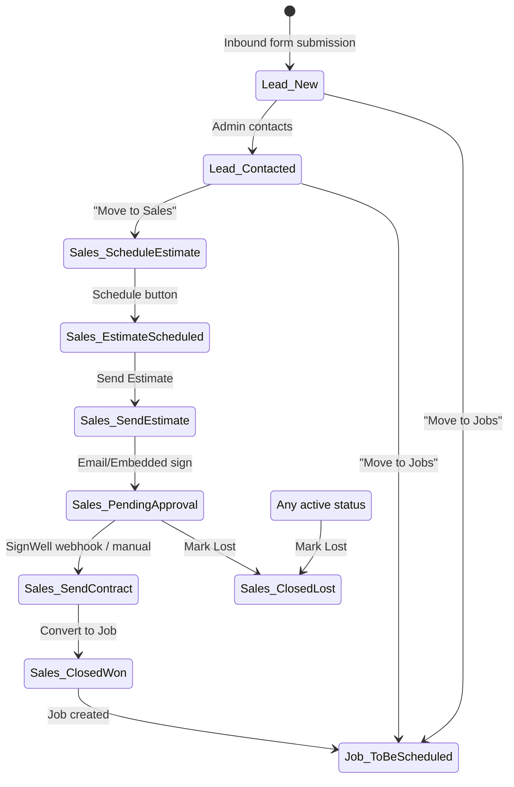
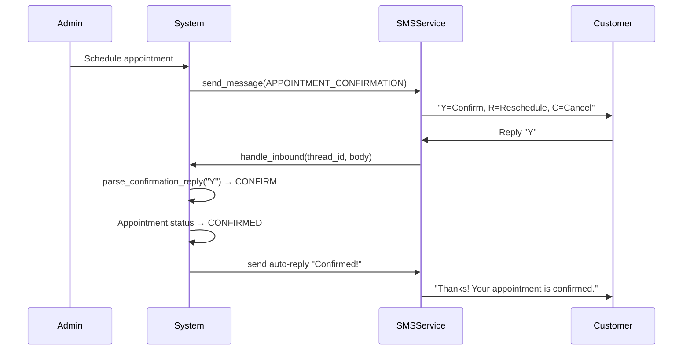
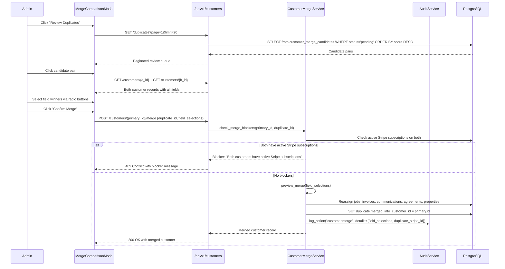
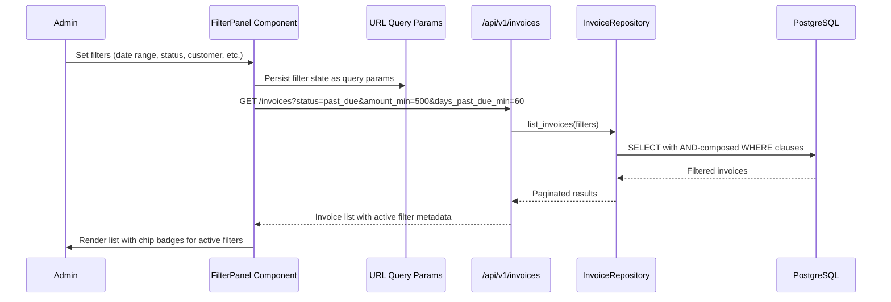

# Design Document: CRM Changes Update 2

## Overview

CRM Changes Update 2 is a comprehensive platform overhaul spanning 39 requirements across authentication, dashboard, customers, leads, sales pipeline, jobs, scheduling, invoicing, onboarding, and contract renewals. The update operates under a single-admin login scope (no RBAC) and integrates SignWell for e-signatures and the existing CallRail SMS provider abstraction for appointment confirmations.

The design is organized into seven implementation domains:

1. **Auth & Dashboard** (Req 1–4, 38–39): Password hardening, session bug investigation, alert navigation, dashboard cleanup
2. **Customers** (Req 5–8): Duplicate detection/merge, service preferences, property tagging
3. **Leads** (Req 9–12): Deletion, column reorder, status simplification, move-out buttons
4. **Sales Pipeline** (Req 13–18): Work Requests removal, new Sales tab with auto-advancing statuses, calendar, Convert to Job with signature gating, documents, e-signature dual path
5. **Jobs** (Req 19–21): Property tags on detail, Week Of rename, missing actions bugfix (blocker)
6. **Schedule & On-Site** (Req 22–27): Job picker, confirmed/unconfirmed visuals, Y/R/C SMS flow, reschedule queue, on-site operations, job status buttons
7. **Invoice, Onboarding & Renewals** (Req 28–31): Full filtering, status colors, mass notifications, week picker onboarding, contract renewal review queue

**Critical implementation blockers:**
- Req 21 (missing job actions) blocks the entire Invoice tab — must be fixed first
- SignWell account provisioning required for Req 16/18
- Messaging infrastructure is production-ready (no blocker for Y/R/C)

## Architecture

The update follows the existing vertical-slice architecture with FastAPI backend, SQLAlchemy 2.0 models, and React 19 frontend. New features are added as extensions to existing slices (customers, leads, jobs, invoices, schedule) plus two new slices (sales, contract-renewals).

```mermaid
graph TB
    subgraph Frontend["Frontend (React 19 + TypeScript)"]
        Dashboard[Dashboard]
        Customers[Customers Feature]
        Leads[Leads Feature]
        Sales[Sales Feature - NEW]
        Jobs[Jobs Feature]
        Schedule[Schedule Feature]
        Invoices[Invoices Feature]
        Onboarding[Onboarding Feature]
        ContractReviews[Contract Reviews - NEW]
    end

    subgraph API["API Layer (FastAPI)"]
        DashAPI["/api/v1/dashboard"]
        CustAPI["/api/v1/customers"]
        LeadAPI["/api/v1/leads"]
        SalesAPI["/api/v1/sales - NEW"]
        JobAPI["/api/v1/jobs"]
        SchedAPI["/api/v1/schedule"]
        InvAPI["/api/v1/invoices"]
        OnbAPI["/api/v1/onboarding"]
        RenewalAPI["/api/v1/contract-renewals - NEW"]
        SignWellWH["/api/v1/webhooks/signwell - NEW"]
        CallRailWH["/api/v1/callrail/webhooks"]
    end

    subgraph Services["Service Layer"]
        DupService[DuplicateDetectionService - NEW]
        MergeService[CustomerMergeService - NEW]
        SalesService[SalesPipelineService - NEW]
        SignWellClient[SignWellClient - NEW]
        JobConfirmService[JobConfirmationService - NEW]
        RenewalService[ContractRenewalReviewService - NEW]
        ExistingSMS[SMSService - EXTEND]
        ExistingJob[JobService - EXTEND]
        ExistingInvoice[InvoiceService - EXTEND]
        ExistingJobGen[JobGenerator - EXTEND]
    end

    subgraph Data["Data Layer (PostgreSQL)"]
        ExistingTables[Existing: customers, leads, jobs,<br/>appointments, invoices, properties,<br/>service_agreements, sent_messages]
        NewTables[New: customer_merge_candidates,<br/>customer_documents, sales_entries,<br/>job_confirmation_responses,<br/>reschedule_requests,<br/>contract_renewal_proposals,<br/>contract_renewal_proposed_jobs]
    end

    subgraph External["External Services"]
        SignWell[SignWell API]
        CallRail[CallRail SMS]
        S3[S3 Storage]
        Stripe[Stripe]
    end

    Frontend --> API
    API --> Services
    Services --> Data
    Services --> External
```



### Cross-Cutting Concerns

- **Audit logging**: All merge operations, force overrides, and status transitions write to the existing `audit_log` table via `AuditService`
- **SMS**: All outbound SMS (Y/R/C confirmations, on-my-way, review push, mass notifications) route through the existing `SMSService` → `BaseSMSProvider` abstraction
- **File storage**: All document uploads route through the existing `PhotoService` S3 infrastructure
- **Background jobs**: Duplicate detection nightly sweep uses the existing `background_jobs.py` scheduler

## Components and Interfaces

### New Backend Services

#### 1. DuplicateDetectionService
- `compute_score(customer_a, customer_b) -> int`: Weighted 0–100 scoring using phone (E.164), email, Jaro-Winkler name, address, ZIP+last-name signals
- `run_nightly_sweep(db) -> int`: Batch-compute scores for all active customer pairs, upsert into `customer_merge_candidates`
- `get_review_queue(db, skip, limit) -> list[MergeCandidate]`: Paginated queue sorted by score descending

#### 2. CustomerMergeService
- `preview_merge(db, primary_id, duplicate_id, field_selections) -> MergePreview`: Generate preview of merged record
- `execute_merge(db, primary_id, duplicate_id, field_selections, admin_id) -> Customer`: Reassign all related records, soft-delete duplicate, write audit log
- `check_merge_blockers(db, primary_id, duplicate_id) -> list[str]`: Check for active Stripe subscriptions on both records

#### 3. SalesPipelineService
- `create_from_lead(db, lead_id) -> SalesEntry`: Create pipeline entry from lead move-out
- `advance_status(db, entry_id, action) -> SalesEntry`: Auto-advance status based on action button
- `manual_override_status(db, entry_id, new_status) -> SalesEntry`: Admin manual override
- `convert_to_job(db, entry_id, force=False) -> Job`: Create job from sales entry, with optional force override

#### 4. SignWellClient (`src/grins_platform/services/signwell/`)
- `create_document_for_email(pdf_url, recipient_email, recipient_name) -> dict`: Create SignWell document for email signing
- `create_document_for_embedded(pdf_url, signer_name) -> dict`: Create document for embedded signing
- `get_embedded_url(document_id) -> str`: Get iframe signing URL
- `fetch_signed_pdf(document_id) -> bytes`: Download completed signed PDF
- `verify_webhook_signature(payload, signature) -> bool`: HMAC verification

#### 5. JobConfirmationService
- `parse_confirmation_reply(body) -> ConfirmationKeyword | None`: Y/R/C keyword parser
- `handle_confirmation(db, thread_id, keyword, raw_body, from_phone) -> dict`: Orchestrate appointment status transition + auto-reply
- `get_reschedule_queue(db, skip, limit) -> list[RescheduleRequest]`: Admin queue

#### 6. ContractRenewalReviewService
- `generate_proposal(db, agreement_id) -> ContractRenewalProposal`: Create proposed jobs from renewal
- `approve_all(db, proposal_id, admin_id) -> list[Job]`: Bulk approve and create real jobs
- `reject_all(db, proposal_id, admin_id) -> None`: Bulk reject
- `approve_job(db, proposed_job_id, admin_id, modifications=None) -> Job`: Per-job approve with optional Week Of modification
- `reject_job(db, proposed_job_id, admin_id) -> None`: Per-job reject

### New API Endpoints

#### Customers (extensions)
| Method | Path | Purpose |
|--------|------|---------|
| GET | `/api/v1/customers/duplicates` | Review queue with pagination |
| POST | `/api/v1/customers/{id}/merge` | Execute merge |
| POST | `/api/v1/customers/{id}/documents` | Upload document |
| GET | `/api/v1/customers/{id}/documents` | List documents |
| GET | `/api/v1/customers/{id}/documents/{doc_id}/download` | Presigned download URL |
| DELETE | `/api/v1/customers/{id}/documents/{doc_id}` | Delete document |

#### Sales (new slice)
| Method | Path | Purpose |
|--------|------|---------|
| GET | `/api/v1/sales` | List pipeline entries |
| GET | `/api/v1/sales/{id}` | Detail view |
| POST | `/api/v1/sales/{id}/advance` | Action-button status advance |
| PUT | `/api/v1/sales/{id}/status` | Manual status override |
| POST | `/api/v1/sales/{id}/sign/email` | Trigger email signing |
| POST | `/api/v1/sales/{id}/sign/embedded` | Get embedded signing URL |
| POST | `/api/v1/sales/{id}/convert` | Convert to job |
| POST | `/api/v1/sales/{id}/force-convert` | Force convert (no signature) |
| DELETE | `/api/v1/sales/{id}` | Mark lost |

#### Sales Calendar
| Method | Path | Purpose |
|--------|------|---------|
| GET | `/api/v1/sales/calendar/events` | List estimate appointments |
| POST | `/api/v1/sales/calendar/events` | Create estimate appointment |
| PUT | `/api/v1/sales/calendar/events/{id}` | Update appointment |
| DELETE | `/api/v1/sales/calendar/events/{id}` | Delete appointment |

#### Webhooks (new)
| Method | Path | Purpose |
|--------|------|---------|
| POST | `/api/v1/webhooks/signwell` | SignWell document_completed webhook |

#### Leads (extensions)
| Method | Path | Purpose |
|--------|------|---------|
| DELETE | `/api/v1/leads/{id}` | Hard delete |
| POST | `/api/v1/leads/{id}/move-to-jobs` | Move to Jobs tab |
| POST | `/api/v1/leads/{id}/move-to-sales` | Move to Sales tab |
| PUT | `/api/v1/leads/{id}/contacted` | Mark as contacted |

#### Jobs (extensions)
| Method | Path | Purpose |
|--------|------|---------|
| POST | `/api/v1/jobs/{id}/invoice` | Create invoice (bugfix) |
| POST | `/api/v1/jobs/{id}/complete` | Mark complete (bugfix) |
| POST | `/api/v1/jobs/{id}/on-my-way` | Send on-my-way SMS |
| POST | `/api/v1/jobs/{id}/started` | Log job started |
| POST | `/api/v1/jobs/{id}/notes` | Add note |
| POST | `/api/v1/jobs/{id}/photos` | Add photo |
| POST | `/api/v1/jobs/{id}/review-push` | Send Google review SMS |

#### Schedule (extensions)
| Method | Path | Purpose |
|--------|------|---------|
| GET | `/api/v1/schedule/reschedule-requests` | Reschedule queue |
| PUT | `/api/v1/schedule/reschedule-requests/{id}/resolve` | Mark resolved |

#### Invoices (extensions)
| Method | Path | Purpose |
|--------|------|---------|
| GET | `/api/v1/invoices` | Extended with 9-axis filtering |
| POST | `/api/v1/invoices/mass-notify` | Bulk SMS/email notifications |

#### Contract Renewals (new slice)
| Method | Path | Purpose |
|--------|------|---------|
| GET | `/api/v1/contract-renewals` | List pending proposals |
| GET | `/api/v1/contract-renewals/{id}` | Proposal detail with proposed jobs |
| POST | `/api/v1/contract-renewals/{id}/approve-all` | Bulk approve |
| POST | `/api/v1/contract-renewals/{id}/reject-all` | Bulk reject |
| POST | `/api/v1/contract-renewals/{id}/jobs/{job_id}/approve` | Per-job approve |
| POST | `/api/v1/contract-renewals/{id}/jobs/{job_id}/reject` | Per-job reject |
| PUT | `/api/v1/contract-renewals/{id}/jobs/{job_id}` | Modify proposed job |

### New Frontend Components

#### Sales Feature (`frontend/src/features/sales/`)
- `SalesPipeline.tsx` — Main list view with summary boxes + pipeline table
- `SalesDetail.tsx` — Expanded per-entry view with documents, signing actions
- `SalesCalendar.tsx` — Dedicated estimate scheduling calendar
- `DocumentsSection.tsx` — Upload/download/preview/delete documents
- `SignWellEmbeddedSigner.tsx` — iframe + postMessage listener (~50 lines)
- `StatusActionButton.tsx` — Auto-advancing pipeline action buttons

#### Customers Feature (extensions)
- `DuplicateReviewQueue.tsx` — Review queue with count badge
- `MergeComparisonModal.tsx` — Side-by-side field comparison with radio buttons
- `ServicePreferencesSection.tsx` — CRUD for multi date/time preferences
- `ServicePreferenceModal.tsx` — Add/edit preference form

#### Leads Feature (extensions)
- Update `LeadsList.tsx` — New columns (Job Requested, City, Last Contacted), remove Intake, reorder source to far right, remove source coloring
- `MoveToJobsButton.tsx` / `MoveToSalesButton.tsx` — Action buttons per row
- `DeleteLeadButton.tsx` — With confirmation modal

#### Jobs Feature (extensions)
- Update `JobList.tsx` — "Week Of" column with week picker, property tags as badges
- Update `JobDetail.tsx` — Property address + tags, status buttons (On My Way / Started / Complete), payment warning modal
- `WeekPicker.tsx` — Week-level date selector

#### Schedule Feature (extensions)
- `JobPickerPopup.tsx` — Mirror of Jobs tab for bulk assignment
- `RescheduleRequestsQueue.tsx` — Admin queue for R replies
- Visual distinction CSS for confirmed vs unconfirmed appointments

#### Invoices Feature (extensions)
- `FilterPanel.tsx` — Collapsible 9-axis filter panel with chip badges
- Update `InvoiceList.tsx` — Status colors, new columns, mass notification actions

#### Contract Renewals Feature (new: `frontend/src/features/contract-renewals/`)
- `RenewalReviewList.tsx` — Pending proposals list
- `RenewalProposalDetail.tsx` — Per-job approve/reject/modify with admin_notes

#### Dashboard Feature (extensions)
- Remove Estimates and New Leads sections
- Add alert-to-record navigation with `?highlight=<id>` URL params and amber pulse animation

#### Onboarding Feature (extensions)
- `WeekPickerStep.tsx` — Per-service week selection during onboarding wizard

### Shared Components
- `FilterPanel.tsx` → `frontend/src/shared/components/FilterPanel.tsx` (reusable across Invoices, Jobs, Customers, Sales — 4+ features)
- `WeekPicker.tsx` → `frontend/src/shared/components/WeekPicker.tsx` (reusable across Jobs, Onboarding, Contract Renewals — 3+ features)
- `PropertyTags.tsx` → `frontend/src/shared/components/PropertyTags.tsx` (reusable across Jobs, Customers, Sales — 3+ features)
- `HighlightRow.tsx` → `frontend/src/shared/components/HighlightRow.tsx` (amber pulse animation for alert navigation)


## Data Models

### New Tables

#### 1. `customer_merge_candidates`
Populated by nightly background job. Never modifies customer records directly.

```sql
CREATE TABLE customer_merge_candidates (
    id UUID PRIMARY KEY DEFAULT gen_random_uuid(),
    customer_a_id UUID NOT NULL REFERENCES customers(id),
    customer_b_id UUID NOT NULL REFERENCES customers(id),
    score INTEGER NOT NULL CHECK (score BETWEEN 0 AND 100),
    match_signals JSONB NOT NULL,  -- {"phone": 60, "email": 50, "name": 25, ...}
    status VARCHAR(20) NOT NULL DEFAULT 'pending',  -- pending, merged, dismissed
    created_at TIMESTAMPTZ NOT NULL DEFAULT now(),
    resolved_at TIMESTAMPTZ,
    resolution VARCHAR(20),  -- merged, dismissed, null
    UNIQUE (customer_a_id, customer_b_id)
);
CREATE INDEX idx_merge_candidates_score ON customer_merge_candidates(score DESC);
CREATE INDEX idx_merge_candidates_status ON customer_merge_candidates(status);
```

#### 2. `customer_documents`
Mirrors `CustomerPhoto` but accepts PDFs, images, and doc types. Uses existing S3 infrastructure.

```sql
CREATE TABLE customer_documents (
    id UUID PRIMARY KEY DEFAULT gen_random_uuid(),
    customer_id UUID NOT NULL REFERENCES customers(id),
    file_key VARCHAR(500) NOT NULL,
    file_name VARCHAR(255) NOT NULL,
    document_type VARCHAR(30) NOT NULL,  -- estimate, contract, photo, diagram, reference, signed_contract
    mime_type VARCHAR(100) NOT NULL,
    size_bytes INTEGER NOT NULL,
    uploaded_at TIMESTAMPTZ NOT NULL DEFAULT now(),
    uploaded_by VARCHAR(100) NOT NULL
);
CREATE INDEX idx_customer_documents_customer ON customer_documents(customer_id);
CREATE INDEX idx_customer_documents_type ON customer_documents(document_type);
```

#### 3. `sales_entries`
Pipeline records for the new Sales tab.

```sql
CREATE TABLE sales_entries (
    id UUID PRIMARY KEY DEFAULT gen_random_uuid(),
    customer_id UUID NOT NULL REFERENCES customers(id),
    property_id UUID REFERENCES properties(id),
    lead_id UUID REFERENCES leads(id),  -- source lead if moved from Leads
    job_type VARCHAR(100),
    status VARCHAR(30) NOT NULL DEFAULT 'schedule_estimate',
    -- Statuses: schedule_estimate, estimate_scheduled, send_estimate,
    --           pending_approval, send_contract, closed_won, closed_lost
    last_contact_date TIMESTAMPTZ,
    notes TEXT,
    override_flag BOOLEAN NOT NULL DEFAULT false,
    closed_reason TEXT,  -- reason for closed_lost
    signwell_document_id VARCHAR(255),  -- SignWell document reference
    created_at TIMESTAMPTZ NOT NULL DEFAULT now(),
    updated_at TIMESTAMPTZ NOT NULL DEFAULT now()
);
CREATE INDEX idx_sales_entries_status ON sales_entries(status);
CREATE INDEX idx_sales_entries_customer ON sales_entries(customer_id);
```

#### 4. `sales_calendar_events`
Estimate appointments for the Sales calendar (separate from main schedule).

```sql
CREATE TABLE sales_calendar_events (
    id UUID PRIMARY KEY DEFAULT gen_random_uuid(),
    sales_entry_id UUID NOT NULL REFERENCES sales_entries(id),
    customer_id UUID NOT NULL REFERENCES customers(id),
    title VARCHAR(255) NOT NULL,
    scheduled_date DATE NOT NULL,
    start_time TIME,
    end_time TIME,
    notes TEXT,
    created_at TIMESTAMPTZ NOT NULL DEFAULT now(),
    updated_at TIMESTAMPTZ NOT NULL DEFAULT now()
);
CREATE INDEX idx_sales_calendar_date ON sales_calendar_events(scheduled_date);
```

#### 5. `job_confirmation_responses`
Audit trail for Y/R/C SMS replies.

```sql
CREATE TABLE job_confirmation_responses (
    id UUID PRIMARY KEY DEFAULT gen_random_uuid(),
    job_id UUID NOT NULL REFERENCES jobs(id),
    appointment_id UUID NOT NULL REFERENCES appointments(id),
    sent_message_id UUID NOT NULL REFERENCES sent_messages(id),
    customer_id UUID NOT NULL REFERENCES customers(id),
    from_phone VARCHAR(20) NOT NULL,
    reply_keyword VARCHAR(20) NOT NULL,  -- CONFIRM, RESCHEDULE, CANCEL
    raw_reply_body TEXT NOT NULL,
    provider_sid VARCHAR(255),
    status VARCHAR(20) NOT NULL DEFAULT 'parsed',  -- parsed, needs_review, processed, failed
    received_at TIMESTAMPTZ NOT NULL DEFAULT now(),
    processed_at TIMESTAMPTZ
);
CREATE INDEX idx_confirmation_responses_appointment ON job_confirmation_responses(appointment_id);
CREATE INDEX idx_confirmation_responses_status ON job_confirmation_responses(status);
```

#### 6. `reschedule_requests`
Queue for R (reschedule) replies from customers.

```sql
CREATE TABLE reschedule_requests (
    id UUID PRIMARY KEY DEFAULT gen_random_uuid(),
    job_id UUID NOT NULL REFERENCES jobs(id),
    appointment_id UUID NOT NULL REFERENCES appointments(id),
    customer_id UUID NOT NULL REFERENCES customers(id),
    original_reply_id UUID NOT NULL REFERENCES job_confirmation_responses(id),
    requested_alternatives JSONB,
    raw_alternatives_text TEXT,
    status VARCHAR(30) NOT NULL DEFAULT 'awaiting_alternatives',
    -- awaiting_alternatives, awaiting_admin_action, resolved, abandoned
    created_at TIMESTAMPTZ NOT NULL DEFAULT now(),
    resolved_at TIMESTAMPTZ
);
CREATE INDEX idx_reschedule_requests_status ON reschedule_requests(status);
```

#### 7. `contract_renewal_proposals`
Batch proposals generated on auto-renewal.

```sql
CREATE TABLE contract_renewal_proposals (
    id UUID PRIMARY KEY DEFAULT gen_random_uuid(),
    service_agreement_id UUID NOT NULL REFERENCES service_agreements(id),
    customer_id UUID NOT NULL REFERENCES customers(id),
    status VARCHAR(30) NOT NULL DEFAULT 'pending_review',
    -- pending_review, approved, rejected, partially_approved
    proposed_job_count INTEGER NOT NULL,
    created_at TIMESTAMPTZ NOT NULL DEFAULT now(),
    reviewed_at TIMESTAMPTZ,
    reviewed_by VARCHAR(100)
);
CREATE INDEX idx_renewal_proposals_status ON contract_renewal_proposals(status);
```

#### 8. `contract_renewal_proposed_jobs`
Individual proposed jobs within a renewal proposal.

```sql
CREATE TABLE contract_renewal_proposed_jobs (
    id UUID PRIMARY KEY DEFAULT gen_random_uuid(),
    proposal_id UUID NOT NULL REFERENCES contract_renewal_proposals(id) ON DELETE CASCADE,
    service_type VARCHAR(100) NOT NULL,
    target_start_date DATE NOT NULL,
    target_end_date DATE NOT NULL,
    status VARCHAR(20) NOT NULL DEFAULT 'pending',  -- pending, approved, rejected, modified
    proposed_job_payload JSONB NOT NULL,
    admin_notes TEXT,
    created_job_id UUID REFERENCES jobs(id)  -- populated on approval
);
CREATE INDEX idx_proposed_jobs_proposal ON contract_renewal_proposed_jobs(proposal_id);
```

### Column Additions to Existing Tables

#### `customers` table
```sql
ALTER TABLE customers ADD COLUMN merged_into_customer_id UUID REFERENCES customers(id);
CREATE INDEX idx_customers_merged_into ON customers(merged_into_customer_id) WHERE merged_into_customer_id IS NOT NULL;
```

#### `properties` table
```sql
ALTER TABLE properties ADD COLUMN is_hoa BOOLEAN NOT NULL DEFAULT false;
```

#### `leads` table
```sql
ALTER TABLE leads ADD COLUMN moved_to VARCHAR(20);  -- 'jobs' or 'sales'
ALTER TABLE leads ADD COLUMN moved_at TIMESTAMPTZ;
ALTER TABLE leads ADD COLUMN last_contacted_at TIMESTAMPTZ;
ALTER TABLE leads ADD COLUMN job_requested VARCHAR(255);
CREATE INDEX idx_leads_moved_to ON leads(moved_to) WHERE moved_to IS NOT NULL;
```

#### `customer_photos` table
```sql
ALTER TABLE customer_photos ADD COLUMN job_id UUID REFERENCES jobs(id);
CREATE INDEX idx_customer_photos_job ON customer_photos(job_id) WHERE job_id IS NOT NULL;
```

#### `service_agreements` table
```sql
ALTER TABLE service_agreements ADD COLUMN service_week_preferences JSONB;
```

### New Enum Values

```python
# In enums.py — additions only

class MessageType(str, Enum):
    # ... existing values ...
    APPOINTMENT_CONFIRMATION = "appointment_confirmation"
    GOOGLE_REVIEW_REQUEST = "google_review_request"
    ON_MY_WAY = "on_my_way"

class SalesEntryStatus(str, Enum):
    SCHEDULE_ESTIMATE = "schedule_estimate"
    ESTIMATE_SCHEDULED = "estimate_scheduled"
    SEND_ESTIMATE = "send_estimate"
    PENDING_APPROVAL = "pending_approval"
    SEND_CONTRACT = "send_contract"
    CLOSED_WON = "closed_won"
    CLOSED_LOST = "closed_lost"

class ConfirmationKeyword(str, Enum):
    CONFIRM = "confirm"
    RESCHEDULE = "reschedule"
    CANCEL = "cancel"

class DocumentType(str, Enum):
    ESTIMATE = "estimate"
    CONTRACT = "contract"
    PHOTO = "photo"
    DIAGRAM = "diagram"
    REFERENCE = "reference"
    SIGNED_CONTRACT = "signed_contract"

class ProposalStatus(str, Enum):
    PENDING_REVIEW = "pending_review"
    APPROVED = "approved"
    REJECTED = "rejected"
    PARTIALLY_APPROVED = "partially_approved"

class ProposedJobStatus(str, Enum):
    PENDING = "pending"
    APPROVED = "approved"
    REJECTED = "rejected"
    MODIFIED = "modified"
```

### Key Data Flow Diagrams

#### Lead → Sales → Job Pipeline


#### Y/R/C Appointment Confirmation Flow



#### Customer Merge Data Flow


#### Contract Renewal Review Flow
```mermaid
sequenceDiagram
    participant Stripe as Stripe Webhook
    participant API as /api/v1/webhooks/stripe
    participant RenewalSvc as ContractRenewalReviewService
    participant DB as PostgreSQL
    participant Dashboard as Dashboard Alerts
    participant Admin

    Stripe->>API: invoice.paid (renewal)
    API->>RenewalSvc: generate_proposal(agreement_id)
    RenewalSvc->>DB: Read prior-year service_week_preferences
    RenewalSvc->>DB: Create contract_renewal_proposals record
    RenewalSvc->>DB: Create contract_renewal_proposed_jobs (rolled forward +1 year)
    RenewalSvc->>Dashboard: Fire alert "1 contract renewal ready for review: {customer_name}"
    RenewalSvc-->>API: Proposal created

    Admin->>API: GET /contract-renewals
    API->>DB: SELECT proposals WHERE status='pending_review'
    DB-->>API: Pending proposals
    API-->>Admin: Proposal list

    Admin->>API: GET /contract-renewals/{id}
    API-->>Admin: Proposal detail with proposed jobs

    alt Approve All
        Admin->>API: POST /contract-renewals/{id}/approve-all
        API->>RenewalSvc: approve_all(proposal_id)
        RenewalSvc->>DB: Create real Job records from proposed_job_payload
        RenewalSvc->>DB: SET proposal.status = 'approved'
    else Per-Job Actions
        Admin->>API: POST /contract-renewals/{id}/jobs/{job_id}/approve
        API->>RenewalSvc: approve_job(proposed_job_id, modifications?)
        RenewalSvc->>DB: Create Job, SET proposed_job.status = 'approved'
        Note over RenewalSvc: Repeat per job; proposal becomes 'partially_approved'
    else Reject All
        Admin->>API: POST /contract-renewals/{id}/reject-all
        API->>RenewalSvc: reject_all(proposal_id)
        RenewalSvc->>DB: SET all proposed_jobs.status = 'rejected', proposal.status = 'rejected'
    end
```


#### Invoice Filtering Data Flow


## Detailed Service Design

### Duplicate Detection Algorithm

The `DuplicateDetectionService` implements a weighted scoring algorithm that runs as a nightly background job. The algorithm is designed to be commutative (`score(A, B) == score(B, A)`) and deterministic.

```python
# Scoring weights (additive, capped at 100)
PHONE_EXACT_MATCH = 60       # E.164 normalized exact match
EMAIL_EXACT_MATCH = 50       # Lowercased exact match
NAME_SIMILARITY = 25         # Jaro-Winkler >= 0.92
ADDRESS_EXACT_MATCH = 20     # Normalized street address
ZIP_PLUS_LASTNAME = 10       # Same ZIP + same last name (weak signal)

# Thresholds
HIGH_CONFIDENCE = 80         # Pre-select merge fields
POSSIBLE_DUPLICATE = 50      # Include in review queue
BELOW_THRESHOLD = 49         # Not flagged
```

Normalization rules:
- Phone: Strip to digits, prepend +1 if 10 digits → E.164 comparison
- Email: Lowercase, strip whitespace
- Name: Lowercase, strip whitespace, Jaro-Winkler similarity from `jellyfish` library
- Address: Lowercase, strip whitespace, normalize common abbreviations (St→Street, Ave→Avenue, etc.)
- ZIP: First 5 digits only

The nightly sweep uses a self-join on the `customers` table excluding soft-deleted records (`merged_into_customer_id IS NULL` and `is_deleted = false`). To avoid O(n²) full comparison, the sweep pre-filters candidate pairs using at least one shared signal (same phone, same email, same ZIP, or same last name) before computing the full weighted score.


### SignWell Integration Design

The SignWell integration lives in `src/grins_platform/services/signwell/` as a thin `httpx` wrapper following the existing external service pattern (similar to `StripeSettings` + service classes).

```
src/grins_platform/services/signwell/
├── __init__.py          # Exports SignWellClient, SignWellSettings
├── config.py            # SignWellSettings (Pydantic BaseSettings)
└── client.py            # SignWellClient (httpx wrapper)
```

#### SignWellSettings
```python
class SignWellSettings(BaseSettings):
    signwell_api_key: str = ""
    signwell_webhook_secret: str = ""
    signwell_api_base_url: str = "https://www.signwell.com/api/v1"
    signwell_test_mode: bool = False

    @property
    def is_configured(self) -> bool:
        return bool(self.signwell_api_key)

    model_config = SettingsConfigDict(env_prefix="")
```

#### SignWellClient Methods
| Method | Purpose | HTTP Call |
|--------|---------|-----------|
| `create_document_for_email(pdf_url, email, name)` | Create doc for email signing | POST /documents |
| `create_document_for_embedded(pdf_url, signer_name)` | Create doc for embedded signing | POST /documents (embedded=true) |
| `get_embedded_url(document_id)` | Get iframe signing URL | GET /documents/{id}/embedded_url |
| `fetch_signed_pdf(document_id)` | Download completed PDF | GET /documents/{id}/completed_pdf |
| `verify_webhook_signature(payload, signature)` | HMAC-SHA256 verification | N/A (local computation) |

#### Webhook Flow
The SignWell webhook endpoint (`POST /api/v1/webhooks/signwell`) handles the `document_completed` event:
1. Verify HMAC-SHA256 signature using `SIGNWELL_WEBHOOK_SECRET`
2. Extract `document_id` from payload
3. Look up `sales_entries` by `signwell_document_id`
4. Fetch signed PDF via `fetch_signed_pdf(document_id)`
5. Store as `customer_documents` with `document_type = "signed_contract"` via `PhotoService`
6. Advance `sales_entry.status` from `pending_approval` to `send_contract`

#### Embedded Signer Component
The `SignWellEmbeddedSigner.tsx` component (~50 lines) mounts a SignWell iframe and listens for `postMessage` events:
```typescript
// Simplified flow
const SignWellEmbeddedSigner = ({ signingUrl, onComplete, onClose }) => {
  useEffect(() => {
    const handler = (event: MessageEvent) => {
      if (event.data?.type === 'signwell:document_signed') onComplete(event.data);
      if (event.data?.type === 'signwell:closed') onClose();
    };
    window.addEventListener('message', handler);
    return () => window.removeEventListener('message', handler);
  }, []);
  return <iframe src={signingUrl} className="w-full h-[600px]" />;
};
```


### Y/R/C Job Confirmation Service Design

The `JobConfirmationService` integrates with the existing `SMSService` → `BaseSMSProvider` abstraction. It uses only the abstract `InboundSMS` dataclass — no CallRail-specific code in the confirmation handler.

#### Keyword Parser
```python
CONFIRM_KEYWORDS = {"y", "yes", "confirm", "confirmed", "ok", "okay"}
RESCHEDULE_KEYWORDS = {"r", "reschedule", "different time", "change time"}
CANCEL_KEYWORDS = {"c", "cancel", "cancelled"}

def parse_confirmation_reply(body: str) -> ConfirmationKeyword | None:
    """Parse Y/R/C keyword from SMS body. Case-insensitive, whitespace-trimmed."""
    normalized = body.strip().lower()
    if normalized in CONFIRM_KEYWORDS:
        return ConfirmationKeyword.CONFIRM
    if normalized in RESCHEDULE_KEYWORDS:
        return ConfirmationKeyword.RESCHEDULE
    if normalized in CANCEL_KEYWORDS:
        return ConfirmationKeyword.CANCEL
    return None
```

#### Confirmation Handling Flow
1. Inbound SMS arrives via existing webhook → `BaseSMSProvider.parse_inbound_webhook()` → `InboundSMS`
2. Correlate via `thread_id` to find the original `sent_messages` record with `message_type = APPOINTMENT_CONFIRMATION`
3. Parse keyword via `parse_confirmation_reply(inbound.body)`
4. Based on keyword:
   - **CONFIRM**: Transition appointment `SCHEDULED → CONFIRMED`, send auto-reply "Thanks! Your appointment is confirmed."
   - **RESCHEDULE**: Create `reschedule_requests` record, send follow-up "We'll follow up with a new time shortly. Please reply with 2-5 preferred dates/times.", surface in admin queue
   - **CANCEL**: Transition appointment `SCHEDULED → CANCELLED`, send auto-reply "Your appointment has been cancelled. We'll be in touch.", notify admin
   - **None**: Log with `status = "needs_review"` for manual processing
5. Persist all replies in `job_confirmation_responses` table

#### Outbound Confirmation Message Template
```
Hi {customer_first_name}, this is Grin's Irrigation confirming your
{service_type} appointment on {scheduled_date} ({time_window}).

Reply:
Y - Confirm
R - Request different time
C - Cancel

Thanks!
```

### Sales Pipeline Status Machine

The sales pipeline follows a strict linear progression with `Closed-Lost` reachable from any active status:

```
Schedule Estimate → Estimate Scheduled → Send Estimate → Pending Approval → Send Contract → Closed-Won
         ↓                  ↓                 ↓                ↓                  ↓
     Closed-Lost        Closed-Lost       Closed-Lost      Closed-Lost        Closed-Lost
```

Valid transitions enforced by `SalesPipelineService`:
```python
VALID_TRANSITIONS: dict[SalesEntryStatus, set[SalesEntryStatus]] = {
    SalesEntryStatus.SCHEDULE_ESTIMATE: {SalesEntryStatus.ESTIMATE_SCHEDULED, SalesEntryStatus.CLOSED_LOST},
    SalesEntryStatus.ESTIMATE_SCHEDULED: {SalesEntryStatus.SEND_ESTIMATE, SalesEntryStatus.CLOSED_LOST},
    SalesEntryStatus.SEND_ESTIMATE: {SalesEntryStatus.PENDING_APPROVAL, SalesEntryStatus.CLOSED_LOST},
    SalesEntryStatus.PENDING_APPROVAL: {SalesEntryStatus.SEND_CONTRACT, SalesEntryStatus.CLOSED_LOST},
    SalesEntryStatus.SEND_CONTRACT: {SalesEntryStatus.CLOSED_WON, SalesEntryStatus.CLOSED_LOST},
    SalesEntryStatus.CLOSED_WON: set(),   # Terminal
    SalesEntryStatus.CLOSED_LOST: set(),   # Terminal
}
```

Action buttons map to exactly one forward step:
| Button | Current Status | Next Status |
|--------|---------------|-------------|
| Schedule Estimate | schedule_estimate | estimate_scheduled |
| Send Estimate | estimate_scheduled | send_estimate |
| (Email/Embedded sign) | send_estimate | pending_approval |
| (SignWell webhook) | pending_approval | send_contract |
| Convert to Job | send_contract | closed_won |
| Mark Lost | (any active) | closed_lost |

Manual override via dropdown allows jumping to any valid status (admin escape hatch), logged in audit.


### Invoice Filtering Design

The invoice filtering system uses a composable query builder pattern. All filters compose via AND (intersection). The `FilterPanel` shared component is reusable across Invoices, Jobs, Customers, and Sales (4+ features → `shared/`).

#### 9-Axis Filter Specification
| Axis | Type | Query Pattern |
|------|------|---------------|
| Date range | created/due/paid date with start+end | `WHERE invoice_date BETWEEN :start AND :end` |
| Status | Multi-select (Complete, Pending, Past Due) | `WHERE status IN (:statuses)` |
| Customer | Searchable dropdown (typeahead) | `WHERE customer_id = :id` |
| Job | Searchable dropdown (typeahead) | `WHERE job_id = :id` |
| Amount range | Min/max numeric | `WHERE total_amount BETWEEN :min AND :max` |
| Payment type | Multi-select (Credit Card, Cash, Check, ACH, Other) | `WHERE payment_method IN (:types)` |
| Days until due | Numeric range | `WHERE due_date - CURRENT_DATE BETWEEN :min AND :max` |
| Days past due | Numeric range | `WHERE CURRENT_DATE - due_date BETWEEN :min AND :max` |
| Invoice number | Exact match | `WHERE invoice_number = :number` |

#### URL Persistence
Filters serialize to URL query params for bookmarkability:
```
/invoices?status=past_due,pending&amount_min=500&days_past_due_min=60&customer_id=abc-123
```

The `FilterPanel` component reads initial state from URL params on mount and writes back on every change via `useSearchParams()`.

#### Mass Notification Targets
| Target | Filter Criteria | Template |
|--------|----------------|----------|
| Past due | `status = past_due` | "Your invoice {invoice_number} of ${amount} is past due..." |
| Due soon | `days_until_due <= {configurable_window}` | "Reminder: Invoice {invoice_number} is due on {due_date}..." |
| Lien eligible | `days_past_due >= 60 AND total_amount > 500` | "Important notice regarding your outstanding balance..." |

### Week Of Date Alignment Design

The `WeekPicker` shared component enforces Monday–Sunday alignment:

```python
def align_to_week(selected_date: date) -> tuple[date, date]:
    """Return (Monday, Sunday) for the week containing selected_date."""
    monday = selected_date - timedelta(days=selected_date.weekday())
    sunday = monday + timedelta(days=6)
    return monday, sunday
```

- `target_start_date` = Monday of selected week
- `target_end_date` = Sunday of selected week (always `start + 6 days`)
- Display format: "Week of M/D/YYYY" where date is the Monday
- Round-trip property: `align_to_week(target_start_date) == (target_start_date, target_end_date)`

The `WeekPicker.tsx` component renders a calendar that highlights full weeks on hover and selects the entire Monday–Sunday range on click. It accepts `restrictToMonths?: [number, number]` for onboarding use (e.g., Spring Startup restricted to March–May).

### Onboarding Week Selection Design

During the onboarding wizard, after the customer selects a service package and before Stripe checkout:

1. The wizard displays a `WeekPicker` for each service in the package
2. Each picker is restricted to the valid month range for that service type (e.g., Spring Startup → March–May, Winterization → October–November)
3. Selections are stored as `service_week_preferences` JSON on the `ServiceAgreement`:
```json
{
  "spring_startup": "2026-04-20",
  "mid_season_inspection": "2026-07-06",
  "winterization": "2026-10-19"
}
```
4. When the Stripe `checkout.session.completed` webhook fires, the job generator reads `service_week_preferences` and sets `target_start_date` / `target_end_date` per the `align_to_week()` function
5. If `service_week_preferences` is null, the existing calendar-month defaults apply


### Contract Renewal Review Design

When a `ServiceAgreement` with `auto_renew=true` renews via Stripe `invoice.paid` webhook:

1. **Proposal Generation**: Instead of creating jobs directly, `ContractRenewalReviewService.generate_proposal()` creates a `contract_renewal_proposals` record with `status = pending_review`
2. **Date Rolling**: Prior-year `service_week_preferences` are rolled forward by +52 weeks (or +1 year, adjusting for leap years). If no prior preferences exist, hardcoded calendar-month defaults apply
3. **Proposed Jobs**: Each service in the agreement gets a `contract_renewal_proposed_jobs` record with `proposed_job_payload` containing all fields needed to create a real `Job` record
4. **Dashboard Alert**: A dashboard alert fires: "1 contract renewal ready for review: {customer_name}"
5. **Admin Review**: Three per-job actions: Approve (creates real Job), Reject (marks rejected), Modify (edit Week Of before approving)
6. **Bulk Actions**: "Approve All" creates all jobs at once; "Reject All" rejects the entire batch (useful for erroneous renewals)

### On-Site Operations Design

The job detail view provides field operation capabilities:

| Action | Backend | Side Effects |
|--------|---------|-------------|
| On My Way | `POST /jobs/{id}/on-my-way` | SMS via SMSService (ON_MY_WAY), log timestamp |
| Job Started | `POST /jobs/{id}/started` | Log timestamp |
| Collect Payment | Existing payment flow | Update appointment, customer record, invoice status |
| Create Invoice | `POST /jobs/{id}/invoice` | Generate from template, email with payment link |
| Add Notes | `POST /jobs/{id}/notes` | Sync to customer record + link to job_id |
| Add Photos | `POST /jobs/{id}/photos` | Upload via PhotoService, link to job_id via new `customer_photos.job_id` FK |
| Google Review Push | `POST /jobs/{id}/review-push` | SMS via SMSService (GOOGLE_REVIEW_REQUEST) with tracked deep link |
| Job Complete | `POST /jobs/{id}/complete` | Status → COMPLETED (with payment warning modal if no payment/invoice) |

#### Payment Warning Modal
When "Job Complete" is clicked and no payment has been collected and no invoice has been sent:
- Modal: "No Payment or Invoice on File"
- Options: "Cancel" (return to detail) or "Complete Anyway" (complete + audit log override entry)

#### Time Tracking Metadata
The system automatically tracks elapsed time between status transitions:
```json
{
  "on_my_way_at": "2026-04-11T09:00:00Z",
  "started_at": "2026-04-11T09:15:00Z",
  "completed_at": "2026-04-11T10:30:00Z",
  "travel_time_minutes": 15,
  "work_time_minutes": 75,
  "total_time_minutes": 90
}
```
Stored as structured metadata per job for future scheduling optimization.

## Migration Strategy

### Database Migrations (Alembic)

Migrations are sequenced to avoid FK dependency issues:

| Order | Migration | Tables/Columns |
|-------|-----------|---------------|
| 1 | `001_crm2_customer_extensions` | `customers.merged_into_customer_id`, `properties.is_hoa`, `leads.moved_to/moved_at/last_contacted_at/job_requested`, `customer_photos.job_id` |
| 2 | `002_crm2_customer_merge_candidates` | `customer_merge_candidates` table |
| 3 | `003_crm2_customer_documents` | `customer_documents` table |
| 4 | `004_crm2_sales_pipeline` | `sales_entries`, `sales_calendar_events` tables |
| 5 | `005_crm2_confirmation_flow` | `job_confirmation_responses`, `reschedule_requests` tables |
| 6 | `006_crm2_contract_renewals` | `contract_renewal_proposals`, `contract_renewal_proposed_jobs` tables |
| 7 | `007_crm2_service_week_preferences` | `service_agreements.service_week_preferences` |
| 8 | `008_crm2_enums` | New enum values for MessageType, SalesEntryStatus, ConfirmationKeyword, DocumentType, ProposalStatus, ProposedJobStatus |

All migrations are additive (new tables, new columns, new indexes). No destructive changes to existing tables. Rollback scripts drop the added columns/tables in reverse order.

### Data Migration: Work Requests → Sales Entries

A one-time data migration script converts existing work request records to `sales_entries`:
- Map work request status to the closest `SalesEntryStatus`
- Preserve customer_id, property_id, and notes
- Set `lead_id = NULL` (no lead linkage for pre-existing records)
- Log migration count and any unmappable records

### Password Migration (Req 1)

A standalone migration script (not Alembic) reads `NEW_ADMIN_PASSWORD` from environment, validates minimum criteria (16 chars, mixed case, digits, symbol), hashes with bcrypt cost 12, and updates the admin staff row. Aborts with descriptive error if env var is missing or password doesn't meet criteria.


## Error Handling

### Service-Level Error Handling

All new services follow the existing `LoggerMixin` pattern with domain-specific exceptions:

```python
# New exceptions in src/grins_platform/exceptions/
class MergeBlockerError(Exception):
    """Raised when a customer merge is blocked (e.g., dual Stripe subscriptions)."""

class InvalidSalesTransitionError(Exception):
    """Raised when a sales pipeline status transition is invalid."""

class SignWellError(Exception):
    """Base exception for SignWell API errors."""

class SignWellDocumentNotFoundError(SignWellError):
    """Raised when a SignWell document is not found."""

class SignWellWebhookVerificationError(SignWellError):
    """Raised when webhook signature verification fails."""

class ConfirmationCorrelationError(Exception):
    """Raised when an inbound SMS cannot be correlated to an outbound confirmation."""

class RenewalProposalNotFoundError(Exception):
    """Raised when a contract renewal proposal is not found."""

class DocumentUploadError(Exception):
    """Raised when a document upload fails (size, type, or S3 error)."""
```

### API Error Responses

All new endpoints follow the existing global exception handler pattern in `app.py`:

| Exception | HTTP Status | Error Code |
|-----------|-------------|------------|
| `MergeBlockerError` | 409 Conflict | `merge_blocked` |
| `InvalidSalesTransitionError` | 422 Unprocessable | `invalid_status_transition` |
| `SignWellError` | 502 Bad Gateway | `signwell_error` |
| `SignWellWebhookVerificationError` | 401 Unauthorized | `webhook_verification_failed` |
| `ConfirmationCorrelationError` | 404 Not Found | `confirmation_not_correlated` |
| `RenewalProposalNotFoundError` | 404 Not Found | `proposal_not_found` |
| `DocumentUploadError` | 400 Bad Request | `document_upload_failed` |

### Webhook Error Handling

- **SignWell webhooks**: Verify HMAC-SHA256 signature first. On verification failure, return 401 immediately. On processing failure, return 200 (to prevent retries) and log the error for manual review.
- **Stripe renewal webhooks**: Follow existing pattern — store webhook event, process asynchronously, idempotent by `event.id`.
- **SMS inbound webhooks**: Follow existing CallRail webhook pattern. Unrecognized keywords logged as `needs_review` rather than raising errors.

## Security Considerations

### Authentication & Authorization
- Password migration (Req 1): bcrypt cost 12, 16+ char minimum, env var sourced — never committed to repo
- Session investigation (Req 2): Document root cause of premature logout; fix refresh token flow if needed
- Single-admin scope (Req 38): No RBAC enforcement in this update — all logged-in users have full admin privileges
- CSP update: Add `https://app.signwell.com` to `frame-src` directive for embedded signing iframe

### Data Protection
- Customer merge audit trail: Every merge writes to `audit_log` with field selections, admin identity, and duplicate's Stripe customer ID
- Force convert audit: Override flag + audit log entry when converting without signature
- Payment warning override audit: Completing a job without payment/invoice writes audit entry
- PII in logs: Phone numbers logged as last 4 digits only (existing pattern). Email addresses not logged.

### External Service Security
- SignWell API key stored as `SIGNWELL_API_KEY` env var (never in code)
- SignWell webhook signature verified via HMAC-SHA256 before processing
- S3 document uploads: Existing `PhotoService` validation (file type, size, EXIF stripping) applies to all document uploads
- Presigned URLs for document downloads (time-limited, not publicly accessible)

### Input Validation
- Duplicate score: Bounded 0–100, commutative, deterministic
- Sales status transitions: Enforced via `VALID_TRANSITIONS` dict — invalid transitions raise `InvalidSalesTransitionError`
- Y/R/C parser: Whitespace-trimmed, case-insensitive, returns `None` for unrecognized input (no exception)
- Week Of alignment: `target_start_date` always Monday, `target_end_date` always Sunday, enforced at service layer
- Document uploads: Max 25 MB, allowed MIME types validated, file extension checked against MIME type

## Correctness Properties (Property-Based Testing)

### Property 1: Duplicate Score Commutativity (Req 32)
```
∀ customer_a, customer_b:
  compute_score(customer_a, customer_b) == compute_score(customer_b, customer_a)
```

### Property 2: Duplicate Score Self-Identity (Req 32)
```
∀ customer:
  compute_score(customer, customer) == max_possible_score
```

### Property 3: Duplicate Score Zero Floor (Req 32)
```
∀ customer_a, customer_b where no signals match:
  compute_score(customer_a, customer_b) == 0
```

### Property 4: Duplicate Score Bounded (Req 32)
```
∀ customer_a, customer_b:
  0 <= compute_score(customer_a, customer_b) <= 100
```


### Property 5: Sales Pipeline Status Transition Validity (Req 33)
```
∀ sales_entry, action:
  advance_status(sales_entry, action).status ∈ VALID_TRANSITIONS[sales_entry.status]
```

### Property 6: Sales Pipeline Terminal State Immutability (Req 33)
```
∀ sales_entry where status ∈ {CLOSED_WON, CLOSED_LOST}:
  advance_status(sales_entry, any_action) raises InvalidSalesTransitionError
```

### Property 7: Sales Pipeline Idempotent Advance (Req 33)
```
∀ sales_entry, action:
  advance_status(sales_entry, action) advances exactly one step forward
  (clicking same button twice does not skip a step)
```

### Property 8: Y/R/C Keyword Parser Completeness (Req 34)
```
∀ input ∈ CONFIRM_KEYWORDS: parse_confirmation_reply(input) == CONFIRM
∀ input ∈ RESCHEDULE_KEYWORDS: parse_confirmation_reply(input) == RESCHEDULE
∀ input ∈ CANCEL_KEYWORDS: parse_confirmation_reply(input) == CANCEL
∀ input ∉ (CONFIRM_KEYWORDS ∪ RESCHEDULE_KEYWORDS ∪ CANCEL_KEYWORDS):
  parse_confirmation_reply(input) == None
```

### Property 9: Y/R/C Parser Idempotency (Req 34)
```
∀ input:
  parse_confirmation_reply(input) == parse_confirmation_reply(input)
```

### Property 10: Y/R/C Parser Case Insensitivity (Req 34)
```
∀ input:
  parse_confirmation_reply(input.upper()) == parse_confirmation_reply(input.lower())
```

### Property 11: Customer Merge Data Conservation (Req 35)
```
∀ merge(primary, duplicate):
  count(jobs_before, primary) + count(jobs_before, duplicate) == count(jobs_after, primary)
  count(invoices_before, primary) + count(invoices_before, duplicate) == count(invoices_after, primary)
  count(communications_before, primary) + count(communications_before, duplicate) == count(communications_after, primary)
  duplicate.merged_into_customer_id == primary.id
  audit_log_exists(action="customer.merge", resource_id=primary.id)
```

### Property 12: Week Of Date Alignment (Req 36)
```
∀ job with Week_Of set:
  job.target_start_date.weekday() == 0  (Monday)
  job.target_end_date.weekday() == 6    (Sunday)
  job.target_end_date == job.target_start_date + timedelta(days=6)
  job.target_start_date <= job.target_end_date
```

### Property 13: Week Of Round-Trip (Req 36)
```
∀ monday_date where monday_date.weekday() == 0:
  align_to_week(monday_date) == (monday_date, monday_date + timedelta(days=6))
```

### Property 14: Invoice Filter Composition (Req 37)
```
∀ filter_set_A, filter_set_B:
  result(A ∪ B) == result(A) ∩ result(B)
  (filters compose via AND/intersection)
```

### Property 15: Invoice Filter URL Round-Trip (Req 37)
```
∀ filter_state:
  deserialize(serialize_to_url(filter_state)) == filter_state
```

### Property 16: Invoice Filter Clear-All Identity (Req 37)
```
clear_all_filters(any_filter_state) == unfiltered_result_set
```

### Property 17: Onboarding Week Preference Round-Trip (Req 30)
```
∀ service_week_preferences:
  generate_jobs(preferences).map(j => j.week_of_display) == preferences.values()
  (selected weeks survive the generate → read cycle)
```

## Testing Strategy

### Unit Tests (`tests/unit/`)
- `test_duplicate_detection_service.py` — Scoring algorithm with mocked customer data
- `test_sales_pipeline_service.py` — Status transitions, terminal state enforcement
- `test_confirmation_keyword_parser.py` — Y/R/C keyword parsing
- `test_signwell_client.py` — HTTP calls mocked via `respx`
- `test_customer_merge_service.py` — Merge logic with mocked repos
- `test_contract_renewal_service.py` — Proposal generation, date rolling
- `test_week_alignment.py` — Monday/Sunday alignment, round-trip
- `test_pbt_crm_changes_update_2.py` — All 17 correctness properties via Hypothesis

### Functional Tests (`tests/functional/`)
- `test_sales_pipeline_functional.py` — Full pipeline flow with real DB
- `test_customer_merge_functional.py` — Merge with real DB, verify data conservation
- `test_invoice_filtering_functional.py` — 9-axis filtering with real DB
- `test_confirmation_flow_functional.py` — Y/R/C flow with real DB + mocked SMS
- `test_contract_renewal_functional.py` — Proposal → approve/reject with real DB

### Integration Tests (`tests/integration/`)
- `test_signwell_integration.py` — SignWell webhook processing end-to-end
- `test_sales_to_job_integration.py` — Lead → Sales → Job full pipeline
- `test_onboarding_week_preferences_integration.py` — Onboarding → job generation with week preferences

## Performance Considerations

- **Duplicate detection nightly sweep**: Pre-filter candidate pairs using shared signals before full scoring. Expected runtime: <5 minutes for 10K customers.
- **Invoice filtering**: All 9 filter axes use indexed columns. Composite queries use AND composition — PostgreSQL query planner handles index intersection.
- **Sales pipeline list**: Indexed on `status` and `customer_id`. Summary boxes use `COUNT(*) GROUP BY status` — single query.
- **Merge operation**: Single transaction with row-level locks on both customer records. Expected runtime: <1 second.
- **SignWell webhook**: Async processing — return 200 immediately, process in background if needed.
- **Y/R/C parsing**: In-memory keyword lookup — O(1) per message.

## Out of Scope (Req 39)

The following are explicitly excluded from this update:
- Generate Routes (AI routing) — upstream team dependency
- Marketing features — lower priority
- Accounting features — lower priority
- Work Requests sub-features (Estimate Builder, Media Library, Diagrams, Follow-Up Queue, Estimates sub-tab) — removed without replacement
- Sales/Jobs calendar merge — remain separate
- Staff/admin role split (RBAC) — deferred
- DocuSign/HelloSign/Dropbox Sign — SignWell replaces them
- Asana scheduling tasks — locked to `CRM_Changes_Update_2.md` content only
