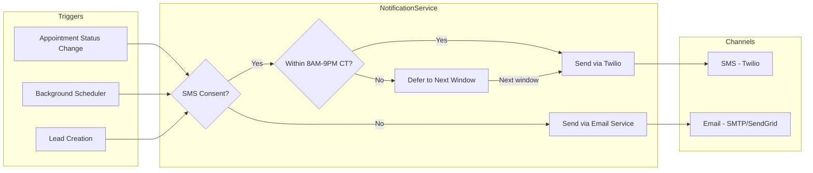

# Design Document — CRM Gap Closure

## Overview

This design covers all 78 requirements identified in the CRM Gap Closure spec, addressing every NOT DONE, PARTIAL, and UNABLE TO VERIFY item from the gap analysis. The design spans: data cleanup, authentication hardening, dashboard enhancements, customer management improvements, leads pipeline overhaul, work request consolidation, jobs UI changes, schedule/staff workflow features, invoice improvements, new Sales/Accounting/Marketing dashboards, AI integrations, campaign management, security hardening, and comprehensive E2E testing.

**Environment Constraint:** ALL implementation work occurs exclusively on the `dev` branch and in the development environment. No changes to the `main` branch or production deployment until the full spec is implemented, all tests pass, and explicit Admin approval is given to merge. The `main` branch remains untouched throughout.

**Preservation Constraint:** The service agreement flow (models, services, routes, frontend components for `ServiceAgreement`, `ServiceAgreementTier`, `AgreementJob`, Stripe checkout/webhook, onboarding consent, job generation) is OFF-LIMITS. All new work must preserve this pipeline exactly as-is.

**Architecture Approach:** Vertical Slice Architecture (VSA). Each major feature area gets its own slice with routes, service, repository, models, schemas, and tests. Cross-cutting concerns (security middleware, PII masking, rate limiting) live in `core/`.

**Stack:** Python 3.11+ / FastAPI / SQLAlchemy 2.0 (async) / PostgreSQL 15+ / Redis 7+ (backend); React 19 / TypeScript 5.9 / Vite 7 / TanStack Query v5 / Tailwind 4 / Radix UI + shadcn (frontend).

---

## Architecture

### High-Level System Architecture

```mermaid
graph TB
    subgraph Frontend["Frontend (React 19 + Vite)"]
        Nav[Sidebar Navigation]
        Dashboard[Dashboard Page]
        Customers[Customers Feature]
        Leads[Leads Feature]
        Jobs[Jobs Feature]
        Schedule[Schedule Feature]
        Invoices[Invoices Feature]
        Sales[Sales Dashboard]
        Accounting[Accounting Dashboard]
        Marketing[Marketing Dashboard]
        Comms[Communications Queue]
        Portal[Customer Portal - Public]
        Chat[Public Chat Widget]
    end

    subgraph Backend["Backend (FastAPI)"]
        subgraph Middleware["Middleware Layer"]
            RateLimit[Rate Limiter - Redis]
            SecHeaders[Security Headers]
            CSRF[CSRF Protection]
            ReqSize[Request Size Limiter]
            PIIMask[PII Log Masking]
        end

        subgraph API["API Layer (v1)"]
            DashAPI[Dashboard API]
            CustAPI[Customer API]
            LeadAPI[Lead API]
            JobAPI[Job API]
            SchedAPI[Schedule/Appointment API]
            InvAPI[Invoice API]
            EstAPI[Estimate API]
            SalesAPI[Sales API]
            AcctAPI[Accounting API]
            MktAPI[Marketing API]
            CommsAPI[Communications API]
            PortalAPI[Portal API - Public]
            ChatAPI[Chat API - Public]
            VoiceAPI[Voice Webhook API]
            AuditAPI[Audit Log API]
            MediaAPI[Media Library API]
            AnalyticsAPI[Analytics API]
            NotifAPI[Notification API]
        end

        subgraph Services["Service Layer"]
            DashSvc[Dashboard Service]
            CustSvc[Customer Service]
            LeadSvc[Lead Service]
            JobSvc[Job Service]
            ApptSvc[Appointment Service]
            InvSvc[Invoice Service]
            EstSvc[Estimate Service]
            SalesSvc[Sales Service]
            AcctSvc[Accounting Service]
            CampSvc[Campaign Service]
            CommsSvc[Communication Service]
            PhotoSvc[Photo Service]
            NotifSvc[Notification Service]
            AuditSvc[Audit Service]
            StaffTimeSvc[Staff Time Analytics]
            ChatSvc[AI Chat Service]
        end

        subgraph Background["Background Jobs"]
            DayOfReminder[Day-Of Reminders - 7AM CT]
            InvReminder[Invoice Reminders - Daily]
            EstFollowUp[Estimate Follow-Ups - Hourly]
            EstAutoRoute[Estimate Auto-Route - Hourly]
            CampaignSend[Campaign Sender]
            TxnSync[Transaction Sync - Daily]
            DelayCheck[Delay Checker - Every 15min]
        end
    end

    subgraph External["External Services"]
        Stripe[Stripe - Payments]
        Twilio[Twilio - SMS]
        GMaps[Google Maps API]
        OpenAI[OpenAI GPT-4o-mini]
        S3[S3-Compatible Storage]
        Plaid[Plaid - Banking]
        VoiceAI[Voice AI - Vapi]
    end

    subgraph Data["Data Layer"]
        PG[(PostgreSQL 15+)]
        Redis[(Redis 7+)]
    end

    Frontend --> API
    API --> Services
    Services --> PG
    Services --> Redis
    Services --> External
    Background --> Services
```



### Backend Module Organization

New feature slices follow VSA. Each new domain gets:

```
src/grins_platform/
├── api/v1/
│   ├── communications.py      # Req 4
│   ├── estimates.py            # Req 16, 17, 32, 48
│   ├── sales.py                # Req 47
│   ├── accounting.py           # Req 52, 53, 59, 60, 61, 62
│   ├── marketing.py            # Req 45, 58, 63, 64, 65
│   ├── portal.py               # Req 16, 78
│   ├── chat.py                 # Req 43
│   ├── voice.py                # Req 44
│   ├── media.py                # Req 49
│   ├── audit.py                # Req 74
│   ├── analytics.py            # Req 37
│   └── notifications.py        # Req 39
├── models/
│   ├── communication.py        # Req 4
│   ├── customer_photo.py       # Req 9
│   ├── lead_attachment.py      # Req 15
│   ├── estimate_template.py    # Req 17
│   ├── contract_template.py    # Req 17
│   ├── estimate.py             # Req 48
│   ├── estimate_follow_up.py   # Req 51
│   ├── expense.py              # Req 53
│   ├── campaign.py             # Req 45
│   ├── campaign_recipient.py   # Req 45
│   ├── marketing_budget.py     # Req 64
│   ├── media_library.py        # Req 49
│   ├── staff_break.py          # Req 42
│   ├── audit_log.py            # Req 74
│   └── enums.py                # Extended with new enums
├── schemas/
│   ├── communication.py
│   ├── estimate.py
│   ├── expense.py
│   ├── campaign.py
│   ├── media.py
│   ├── sales.py
│   ├── accounting.py
│   ├── marketing.py
│   ├── portal.py
│   ├── audit.py
│   └── analytics.py
├── services/
│   ├── communication_service.py
│   ├── estimate_service.py
│   ├── photo_service.py
│   ├── notification_service.py
│   ├── campaign_service.py
│   ├── sales_service.py
│   ├── accounting_service.py
│   ├── marketing_service.py
│   ├── audit_service.py
│   ├── chat_service.py
│   ├── media_service.py
│   └── pii_masking.py
├── repositories/
│   ├── communication_repository.py
│   ├── estimate_repository.py
│   ├── expense_repository.py
│   ├── campaign_repository.py
│   ├── media_repository.py
│   ├── audit_log_repository.py
│   └── marketing_budget_repository.py
├── middleware/
│   ├── rate_limit.py           # Req 69
│   ├── security_headers.py     # Req 70
│   └── request_size.py         # Req 73
└── migrations/versions/
    ├── xxx_remove_seed_data.py          # Req 1
    ├── xxx_add_communication_table.py   # Req 4
    ├── xxx_add_customer_photos.py       # Req 9
    ├── xxx_add_lead_address_fields.py   # Req 12
    ├── xxx_add_lead_action_tags.py      # Req 13
    ├── xxx_add_lead_attachments.py      # Req 15
    ├── xxx_add_estimate_templates.py    # Req 17
    ├── xxx_add_job_notes_summary.py     # Req 20
    ├── xxx_add_appointment_enroute.py   # Req 35
    ├── xxx_add_appointment_enrichment.py # Req 40
    ├── xxx_add_staff_breaks.py          # Req 42
    ├── xxx_add_estimates_table.py       # Req 48
    ├── xxx_add_estimate_followups.py    # Req 51
    ├── xxx_add_expenses_table.py        # Req 53
    ├── xxx_add_invoice_reminder_fields.py # Req 54
    ├── xxx_add_campaigns_table.py       # Req 45
    ├── xxx_add_marketing_budgets.py     # Req 64
    ├── xxx_add_media_library.py         # Req 49
    ├── xxx_add_audit_log.py             # Req 74
    ├── xxx_migrate_work_requests.py     # Req 19
    ├── xxx_fix_appointment_status_enum.py # Req 79: add pending, no_show to AppointmentStatus CHECK
    ├── xxx_add_invoice_document_url.py  # Req 80: add document_url to invoices
    ├── xxx_fix_sent_message_constraints.py # Req 81: nullable customer_id, add lead_id, update message_type CHECK
    ├── xxx_add_invoice_portal_token.py  # Req 84: add invoice_token, invoice_token_expires_at to invoices
    └── xxx_add_business_settings.py     # Req 87: create business_settings table with seed defaults
```

### Frontend Module Organization

```
frontend/src/
├── features/
│   ├── dashboard/              # Enhanced: Req 3, 4, 5, 6
│   │   ├── components/
│   │   │   ├── AlertCard.tsx           # Clickable alerts with navigation
│   │   │   ├── MessagesWidget.tsx      # Unaddressed message count
│   │   │   ├── InvoiceMetricsWidget.tsx # Pending invoices from real data
│   │   │   └── JobStatusGrid.tsx       # 6-category job status
│   │   └── hooks/
│   ├── customers/              # Enhanced: Req 7, 8, 9, 10, 11
│   │   ├── components/
│   │   │   ├── DuplicateReview.tsx     # Duplicate detection + merge
│   │   │   ├── InternalNotes.tsx       # Editable notes
│   │   │   ├── PhotoGallery.tsx        # Photo upload/view/delete
│   │   │   ├── InvoiceHistory.tsx      # Invoice tab
│   │   │   ├── ServicePreferences.tsx  # Preferred times editor
│   │   │   └── PaymentMethods.tsx      # Stripe saved cards
│   │   └── hooks/
│   ├── leads/                  # Enhanced: Req 12, 13, 14, 15, 18, 19
│   │   ├── components/
│   │   │   ├── LeadTagBadges.tsx       # Color-coded action tags
│   │   │   ├── BulkOutreach.tsx        # Multi-select + template send
│   │   │   ├── AttachmentPanel.tsx     # File upload/download
│   │   │   ├── EstimateCreator.tsx     # Template-based estimate form
│   │   │   └── ContractCreator.tsx     # Template-based contract form
│   │   └── hooks/
│   ├── jobs/                   # Enhanced: Req 20, 21, 22, 23
│   │   ├── components/
│   │   │   ├── JobListColumns.tsx      # New columns: Customer, Tags, Days Waiting, Due By
│   │   │   ├── SimplifiedStatusFilter.tsx
│   │   │   └── JobFinancials.tsx       # Per-job financial view
│   │   └── hooks/
│   ├── schedule/               # Enhanced: Req 24-37, 39-42
│   │   ├── components/
│   │   │   ├── DragDropCalendar.tsx    # FullCalendar with drag-drop
│   │   │   ├── LeadTimeIndicator.tsx   # Booking lead time display
│   │   │   ├── JobSelector.tsx         # Filtered job multi-select
│   │   │   ├── InlineCustomerPanel.tsx # Slide-over customer/job info
│   │   │   ├── StaffWorkflowButtons.tsx # On My Way / Started / Complete
│   │   │   ├── PaymentCollector.tsx    # On-site payment form
│   │   │   ├── InvoiceCreator.tsx      # On-site invoice creation
│   │   │   ├── EstimateCreator.tsx     # On-site estimate creation
│   │   │   ├── AppointmentNotes.tsx    # Notes + photo upload
│   │   │   ├── ReviewRequest.tsx       # Google review button
│   │   │   ├── StaffLocationMap.tsx    # GPS tracking overlay
│   │   │   ├── BreakButton.tsx         # Staff break management
│   │   │   └── AppointmentDetail.tsx   # Enriched appointment view
│   │   └── hooks/
│   ├── invoices/               # Enhanced: Req 38
│   │   ├── components/
│   │   │   └── BulkNotify.tsx          # Multi-select + notify type
│   │   └── hooks/
│   ├── sales/                  # NEW: Req 47, 48, 49, 50, 51
│   │   ├── components/
│   │   │   ├── SalesDashboard.tsx      # Pipeline sections
│   │   │   ├── EstimateBuilder.tsx     # Multi-tier estimate builder
│   │   │   ├── MediaLibrary.tsx        # Photo/video/testimonial browser
│   │   │   ├── DiagramBuilder.tsx      # Canvas drawing tool
│   │   │   └── FollowUpQueue.tsx       # Scheduled follow-ups
│   │   ├── hooks/
│   │   └── api/
│   ├── accounting/             # NEW: Req 52, 53, 54, 55, 56, 57, 59, 60, 61, 62
│   │   ├── components/
│   │   │   ├── AccountingDashboard.tsx # Revenue, profit, pending/past-due
│   │   │   ├── ExpenseTracker.tsx      # CRUD with receipt upload
│   │   │   ├── SpendingChart.tsx       # Category breakdown
│   │   │   ├── TaxPreparation.tsx      # Tax category totals
│   │   │   ├── TaxProjection.tsx       # What-if tool
│   │   │   ├── ReceiptCapture.tsx      # Photo + OCR amount
│   │   │   ├── ConnectedAccounts.tsx   # Plaid integration
│   │   │   └── AuditLog.tsx            # Admin action log
│   │   ├── hooks/
│   │   └── api/
│   ├── marketing/              # NEW: Req 45, 58, 63, 64, 65
│   │   ├── components/
│   │   │   ├── MarketingDashboard.tsx  # Lead source analytics
│   │   │   ├── CampaignManager.tsx     # Create/schedule/send campaigns
│   │   │   ├── BudgetTracker.tsx       # Budget vs actual chart
│   │   │   ├── QRCodeGenerator.tsx     # QR code creation
│   │   │   ├── CACChart.tsx            # Customer acquisition cost
│   │   │   └── ConversionFunnel.tsx    # Lead conversion visualization
│   │   ├── hooks/
│   │   └── api/
│   ├── communications/         # NEW: Req 4, 82
│   │   ├── components/
│   │   │   ├── CommunicationsQueue.tsx # Unaddressed message list
│   │   │   └── SentMessagesLog.tsx     # Outbound notification history (Req 82)
│   │   ├── hooks/
│   │   └── api/
│   ├── estimates/              # NEW: Req 83
│   │   ├── components/
│   │   │   ├── EstimateDetail.tsx      # Admin-side estimate detail + activity timeline
│   │   │   └── EstimateList.tsx        # Filtered estimate list (from pipeline cards)
│   │   ├── hooks/
│   │   └── api/
│   ├── settings/               # ENHANCED: Req 87
│   │   ├── components/
│   │   │   ├── BusinessInfo.tsx        # Company name, address, phone, logo upload
│   │   │   ├── InvoiceDefaults.tsx     # Payment terms, late fees, lien days
│   │   │   ├── NotificationPrefs.tsx   # Reminder times, time windows, toggles
│   │   │   └── EstimateDefaults.tsx    # Valid days, follow-up intervals, auto toggle
│   │   ├── hooks/
│   │   └── api/
│   └── portal/                 # NEW: Req 16, 78, 84 (public, no auth)
│       ├── components/
│       │   ├── EstimateReview.tsx       # Customer estimate view
│       │   ├── ContractSigning.tsx      # Electronic signature
│       │   ├── ApprovalConfirmation.tsx
│       │   └── InvoicePortal.tsx        # Customer invoice view + Pay Now (Req 84)
│       └── api/
├── pages/
│   ├── Sales.tsx               # NEW
│   ├── Accounting.tsx          # NEW
│   ├── Marketing.tsx           # NEW
│   ├── Communications.tsx      # NEW
│   └── EstimateDetail.tsx      # NEW (Req 83)
└── core/
    ├── router/
    │   └── index.tsx               # Updated with new routes (Req 66, 83, 84)
    └── api/
        └── client.ts               # Updated with 429 interceptor (Req 85)
```

---

## Components and Interfaces

### API Endpoints Summary

#### Dashboard (Enhanced — Req 3, 4, 5, 6)
| Method | Path | Description |
|--------|------|-------------|
| GET | `/api/v1/communications/unaddressed-count` | Unaddressed message count (Req 4) |
| GET | `/api/v1/invoices/metrics/pending` | Pending invoice count + total (Req 5) |
| GET | `/api/v1/jobs/metrics/by-status` | 6-category job status counts (Req 6) |

#### Customer (Enhanced — Req 7, 8, 9, 10, 11, 56)
| Method | Path | Description |
|--------|------|-------------|
| GET | `/api/v1/customers/duplicates` | Potential duplicate groups (Req 7) |
| POST | `/api/v1/customers/merge` | Merge duplicate customers (Req 7) |
| POST | `/api/v1/customers/{id}/photos` | Upload customer photos (Req 9) |
| GET | `/api/v1/customers/{id}/photos` | List customer photos (Req 9) |
| DELETE | `/api/v1/customers/{id}/photos/{photo_id}` | Delete photo (Req 9) |
| GET | `/api/v1/customers/{id}/invoices` | Customer invoice history (Req 10) |
| GET | `/api/v1/customers/{id}/payment-methods` | Stripe saved cards (Req 56) |
| POST | `/api/v1/customers/{id}/charge` | Charge saved card (Req 56) |

#### Lead (Enhanced — Req 12, 13, 14, 15, 18, 19, 46)
| Method | Path | Description |
|--------|------|-------------|
| POST | `/api/v1/leads/bulk-outreach` | Bulk SMS/email outreach (Req 14) |
| POST | `/api/v1/leads/{id}/attachments` | Upload attachment (Req 15) |
| GET | `/api/v1/leads/{id}/attachments` | List attachments (Req 15) |
| DELETE | `/api/v1/leads/{id}/attachments/{att_id}` | Delete attachment (Req 15) |

#### Estimate (New — Req 16, 17, 32, 48, 51)
| Method | Path | Description |
|--------|------|-------------|
| CRUD | `/api/v1/estimates` | Estimate CRUD (Req 48) |
| POST | `/api/v1/estimates/{id}/send` | Send estimate to customer (Req 48) |
| CRUD | `/api/v1/templates/estimates` | Estimate template CRUD (Req 17) |
| CRUD | `/api/v1/templates/contracts` | Contract template CRUD (Req 17) |

#### Portal (Public — Req 16, 78, 84)
| Method | Path | Description |
|--------|------|-------------|
| GET | `/api/v1/portal/estimates/{token}` | View estimate (public) |
| POST | `/api/v1/portal/estimates/{token}/approve` | Approve estimate (public) |
| POST | `/api/v1/portal/estimates/{token}/reject` | Reject estimate (public) |
| POST | `/api/v1/portal/contracts/{token}/sign` | Sign contract (public) |
| GET | `/api/v1/portal/invoices/{token}` | View invoice (public, Req 84) |

#### Schedule/Appointment (Enhanced — Req 24, 25, 26, 29, 30, 31, 32, 33, 34, 35, 37, 39, 40, 42)
| Method | Path | Description |
|--------|------|-------------|
| PATCH | `/api/v1/appointments/{id}` | Reschedule via drag-drop (Req 24) |
| GET | `/api/v1/schedule/lead-time` | Booking lead time (Req 25) |
| POST | `/api/v1/appointments/{id}/collect-payment` | On-site payment (Req 30) |
| POST | `/api/v1/appointments/{id}/create-invoice` | On-site invoice (Req 31) |
| POST | `/api/v1/appointments/{id}/create-estimate` | On-site estimate (Req 32) |
| POST | `/api/v1/appointments/{id}/photos` | Staff photo upload (Req 33) |
| POST | `/api/v1/appointments/{id}/request-review` | Google review SMS (Req 34) |
| POST | `/api/v1/staff/{id}/location` | GPS location update (Req 41) |
| GET | `/api/v1/staff/locations` | All staff locations (Req 41) |
| POST | `/api/v1/staff/{id}/breaks` | Start break (Req 42) |
| PATCH | `/api/v1/staff/{id}/breaks/{break_id}` | End break (Req 42) |
| GET | `/api/v1/analytics/staff-time` | Staff time analytics (Req 37) |
| POST | `/api/v1/notifications/appointment/{id}/day-of` | Day-of reminder trigger (Req 39) |

#### Sales (New — Req 47)
| Method | Path | Description |
|--------|------|-------------|
| GET | `/api/v1/sales/metrics` | Sales pipeline metrics |

#### Accounting (New — Req 52, 53, 57, 59, 60, 61, 62)
| Method | Path | Description |
|--------|------|-------------|
| GET | `/api/v1/accounting/summary` | YTD revenue/expenses/profit (Req 52) |
| CRUD | `/api/v1/expenses` | Expense CRUD (Req 53) |
| GET | `/api/v1/expenses/by-category` | Spending by category (Req 53) |
| GET | `/api/v1/jobs/{id}/financials` | Per-job financials (Req 57) |
| GET | `/api/v1/jobs/{id}/costs` | Per-job expenses (Req 53) |
| GET | `/api/v1/accounting/tax-summary` | Tax category totals (Req 59) |
| GET | `/api/v1/accounting/tax-estimate` | Estimated tax due (Req 61) |
| POST | `/api/v1/accounting/tax-projection` | What-if projection (Req 61) |
| POST | `/api/v1/accounting/connect-account` | Plaid Link initiation (Req 62) |

#### Marketing (New — Req 45, 58, 63, 64, 65)
| Method | Path | Description |
|--------|------|-------------|
| CRUD | `/api/v1/campaigns` | Campaign CRUD (Req 45) |
| POST | `/api/v1/campaigns/{id}/send` | Send campaign (Req 45) |
| GET | `/api/v1/campaigns/{id}/stats` | Campaign delivery stats (Req 45) |
| GET | `/api/v1/marketing/lead-analytics` | Lead source analytics (Req 63) |
| GET | `/api/v1/marketing/cac` | Customer acquisition cost (Req 58) |
| CRUD | `/api/v1/marketing/budgets` | Marketing budget CRUD (Req 64) |
| POST | `/api/v1/marketing/qr-codes` | Generate QR code (Req 65) |

#### Communications (New — Req 4, 82)
| Method | Path | Description |
|--------|------|-------------|
| GET | `/api/v1/communications` | List inbound communications |
| PATCH | `/api/v1/communications/{id}/address` | Mark as addressed |
| GET | `/api/v1/sent-messages` | Paginated outbound notification history with filters (Req 82) |
| GET | `/api/v1/customers/{id}/sent-messages` | Outbound messages for a specific customer (Req 82) |

#### Estimates (New — Req 83)
| Method | Path | Description |
|--------|------|-------------|
| GET | `/api/v1/estimates/{id}` | Estimate detail with activity timeline (Req 83) |
| GET | `/api/v1/estimates` | Filtered estimate list for pipeline views (Req 83) |

#### Settings (Enhanced — Req 87)
| Method | Path | Description |
|--------|------|-------------|
| GET | `/api/v1/settings` | List all business settings (Req 87) |
| PATCH | `/api/v1/settings/{key}` | Update a specific setting (Req 87) |

#### AI/Chat (New — Req 43, 44)
| Method | Path | Description |
|--------|------|-------------|
| POST | `/api/v1/chat/public` | Public AI chatbot (Req 43) |
| POST | `/api/v1/voice/webhook` | Voice AI webhook (Req 44) |

#### Media (New — Req 49)
| Method | Path | Description |
|--------|------|-------------|
| CRUD | `/api/v1/media` | Media library CRUD |

#### Audit (New — Req 74)
| Method | Path | Description |
|--------|------|-------------|
| GET | `/api/v1/audit-log` | Paginated audit log |

#### Invoice (Enhanced — Req 38, 54, 55, 80)
| Method | Path | Description |
|--------|------|-------------|
| POST | `/api/v1/invoices/bulk-notify` | Bulk notification (Req 38) |
| POST | `/api/v1/invoices/{id}/generate-pdf` | Generate PDF, store in S3, set document_url (Req 80) |
| GET | `/api/v1/invoices/{id}/pdf` | Return pre-signed download URL for invoice PDF (Req 80) |


---

## Data Models

### New Tables

#### Communication (Req 4)
```python
class Communication(Base):
    __tablename__ = "communications"
    id: Mapped[uuid.UUID] = mapped_column(primary_key=True, default=uuid.uuid4)
    customer_id: Mapped[uuid.UUID] = mapped_column(ForeignKey("customers.id"))
    channel: Mapped[str]          # SMS, EMAIL, PHONE
    direction: Mapped[str]        # INBOUND, OUTBOUND
    content: Mapped[str]
    addressed: Mapped[bool] = mapped_column(default=False)
    addressed_at: Mapped[Optional[datetime]]
    addressed_by: Mapped[Optional[uuid.UUID]] = mapped_column(ForeignKey("staff.id"))
    created_at: Mapped[datetime] = mapped_column(default=func.now())
```

#### CustomerPhoto (Req 9)
```python
class CustomerPhoto(Base):
    __tablename__ = "customer_photos"
    id: Mapped[uuid.UUID] = mapped_column(primary_key=True, default=uuid.uuid4)
    customer_id: Mapped[uuid.UUID] = mapped_column(ForeignKey("customers.id"))
    file_key: Mapped[str]         # S3 object key
    file_name: Mapped[str]
    file_size: Mapped[int]
    content_type: Mapped[str]
    caption: Mapped[Optional[str]]
    uploaded_by: Mapped[Optional[uuid.UUID]] = mapped_column(ForeignKey("staff.id"))
    appointment_id: Mapped[Optional[uuid.UUID]] = mapped_column(ForeignKey("appointments.id"))  # Req 33
    created_at: Mapped[datetime] = mapped_column(default=func.now())
```

#### LeadAttachment (Req 15)
```python
class LeadAttachment(Base):
    __tablename__ = "lead_attachments"
    id: Mapped[uuid.UUID] = mapped_column(primary_key=True, default=uuid.uuid4)
    lead_id: Mapped[uuid.UUID] = mapped_column(ForeignKey("leads.id"))
    file_key: Mapped[str]
    file_name: Mapped[str]
    file_size: Mapped[int]
    content_type: Mapped[str]
    attachment_type: Mapped[str]  # ESTIMATE, CONTRACT, OTHER
    created_at: Mapped[datetime] = mapped_column(default=func.now())
```

#### EstimateTemplate (Req 17)
```python
class EstimateTemplate(Base):
    __tablename__ = "estimate_templates"
    id: Mapped[uuid.UUID] = mapped_column(primary_key=True, default=uuid.uuid4)
    name: Mapped[str]
    description: Mapped[Optional[str]]
    line_items: Mapped[dict] = mapped_column(JSONB)  # [{item, description, unit_price, quantity}]
    terms: Mapped[Optional[str]]
    is_active: Mapped[bool] = mapped_column(default=True)
    created_at: Mapped[datetime] = mapped_column(default=func.now())
    updated_at: Mapped[datetime] = mapped_column(default=func.now(), onupdate=func.now())
```

#### ContractTemplate (Req 17)
```python
class ContractTemplate(Base):
    __tablename__ = "contract_templates"
    id: Mapped[uuid.UUID] = mapped_column(primary_key=True, default=uuid.uuid4)
    name: Mapped[str]
    body: Mapped[str]             # Supports template variables
    terms_and_conditions: Mapped[Optional[str]]
    is_active: Mapped[bool] = mapped_column(default=True)
    created_at: Mapped[datetime] = mapped_column(default=func.now())
    updated_at: Mapped[datetime] = mapped_column(default=func.now(), onupdate=func.now())
```

#### Estimate (Req 48)
```python
class Estimate(Base):
    __tablename__ = "estimates"
    id: Mapped[uuid.UUID] = mapped_column(primary_key=True, default=uuid.uuid4)
    lead_id: Mapped[Optional[uuid.UUID]] = mapped_column(ForeignKey("leads.id"))
    customer_id: Mapped[Optional[uuid.UUID]] = mapped_column(ForeignKey("customers.id"))
    job_id: Mapped[Optional[uuid.UUID]] = mapped_column(ForeignKey("jobs.id"))
    template_id: Mapped[Optional[uuid.UUID]] = mapped_column(ForeignKey("estimate_templates.id"))
    status: Mapped[str]           # DRAFT, SENT, VIEWED, APPROVED, REJECTED, EXPIRED
    line_items: Mapped[dict] = mapped_column(JSONB)
    options: Mapped[Optional[dict]] = mapped_column(JSONB)  # Good/Better/Best tiers
    subtotal: Mapped[Decimal]
    tax_amount: Mapped[Decimal]
    discount_amount: Mapped[Decimal] = mapped_column(default=Decimal("0"))
    total: Mapped[Decimal]
    promotion_code: Mapped[Optional[str]]
    valid_until: Mapped[Optional[date]]
    customer_token: Mapped[uuid.UUID] = mapped_column(default=uuid.uuid4)  # Portal access
    notes: Mapped[Optional[str]]
    created_by: Mapped[Optional[uuid.UUID]] = mapped_column(ForeignKey("staff.id"))
    approved_at: Mapped[Optional[datetime]]
    approved_ip: Mapped[Optional[str]]
    approved_user_agent: Mapped[Optional[str]]
    rejected_at: Mapped[Optional[datetime]]
    rejection_reason: Mapped[Optional[str]]
    token_expires_at: Mapped[datetime]  # Req 78: 30-day default
    token_readonly: Mapped[bool] = mapped_column(default=False)  # Req 78: after approval
    created_at: Mapped[datetime] = mapped_column(default=func.now())
    updated_at: Mapped[datetime] = mapped_column(default=func.now(), onupdate=func.now())
```

#### EstimateFollowUp (Req 51)
```python
class EstimateFollowUp(Base):
    __tablename__ = "estimate_follow_ups"
    id: Mapped[uuid.UUID] = mapped_column(primary_key=True, default=uuid.uuid4)
    estimate_id: Mapped[uuid.UUID] = mapped_column(ForeignKey("estimates.id"))
    follow_up_number: Mapped[int]
    scheduled_at: Mapped[datetime]
    sent_at: Mapped[Optional[datetime]]
    channel: Mapped[str]          # SMS, EMAIL
    message: Mapped[str]
    promotion_code: Mapped[Optional[str]]
    status: Mapped[str]           # PENDING, SENT, CANCELLED
    created_at: Mapped[datetime] = mapped_column(default=func.now())
```

#### Expense (Req 53)
```python
class Expense(Base):
    __tablename__ = "expenses"
    id: Mapped[uuid.UUID] = mapped_column(primary_key=True, default=uuid.uuid4)
    category: Mapped[str]         # MATERIALS, FUEL, MAINTENANCE, LABOR, MARKETING, etc.
    description: Mapped[str]
    amount: Mapped[Decimal] = mapped_column(Numeric(10, 2))
    date: Mapped[date]
    job_id: Mapped[Optional[uuid.UUID]] = mapped_column(ForeignKey("jobs.id"))
    staff_id: Mapped[Optional[uuid.UUID]] = mapped_column(ForeignKey("staff.id"))
    vendor: Mapped[Optional[str]]
    receipt_file_key: Mapped[Optional[str]]  # S3 key
    receipt_amount_extracted: Mapped[Optional[Decimal]]  # Req 60: OCR amount
    lead_source: Mapped[Optional[str]]  # Req 58: for marketing expense attribution
    notes: Mapped[Optional[str]]
    created_by: Mapped[Optional[uuid.UUID]] = mapped_column(ForeignKey("staff.id"))
    created_at: Mapped[datetime] = mapped_column(default=func.now())
    updated_at: Mapped[datetime] = mapped_column(default=func.now(), onupdate=func.now())
```

#### Campaign (Req 45)
```python
class Campaign(Base):
    __tablename__ = "campaigns"
    id: Mapped[uuid.UUID] = mapped_column(primary_key=True, default=uuid.uuid4)
    name: Mapped[str]
    campaign_type: Mapped[str]    # EMAIL, SMS, BOTH
    status: Mapped[str]           # DRAFT, SCHEDULED, SENDING, SENT, CANCELLED
    subject: Mapped[Optional[str]]
    body: Mapped[str]
    template_id: Mapped[Optional[uuid.UUID]]
    target_audience: Mapped[dict] = mapped_column(JSONB)  # Filter criteria
    scheduled_at: Mapped[Optional[datetime]]
    sent_at: Mapped[Optional[datetime]]
    automation_rule: Mapped[Optional[dict]] = mapped_column(JSONB)  # Recurring trigger config
    created_by: Mapped[Optional[uuid.UUID]] = mapped_column(ForeignKey("staff.id"))
    created_at: Mapped[datetime] = mapped_column(default=func.now())
    updated_at: Mapped[datetime] = mapped_column(default=func.now(), onupdate=func.now())

class CampaignRecipient(Base):
    __tablename__ = "campaign_recipients"
    id: Mapped[uuid.UUID] = mapped_column(primary_key=True, default=uuid.uuid4)
    campaign_id: Mapped[uuid.UUID] = mapped_column(ForeignKey("campaigns.id"))
    customer_id: Mapped[uuid.UUID] = mapped_column(ForeignKey("customers.id"))
    channel: Mapped[str]          # EMAIL, SMS
    status: Mapped[str]           # PENDING, SENT, DELIVERED, FAILED, BOUNCED, OPTED_OUT
    sent_at: Mapped[Optional[datetime]]
    error_message: Mapped[Optional[str]]
```

#### MarketingBudget (Req 64)
```python
class MarketingBudget(Base):
    __tablename__ = "marketing_budgets"
    id: Mapped[uuid.UUID] = mapped_column(primary_key=True, default=uuid.uuid4)
    channel: Mapped[str]          # "Google Ads", "Facebook", "Flyers", etc.
    budget_amount: Mapped[Decimal] = mapped_column(Numeric(10, 2))
    period_start: Mapped[date]
    period_end: Mapped[date]
    actual_spend: Mapped[Decimal] = mapped_column(Numeric(10, 2), default=Decimal("0"))
    notes: Mapped[Optional[str]]
    created_at: Mapped[datetime] = mapped_column(default=func.now())
    updated_at: Mapped[datetime] = mapped_column(default=func.now(), onupdate=func.now())
```

#### MediaLibrary (Req 49)
```python
class MediaLibraryItem(Base):
    __tablename__ = "media_library"
    id: Mapped[uuid.UUID] = mapped_column(primary_key=True, default=uuid.uuid4)
    file_key: Mapped[str]
    file_name: Mapped[str]
    file_size: Mapped[int]
    content_type: Mapped[str]
    media_type: Mapped[str]       # PHOTO, VIDEO, TESTIMONIAL
    category: Mapped[Optional[str]]  # "spring_startup", "installation", etc.
    caption: Mapped[Optional[str]]
    is_public: Mapped[bool] = mapped_column(default=False)
    uploaded_by: Mapped[Optional[uuid.UUID]] = mapped_column(ForeignKey("staff.id"))
    created_at: Mapped[datetime] = mapped_column(default=func.now())
```

#### StaffBreak (Req 42)
```python
class StaffBreak(Base):
    __tablename__ = "staff_breaks"
    id: Mapped[uuid.UUID] = mapped_column(primary_key=True, default=uuid.uuid4)
    staff_id: Mapped[uuid.UUID] = mapped_column(ForeignKey("staff.id"))
    appointment_id: Mapped[Optional[uuid.UUID]] = mapped_column(ForeignKey("appointments.id"))
    start_time: Mapped[datetime]
    end_time: Mapped[Optional[datetime]]
    break_type: Mapped[str]       # LUNCH, GAS, PERSONAL, OTHER
    created_at: Mapped[datetime] = mapped_column(default=func.now())
```

#### AuditLog (Req 74)
```python
class AuditLog(Base):
    __tablename__ = "audit_log"
    id: Mapped[uuid.UUID] = mapped_column(primary_key=True, default=uuid.uuid4)
    actor_id: Mapped[Optional[uuid.UUID]] = mapped_column(ForeignKey("staff.id"))
    actor_role: Mapped[Optional[str]]
    action: Mapped[str]           # "customer.merge", "invoice.bulk_notify", etc.
    resource_type: Mapped[str]
    resource_id: Mapped[Optional[uuid.UUID]]
    details: Mapped[Optional[dict]] = mapped_column(JSONB)
    ip_address: Mapped[Optional[str]]
    user_agent: Mapped[Optional[str]]
    created_at: Mapped[datetime] = mapped_column(default=func.now())
```

### Modified Existing Tables

#### Lead Model (Req 12, 13, 19)
New columns:
- `city: Mapped[Optional[str]]` — display in list view
- `state: Mapped[Optional[str]]`
- `address: Mapped[Optional[str]]` — full street address
- `action_tags: Mapped[Optional[list]] = mapped_column(JSONB, default=[])` — NEEDS_CONTACT, NEEDS_ESTIMATE, ESTIMATE_PENDING, ESTIMATE_APPROVED, ESTIMATE_REJECTED

#### Job Model (Req 20)
New columns:
- `notes: Mapped[Optional[str]]` — persistent job notes
- `summary: Mapped[Optional[str]] = mapped_column(String(255))` — visible in list view

#### Appointment Model (Req 35, 40, 79)
New columns:
- `en_route_at: Mapped[Optional[datetime]]` — "On My Way" timestamp
- `materials_needed: Mapped[Optional[str]]` — equipment/materials list
- `estimated_duration_minutes: Mapped[Optional[int]]`

New enum values in AppointmentStatus:
- `EN_ROUTE = "en_route"` — between CONFIRMED and IN_PROGRESS (Req 35)
- `NO_SHOW = "no_show"` — terminal state for missed appointments (Req 79)
- `PENDING = "pending"` — initial state before confirmation (Req 79)

**Migration note:** The DB CHECK constraint on `appointments.status` must be updated to include all 8 values: pending, scheduled, confirmed, en_route, in_progress, completed, cancelled, no_show. This fixes a live bug where the frontend `markNoShow()` function sends `no_show` status which fails the current CHECK constraint.

#### Invoice Model (Req 54, 80)
New columns:
- `pre_due_reminder_sent_at: Mapped[Optional[datetime]]`
- `last_past_due_reminder_at: Mapped[Optional[datetime]]`
- `document_url: Mapped[Optional[str]] = mapped_column(String(500))` — S3 key for generated PDF (Req 80)

#### SentMessage Model (Req 46, 81)
Changes:
- `customer_id: Mapped[Optional[uuid.UUID]]` — **CHANGED from NOT NULL to nullable** (Req 81). Required so that SMS records can be stored for leads who haven't been converted to customers yet.
- `lead_id: Mapped[Optional[uuid.UUID]] = mapped_column(ForeignKey("leads.id"))` — SMS logging for unconverted leads (Req 46)
- **New CHECK constraint:** `CHECK (customer_id IS NOT NULL OR lead_id IS NOT NULL)` — at least one recipient must be specified (Req 81)
- **Updated message_type CHECK constraint:** Add `lead_confirmation`, `estimate_sent`, `contract_sent`, `review_request`, `campaign` to the allowed values list (Req 81)

### New Enum Values

```python
# enums.py additions

class CommunicationChannel(str, Enum):
    SMS = "sms"
    EMAIL = "email"
    PHONE = "phone"

class CommunicationDirection(str, Enum):
    INBOUND = "inbound"
    OUTBOUND = "outbound"

class AttachmentType(str, Enum):
    ESTIMATE = "estimate"
    CONTRACT = "contract"
    OTHER = "other"

class EstimateStatus(str, Enum):
    DRAFT = "draft"
    SENT = "sent"
    VIEWED = "viewed"
    APPROVED = "approved"
    REJECTED = "rejected"
    EXPIRED = "expired"

class ActionTag(str, Enum):
    NEEDS_CONTACT = "needs_contact"
    NEEDS_ESTIMATE = "needs_estimate"
    ESTIMATE_PENDING = "estimate_pending"
    ESTIMATE_APPROVED = "estimate_approved"
    ESTIMATE_REJECTED = "estimate_rejected"

class ExpenseCategory(str, Enum):
    MATERIALS = "materials"
    FUEL = "fuel"
    MAINTENANCE = "maintenance"
    LABOR = "labor"
    MARKETING = "marketing"
    INSURANCE = "insurance"
    EQUIPMENT = "equipment"
    OFFICE = "office"
    SUBCONTRACTING = "subcontracting"
    OTHER = "other"

class CampaignType(str, Enum):
    EMAIL = "email"
    SMS = "sms"
    BOTH = "both"

class CampaignStatus(str, Enum):
    DRAFT = "draft"
    SCHEDULED = "scheduled"
    SENDING = "sending"
    SENT = "sent"
    CANCELLED = "cancelled"

class MediaType(str, Enum):
    PHOTO = "photo"
    VIDEO = "video"
    TESTIMONIAL = "testimonial"

class BreakType(str, Enum):
    LUNCH = "lunch"
    GAS = "gas"
    PERSONAL = "personal"
    OTHER = "other"

class NotificationType(str, Enum):
    REMINDER = "reminder"
    PAST_DUE = "past_due"
    LIEN_WARNING = "lien_warning"
    UPCOMING_DUE = "upcoming_due"

class FollowUpStatus(str, Enum):
    PENDING = "pending"
    SENT = "sent"
    CANCELLED = "cancelled"
```

Updated AppointmentStatus:
```python
class AppointmentStatus(str, Enum):
    PENDING = "pending"         # NEW — Req 79: initial state before confirmation
    SCHEDULED = "scheduled"
    CONFIRMED = "confirmed"
    EN_ROUTE = "en_route"       # NEW — Req 35: "On My Way"
    IN_PROGRESS = "in_progress"
    COMPLETED = "completed"
    CANCELLED = "cancelled"
    NO_SHOW = "no_show"         # NEW — Req 79: terminal state for missed appointments
```

Updated SentMessage message_type CHECK (Req 81):
```python
# Updated CHECK constraint values for sent_messages.message_type
VALID_MESSAGE_TYPES = [
    'appointment_confirmation', 'appointment_reminder', 'on_the_way',
    'arrival', 'completion', 'invoice', 'payment_reminder', 'custom',
    'lead_confirmation',    # NEW — Req 81: SMS to leads on form submission
    'estimate_sent',        # NEW — Req 81: estimate delivery notification
    'contract_sent',        # NEW — Req 81: contract delivery notification
    'review_request',       # NEW — Req 81: Google review solicitation
    'campaign',             # NEW — Req 81: marketing campaign messages
]
```

### Background Jobs (scheduler.py additions)

| Job Name | Schedule | Description | Req |
|----------|----------|-------------|-----|
| `send_day_of_reminders` | Daily 7:00 AM CT | Send appointment reminders for today's appointments | 39 |
| `send_invoice_reminders` | Daily 8:00 AM CT | Pre-due (3 days), past-due (weekly), lien (30 days) | 54, 55 |
| `check_estimate_approvals` | Hourly | Route unapproved estimates >4hrs to leads pipeline | 32 |
| `process_estimate_follow_ups` | Hourly | Send scheduled follow-up notifications | 51 |
| `check_appointment_delays` | Every 15 min | Detect appointments running >15min past scheduled end | 39 |
| `send_scheduled_campaigns` | Every 5 min | Send campaigns with scheduled_at in the past | 45 |
| `process_automation_rules` | Daily 6:00 AM CT | Evaluate recurring campaign automation rules | 45 |
| `sync_transactions` | Daily 2:00 AM CT | Fetch new transactions from Plaid-connected accounts | 62 |

All background jobs use the existing `scheduler.py` APScheduler integration. Each job logs start/completion with structured logging events.

---

### Key Service Design Decisions

**Req 1 — Seed Data Removal:** Reversible Alembic migration that DELETEs records matching seed data IDs. The seed migration files are renamed with `.disabled` suffix rather than deleted, preserving history.

**Req 2 — Token Refresh:** The existing `auth_service.py` already has refresh logic. Enhancement: frontend Axios interceptor catches 401, attempts `POST /auth/refresh` with httpOnly cookie, retries original request on success. On refresh failure, redirect to `/login` with `?reason=session_expired`.

**Req 7 — Duplicate Detection:** Uses PostgreSQL `similarity()` function (pg_trgm extension) for name matching with threshold 0.7, plus exact match on phone/email. Merge operation runs in a single transaction: UPDATE all FK references on related tables → soft-delete duplicates.

**Req 19 — Work Request Consolidation:** Data migration maps GoogleSheetSubmission fields to Lead fields. The Google Sheets poller service is updated to call `LeadService.create()` instead of creating GoogleSheetSubmission records. Frontend `/work-requests` route redirects to `/leads`.

**Req 21 — Job Status Simplification:** Frontend-only mapping. The backend enum stays unchanged for backward compatibility. A utility function maps raw statuses to simplified labels: `{requested, approved} → "To Be Scheduled"`, `{scheduled, in_progress} → "In Progress"`, `{completed, closed} → "Complete"`.

**Req 35 — Staff Workflow:** Strict state machine: `confirmed → en_route → in_progress → completed`. Each transition records a timestamp. The `en_route` status is added to AppointmentStatus enum via migration.

**Req 36 — Payment Gate:** Before allowing `in_progress → completed` transition, the service checks for linked Invoice with status ≠ DRAFT or a payment record. Admin override via `ALLOW_COMPLETION_WITHOUT_PAYMENT` config flag.

**Req 39 — Customer Notifications:** All notifications are consent-gated (SMS requires `sms_consent=True`). Email is always sent as fallback. Google Maps ETA is fetched via Directions API when "On My Way" is clicked.

**Req 43 — AI Chatbot:** Uses OpenAI GPT-4o-mini with a system prompt containing Grins Irrigation service info, pricing, and FAQs. Session state stored in Redis with 30-minute TTL. Human escalation detected via keyword matching ("speak to a person", "real person", "human").

**Req 56 — Customer Credit on File:** Leverages existing `stripe_customer_id` from service-package-purchases. No modification to agreement flow — only reads the Stripe customer ID to list payment methods and create PaymentIntents.

**Req 62 — Banking Integration:** Plaid Link flow: frontend opens Plaid Link → receives `public_token` → sends to backend → backend exchanges for `access_token` → stores encrypted. Daily sync job fetches transactions and auto-categorizes by MCC code.

**Req 68 — Agreement Flow Preservation:** All new migrations use nullable columns or defaults. No existing service code paths are modified. A dedicated regression test suite runs before and after each major feature implementation.

**Req 71 — Secure Token Storage:** JWT moves from localStorage to httpOnly cookies. Backend `Set-Cookie` with `HttpOnly; Secure; SameSite=Lax`. Frontend API client uses `credentials: 'include'`. CSRF middleware continues to protect state-changing requests.

**Req 76 — PII Masking:** A structlog processor is added globally that scans log event dicts for keys matching PII patterns (phone, email, address) and masks values: `phone=***1234`, `email=j***@example.com`.

**Req 77 — Secure File Upload:** All uploads validated by magic bytes (python-magic library). EXIF stripped via Pillow. S3 keys are UUID-based. Pre-signed URLs expire in 1 hour. Per-customer storage quota tracked via SUM of file_size on related photo/attachment tables.

---

## Service Layer Design

This section details the key service classes, their method signatures, business rules, and cross-service interactions.

### CustomerService (Enhanced — Req 7, 8, 9, 10, 11, 56)

```python
class CustomerService(LoggerMixin):
    DOMAIN = "customer"

    async def find_duplicates(self, db: AsyncSession) -> list[DuplicateGroup]:
        """Req 7: Find potential duplicate customers by phone, email, or similar name.
        Uses pg_trgm similarity() with threshold 0.7 for name matching.
        Returns groups of 2+ customers that may be duplicates."""

    async def merge_customers(
        self, db: AsyncSession, primary_id: UUID, duplicate_ids: list[UUID],
        actor_id: UUID, ip_address: str
    ) -> Customer:
        """Req 7: Merge duplicates into primary. Single transaction:
        1. UPDATE all FK refs (jobs, invoices, leads, agreements, communications) to primary_id
        2. Merge internal_notes with timestamps
        3. Soft-delete duplicate records (is_active=False)
        4. Create AuditLog entry
        Raises: CustomerNotFoundError, MergeConflictError"""

    async def update_internal_notes(self, db: AsyncSession, customer_id: UUID, notes: str) -> Customer:
        """Req 8: Update internal_notes field via PATCH."""

    async def update_preferred_service_times(
        self, db: AsyncSession, customer_id: UUID, preferences: ServiceTimePreferences
    ) -> Customer:
        """Req 11: Update preferred_service_times JSONB field."""

    async def get_customer_invoices(
        self, db: AsyncSession, customer_id: UUID, page: int, page_size: int
    ) -> PaginatedResponse[InvoiceResponse]:
        """Req 10: Paginated invoice history for a customer, sorted by date desc."""

    async def get_payment_methods(self, customer_id: UUID) -> list[PaymentMethodResponse]:
        """Req 56: List Stripe saved payment methods via stripe_customer_id."""

    async def charge_customer(
        self, db: AsyncSession, customer_id: UUID, amount: Decimal,
        description: str, invoice_id: UUID | None
    ) -> ChargeResponse:
        """Req 56: Create Stripe PaymentIntent using default payment method on file.
        Logs: customer.charge.attempted, customer.charge.succeeded/failed"""
```

### LeadService (Enhanced — Req 12, 13, 14, 15, 18, 19, 46)

```python
class LeadService(LoggerMixin):
    DOMAIN = "lead"

    async def create_lead(self, db: AsyncSession, data: LeadCreate) -> Lead:
        """Req 12, 13, 46: Create lead with address fields, auto-assign NEEDS_CONTACT tag.
        If sms_consent=True, trigger SMS confirmation via NotificationService.
        If only zip_code provided, auto-populate city/state via zip lookup."""

    async def update_action_tags(
        self, db: AsyncSession, lead_id: UUID, add_tags: list[ActionTag],
        remove_tags: list[ActionTag]
    ) -> Lead:
        """Req 13: Atomic tag update on JSONB action_tags field."""

    async def mark_contacted(self, db: AsyncSession, lead_id: UUID) -> Lead:
        """Req 13: Remove NEEDS_CONTACT, update contacted_at timestamp."""

    async def bulk_outreach(
        self, db: AsyncSession, lead_ids: list[UUID], template: str, channel: str
    ) -> BulkOutreachSummary:
        """Req 14: Send SMS/email to multiple leads. Skip non-consented.
        Returns: {sent_count, skipped_count, failed_count}
        Logs: lead.outreach.sent / lead.outreach.skipped per lead."""

    async def create_lead_from_estimate(
        self, db: AsyncSession, customer_id: UUID, estimate_id: UUID
    ) -> Lead:
        """Req 18: Reverse flow — create/reactivate lead with ESTIMATE_PENDING tag
        when an estimate requires customer approval."""

    async def migrate_work_requests(self, db: AsyncSession) -> MigrationSummary:
        """Req 19: One-time migration of GoogleSheetSubmission → Lead records.
        Maps all fields, preserves timestamps, sets intake_tag."""
```

### EstimateService (New — Req 16, 17, 32, 48, 51)

```python
class EstimateService(LoggerMixin):
    DOMAIN = "estimate"

    async def create_estimate(
        self, db: AsyncSession, data: EstimateCreate, created_by: UUID
    ) -> Estimate:
        """Req 48: Create estimate with line items, optional tiers (Good/Better/Best),
        promotional discount. Calculates subtotal, tax, discount, total.
        Generates customer_token (UUID v4) and sets token_expires_at (30 days)."""

    async def create_from_template(
        self, db: AsyncSession, template_id: UUID, overrides: dict
    ) -> Estimate:
        """Req 17: Clone template line_items, apply overrides, create estimate."""

    async def send_estimate(
        self, db: AsyncSession, estimate_id: UUID
    ) -> Estimate:
        """Req 48: Set status=SENT, send portal link via SMS (if consented) + email.
        Schedule follow-ups at Day 3, 7, 14, 21 (Req 51)."""

    async def approve_via_portal(
        self, db: AsyncSession, token: UUID, ip: str, user_agent: str
    ) -> Estimate:
        """Req 16: Customer approval. Records timestamp, IP, user_agent.
        Sets token_readonly=True. Updates lead tag to ESTIMATE_APPROVED.
        Cancels remaining follow-ups. Creates Job if needed (Req 18)."""

    async def reject_via_portal(
        self, db: AsyncSession, token: UUID, reason: str | None
    ) -> Estimate:
        """Req 16: Customer rejection. Cancels follow-ups."""

    async def check_unapproved_estimates(self, db: AsyncSession) -> int:
        """Req 32: Background job — find estimates >4hrs old without approval,
        create leads with ESTIMATE_PENDING tag. Returns count routed."""

    async def process_follow_ups(self, db: AsyncSession) -> int:
        """Req 51: Background job — send due follow-ups, return count sent."""

    async def apply_promotion(
        self, db: AsyncSession, estimate_id: UUID, code: str
    ) -> Estimate:
        """Req 48: Validate promotion code, calculate discounted total."""
```

### AppointmentService (Enhanced — Req 24, 29, 30, 31, 32, 33, 34, 35, 36, 37, 39, 40, 42)

```python
class AppointmentService(LoggerMixin):
    DOMAIN = "appointment"

    async def reschedule(
        self, db: AsyncSession, appointment_id: UUID, new_start: datetime, new_end: datetime
    ) -> Appointment:
        """Req 24: Drag-drop reschedule. Validates no staff conflict.
        Raises: StaffConflictError if overlapping appointment exists."""

    async def transition_status(
        self, db: AsyncSession, appointment_id: UUID, new_status: AppointmentStatus,
        actor_id: UUID
    ) -> Appointment:
        """Req 35: Strict state machine: confirmed→en_route→in_progress→completed.
        Records timestamps: en_route_at, arrived_at, completed_at.
        Req 36: Blocks completed transition if no payment/invoice exists (unless admin override).
        Req 39: Triggers notifications on each transition via NotificationService.
        Raises: InvalidTransitionError, PaymentRequiredError"""

    async def collect_payment(
        self, db: AsyncSession, appointment_id: UUID, payment: PaymentCollectionRequest
    ) -> PaymentResult:
        """Req 30: Create/update invoice with payment. Supports: card, cash, check, venmo, zelle.
        Logs: appointment.payment.collected"""

    async def create_invoice_from_appointment(
        self, db: AsyncSession, appointment_id: UUID
    ) -> Invoice:
        """Req 31: Pre-populate invoice from job/customer data. Generate Stripe payment link.
        Send via SMS + email. Logs: invoice.from_appointment.created"""

    async def create_estimate_from_appointment(
        self, db: AsyncSession, appointment_id: UUID, data: EstimateCreate
    ) -> Estimate:
        """Req 32: Delegate to EstimateService. Link estimate to appointment's job/customer."""

    async def add_notes_and_photos(
        self, db: AsyncSession, appointment_id: UUID, notes: str | None,
        photos: list[UploadFile]
    ) -> Appointment:
        """Req 33: Save notes to appointment AND append to customer.internal_notes.
        Upload photos linked to both appointment and customer."""

    async def request_google_review(
        self, db: AsyncSession, appointment_id: UUID
    ) -> bool:
        """Req 34: Send Google review link via SMS. Gated on consent + 30-day dedup.
        Logs: appointment.review_request.sent"""

    async def calculate_lead_time(self, db: AsyncSession) -> LeadTimeResponse:
        """Req 25: Calculate earliest available slot based on staff availability,
        existing appointments, and max appointments per day per staff."""

    async def get_staff_time_analytics(
        self, db: AsyncSession, date_range: DateRange
    ) -> list[StaffTimeAnalytics]:
        """Req 37: Average travel_time, job_duration, total_time by staff and job_type.
        Flag staff exceeding 1.5x average."""
```

### CampaignService (New — Req 45)

```python
class CampaignService(LoggerMixin):
    DOMAIN = "campaign"

    async def create_campaign(self, db: AsyncSession, data: CampaignCreate) -> Campaign:
        """Create campaign in DRAFT status."""

    async def send_campaign(self, db: AsyncSession, campaign_id: UUID) -> CampaignSendResult:
        """Req 45: Filter recipients by target_audience criteria.
        Skip non-consented (SMS) and opted-out (email).
        Enqueue as background job. CAN-SPAM: include address + unsubscribe link.
        Returns: {total_recipients, sent, skipped}"""

    async def get_campaign_stats(self, db: AsyncSession, campaign_id: UUID) -> CampaignStats:
        """Req 45: Delivery metrics from campaign_recipients table."""

    async def evaluate_automation_rules(self, db: AsyncSession) -> int:
        """Req 45: Daily job — evaluate recurring triggers (e.g., 'no appointment in 90 days').
        Create and send campaigns matching rules. Returns count triggered."""
```

### AccountingService (New — Req 52, 53, 57, 59, 60, 61, 62)

```python
class AccountingService(LoggerMixin):
    DOMAIN = "accounting"

    async def get_summary(
        self, db: AsyncSession, date_range: DateRange
    ) -> AccountingSummary:
        """Req 52: YTD revenue (paid invoices), expenses, profit, pending/past-due totals."""

    async def get_expenses_by_category(
        self, db: AsyncSession, date_range: DateRange
    ) -> list[CategoryTotal]:
        """Req 53: Aggregate expenses by category for date range."""

    async def get_job_financials(self, db: AsyncSession, job_id: UUID) -> JobFinancials:
        """Req 57: quoted_amount, final_amount, total_paid, material_costs, labor_costs,
        total_costs, profit, profit_margin."""

    async def get_tax_summary(self, db: AsyncSession, tax_year: int) -> TaxSummary:
        """Req 59: Expense totals by tax category + revenue by job type. CSV exportable."""

    async def get_tax_estimate(self, db: AsyncSession) -> TaxEstimate:
        """Req 61: estimated_tax_due based on revenue - deductions * effective_tax_rate."""

    async def project_tax(
        self, db: AsyncSession, hypothetical: TaxProjectionRequest
    ) -> TaxProjectionResponse:
        """Req 61: What-if tool — add hypothetical revenue/expenses, recalculate."""

    async def extract_receipt(self, file: UploadFile) -> ReceiptExtraction:
        """Req 60: Send image to OpenAI Vision API, extract amount/vendor/category."""

    async def sync_transactions(self, db: AsyncSession) -> int:
        """Req 62: Plaid daily sync — fetch transactions, auto-categorize by MCC, create expenses."""
```

### MarketingService (New — Req 58, 63, 64, 65)

```python
class MarketingService(LoggerMixin):
    DOMAIN = "marketing"

    async def get_lead_analytics(
        self, db: AsyncSession, date_range: DateRange
    ) -> LeadAnalytics:
        """Req 63: Lead counts by source, conversion funnel (Total→Contacted→Qualified→Converted),
        conversion rates, avg time to conversion, top source, trend over time."""

    async def get_cac(self, db: AsyncSession, date_range: DateRange) -> list[CACBySource]:
        """Req 58: CAC per lead source = marketing_spend / converted_customers."""

    async def generate_qr_code(
        self, target_url: str, campaign_name: str
    ) -> bytes:
        """Req 65: Generate QR code PNG with UTM params appended:
        utm_source=qr_code, utm_campaign={name}, utm_medium=print."""
```

### NotificationService (New — Req 39, 46, 54, 55)

```python
class NotificationService(LoggerMixin):
    DOMAIN = "notification"

    async def send_day_of_reminders(self, db: AsyncSession) -> int:
        """Req 39: Daily 7AM CT — send reminders for today's appointments.
        SMS (if consented) + email. Returns count sent."""

    async def send_on_my_way(
        self, db: AsyncSession, appointment_id: UUID
    ) -> None:
        """Req 39: Send staff name + Google Maps ETA to customer."""

    async def send_arrival_notification(
        self, db: AsyncSession, appointment_id: UUID
    ) -> None:
        """Req 39: Confirm technician has arrived."""

    async def send_delay_notification(
        self, db: AsyncSession, appointment_id: UUID, new_eta: datetime
    ) -> None:
        """Req 39: Appointment running >15min past scheduled end."""

    async def send_completion_notification(
        self, db: AsyncSession, appointment_id: UUID
    ) -> None:
        """Req 39: Job summary + receipt/invoice link + Google review link."""

    async def send_invoice_reminders(self, db: AsyncSession) -> InvoiceReminderSummary:
        """Req 54, 55: Daily job — pre-due (3 days), past-due (weekly), lien (30 days).
        Returns: {pre_due_sent, past_due_sent, lien_sent}"""

    async def send_lead_confirmation_sms(
        self, db: AsyncSession, lead_id: UUID
    ) -> bool:
        """Req 46: SMS confirmation for new lead submissions.
        Gated on sms_consent + time window (8AM-9PM CT). Defers if outside window."""
```

### InvoicePDFService (New — Req 80)

```python
class InvoicePDFService(LoggerMixin):
    DOMAIN = "invoice_pdf"

    async def generate_pdf(self, db: AsyncSession, invoice_id: UUID) -> str:
        """Req 80: Generate a professional PDF for the invoice using WeasyPrint.
        Renders HTML template with invoice data (line items, customer info, company branding),
        converts to PDF, uploads to S3 at `invoices/{invoice_id}.pdf`,
        updates invoice.document_url, returns pre-signed download URL.
        Logs: invoice.pdf.generated"""

    async def get_pdf_url(self, db: AsyncSession, invoice_id: UUID) -> str:
        """Req 80: Return a pre-signed S3 download URL (1hr expiry) for an existing invoice PDF.
        If document_url is null, raises InvoicePDFNotFoundError."""
```

### PhotoService (Enhanced — Req 9, 33, 49, 77)

```python
class PhotoService(LoggerMixin):
    DOMAIN = "file"

    async def upload_customer_photo(
        self, db: AsyncSession, customer_id: UUID, file: UploadFile,
        caption: str | None, uploaded_by: UUID | None, appointment_id: UUID | None
    ) -> CustomerPhoto:
        """Req 9, 33: Validate magic bytes, strip EXIF, generate UUID S3 key,
        check per-customer quota (500MB), upload to S3.
        Logs: customer.photo.uploaded"""

    async def list_customer_photos(
        self, db: AsyncSession, customer_id: UUID, page: int, page_size: int
    ) -> PaginatedResponse[PhotoResponse]:
        """Req 9: Return photo metadata with pre-signed download URLs (1hr expiry)."""

    async def delete_customer_photo(
        self, db: AsyncSession, customer_id: UUID, photo_id: UUID
    ) -> None:
        """Req 9: Delete DB record + S3 object. Logs: customer.photo.deleted"""

    async def upload_lead_attachment(
        self, db: AsyncSession, lead_id: UUID, file: UploadFile,
        attachment_type: AttachmentType
    ) -> LeadAttachment:
        """Req 15: Validate file type (PDF, DOCX, JPEG, PNG, max 25MB).
        Store with UUID S3 key."""
```

### AuditService (New — Req 74)

```python
class AuditService(LoggerMixin):
    DOMAIN = "audit"

    async def log_action(
        self, db: AsyncSession, actor_id: UUID, actor_role: str,
        action: str, resource_type: str, resource_id: UUID | None,
        details: dict | None, ip_address: str, user_agent: str
    ) -> AuditLog:
        """Req 74: Create audit log entry. Called by other services for auditable actions."""

    async def get_audit_log(
        self, db: AsyncSession, filters: AuditLogFilters, page: int, page_size: int
    ) -> PaginatedResponse[AuditLogResponse]:
        """Req 74: Paginated, filterable audit log (action, actor, resource_type, date range)."""
```

### ChatService (New — Req 43)

```python
class ChatService(LoggerMixin):
    DOMAIN = "chat"

    async def handle_public_message(
        self, session_id: str, message: str
    ) -> ChatResponse:
        """Req 43: Send message to GPT-4o-mini with Grins Irrigation context.
        Session state in Redis (30min TTL).
        Detect human escalation keywords → create Communication record + Lead.
        Collect name/phone before escalation."""
```

### Cross-Service Interaction Patterns

Services that need to coordinate share a single `AsyncSession` for transactional consistency:

```python
# Example: Estimate approval triggers lead update + job creation
class EstimateService:
    async def approve_via_portal(self, db: AsyncSession, token: UUID, ...):
        estimate = await self.repo.get_by_token(db, token)
        estimate.status = EstimateStatus.APPROVED
        # Cross-service: update lead tag
        if estimate.lead_id:
            await self.lead_service.update_action_tags(
                db, estimate.lead_id,
                add_tags=[ActionTag.ESTIMATE_APPROVED],
                remove_tags=[ActionTag.ESTIMATE_PENDING]
            )
        # Cross-service: create job from approved estimate
        job = await self.job_service.create_from_estimate(db, estimate)
        # Cross-service: cancel follow-ups
        await self.follow_up_repo.cancel_pending(db, estimate.id)
        # Cross-service: audit log
        await self.audit_service.log_action(db, ...)
        await db.commit()
```

---

## Frontend Component Design

### Dashboard Enhancements (Req 3, 4, 5, 6)

**AlertCard** — Clickable card that navigates to target page with query params. Uses `useNavigate()` with `?status={status}&highlight={id}`. Target pages parse URL params via `useSearchParams()` and apply filters + 3-second highlight animation (CSS `@keyframes highlight-fade`).

**MessagesWidget** — Fetches `GET /communications/unaddressed-count`. Displays count badge. Click navigates to `/communications`.

**InvoiceMetricsWidget** — Fetches `GET /invoices/metrics/pending`. Displays count + total amount. Replaces old job-status-based calculation.

**JobStatusGrid** — Fetches `GET /jobs/metrics/by-status`. Renders 6 cards: New Requests, Estimates, Pending Approval, To Be Scheduled, In Progress, Complete. Each card is clickable → navigates to `/jobs?status={status}`.

### Customer Detail Tabs (Req 7, 8, 9, 10, 11, 56)

The Customer Detail page uses a tabbed layout (Radix Tabs):
- **Overview** — Existing fields + editable `internal_notes` textarea (Req 8) + `preferred_service_times` editor (Req 11)
- **Photos** — Grid gallery with upload dropzone, caption editing, delete. Uses `useCustomerPhotos()` hook (Req 9)
- **Invoice History** — DataTable with invoice_number, date, total, status badge, days_until_due. Uses `useCustomerInvoices()` hook (Req 10)
- **Payment Methods** — Lists Stripe saved cards with last4/brand. "Charge" button opens amount/description dialog (Req 56)
- **Potential Duplicates** — Shown conditionally when duplicates detected. Side-by-side comparison with "Merge" button (Req 7)

### Leads Pipeline (Req 12, 13, 14, 15, 18, 19)

**LeadTagBadges** — Color-coded badges: NEEDS_CONTACT (red), NEEDS_ESTIMATE (orange), ESTIMATE_PENDING (yellow), ESTIMATE_APPROVED (green), ESTIMATE_REJECTED (gray).

**BulkOutreach** — Checkbox column + "Bulk Outreach" toolbar button. Opens modal with template selector and channel choice. Displays summary after send.

**AttachmentPanel** — Grouped by type (Estimates, Contracts, Other). Upload dropzone + download links (pre-signed URLs). Delete with confirmation.

**EstimateCreator / ContractCreator** — Template selector dropdown → pre-populated form → line item editor → send to customer.

### Jobs List (Req 20, 21, 22, 23)

Column configuration:
| Column | Source | Notes |
|--------|--------|-------|
| Customer | `job.customer.full_name` | Linked to customer detail |
| Tags | `job.customer.tags` | Color-coded badges |
| Summary | `job.summary` | New field (Req 20) |
| Status | Simplified label | Mapped from raw enum (Req 21) |
| Days Waiting | `now() - job.created_at` | Calculated client-side (Req 22) |
| Due By | `job.target_end_date` | Amber <7 days, Red if past (Req 23) |

Removed: Category column (Req 22).

### Schedule & Staff Workflow (Req 24-37, 39-42)

**DragDropCalendar** — FullCalendar with `editable: true`. `eventDrop` handler calls `PATCH /appointments/{id}`. On conflict (409), reverts position + error toast. Event labels: `"{Staff Name} - {Job Type}"` (Req 28). Color by status.

**LeadTimeIndicator** — Badge in schedule header: "Booked out {N} days/weeks". Fetches `GET /schedule/lead-time`.

**JobSelector** — Modal with filterable DataTable of unscheduled jobs. Filters: city/zip, job type, customer name. Multi-select checkboxes. "Add to Schedule" creates appointments for each.

**InlineCustomerPanel** — Radix Sheet (slide-over from right). Shows customer name, phone, email, address, preferred times, internal notes, job details. "View Full Details" link. URL does NOT change.

**StaffWorkflowButtons** — Three sequential buttons rendered based on current status:
- `confirmed` → Show "On My Way" (blue)
- `en_route` → Show "Job Started" (orange)
- `in_progress` → Show "Job Complete" (green, disabled if no payment/invoice per Req 36)

Each click calls `PATCH /appointments/{id}/status` and triggers corresponding notification.

**PaymentCollector** — Form with method selector (Credit Card, Cash, Check, Venmo, Zelle, Send Invoice). Amount input. Reference number for non-card methods. Calls `POST /appointments/{id}/collect-payment`.

**AppointmentDetail** — Enriched view (Req 40): customer info, job type, location with Google Maps link, materials needed, estimated duration, customer history summary, special notes. "Get Directions" button opens `https://maps.google.com/?daddr={address}`.

**StaffLocationMap** — Google Maps embed with staff pins. Fetches `GET /staff/locations` every 30 seconds. Pin tooltip: staff name, current appointment, time elapsed.

**BreakButton** — "Take Break" with type selector (Lunch, Gas, Personal, Other). Creates blocked calendar slot. Adjusts subsequent appointment ETAs.

### Sales Dashboard (Req 47, 48, 49, 50, 51)

**SalesDashboard** — Four pipeline cards: Needs Estimate, Pending Approval, Needs Follow-Up, Revenue Pipeline. Conversion funnel chart (Recharts). Click-through to filtered lists.

**EstimateBuilder** — Multi-step form: 1) Select template or start blank, 2) Add/edit line items with material + labor costs, 3) Create Good/Better/Best tiers, 4) Apply promotional discount, 5) Preview + Send. Totals auto-calculate.

**MediaLibrary** — Grid/list toggle. Filter by category + media type. Upload with drag-drop. Attach to estimates.

**DiagramBuilder** — Excalidraw embed or custom canvas. Irrigation component icon palette. Background image import. Save as PNG to media library linked to estimate.

**FollowUpQueue** — DataTable of estimates with upcoming follow-ups. Columns: customer, estimate total, days since sent, next follow-up date, promotion attached.

### Accounting Dashboard (Req 52, 53, 54, 55, 56, 57, 59, 60, 61, 62)

**AccountingDashboard** — Top-level metrics cards: YTD Revenue, YTD Expenses, YTD Profit, Profit Margin %. Date range picker (month/quarter/custom). Sections: Pending Invoices, Past Due Invoices, Spending by Category (Recharts pie/bar), Tax Preparation, Estimated Tax Due, Connected Accounts, Audit Log.

**ExpenseTracker** — DataTable with CRUD. Create form: category dropdown, description, amount, date, vendor, job link (optional), receipt upload. Receipt upload triggers OCR extraction (Req 60) → pre-populates amount/vendor/category.

**TaxPreparation** — Table of tax-relevant categories with YTD totals. Revenue by job type. "Export CSV" button for accountant handoff.

**TaxProjection** — What-if form: input hypothetical revenue and expenses → see projected tax impact. Uses `POST /accounting/tax-projection`.

**ConnectedAccounts** — Plaid Link integration button. List of connected accounts with last sync timestamp. Transaction review queue for auto-imported expenses.

### Marketing Dashboard (Req 45, 58, 63, 64, 65)

**MarketingDashboard** — Lead Sources chart (Recharts bar), Conversion Funnel (stepped funnel visualization), Key Metrics cards (total leads, conversion rate, avg time to conversion, top source), Advertising Channels table, CAC by Channel chart.

**CampaignManager** — Campaign list with status badges. Create form: name, type (Email/SMS/Both), audience filter builder, body editor, schedule picker. Send button with confirmation. Stats view: sent/delivered/failed/bounced/opted_out.

**BudgetTracker** — Budget vs Actual grouped bar chart by channel. CRUD for budget entries. Auto-links marketing expenses to channels.

**QRCodeGenerator** — Form: target URL + campaign name. Preview QR code. Download PNG button. UTM params auto-appended.

### Portal Pages (Req 16, 78 — Public, No Auth)

**EstimateReview** — Clean, mobile-responsive page. Displays: company logo, estimate details, line items table, tier options (if multi-tier), total with any discount. "Approve" and "Reject" buttons. Reject shows optional reason textarea.

**ContractSigning** — Displays contract body with template variables resolved. Signature pad (canvas-based). "Sign" button records electronic signature with timestamp/IP/user-agent.

**ApprovalConfirmation** — Thank you page after approval/signing. Shows next steps. No internal IDs exposed (Req 78).

---

## Security Design (Req 69-78)

### Rate Limiting (Req 69)

Implementation: Redis-backed sliding window rate limiter using `slowapi` with custom key functions.

```python
# middleware/rate_limit.py
from slowapi import Limiter
from slowapi.util import get_remote_address

limiter = Limiter(
    key_func=get_remote_address,
    storage_uri=settings.REDIS_URL,
    strategy="moving-window"
)

# Rate limit configuration by endpoint category
RATE_LIMITS = {
    "auth_login": "5/minute",           # Per IP
    "public_lead": "10/minute",          # Per IP
    "public_chat": "10/minute",          # Per session
    "webhooks": "100/minute",            # Per IP
    "authenticated": "200/minute",       # Per user
    "file_upload": "20/minute",          # Per user
    "portal_token": "20/minute",         # Per token (Req 78)
}
```

429 responses include `Retry-After` header. All violations logged with `security.rate_limit.exceeded`.

### Security Headers (Req 70)

```python
# middleware/security_headers.py
class SecurityHeadersMiddleware:
    HEADERS = {
        "X-Content-Type-Options": "nosniff",
        "X-Frame-Options": "DENY",
        "X-XSS-Protection": "0",
        "Referrer-Policy": "strict-origin-when-cross-origin",
        "Permissions-Policy": "camera=(), microphone=(), geolocation=()",
    }
    # HSTS added only when ENVIRONMENT=production
    # CSP configurable via CSP_DIRECTIVES env var
```

### Secure Token Storage (Req 71)

Auth flow change:
1. Backend `POST /auth/login` returns `Set-Cookie: access_token=...; HttpOnly; Secure; SameSite=Lax; Path=/; Max-Age=3600`
2. Frontend API client configured with `credentials: 'include'` — no manual token header
3. On first load post-migration, frontend runs `localStorage.removeItem('auth_token')` cleanup
4. CSRF middleware remains active for all state-changing requests (POST/PUT/PATCH/DELETE)

### JWT Validation & Key Rotation (Req 72)

```python
# Startup validation in core/config.py
def validate_jwt_config(settings: Settings) -> None:
    if settings.ENVIRONMENT in ("production", "staging"):
        if settings.JWT_SECRET_KEY == "dev-secret-key-change-in-production":
            logger.critical("security.jwt.insecure_secret")
            raise SystemExit("CRITICAL: Default JWT secret in production")
        if len(settings.JWT_SECRET_KEY) < 32:
            raise SystemExit("CRITICAL: JWT secret must be ≥32 characters")

# Key rotation: accept JWT_PREVIOUS_SECRET_KEY for grace period (default 24h)
# Token verification tries current key first, falls back to previous key
# New tokens always signed with current key
```

### Request Size Limits (Req 73)

```python
# middleware/request_size.py
class RequestSizeLimitMiddleware:
    DEFAULT_MAX_SIZE = 10 * 1024 * 1024      # 10MB
    UPLOAD_MAX_SIZE = 50 * 1024 * 1024        # 50MB
    UPLOAD_PATHS = ["/photos", "/attachments", "/media", "/receipts", "/extract-receipt"]

    # Returns 413 Payload Too Large if exceeded
    # Logs: security.request.payload_too_large
```

### Admin Audit Trail (Req 74)

Auditable actions: customer merge, customer delete, bulk outreach, bulk invoice notification, staff CRUD, campaign sends, payment collection, estimate approval/rejection, schedule modifications, data exports.

The `AuditService.log_action()` is called by each service at the point of the auditable action. A FastAPI dependency extracts `ip_address` and `user_agent` from the request and passes them through.

### Input Validation & Sanitization (Req 75)

All Pydantic schemas enforce:
- `max_length` on all string fields (names ≤ 100, notes ≤ 5000, descriptions ≤ 2000)
- UUID format validation on all ID fields via `UUID` type
- File uploads: allowlist extensions, MIME type match, magic byte verification, size limits
- HTML sanitization via `bleach` library for any text rendered in portal/email templates
- All SQLAlchemy queries use ORM or parameterized queries — no raw SQL string interpolation

### PII Protection in Logs (Req 76)

```python
# Global structlog processor
PII_PATTERNS = {
    "phone": lambda v: f"***{str(v)[-4:]}" if v else None,
    "email": lambda v: f"{v[0]}***@{v.split('@')[1]}" if v and '@' in v else None,
    "address": lambda v: "***masked***" if v else None,
    "card_number": lambda v: "***REDACTED***",
    "ssn": lambda v: "***REDACTED***",
}
# Applied to: phone, phone_number, email, email_address, address, street_address,
# card_number, stripe_customer_id, jwt_token, api_key, password
```

### Secure File Upload & Storage (Req 77)

Pipeline for all file uploads:
1. **Extension check** — allowlist per endpoint (JPEG, PNG, HEIC for photos; PDF, DOCX for attachments; MP4, MOV for video)
2. **Magic byte verification** — `python-magic` library validates file content matches declared type
3. **EXIF stripping** — Pillow removes all EXIF metadata from images (prevents GPS leakage)
4. **UUID key generation** — S3 key: `{entity_type}/{entity_id}/{uuid4}.{ext}` — no original filename in URL
5. **Upload to S3** — boto3 with server-side encryption (AES-256)
6. **Quota check** — SUM(file_size) for entity must not exceed 500MB (configurable)
7. **Pre-signed URLs** — All downloads via pre-signed URLs with 1-hour expiry

### Portal Token Security (Req 78)

- Tokens: UUID v4 (128-bit entropy)
- Expiry: 30 days default, configurable via `PORTAL_TOKEN_EXPIRY_DAYS`
- Expired tokens return HTTP 410 Gone
- After approval/signing: `token_readonly=True` — read-only access for 90 days, no further modifications
- Rate limited: 20 requests/minute per token
- Portal responses exclude all internal IDs (customer_id, lead_id, staff_id)
- Logging: `portal.access.attempted` with last 8 chars of token only

---

## Integration Design

### Stripe Integration (Req 30, 31, 56)

**Existing:** Stripe checkout + webhook for service agreements (OFF-LIMITS).

**New additions (read-only from agreement flow perspective):**
- `GET /customers/{id}/payment-methods` → `stripe.PaymentMethod.list(customer=stripe_customer_id)`
- `POST /customers/{id}/charge` → `stripe.PaymentIntent.create(customer=stripe_customer_id, amount=..., payment_method=default)`
- `POST /appointments/{id}/create-invoice` → `stripe.PaymentLink.create(...)` for invoice payment links
- On-site card payments: `stripe.PaymentIntent.create()` with manual card entry (no Terminal SDK needed for MVP)

All Stripe calls wrapped in try/except with structured logging. Stripe API key from `STRIPE_SECRET_KEY` env var (existing).

### Twilio Integration (Req 14, 34, 39, 46, 54, 55)

**Existing:** SMS sending via `sms_service.py`.

**New usage patterns:**
- Bulk outreach (Req 14): batch SMS via existing `send_sms()`, with consent check per recipient
- Review requests (Req 34): single SMS with Google review URL
- Appointment notifications (Req 39): triggered by status transitions, includes Google Maps ETA
- Lead confirmation (Req 46): immediate SMS on lead creation, time-window gated (8AM-9PM CT)
- Invoice reminders (Req 54, 55): automated daily via background job

All SMS gated on `sms_consent=True`. Email always sent as fallback via existing email service.

### Google Maps Integration (Req 39, 40, 50)

- **Directions API** (Req 39): Calculate ETA from staff location to appointment address when "On My Way" clicked. Response includes `duration_in_traffic`.
- **Static Maps API** (Req 50): Satellite/aerial background for property diagram builder.
- **Maps URL** (Req 40): "Get Directions" button opens `https://www.google.com/maps/dir/?api=1&destination={encoded_address}`.

API key from `GOOGLE_MAPS_API_KEY` env var. Rate limited by Google's quotas.

### OpenAI Integration (Req 43, 60)

- **Chat API** (Req 43): GPT-4o-mini with system prompt containing Grins Irrigation context. `temperature=0.7`, `max_tokens=500`. Session history stored in Redis.
- **Vision API** (Req 60): Receipt OCR. Send image as base64, prompt: "Extract the total amount, vendor name, and suggest an expense category." Parse structured response.

API key from `OPENAI_API_KEY` env var. Both endpoints have fallback error handling — chat returns "I'm having trouble right now, please try again", OCR returns empty extraction with manual entry required.

### Plaid Integration (Req 62)

- **Link flow**: Frontend opens Plaid Link → user connects bank → receives `public_token` → sends to backend
- **Token exchange**: Backend calls `plaid.item.public_token.exchange()` → receives `access_token` → stores encrypted in DB
- **Daily sync**: Background job calls `plaid.transactions.sync()` → creates Expense records with auto-categorization by MCC code
- **MCC mapping**: Merchant Category Codes mapped to ExpenseCategory enum (e.g., 5541 → FUEL, 5211 → MATERIALS)

API keys from `PLAID_CLIENT_ID`, `PLAID_SECRET`, `PLAID_ENV` env vars.

### Voice AI Integration (Req 44)

- **Provider**: Vapi (or similar voice AI platform)
- **Webhook**: `POST /api/v1/voice/webhook` receives call transcripts and collected data
- **Lead creation**: Webhook handler extracts name, phone, service needed, callback time → creates Lead via LeadService
- **Human transfer**: Vapi configured to transfer to Admin phone number on request, or take message if unavailable

Webhook authenticated via shared secret in `VOICE_AI_WEBHOOK_SECRET` env var.

### S3-Compatible Storage (Req 9, 15, 33, 49, 53, 60, 77)

- **Provider**: Any S3-compatible service (AWS S3, MinIO for local dev, Railway object storage)
- **Bucket**: Single bucket `grins-platform-files` with prefix-based organization: `customer-photos/`, `lead-attachments/`, `media-library/`, `receipts/`
- **Access**: All via boto3 with `AWS_ACCESS_KEY_ID`, `AWS_SECRET_ACCESS_KEY`, `S3_BUCKET_NAME`, `S3_ENDPOINT_URL` env vars
- **Pre-signed URLs**: Generated server-side with 1-hour expiry for downloads

---

## Notification System Design (Req 39, 46, 54, 55)

### Notification Flow Architecture



### Notification Types and Triggers

| Type | Trigger | Channel | Template |
|------|---------|---------|----------|
| Day-of Reminder | Background job 7AM CT | SMS + Email | "Your appointment with Grins Irrigation is today at {time}. {staff_name} will be your technician." |
| On My Way | Staff clicks "On My Way" | SMS + Email | "{staff_name} is on the way! Estimated arrival: {eta}." |
| Arrival | Staff clicks "Job Started" | SMS + Email | "{staff_name} has arrived at your property." |
| Delay | Background job (15min check) | SMS + Email | "Your appointment is running a bit longer than expected. Updated completion: {new_eta}." |
| Completion | Staff clicks "Job Complete" | SMS + Email | "Your service is complete! View receipt: {invoice_link}. Leave a review: {review_link}" |
| Pre-Due Invoice | Background job (3 days before) | SMS + Email | "Invoice {number} for ${amount} is due on {date}." |
| Past-Due Invoice | Background job (weekly) | SMS + Email | "Invoice {number} for ${amount} is past due." |
| Lien Warning | Background job (30 days past due) | Email + SMS | Formal lien notice with property address and statutory deadline |
| Lead Confirmation | Lead creation event | SMS only | "Thanks for reaching out to Grins Irrigation! We received your request." |

### Consent and Time Window Rules

- SMS requires `sms_consent=True` on Customer or Lead record
- Email is always sent as fallback when SMS consent is missing
- SMS restricted to 8:00 AM – 9:00 PM Central Time
- Outside window: SMS deferred to next 8:00 AM, email sent immediately
- 30-day deduplication for Google review requests per customer

---

## Correctness Properties

*A property is a characteristic or behavior that should hold true across all valid executions of a system — essentially, a formal statement about what the system should do. Properties serve as the bridge between human-readable specifications and machine-verifiable correctness guarantees.*

### Property 1: Seed cleanup preserves non-seed records

*For any* set of customer, staff, and job records not created by seed migrations, running the cleanup migration shall leave all such records intact with unchanged field values.

**Validates: Requirements 1.4**

### Property 2: Token refresh extends session validity

*For any* valid JWT token within its validity window, calling the refresh endpoint shall return a new token with an expiry strictly later than the original token's expiry.

**Validates: Requirements 2.1**

### Property 3: Unaddressed communication count accuracy

*For any* set of communication records with varying `addressed` status, the unaddressed-count endpoint shall return a count exactly equal to the number of records where `addressed=false`.

**Validates: Requirements 4.2**

### Property 4: Communication record round-trip

*For any* valid communication data (customer_id, channel, direction, content), creating a communication record and reading it back shall return identical field values, with `addressed` defaulting to `false`.

**Validates: Requirements 4.4**

### Property 5: Pending invoice metrics correctness

*For any* set of invoices with varying statuses, the pending metrics endpoint shall return a count equal to the number of invoices with status SENT or VIEWED, and a total equal to the sum of their amounts.

**Validates: Requirements 5.1, 5.2**

### Property 6: Job status category partitioning

*For any* set of active jobs, the by-status metrics endpoint shall return counts for exactly six categories that partition all jobs — every job appears in exactly one category, and the sum of all category counts equals the total active job count.

**Validates: Requirements 6.1, 6.2**

### Property 7: Duplicate detection finds matching records

*For any* set of customers where two or more share the same phone number, email address, or have names with Levenshtein distance ≤ 2, the duplicates endpoint shall return a group containing those customers.

**Validates: Requirements 7.1**

### Property 8: Customer merge reassigns all related records

*For any* customer merge operation with a primary customer and one or more duplicates, after merge: all jobs, invoices, leads, agreements, and communications previously linked to duplicate customers shall be linked to the primary customer, and all duplicate customer records shall have `is_active=False`.

**Validates: Requirements 7.2**

### Property 9: Internal notes round-trip

*For any* valid string value saved as a customer's `internal_notes` via PATCH, reading the customer back shall return the identical string.

**Validates: Requirements 8.4**

### Property 10: Customer photo lifecycle round-trip

*For any* valid image file (JPEG/PNG/HEIC, ≤10MB), uploading it as a customer photo, then listing customer photos, shall include the uploaded photo with correct metadata. Deleting that photo and listing again shall not include it.

**Validates: Requirements 9.2, 9.3, 9.4**

### Property 11: File upload validation rejects invalid files

*For any* file with a disallowed extension, a file exceeding the size limit, or a file whose magic bytes do not match its declared content type, the upload endpoint shall reject it with a 4xx error and the file shall not be stored.

**Validates: Requirements 9.2, 15.1, 49.5, 75.3, 77.1**

### Property 12: Customer invoice history is correctly filtered and sorted

*For any* customer with invoices, the customer invoices endpoint shall return only invoices belonging to that customer, sorted by date descending.

**Validates: Requirements 10.1, 10.3**

### Property 13: Preferred service times round-trip

*For any* valid service time preference value, saving it via PATCH and reading the customer back shall return the identical preference.

**Validates: Requirements 11.1, 11.2, 11.3, 11.4**

### Property 14: Lead address fields round-trip

*For any* lead created with city, state, and address fields, reading the lead back shall return identical address values.

**Validates: Requirements 12.2**

### Property 15: Zip code auto-populates city and state

*For any* valid US zip code provided during lead creation without city/state, the created lead shall have non-empty `city` and `state` fields populated from the zip code lookup.

**Validates: Requirements 12.5**

### Property 16: Lead action tag state machine

*For any* lead, the action tag lifecycle shall follow these transitions correctly: new lead gets NEEDS_CONTACT → marking contacted removes NEEDS_CONTACT → requesting estimate adds NEEDS_ESTIMATE → providing estimate replaces with ESTIMATE_PENDING → customer approval replaces with ESTIMATE_APPROVED. At each step, only the expected tags shall be present.

**Validates: Requirements 13.2, 13.3, 13.4, 13.5, 13.6**

### Property 17: Lead tag filtering returns only matching leads

*For any* action tag filter value, the leads endpoint shall return only leads whose `action_tags` array contains that tag.

**Validates: Requirements 13.8**

### Property 18: Consent-gated bulk outreach with correct summary

*For any* set of leads with mixed SMS consent status, bulk outreach shall send only to leads with `sms_consent=True`, skip the rest, and return a summary where `sent_count + skipped_count + failed_count` equals the total number of leads in the request.

**Validates: Requirements 14.1, 14.3, 14.4**

### Property 19: Lead attachment lifecycle round-trip

*For any* valid file (PDF/DOCX/JPEG/PNG, ≤25MB), uploading it as a lead attachment, then listing attachments, shall include it with correct metadata and a valid pre-signed URL. Deleting it and listing again shall not include it.

**Validates: Requirements 15.1, 15.2, 15.3, 15.4**

### Property 20: Portal estimate access by token

*For any* valid, non-expired portal token, the estimate retrieval endpoint shall return the estimate details. For any expired token (past `token_expires_at`), the endpoint shall return HTTP 410 Gone.

**Validates: Requirements 16.1, 78.1, 78.2**

### Property 21: Estimate approval updates lead tag and invalidates token for writes

*For any* estimate approved via the portal, the linked lead's action tags shall contain ESTIMATE_APPROVED and not contain ESTIMATE_PENDING, and the token shall be set to `token_readonly=True` preventing further modifications.

**Validates: Requirements 16.2, 16.5, 78.4**

### Property 22: Estimate template round-trip

*For any* estimate template created via CRUD, reading it back shall return identical name, line_items, and terms. For any estimate created from a template with overrides, the estimate's line_items shall reflect the template values with overrides applied.

**Validates: Requirements 17.1, 17.2, 17.3, 17.4, 17.5**

### Property 23: Reverse flow — estimate requiring approval creates lead

*For any* estimate created for an existing customer that requires approval, a lead record shall exist linked to that customer with action tag ESTIMATE_PENDING. When the customer approves, the lead tag shall change to ESTIMATE_APPROVED and a Job record shall be created.

**Validates: Requirements 18.1, 18.2**

### Property 24: Work request migration preserves all data

*For any* GoogleSheetSubmission record, after migration a corresponding Lead record shall exist with all mapped fields containing equivalent values.

**Validates: Requirements 19.1, 19.5**

### Property 25: Job notes and summary round-trip

*For any* valid notes string and summary string (≤255 chars), saving them on a job via PATCH and reading back shall return identical values.

**Validates: Requirements 20.1, 20.2**

### Property 26: Job status simplification mapping

*For any* raw job status enum value, the simplification mapping shall produce exactly one of: "To Be Scheduled" (for requested, approved), "In Progress" (for scheduled, in_progress), "Complete" (for completed, closed), or "Cancelled" (for cancelled). The mapping shall be total — no status is unmapped.

**Validates: Requirements 21.1**

### Property 27: Days Waiting calculation and Due By color logic

*For any* job, "Days Waiting" shall equal the number of days between `created_at` and the current date. For the "Due By" column: if `target_end_date` is past, color is red; if within 7 days, color is amber; if null, display "No deadline"; otherwise default color.

**Validates: Requirements 22.4, 23.1, 23.2, 23.3, 23.4**

### Property 28: Appointment conflict detection on reschedule

*For any* appointment reschedule to a new time, if another appointment exists for the same staff member overlapping the new time window, the reschedule shall be rejected. If no conflict exists, it shall succeed with the updated time.

**Validates: Requirements 24.2, 24.4, 24.5**

### Property 29: Schedule lead time calculation

*For any* set of existing appointments and staff availability configurations, the lead time endpoint shall return the earliest date where at least one staff member has an available slot, accounting for working hours and max appointments per day.

**Validates: Requirements 25.2, 25.3**

### Property 30: Job filter returns only matching jobs

*For any* combination of location (city/zip) and job type filters, the job selection endpoint shall return only jobs matching all specified criteria.

**Validates: Requirements 26.2, 26.3**

### Property 31: Calendar event label format

*For any* appointment with a linked staff member and job, the calendar event label shall be formatted as "{Staff Name} - {Job Type}".

**Validates: Requirements 28.1**

### Property 32: Address auto-population from customer

*For any* appointment creation where a customer with a property address is selected, the address field shall be auto-populated with the customer's primary property address.

**Validates: Requirements 29.1**

### Property 33: Payment collection creates/updates invoice

*For any* payment collected on an appointment with a valid amount and method, the linked invoice shall be created or updated with the payment amount, method, and timestamp. The invoice total_paid shall increase by the payment amount.

**Validates: Requirements 30.3, 30.4, 30.5**

### Property 34: Invoice pre-population from appointment

*For any* appointment with a linked job and customer, creating an invoice from that appointment shall produce an invoice with customer_id, job_id, and amount matching the appointment's job data.

**Validates: Requirements 31.2, 31.4**

### Property 35: Unapproved estimate auto-routing to leads

*For any* estimate with status SENT that has been unapproved for more than 4 hours, the background job shall create a lead with action tag ESTIMATE_PENDING linked to that estimate's customer.

**Validates: Requirements 32.4, 32.7**

### Property 36: Appointment notes propagate to customer

*For any* notes saved on an appointment, the linked customer's `internal_notes` shall contain those notes with a timestamp prefix. For any photo uploaded from an appointment, it shall be linked to both the appointment_id and the customer_id.

**Validates: Requirements 33.2, 33.3**

### Property 37: Google review request consent and deduplication

*For any* review request, if the customer has `sms_consent=False`, no SMS shall be sent. If a review request was sent to the same customer within the last 30 days, the request shall be rejected.

**Validates: Requirements 34.2, 34.6**

### Property 38: Appointment status transition state machine

*For any* appointment, status transitions shall follow the strict chain: confirmed → en_route → in_progress → completed. Any transition that skips a step or goes backward shall be rejected. Each transition shall record the corresponding timestamp (en_route_at, arrived_at, completed_at).

**Validates: Requirements 35.1, 35.2, 35.3, 35.4, 35.5, 35.6**

### Property 39: Payment gate blocks completion without payment or invoice

*For any* appointment in `in_progress` status where no payment has been collected and no invoice has been sent for the linked job, transitioning to `completed` shall be rejected. If a payment or invoice exists, the transition shall succeed.

**Validates: Requirements 36.1, 36.2**

### Property 40: Staff time duration calculations

*For any* completed appointment with en_route_at, arrived_at, and completed_at timestamps, travel_time shall equal arrived_at minus en_route_at, job_duration shall equal completed_at minus arrived_at, and total_time shall equal completed_at minus en_route_at.

**Validates: Requirements 37.1**

### Property 41: Consent-gated bulk invoice notifications

*For any* set of invoices with mixed customer SMS consent, bulk notify shall send SMS only to customers with `sms_consent=True`, send email to all, and return a summary where `sent_count + skipped_count + failed_count` equals the total invoice count.

**Validates: Requirements 38.1, 38.3, 38.4**

### Property 42: All customer notifications are consent-gated

*For any* automated customer notification (day-of, on-my-way, arrival, delay, completion), SMS shall only be sent if the customer has `sms_consent=True`. Email shall always be sent as fallback regardless of SMS consent.

**Validates: Requirements 39.1, 39.2, 39.3, 39.4, 39.5, 39.8**

### Property 43: Enriched appointment response includes all required fields

*For any* appointment with a linked customer and job, the enriched response shall include: customer name, phone, email, job type, location, materials_needed, estimated_duration_minutes, and customer service history summary.

**Validates: Requirements 40.2**

### Property 44: Staff location round-trip via Redis

*For any* staff location update (latitude, longitude, timestamp), storing it and immediately retrieving it shall return the same coordinates. After the TTL (5 minutes) expires, the location shall no longer be retrievable.

**Validates: Requirements 41.1, 41.2**

### Property 45: Break adjusts subsequent appointment ETAs

*For any* staff break with a specified duration, subsequent appointments for that staff member shall have their estimated arrival windows adjusted by the break duration.

**Validates: Requirements 42.5**

### Property 46: Chat escalation detection creates lead and communication

*For any* chat message containing human escalation keywords ("speak to a person", "real person", "human"), the system shall create a Communication record flagged for admin review and respond with the escalation message. If name and phone are collected, a Lead record shall be created.

**Validates: Requirements 43.3, 43.5**

### Property 47: Voice webhook creates lead with correct source

*For any* voice webhook payload containing customer name, phone, and service needed, a Lead record shall be created with `lead_source=PHONE_CALL` and all provided fields mapped correctly.

**Validates: Requirements 44.3, 44.5**

### Property 48: Campaign recipient filtering by consent

*For any* campaign send, recipients shall be filtered by target_audience criteria. For SMS campaigns, customers without `sms_consent=True` shall be skipped. For email campaigns, customers who opted out shall be skipped. The delivery stats shall accurately reflect sent, skipped, and failed counts.

**Validates: Requirements 45.6, 45.5**

### Property 49: SMS lead confirmation is consent and time-window gated

*For any* newly created lead, if `sms_consent=True` and current time is within 8AM-9PM Central, an SMS confirmation shall be sent. If outside the time window, the SMS shall be deferred. If `sms_consent=False`, no SMS shall be sent.

**Validates: Requirements 46.1, 46.2**

### Property 50: Sales pipeline metrics accuracy

*For any* set of estimates and leads, the sales metrics endpoint shall return: estimates_needing_writeup_count equal to leads tagged NEEDS_ESTIMATE, pending_approval_count equal to estimates with status SENT older than 0 hours, and total_pipeline_revenue equal to the sum of all pending estimate totals.

**Validates: Requirements 47.2, 47.3**

### Property 51: Estimate total calculation with tiers and discounts

*For any* estimate with line items (each having quantity and unit_price), the subtotal shall equal the sum of (quantity × unit_price) for all items. With a percentage discount, total shall equal subtotal - (subtotal × discount_rate) + tax_amount. With a fixed discount, total shall equal subtotal - discount_amount + tax_amount. Total shall never be negative.

**Validates: Requirements 48.4, 48.5, 48.6, 48.7**

### Property 52: Follow-up scheduling and cancellation

*For any* sent estimate, follow-up notifications shall be scheduled at the configured intervals (Day 3, 7, 14, 21). When the customer approves or rejects the estimate, all remaining follow-ups with status PENDING shall be set to CANCELLED.

**Validates: Requirements 51.2, 51.5**

### Property 53: Accounting summary calculation correctness

*For any* set of paid invoices and expenses within a date range, YTD revenue shall equal the sum of paid invoice amounts, YTD expenses shall equal the sum of expense amounts, and YTD profit shall equal revenue minus expenses.

**Validates: Requirements 52.2, 52.5**

### Property 54: Expense category aggregation and per-job cost linkage

*For any* set of expenses with categories, the by-category endpoint shall return totals where each category total equals the sum of expense amounts in that category. For any expense linked to a job_id, it shall appear in that job's costs endpoint response.

**Validates: Requirements 53.3, 53.5**

### Property 55: Automated invoice reminder scheduling

*For any* invoice that is 3 days before due_date with no `pre_due_reminder_sent_at`, the reminder job shall send a pre-due reminder. For any invoice past due_date with `last_past_due_reminder_at` older than 7 days (or null), a past-due reminder shall be sent. For any lien-eligible invoice 30+ days past due with no lien warning sent, a lien notification shall be sent.

**Validates: Requirements 54.1, 54.2, 54.3, 55.1, 55.2**

### Property 56: Per-job financial calculations

*For any* job with linked invoices and expenses, profit shall equal total_paid minus total_costs, and profit_margin shall equal (profit / total_paid) × 100. When total_paid is zero, profit_margin shall be zero (no division by zero).

**Validates: Requirements 57.1, 57.2**

### Property 57: Customer acquisition cost calculation

*For any* lead source with marketing spend and converted customers, CAC shall equal total_marketing_spend divided by number_of_converted_customers. When converted_customers is zero, CAC shall be reported as null or infinity (no division by zero crash).

**Validates: Requirements 58.1, 58.2**

### Property 58: Tax summary aggregation by category

*For any* set of expenses within a tax year, the tax summary shall return totals per tax-relevant category where each total equals the sum of expense amounts in that category for the year.

**Validates: Requirements 59.1, 59.2**

### Property 59: Tax estimation calculation

*For any* revenue total and deduction total with a configured effective tax rate, estimated_tax_due shall equal (revenue - deductions) × effective_tax_rate. The what-if projection shall correctly add hypothetical values before recalculating.

**Validates: Requirements 61.1, 61.2, 61.3, 61.4**

### Property 60: Plaid transaction auto-categorization

*For any* Plaid transaction with a merchant category code (MCC), the auto-categorization shall map it to the correct ExpenseCategory based on the MCC mapping table (e.g., 5541 → FUEL, 5211 → MATERIALS).

**Validates: Requirements 62.4**

### Property 61: Lead source analytics and conversion funnel

*For any* set of leads with various sources and statuses, the lead analytics endpoint shall return counts by source that sum to the total lead count, and conversion rates where rate = converted / total for each funnel stage.

**Validates: Requirements 63.2, 63.3, 63.4, 63.5**

### Property 62: Marketing budget vs actual spend

*For any* marketing budget entry and linked marketing expenses, the actual_spend shall equal the sum of expense amounts with category MARKETING attributed to that budget's channel within the budget period.

**Validates: Requirements 64.3, 64.4**

### Property 63: QR code URL contains correct UTM parameters

*For any* target URL and campaign name, the generated QR code shall encode a URL containing `utm_source=qr_code`, `utm_campaign={campaign_name}`, and `utm_medium=print` as query parameters appended to the target URL.

**Validates: Requirements 65.1, 65.3**

### Property 64: Agreement flow preservation invariant

*For any* sequence of migrations and code changes in this spec, the service agreement flow shall produce identical results: tier retrieval returns correct tiers, checkout session creation succeeds, webhook processing creates agreement records, and job generation creates correctly linked jobs. No existing agreement-related model, service, or route shall be modified.

**Validates: Requirements 68.1, 68.2, 68.3, 68.4, 68.5**

### Property 65: Rate limiting enforces thresholds

*For any* API endpoint with a configured rate limit, requests exceeding the limit within the time window shall receive HTTP 429 with a `Retry-After` header. Requests within the limit shall succeed normally.

**Validates: Requirements 69.1, 69.2, 69.3**

### Property 66: Security headers present on all responses

*For any* API response, the following headers shall be present with correct values: `X-Content-Type-Options: nosniff`, `X-Frame-Options: DENY`, `X-XSS-Protection: 0`, `Referrer-Policy: strict-origin-when-cross-origin`, and `Permissions-Policy: camera=(), microphone=(), geolocation=()`.

**Validates: Requirements 70.1**

### Property 67: Secure token storage in httpOnly cookies

*For any* successful login response, the JWT token shall be set via `Set-Cookie` with `HttpOnly`, `SameSite=Lax`, and `Path=/` flags. The token shall NOT appear in the response body or be accessible via JavaScript `document.cookie` on the client.

**Validates: Requirements 71.1, 71.2**

### Property 68: JWT secret validation at startup

*For any* application startup where `ENVIRONMENT` is "production" or "staging", if `JWT_SECRET_KEY` equals the default value or is shorter than 32 characters, the application shall refuse to start. For key rotation, tokens signed with `JWT_PREVIOUS_SECRET_KEY` shall be accepted within the grace period.

**Validates: Requirements 72.1, 72.2, 72.3, 72.4**

### Property 69: Request size limit enforcement

*For any* request body exceeding 10MB on standard endpoints or 50MB on file upload endpoints, the response shall be HTTP 413 Payload Too Large. Requests within limits shall be accepted.

**Validates: Requirements 73.1, 73.2, 73.3**

### Property 70: Audit log entry creation for auditable actions

*For any* auditable action (customer merge, bulk outreach, bulk notify, campaign send, payment collection, estimate approval/rejection, schedule modification), an audit log entry shall be created with correct actor_id, action, resource_type, resource_id, and timestamp.

**Validates: Requirements 74.1, 74.2**

### Property 71: Input validation rejects oversized and malformed input

*For any* string field exceeding its configured max_length, the request shall be rejected with a validation error. For any UUID field with an invalid format, the request shall be rejected. For any HTML input containing `<script>` tags or event handlers, the sanitized output shall not contain them.

**Validates: Requirements 75.1, 75.2, 75.4, 75.5**

### Property 72: PII masking in log output

*For any* log event dict containing keys matching PII patterns (phone, email, address), the output shall contain only masked versions: phone shows last 4 digits only, email shows first character and domain only, addresses are fully masked. Full values shall never appear in log output.

**Validates: Requirements 76.1, 76.2, 76.3, 76.4**

### Property 73: EXIF stripping removes GPS data from uploaded images

*For any* uploaded image containing EXIF GPS metadata, the stored version shall have all EXIF data stripped. Reading the stored image shall return no GPS coordinates.

**Validates: Requirements 77.4**

### Property 74: Pre-signed URLs expire after configured duration

*For any* pre-signed download URL generated for a stored file, the URL shall be valid for requests made within the expiry window (1 hour default) and shall return an error for requests made after expiry.

**Validates: Requirements 77.3**

### Property 75: Portal responses exclude internal IDs

*For any* portal endpoint response (estimate review, contract signing, approval confirmation), the response body shall not contain any internal UUIDs for customer_id, lead_id, or staff_id fields.

**Validates: Requirements 78.6**

### Property 76: AppointmentStatus enum accepts all frontend values

*For any* appointment status transition including `pending`, `scheduled`, `confirmed`, `en_route`, `in_progress`, `completed`, `cancelled`, and `no_show`, the database CHECK constraint shall accept the value and the backend enum shall include it. Specifically, calling `markNoShow()` from the frontend shall successfully update the appointment status to `no_show` without a constraint violation.

**Validates: Requirements 79.1, 79.2, 79.3**

### Property 77: Invoice PDF generation round-trip

*For any* invoice with status SENT or later, generating a PDF via `POST /invoices/{id}/generate-pdf` shall produce a valid PDF file stored in S3, set the invoice's `document_url` field, and return a pre-signed download URL. Subsequent calls to `GET /invoices/{id}/pdf` shall return a valid pre-signed URL that downloads the same PDF.

**Validates: Requirements 80.1, 80.2, 80.3, 80.4**

### Property 78: SentMessage supports lead-only recipients

*For any* SMS or notification sent to a lead who has not been converted to a customer, the `sent_messages` record shall be insertable with `customer_id = NULL` and `lead_id = {lead_uuid}`. The record shall pass the CHECK constraint requiring at least one of customer_id or lead_id to be non-null. The `message_type` field shall accept `lead_confirmation` without a CHECK constraint violation.

**Validates: Requirements 81.1, 81.2, 81.3, 81.4**

### Property 79: Outbound notification history correctly filtered and paginated

*For any* set of sent_messages records, the sent-messages endpoint shall return results filtered by message_type, delivery_status, and date range, with correct pagination. Customer-specific queries shall return only messages for that customer_id.

**Validates: Requirements 82.1, 82.2, 82.3, 82.4**

### Property 80: Estimate detail includes complete activity timeline

*For any* estimate, the detail endpoint shall return the estimate data plus an ordered activity timeline containing all lifecycle events (created, sent, viewed, approved/rejected) and all follow-up notifications (with their status and timestamps), sorted chronologically.

**Validates: Requirements 83.2, 83.3**

### Property 81: Portal invoice access by token with correct data

*For any* valid invoice token, the portal endpoint shall return invoice data including line items, amounts, and payment status without exposing internal IDs. Expired tokens (>90 days) shall return 410. Tokens for fully paid invoices shall show "Paid in Full" instead of a payment link.

**Validates: Requirements 84.2, 84.4, 84.5, 84.8, 84.9**

### Property 82: 429 interceptor displays toast with retry time

*For any* HTTP 429 response received by the frontend API client, a toast notification shall be displayed containing the Retry-After value. If Retry-After is absent, the toast shall display "a moment" as the wait time.

**Validates: Requirements 85.1, 85.2**

### Property 83: Staff workflow components are mobile-usable

*For any* staff-facing component rendered at 375px viewport width, all interactive elements (buttons, inputs, upload areas) shall have a minimum touch target of 44px, no horizontal overflow shall occur, and all action buttons shall be visible without scrolling past the fold.

**Validates: Requirements 86.1, 86.2, 86.3, 86.4**

### Property 84: Business settings round-trip and service consumption

*For any* business setting updated via `PATCH /settings/{key}`, the updated value shall be returned by subsequent `GET /settings` calls. The InvoicePDFService and NotificationService shall read their respective settings from the business_settings table, not from hardcoded values.

**Validates: Requirements 87.2, 87.7, 87.8**

---

## Error Handling

### Standard Error Response Format

All API errors follow a consistent JSON structure:

```json
{
  "detail": {
    "code": "CUSTOMER_NOT_FOUND",
    "message": "Customer with the specified ID was not found.",
    "field": null
  }
}
```

### Error Categories and HTTP Status Codes

| Category | HTTP Status | Error Code Pattern | Example |
|----------|-------------|-------------------|---------|
| Validation | 400 | `INVALID_{FIELD}` | `INVALID_PHONE_FORMAT` |
| Validation | 400 | `MISSING_{FIELD}` | `MISSING_CUSTOMER_ID` |
| Authentication | 401 | `AUTH_{REASON}` | `AUTH_TOKEN_EXPIRED` |
| Authorization | 403 | `FORBIDDEN_{ACTION}` | `FORBIDDEN_ADMIN_ONLY` |
| Not Found | 404 | `{ENTITY}_NOT_FOUND` | `CUSTOMER_NOT_FOUND` |
| Conflict | 409 | `{ENTITY}_CONFLICT` | `APPOINTMENT_CONFLICT` |
| Gone | 410 | `TOKEN_EXPIRED` | Portal token expired |
| Payload Too Large | 413 | `PAYLOAD_TOO_LARGE` | Request body exceeds limit |
| Unprocessable | 422 | `{DOMAIN}_{REASON}` | `ESTIMATE_ALREADY_APPROVED` |
| Rate Limited | 429 | `RATE_LIMIT_EXCEEDED` | Too many requests |
| Server Error | 500 | `INTERNAL_ERROR` | Unexpected failure |
| External Service | 502 | `EXTERNAL_{SERVICE}_ERROR` | `EXTERNAL_STRIPE_ERROR` |

### Service-Specific Error Handling

**CustomerService:**
- `CustomerNotFoundError(404)` — customer ID not found
- `MergeConflictError(409)` — merge would create data inconsistency (e.g., merging into inactive customer)
- `StorageQuotaExceededError(400)` — photo upload exceeds 500MB per-customer quota

**EstimateService:**
- `EstimateNotFoundError(404)` — estimate ID or token not found
- `EstimateAlreadyApprovedError(422)` — attempt to approve/reject an already-decided estimate
- `TokenExpiredError(410)` — portal token past expiration
- `InvalidPromotionCodeError(400)` — promotion code not found or expired

**AppointmentService:**
- `StaffConflictError(409)` — reschedule conflicts with existing appointment
- `InvalidTransitionError(422)` — status transition violates state machine (e.g., confirmed → completed)
- `PaymentRequiredError(422)` — completion blocked due to missing payment/invoice

**CampaignService:**
- `CampaignAlreadySentError(422)` — attempt to send an already-sent campaign
- `NoRecipientsError(400)` — target audience filter matches zero customers

**AccountingService:**
- `PlaidConnectionError(502)` — Plaid API failure during token exchange or sync
- `DivisionByZeroError` — handled internally, returns null/0 for CAC/margin when denominator is zero

**PhotoService / File Uploads:**
- `InvalidFileTypeError(400)` — file extension or magic bytes mismatch
- `FileTooLargeError(400)` — individual file exceeds size limit
- `StorageQuotaExceededError(400)` — entity storage quota exceeded

### External Service Error Handling Pattern

All external service calls (Stripe, Twilio, Google Maps, OpenAI, Plaid) follow:

```python
try:
    result = await external_client.operation(...)
    self.log_completed("external_call", service="stripe", operation="create_payment_intent")
    return result
except ExternalServiceError as e:
    self.log_failed("external_call", service="stripe", error=str(e))
    # Retry logic for transient errors (network timeouts, 5xx)
    if is_retryable(e):
        return await self._retry_with_backoff(operation, max_retries=3)
    raise ServiceError(f"Stripe operation failed: {e}") from e
```

Retry policy: exponential backoff (1s, 2s, 4s) for transient errors only. Non-retryable errors (4xx from external service) propagate immediately.

### Frontend Error Handling

- **API errors**: Axios interceptor catches errors, displays toast with `error.detail.message`
- **401 responses**: Silent token refresh attempt → retry original request → redirect to login on failure
- **Network errors**: "Connection lost. Retrying..." toast with automatic retry
- **Form validation**: Zod schema validation with inline field errors via React Hook Form
- **Optimistic updates**: TanStack Query mutations with `onError` rollback

---

## Testing Strategy

### Testing Framework and Libraries

**Backend:**
- `pytest` with `pytest-asyncio` for async test support
- `hypothesis` for property-based testing (PBT)
- `pytest-mock` / `unittest.mock` for mocking
- `httpx` with `ASGITransport` for API testing
- `factory_boy` for test data generation
- Markers: `@pytest.mark.unit`, `@pytest.mark.functional`, `@pytest.mark.integration`

**Frontend:**
- `vitest` for unit and component tests
- `@testing-library/react` for component rendering
- `fast-check` for property-based testing
- `msw` (Mock Service Worker) for API mocking
- `agent-browser` for E2E tests

### Property-Based Testing Configuration

- Library: `hypothesis` (backend), `fast-check` (frontend)
- Minimum 100 iterations per property test (`@settings(max_examples=100)`)
- Each property test tagged with design document reference
- Tag format: `# Feature: crm-gap-closure, Property {N}: {title}`

### Test Tiers and Scope

**Tier 1 — Unit Tests** (`tests/unit/`, `@pytest.mark.unit`):
All dependencies mocked. Focus on:
- Service method logic (calculations, validations, state transitions)
- Pydantic schema validation (accept valid, reject invalid)
- Status mapping functions (Req 21, 23)
- Duration calculations (Req 37)
- Financial calculations (Req 52, 53, 56, 57, 58, 59, 61)
- Consent gating logic (Req 14, 38, 39, 46)
- PII masking processor (Req 76)
- Security header presence (Req 70)
- Rate limit enforcement (Req 69)
- JWT validation (Req 72)
- File validation (magic bytes, size, type) (Req 77)
- Tag state machine transitions (Req 13)
- Appointment status state machine (Req 35)
- Payment gate logic (Req 36)

**Tier 2 — Functional Tests** (`tests/functional/`, `@pytest.mark.functional`):
Real database, mocked external services. Focus on:
- Full CRUD lifecycles (estimates, expenses, campaigns, media)
- Customer merge with FK reassignment (Req 7)
- Work request migration (Req 19)
- Bulk outreach and bulk notify flows (Req 14, 38)
- Estimate → approval → job creation pipeline (Req 16, 18)
- Follow-up scheduling and cancellation (Req 51)
- Background job execution (reminders, follow-ups, campaign sends)
- Audit log creation for auditable actions (Req 74)

**Tier 3 — Integration Tests** (`tests/integration/`, `@pytest.mark.integration`):
Full system with real external service test modes. Focus on:
- Stripe payment intent creation (test mode) (Req 56)
- S3 file upload/download round-trip (Req 9, 15, 49)
- Redis location storage and TTL (Req 41)
- Agreement flow regression suite (Req 68)
- End-to-end estimate portal flow (Req 16)

**Tier 4 — E2E Tests** (`scripts/e2e-tests.sh`, agent-browser):
Full browser automation covering all critical user flows per Req 67. Each test script:
- Uses `data-testid` attributes for reliable element selection
- Includes proper wait conditions (`wait --load networkidle`)
- Takes screenshots on failure
- Cleans up test data after execution

### Property-Based Test Mapping

Each correctness property (Properties 1-75) maps to exactly one property-based test. Example:

```python
# Feature: crm-gap-closure, Property 16: Lead action tag state machine
@pytest.mark.unit
@settings(max_examples=100)
@given(st.builds(LeadCreate, name=st.text(min_size=1), phone=st.from_regex(r"\d{10}")))
def test_lead_tag_state_machine(lead_data):
    """For any lead, the action tag lifecycle shall follow correct transitions."""
    lead = lead_service.create_lead(db, lead_data)
    assert ActionTag.NEEDS_CONTACT in lead.action_tags
    lead = lead_service.mark_contacted(db, lead.id)
    assert ActionTag.NEEDS_CONTACT not in lead.action_tags
    # ... continue through lifecycle
```

```typescript
// Feature: crm-gap-closure, Property 27: Days Waiting and Due By color logic
test.prop(
  'Due By color logic is correct for all dates',
  [fc.date()],
  (targetDate) => {
    const now = new Date();
    const color = getDueByColor(targetDate, now);
    if (targetDate < now) expect(color).toBe('red');
    else if (diffDays(targetDate, now) <= 7) expect(color).toBe('amber');
    else expect(color).toBe('default');
  },
  { numRuns: 100 }
);
```

### Test Data Strategy

- **Factories**: `factory_boy` factories for all models (Customer, Lead, Job, Estimate, Expense, Campaign, etc.)
- **Hypothesis strategies**: Custom strategies for domain types (phone numbers, email addresses, valid amounts, date ranges)
- **Fixtures**: Shared pytest fixtures in `conftest.py` for DB session, test client, authenticated client, S3 mock
- **Isolation**: Each test uses database transactions that roll back after completion
- **E2E data**: Dedicated test data created via API calls at test start, cleaned up at test end

---

## Requirements Coverage Matrix

This matrix maps every requirement to its design coverage, ensuring 100% traceability.

| Req | Title | Architecture | Data Model | API Endpoints | Service Layer | Frontend | Properties | Security |
|-----|-------|-------------|------------|---------------|---------------|----------|------------|----------|
| 1 | Remove Fake/Test Data | ✅ Migration | — | — | — | — | P1 | — |
| 2 | Fix Random Logout | ✅ Auth flow | — | — | ✅ Token refresh | ✅ Interceptor | P2 | ✅ Req 71 |
| 3 | Dashboard Alert Navigation | ✅ Frontend | — | — | — | ✅ AlertCard | — | — |
| 4 | Dashboard Messages Widget | ✅ Comms slice | ✅ Communication | ✅ GET unaddressed-count | ✅ CommsSvc | ✅ MessagesWidget | P3, P4 | — |
| 5 | Dashboard Invoice Metrics | ✅ Dashboard | — | ✅ GET pending metrics | ✅ DashSvc | ✅ InvoiceMetricsWidget | P5 | — |
| 6 | Dashboard Job Status | ✅ Dashboard | — | ✅ GET by-status | ✅ DashSvc | ✅ JobStatusGrid | P6 | — |
| 7 | Customer Duplicate Merge | ✅ Customer | — | ✅ GET duplicates, POST merge | ✅ CustSvc | ✅ DuplicateReview | P7, P8 | ✅ Audit |
| 8 | Customer Internal Notes | — | — | ✅ PATCH customer | ✅ CustSvc | ✅ InternalNotes | P9 | — |
| 9 | Customer Photos | ✅ Photo slice | ✅ CustomerPhoto | ✅ POST/GET/DELETE photos | ✅ PhotoSvc | ✅ PhotoGallery | P10, P11 | ✅ Req 77 |
| 10 | Customer Invoice History | — | — | ✅ GET customer invoices | ✅ CustSvc | ✅ InvoiceHistory | P12 | — |
| 11 | Customer Service Times | — | — | ✅ PATCH customer | ✅ CustSvc | ✅ ServicePreferences | P13 | — |
| 12 | Lead Address Fields | — | ✅ Lead (city/state/address) | ✅ POST/PATCH lead | ✅ LeadSvc | ✅ Leads list + detail | P14, P15 | — |
| 13 | Lead Tags System | — | ✅ Lead (action_tags) | ✅ PATCH lead tags | ✅ LeadSvc | ✅ LeadTagBadges | P16, P17 | — |
| 14 | Lead Bulk Outreach | — | — | ✅ POST bulk-outreach | ✅ LeadSvc | ✅ BulkOutreach | P18 | — |
| 15 | Lead Attachments | ✅ Attachment slice | ✅ LeadAttachment | ✅ POST/GET/DELETE attachments | ✅ PhotoSvc | ✅ AttachmentPanel | P19 | ✅ Req 77 |
| 16 | Customer Portal | ✅ Portal slice | ✅ Estimate (token fields) | ✅ GET/POST portal endpoints | ✅ EstSvc | ✅ EstimateReview | P20, P21 | ✅ Req 78 |
| 17 | Estimate/Contract Templates | — | ✅ EstimateTemplate, ContractTemplate | ✅ CRUD templates | ✅ EstSvc | ✅ EstimateCreator | P22 | — |
| 18 | Estimate-to-Approval Reverse | — | — | — | ✅ EstSvc + LeadSvc | ✅ Leads list | P23 | — |
| 19 | Consolidate Work Requests | ✅ Migration | — | — | ✅ LeadSvc | ✅ Redirect | P24 | — |
| 20 | Job Notes and Summary | — | ✅ Job (notes/summary) | ✅ PATCH job | ✅ JobSvc | ✅ JobListColumns | P25 | — |
| 21 | Job Status Simplification | — | — | — | — | ✅ SimplifiedStatusFilter | P26 | — |
| 22 | Job List Columns | — | — | ✅ JobResponse w/ customer | — | ✅ JobListColumns | P27 | — |
| 23 | Job Due By Column | — | — | — | — | ✅ JobListColumns | P27 | — |
| 24 | Schedule Drag and Drop | — | — | ✅ PATCH appointment | ✅ ApptSvc | ✅ DragDropCalendar | P28 | — |
| 25 | Schedule Lead Time | — | — | ✅ GET lead-time | ✅ ApptSvc | ✅ LeadTimeIndicator | P29 | — |
| 26 | Schedule Job Addition | — | — | — | — | ✅ JobSelector | P30 | — |
| 27 | Schedule Inline Customer | — | — | — | — | ✅ InlineCustomerPanel | — | — |
| 28 | Schedule Calendar Format | — | — | — | — | ✅ DragDropCalendar | P31 | — |
| 29 | Schedule Address Auto-Pop | — | — | — | — | ✅ Appointment form | P32 | — |
| 30 | On-Site Payment | — | — | ✅ POST collect-payment | ✅ ApptSvc | ✅ PaymentCollector | P33 | ✅ Audit |
| 31 | On-Site Invoice | — | — | ✅ POST create-invoice | ✅ ApptSvc | ✅ InvoiceCreator | P34 | — |
| 32 | On-Site Estimate | — | — | ✅ POST create-estimate | ✅ ApptSvc + EstSvc | ✅ EstimateCreator | P35 | — |
| 33 | Staff Notes/Photos | — | — | ✅ POST appointment photos | ✅ ApptSvc + PhotoSvc | ✅ AppointmentNotes | P36 | — |
| 34 | Google Review Request | — | — | ✅ POST request-review | ✅ NotifSvc | ✅ ReviewRequest | P37 | — |
| 35 | Staff Workflow Buttons | — | ✅ Appointment (en_route) | ✅ PATCH status | ✅ ApptSvc | ✅ StaffWorkflowButtons | P38 | — |
| 36 | Payment Gate | — | — | — | ✅ ApptSvc | ✅ StaffWorkflowButtons | P39 | — |
| 37 | Staff Time Analytics | — | — | ✅ GET staff-time | ✅ ApptSvc | ✅ AppointmentDetail | P40 | — |
| 38 | Invoice Bulk Notify | — | — | ✅ POST bulk-notify | ✅ InvSvc | ✅ BulkNotify | P41 | — |
| 39 | Customer Notifications | ✅ Notification flow | — | ✅ POST day-of | ✅ NotifSvc | — | P42 | — |
| 40 | Appointment Enrichment | — | ✅ Appointment (materials/duration) | — | ✅ ApptSvc | ✅ AppointmentDetail | P43 | — |
| 41 | Staff GPS Tracking | — | — (Redis) | ✅ POST/GET locations | ✅ StaffTimeSvc | ✅ StaffLocationMap | P44 | — |
| 42 | Staff Breaks | — | ✅ StaffBreak | ✅ POST/PATCH breaks | ✅ ApptSvc | ✅ BreakButton | P45 | — |
| 43 | AI Chatbot | ✅ Chat slice | — (Redis sessions) | ✅ POST chat/public | ✅ ChatSvc | ✅ Chat widget | P46 | ✅ Rate limit |
| 44 | Voice AI | ✅ Voice slice | — | ✅ POST voice/webhook | ✅ LeadSvc | — | P47 | — |
| 45 | Campaign Management | ✅ Campaign slice | ✅ Campaign, CampaignRecipient | ✅ CRUD + send + stats | ✅ CampSvc | ✅ CampaignManager | P48 | — |
| 46 | SMS Lead Confirmation | — | ✅ SentMessage (lead_id) | — | ✅ LeadSvc + NotifSvc | — | P49 | — |
| 47 | Sales Dashboard | ✅ Sales slice | — | ✅ GET sales/metrics | ✅ SalesSvc | ✅ SalesDashboard | P50 | — |
| 48 | Estimate Builder | — | ✅ Estimate | ✅ CRUD + send estimates | ✅ EstSvc | ✅ EstimateBuilder | P51 | — |
| 49 | Media Library | ✅ Media slice | ✅ MediaLibraryItem | ✅ CRUD media | ✅ MediaSvc | ✅ MediaLibrary | P11 | ✅ Req 77 |
| 50 | Property Diagram | — | — | — | — | ✅ DiagramBuilder | — | — |
| 51 | Estimate Follow-Up | — | ✅ EstimateFollowUp | — | ✅ EstSvc | ✅ FollowUpQueue | P52 | — |
| 52 | Accounting Dashboard | ✅ Accounting slice | — | ✅ GET summary | ✅ AcctSvc | ✅ AccountingDashboard | P53 | — |
| 53 | Expense Tracking | — | ✅ Expense | ✅ CRUD + by-category | ✅ AcctSvc | ✅ ExpenseTracker | P54 | — |
| 54 | Automated Invoice Reminders | ✅ Background job | ✅ Invoice (reminder fields) | — | ✅ NotifSvc | — | P55 | — |
| 55 | Automated Lien Notifications | ✅ Background job | — | — | ✅ NotifSvc | — | P55 | — |
| 56 | Customer Credit on File | — | — (uses existing stripe_customer_id) | ✅ GET payment-methods, POST charge | ✅ CustSvc | ✅ PaymentMethods | P56 | — |
| 57 | Per-Job Financial View | — | — | ✅ GET job financials | ✅ AcctSvc | ✅ JobFinancials | P56 | — |
| 58 | Customer Acquisition Cost | — | — | ✅ GET marketing/cac | ✅ MktSvc | ✅ CACChart | P57 | — |
| 59 | Tax and Write-Off Tracking | — | — | ✅ GET tax-summary | ✅ AcctSvc | ✅ TaxPreparation | P58 | — |
| 60 | Receipt OCR | — | — | ✅ POST extract-receipt | ✅ AcctSvc | ✅ ReceiptCapture | — | ✅ Req 77 |
| 61 | Tax Estimation/Projections | — | — | ✅ GET tax-estimate, POST projection | ✅ AcctSvc | ✅ TaxProjection | P59 | — |
| 62 | Banking Integration | ✅ Plaid integration | — | ✅ POST connect-account | ✅ AcctSvc | ✅ ConnectedAccounts | P60 | — |
| 63 | Marketing Lead Analytics | ✅ Marketing slice | — | ✅ GET lead-analytics | ✅ MktSvc | ✅ MarketingDashboard | P61 | — |
| 64 | Marketing Budget Tracking | — | ✅ MarketingBudget | ✅ CRUD budgets | ✅ MktSvc | ✅ BudgetTracker | P62 | — |
| 65 | QR Code Generation | — | — | ✅ POST qr-codes | ✅ MktSvc | ✅ QRCodeGenerator | P63 | — |
| 66 | Navigation/Route Registration | ✅ Router config | — | — | — | ✅ Sidebar + routes | — | — |
| 67 | E2E Test Suite | ✅ Test infrastructure | — | — | — | — | — | — |
| 68 | Agreement Flow Preservation | ✅ Constraint | — | — | — | — | P64 | — |
| 69 | Rate Limiting | ✅ Middleware | — | — | — | — | P65 | ✅ |
| 70 | Security Headers | ✅ Middleware | — | — | — | — | P66 | ✅ |
| 71 | Secure Token Storage | ✅ Auth flow | — | — | — | ✅ Cookie migration | P67 | ✅ |
| 72 | JWT Validation/Rotation | ✅ Startup config | — | — | — | — | P68 | ✅ |
| 73 | Request Size Limits | ✅ Middleware | — | — | — | — | P69 | ✅ |
| 74 | Admin Audit Trail | ✅ Audit slice | ✅ AuditLog | ✅ GET audit-log | ✅ AuditSvc | ✅ AuditLog | P70 | ✅ |
| 75 | Input Validation | ✅ Pydantic schemas | — | — | — | — | P71 | ✅ |
| 76 | PII Protection in Logs | ✅ structlog processor | — | — | — | — | P72 | ✅ |
| 77 | Secure File Upload | ✅ Upload pipeline | — | — | ✅ PhotoSvc | — | P11, P73, P74 | ✅ |
| 78 | Portal Token Security | ✅ Token design | ✅ Estimate (token fields) | — | ✅ EstSvc | — | P20, P21, P75 | ✅ |
| 79 | AppointmentStatus Enum Fix | ✅ Migration | ✅ Appointment (CHECK update) | ✅ PATCH status | ✅ ApptSvc | ✅ AppointmentList | P76 | — |
| 80 | Invoice PDF Generation | ✅ PDF pipeline | ✅ Invoice (document_url) | ✅ POST generate-pdf, GET pdf | ✅ InvSvc | ✅ InvoiceDetail | P77 | ✅ Req 77 |
| 81 | SentMessage Constraint Fix | ✅ Migration | ✅ SentMessage (nullable customer_id, lead_id, CHECK, message_type) | — | ✅ NotifSvc | — | P78 | — |
| 82 | Outbound Notification History | — | — | ✅ GET sent-messages | — | ✅ SentMessagesLog | P79 | — |
| 83 | Estimate Detail View | ✅ Estimates slice | — | ✅ GET estimates/{id} | ✅ EstSvc | ✅ EstimateDetail + EstimateList | P80 | — |
| 84 | Customer Invoice Portal | ✅ Portal slice | ✅ Invoice (invoice_token) | ✅ GET portal/invoices/{token} | ✅ InvSvc | ✅ InvoicePortal | P81 | ✅ Req 78 |
| 85 | Rate Limit Error UI | — | — | — | — | ✅ API client 429 interceptor | P82 | — |
| 86 | Mobile Staff Views | — | — | — | — | ✅ Responsive CSS for all staff components | P83 | — |
| 87 | Settings Page | ✅ Migration | ✅ BusinessSetting | ✅ GET/PATCH settings | ✅ SettingsSvc | ✅ Settings page sections | P84 | — |

All 87 requirements have design coverage. Properties P1–P84 provide formal correctness guarantees for all testable acceptance criteria.
