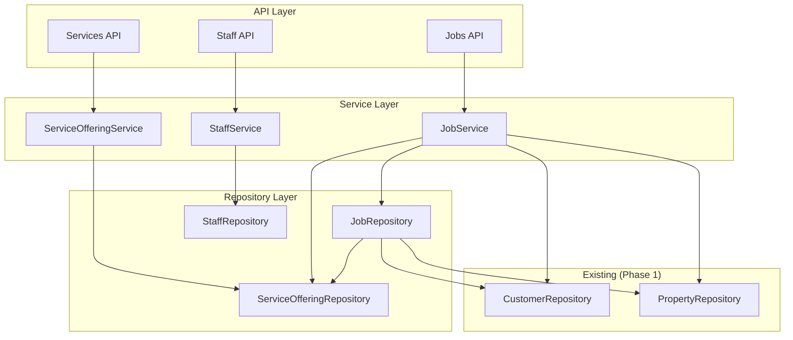

# Design Document: Field Operations (Phase 2)

## Introduction

This document provides the technical design for the Field Operations feature of Grin's Irrigation Platform. It defines the database schema, API endpoints, service layer architecture, and implementation patterns that will fulfill the requirements specified in requirements.md. This phase builds on the Customer Management foundation from Phase 1.

## Design Overview

The Field Operations feature follows the same layered architecture pattern established in Phase 1:

```
┌─────────────────────────────────────────────────────────────┐
│                      API Layer                               │
│  FastAPI endpoints with Pydantic request/response models     │
├─────────────────────────────────────────────────────────────┤
│                    Service Layer                             │
│  ServiceOfferingService, JobService, StaffService            │
│  with LoggerMixin for business logic                         │
├─────────────────────────────────────────────────────────────┤
│                   Repository Layer                           │
│  ServiceOfferingRepository, JobRepository, StaffRepository   │
├─────────────────────────────────────────────────────────────┤
│                    Database Layer                            │
│  PostgreSQL with SQLAlchemy async models                     │
└─────────────────────────────────────────────────────────────┘
```

## Architecture

### Component Relationships




## Database Schema

### service_offerings Table

```sql
CREATE TABLE service_offerings (
    id UUID PRIMARY KEY DEFAULT gen_random_uuid(),
    
    -- Service Identity
    name VARCHAR(100) NOT NULL,
    category VARCHAR(50) NOT NULL,  -- seasonal, repair, installation, diagnostic, landscaping
    description TEXT,
    
    -- Pricing
    base_price DECIMAL(10, 2),
    price_per_zone DECIMAL(10, 2),
    pricing_model VARCHAR(50) NOT NULL,  -- flat, zone_based, hourly, custom
    
    -- Duration Estimates
    estimated_duration_minutes INTEGER,
    duration_per_zone_minutes INTEGER,
    
    -- Requirements
    staffing_required INTEGER DEFAULT 1,
    equipment_required JSONB,  -- Array of equipment names
    
    -- Business Rules
    lien_eligible BOOLEAN DEFAULT FALSE,
    requires_prepay BOOLEAN DEFAULT FALSE,
    is_active BOOLEAN DEFAULT TRUE,
    
    -- Timestamps
    created_at TIMESTAMP WITH TIME ZONE DEFAULT NOW(),
    updated_at TIMESTAMP WITH TIME ZONE DEFAULT NOW(),
    
    -- Constraints
    CONSTRAINT valid_category CHECK (category IN ('seasonal', 'repair', 'installation', 'diagnostic', 'landscaping')),
    CONSTRAINT valid_pricing_model CHECK (pricing_model IN ('flat', 'zone_based', 'hourly', 'custom')),
    CONSTRAINT positive_base_price CHECK (base_price IS NULL OR base_price >= 0),
    CONSTRAINT positive_price_per_zone CHECK (price_per_zone IS NULL OR price_per_zone >= 0),
    CONSTRAINT positive_duration CHECK (estimated_duration_minutes IS NULL OR estimated_duration_minutes > 0),
    CONSTRAINT positive_staffing CHECK (staffing_required >= 1)
);

-- Indexes
CREATE INDEX idx_service_offerings_category ON service_offerings(category);
CREATE INDEX idx_service_offerings_pricing_model ON service_offerings(pricing_model);
CREATE INDEX idx_service_offerings_is_active ON service_offerings(is_active);
CREATE INDEX idx_service_offerings_name ON service_offerings(name);
```


### jobs Table

```sql
CREATE TABLE jobs (
    id UUID PRIMARY KEY DEFAULT gen_random_uuid(),
    
    -- References
    customer_id UUID NOT NULL REFERENCES customers(id),
    property_id UUID REFERENCES properties(id),
    service_offering_id UUID REFERENCES service_offerings(id),
    
    -- Job Details
    job_type VARCHAR(50) NOT NULL,
    category VARCHAR(50) NOT NULL,  -- ready_to_schedule, requires_estimate
    status VARCHAR(50) NOT NULL DEFAULT 'requested',
    description TEXT,
    
    -- Scheduling
    estimated_duration_minutes INTEGER,
    priority_level INTEGER DEFAULT 0,  -- 0=normal, 1=high, 2=urgent
    weather_sensitive BOOLEAN DEFAULT FALSE,
    
    -- Requirements
    staffing_required INTEGER DEFAULT 1,
    equipment_required JSONB,
    materials_required JSONB,
    
    -- Pricing
    quoted_amount DECIMAL(10, 2),
    final_amount DECIMAL(10, 2),
    
    -- Lead Attribution
    source VARCHAR(50),  -- website, google, referral, phone, partner
    source_details JSONB,
    
    -- Status Timestamps
    requested_at TIMESTAMP WITH TIME ZONE DEFAULT NOW(),
    approved_at TIMESTAMP WITH TIME ZONE,
    scheduled_at TIMESTAMP WITH TIME ZONE,
    started_at TIMESTAMP WITH TIME ZONE,
    completed_at TIMESTAMP WITH TIME ZONE,
    closed_at TIMESTAMP WITH TIME ZONE,
    
    -- Record Timestamps
    created_at TIMESTAMP WITH TIME ZONE DEFAULT NOW(),
    updated_at TIMESTAMP WITH TIME ZONE DEFAULT NOW(),
    
    -- Soft Delete
    is_deleted BOOLEAN DEFAULT FALSE,
    deleted_at TIMESTAMP WITH TIME ZONE,
    
    -- Constraints
    CONSTRAINT valid_job_category CHECK (category IN ('ready_to_schedule', 'requires_estimate')),
    CONSTRAINT valid_job_status CHECK (status IN ('requested', 'approved', 'scheduled', 'in_progress', 'completed', 'closed', 'cancelled')),
    CONSTRAINT valid_source CHECK (source IS NULL OR source IN ('website', 'google', 'referral', 'phone', 'partner')),
    CONSTRAINT valid_priority CHECK (priority_level >= 0 AND priority_level <= 2),
    CONSTRAINT positive_quoted_amount CHECK (quoted_amount IS NULL OR quoted_amount >= 0),
    CONSTRAINT positive_final_amount CHECK (final_amount IS NULL OR final_amount >= 0)
);

-- Indexes
CREATE INDEX idx_jobs_customer ON jobs(customer_id);
CREATE INDEX idx_jobs_property ON jobs(property_id);
CREATE INDEX idx_jobs_service_offering ON jobs(service_offering_id);
CREATE INDEX idx_jobs_status ON jobs(status);
CREATE INDEX idx_jobs_category ON jobs(category);
CREATE INDEX idx_jobs_created_at ON jobs(created_at);
CREATE INDEX idx_jobs_is_deleted ON jobs(is_deleted);
CREATE INDEX idx_jobs_priority ON jobs(priority_level);
```


### job_status_history Table

```sql
CREATE TABLE job_status_history (
    id UUID PRIMARY KEY DEFAULT gen_random_uuid(),
    job_id UUID NOT NULL REFERENCES jobs(id) ON DELETE CASCADE,
    
    -- Status Change
    previous_status VARCHAR(50),
    new_status VARCHAR(50) NOT NULL,
    changed_at TIMESTAMP WITH TIME ZONE DEFAULT NOW(),
    
    -- Audit
    changed_by VARCHAR(100),  -- User identifier (future)
    notes TEXT,
    
    -- Constraints
    CONSTRAINT valid_previous_status CHECK (previous_status IS NULL OR previous_status IN ('requested', 'approved', 'scheduled', 'in_progress', 'completed', 'closed', 'cancelled')),
    CONSTRAINT valid_new_status CHECK (new_status IN ('requested', 'approved', 'scheduled', 'in_progress', 'completed', 'closed', 'cancelled'))
);

-- Indexes
CREATE INDEX idx_job_status_history_job ON job_status_history(job_id);
CREATE INDEX idx_job_status_history_changed_at ON job_status_history(changed_at);
```

### staff Table

```sql
CREATE TABLE staff (
    id UUID PRIMARY KEY DEFAULT gen_random_uuid(),
    
    -- Identity
    name VARCHAR(100) NOT NULL,
    phone VARCHAR(20) NOT NULL,
    email VARCHAR(255),
    
    -- Role and Skills
    role VARCHAR(50) NOT NULL,  -- tech, sales, admin
    skill_level VARCHAR(50),  -- junior, senior, lead
    certifications JSONB,  -- Array of certification names
    
    -- Availability
    is_available BOOLEAN DEFAULT TRUE,
    availability_notes TEXT,
    
    -- Compensation
    hourly_rate DECIMAL(10, 2),
    
    -- Status
    is_active BOOLEAN DEFAULT TRUE,
    
    -- Timestamps
    created_at TIMESTAMP WITH TIME ZONE DEFAULT NOW(),
    updated_at TIMESTAMP WITH TIME ZONE DEFAULT NOW(),
    
    -- Constraints
    CONSTRAINT valid_role CHECK (role IN ('tech', 'sales', 'admin')),
    CONSTRAINT valid_skill_level CHECK (skill_level IS NULL OR skill_level IN ('junior', 'senior', 'lead')),
    CONSTRAINT positive_hourly_rate CHECK (hourly_rate IS NULL OR hourly_rate >= 0)
);

-- Indexes
CREATE INDEX idx_staff_role ON staff(role);
CREATE INDEX idx_staff_skill_level ON staff(skill_level);
CREATE INDEX idx_staff_is_available ON staff(is_available);
CREATE INDEX idx_staff_is_active ON staff(is_active);
CREATE INDEX idx_staff_name ON staff(name);
```


## Components and Interfaces

### API Endpoints

#### Service Offering Endpoints (6 endpoints)

| Method | Endpoint | Description | Request Body | Response |
|--------|----------|-------------|--------------|----------|
| GET | `/api/v1/services` | List all services | Query params | PaginatedServiceResponse |
| GET | `/api/v1/services/{id}` | Get service details | - | ServiceOfferingResponse |
| GET | `/api/v1/services/category/{category}` | Services by category | - | ServiceOfferingResponse[] |
| POST | `/api/v1/services` | Create service | ServiceOfferingCreate | ServiceOfferingResponse |
| PUT | `/api/v1/services/{id}` | Update service | ServiceOfferingUpdate | ServiceOfferingResponse |
| DELETE | `/api/v1/services/{id}` | Deactivate service | - | 204 No Content |

#### Job Endpoints (12 endpoints)

| Method | Endpoint | Description | Request Body | Response |
|--------|----------|-------------|--------------|----------|
| POST | `/api/v1/jobs` | Create job request | JobCreate | JobResponse |
| GET | `/api/v1/jobs/{id}` | Get job by ID | - | JobDetailResponse |
| PUT | `/api/v1/jobs/{id}` | Update job | JobUpdate | JobResponse |
| DELETE | `/api/v1/jobs/{id}` | Soft delete job | - | 204 No Content |
| GET | `/api/v1/jobs` | List jobs | Query params | PaginatedJobResponse |
| PUT | `/api/v1/jobs/{id}/status` | Update job status | JobStatusUpdate | JobResponse |
| GET | `/api/v1/jobs/{id}/history` | Get status history | - | JobStatusHistoryResponse[] |
| GET | `/api/v1/jobs/ready-to-schedule` | Jobs ready to schedule | Query params | PaginatedJobResponse |
| GET | `/api/v1/jobs/needs-estimate` | Jobs needing estimates | Query params | PaginatedJobResponse |
| GET | `/api/v1/jobs/by-status/{status}` | Jobs by status | Query params | PaginatedJobResponse |
| GET | `/api/v1/customers/{id}/jobs` | Customer's jobs | Query params | PaginatedJobResponse |
| POST | `/api/v1/jobs/{id}/calculate-price` | Calculate job price | - | PriceCalculationResponse |

#### Staff Endpoints (8 endpoints)

| Method | Endpoint | Description | Request Body | Response |
|--------|----------|-------------|--------------|----------|
| POST | `/api/v1/staff` | Create staff member | StaffCreate | StaffResponse |
| GET | `/api/v1/staff/{id}` | Get staff by ID | - | StaffResponse |
| PUT | `/api/v1/staff/{id}` | Update staff | StaffUpdate | StaffResponse |
| DELETE | `/api/v1/staff/{id}` | Deactivate staff | - | 204 No Content |
| GET | `/api/v1/staff` | List staff | Query params | PaginatedStaffResponse |
| GET | `/api/v1/staff/available` | List available staff | Query params | StaffResponse[] |
| GET | `/api/v1/staff/by-role/{role}` | Staff by role | Query params | StaffResponse[] |
| PUT | `/api/v1/staff/{id}/availability` | Update availability | StaffAvailabilityUpdate | StaffResponse |


## Data Models

### Enum Types

```python
from enum import Enum

class ServiceCategory(str, Enum):
    """Service category enumeration."""
    SEASONAL = "seasonal"
    REPAIR = "repair"
    INSTALLATION = "installation"
    DIAGNOSTIC = "diagnostic"
    LANDSCAPING = "landscaping"

class PricingModel(str, Enum):
    """Pricing model enumeration."""
    FLAT = "flat"
    ZONE_BASED = "zone_based"
    HOURLY = "hourly"
    CUSTOM = "custom"

class JobCategory(str, Enum):
    """Job category enumeration."""
    READY_TO_SCHEDULE = "ready_to_schedule"
    REQUIRES_ESTIMATE = "requires_estimate"

class JobStatus(str, Enum):
    """Job status enumeration."""
    REQUESTED = "requested"
    APPROVED = "approved"
    SCHEDULED = "scheduled"
    IN_PROGRESS = "in_progress"
    COMPLETED = "completed"
    CLOSED = "closed"
    CANCELLED = "cancelled"

class JobSource(str, Enum):
    """Job source enumeration for lead attribution."""
    WEBSITE = "website"
    GOOGLE = "google"
    REFERRAL = "referral"
    PHONE = "phone"
    PARTNER = "partner"

class StaffRole(str, Enum):
    """Staff role enumeration."""
    TECH = "tech"
    SALES = "sales"
    ADMIN = "admin"

class SkillLevel(str, Enum):
    """Staff skill level enumeration."""
    JUNIOR = "junior"
    SENIOR = "senior"
    LEAD = "lead"
```


### Pydantic Schemas

#### Service Offering Schemas

```python
from pydantic import BaseModel, Field
from typing import Optional, List
from datetime import datetime
from uuid import UUID
from decimal import Decimal

class ServiceOfferingCreate(BaseModel):
    name: str = Field(..., min_length=1, max_length=100)
    category: ServiceCategory
    description: Optional[str] = None
    base_price: Optional[Decimal] = Field(None, ge=0, decimal_places=2)
    price_per_zone: Optional[Decimal] = Field(None, ge=0, decimal_places=2)
    pricing_model: PricingModel
    estimated_duration_minutes: Optional[int] = Field(None, gt=0)
    duration_per_zone_minutes: Optional[int] = Field(None, gt=0)
    staffing_required: int = Field(default=1, ge=1)
    equipment_required: Optional[List[str]] = None
    lien_eligible: bool = False
    requires_prepay: bool = False

class ServiceOfferingUpdate(BaseModel):
    name: Optional[str] = Field(None, min_length=1, max_length=100)
    category: Optional[ServiceCategory] = None
    description: Optional[str] = None
    base_price: Optional[Decimal] = Field(None, ge=0)
    price_per_zone: Optional[Decimal] = Field(None, ge=0)
    pricing_model: Optional[PricingModel] = None
    estimated_duration_minutes: Optional[int] = Field(None, gt=0)
    duration_per_zone_minutes: Optional[int] = Field(None, gt=0)
    staffing_required: Optional[int] = Field(None, ge=1)
    equipment_required: Optional[List[str]] = None
    lien_eligible: Optional[bool] = None
    requires_prepay: Optional[bool] = None
    is_active: Optional[bool] = None

class ServiceOfferingResponse(BaseModel):
    id: UUID
    name: str
    category: ServiceCategory
    description: Optional[str]
    base_price: Optional[Decimal]
    price_per_zone: Optional[Decimal]
    pricing_model: PricingModel
    estimated_duration_minutes: Optional[int]
    duration_per_zone_minutes: Optional[int]
    staffing_required: int
    equipment_required: Optional[List[str]]
    lien_eligible: bool
    requires_prepay: bool
    is_active: bool
    created_at: datetime
    updated_at: datetime

    class Config:
        from_attributes = True
```


#### Job Schemas

```python
class JobCreate(BaseModel):
    customer_id: UUID
    property_id: Optional[UUID] = None
    service_offering_id: Optional[UUID] = None
    job_type: str = Field(..., min_length=1, max_length=50)
    description: Optional[str] = None
    estimated_duration_minutes: Optional[int] = Field(None, gt=0)
    priority_level: int = Field(default=0, ge=0, le=2)
    weather_sensitive: bool = False
    staffing_required: int = Field(default=1, ge=1)
    equipment_required: Optional[List[str]] = None
    materials_required: Optional[List[str]] = None
    quoted_amount: Optional[Decimal] = Field(None, ge=0)
    source: Optional[JobSource] = None
    source_details: Optional[dict] = None

class JobUpdate(BaseModel):
    property_id: Optional[UUID] = None
    service_offering_id: Optional[UUID] = None
    job_type: Optional[str] = Field(None, min_length=1, max_length=50)
    category: Optional[JobCategory] = None
    description: Optional[str] = None
    estimated_duration_minutes: Optional[int] = Field(None, gt=0)
    priority_level: Optional[int] = Field(None, ge=0, le=2)
    weather_sensitive: Optional[bool] = None
    staffing_required: Optional[int] = Field(None, ge=1)
    equipment_required: Optional[List[str]] = None
    materials_required: Optional[List[str]] = None
    quoted_amount: Optional[Decimal] = Field(None, ge=0)
    final_amount: Optional[Decimal] = Field(None, ge=0)
    source: Optional[JobSource] = None
    source_details: Optional[dict] = None

class JobStatusUpdate(BaseModel):
    status: JobStatus
    notes: Optional[str] = None

class JobResponse(BaseModel):
    id: UUID
    customer_id: UUID
    property_id: Optional[UUID]
    service_offering_id: Optional[UUID]
    job_type: str
    category: JobCategory
    status: JobStatus
    description: Optional[str]
    estimated_duration_minutes: Optional[int]
    priority_level: int
    weather_sensitive: bool
    staffing_required: int
    equipment_required: Optional[List[str]]
    materials_required: Optional[List[str]]
    quoted_amount: Optional[Decimal]
    final_amount: Optional[Decimal]
    source: Optional[JobSource]
    source_details: Optional[dict]
    requested_at: Optional[datetime]
    approved_at: Optional[datetime]
    scheduled_at: Optional[datetime]
    started_at: Optional[datetime]
    completed_at: Optional[datetime]
    closed_at: Optional[datetime]
    created_at: datetime
    updated_at: datetime

    class Config:
        from_attributes = True

class JobDetailResponse(JobResponse):
    customer: 'CustomerResponse'
    property: Optional['PropertyResponse']
    service_offering: Optional['ServiceOfferingResponse']
    status_history: List['JobStatusHistoryResponse']

class JobStatusHistoryResponse(BaseModel):
    id: UUID
    job_id: UUID
    previous_status: Optional[JobStatus]
    new_status: JobStatus
    changed_at: datetime
    changed_by: Optional[str]
    notes: Optional[str]

    class Config:
        from_attributes = True

class PriceCalculationResponse(BaseModel):
    job_id: UUID
    service_offering_id: Optional[UUID]
    pricing_model: Optional[PricingModel]
    base_price: Optional[Decimal]
    zone_count: Optional[int]
    calculated_price: Optional[Decimal]
    requires_manual_quote: bool
    calculation_details: dict
```


#### Staff Schemas

```python
class StaffCreate(BaseModel):
    name: str = Field(..., min_length=1, max_length=100)
    phone: str = Field(..., min_length=10, max_length=20)
    email: Optional[str] = None
    role: StaffRole
    skill_level: Optional[SkillLevel] = None
    certifications: Optional[List[str]] = None
    hourly_rate: Optional[Decimal] = Field(None, ge=0)
    is_available: bool = True
    availability_notes: Optional[str] = None

    @field_validator('phone')
    @classmethod
    def validate_phone(cls, v: str) -> str:
        digits = ''.join(filter(str.isdigit, v))
        if len(digits) != 10:
            raise ValueError('Phone must be 10 digits')
        return digits

class StaffUpdate(BaseModel):
    name: Optional[str] = Field(None, min_length=1, max_length=100)
    phone: Optional[str] = Field(None, min_length=10, max_length=20)
    email: Optional[str] = None
    role: Optional[StaffRole] = None
    skill_level: Optional[SkillLevel] = None
    certifications: Optional[List[str]] = None
    hourly_rate: Optional[Decimal] = Field(None, ge=0)
    is_active: Optional[bool] = None

class StaffAvailabilityUpdate(BaseModel):
    is_available: bool
    availability_notes: Optional[str] = None

class StaffResponse(BaseModel):
    id: UUID
    name: str
    phone: str
    email: Optional[str]
    role: StaffRole
    skill_level: Optional[SkillLevel]
    certifications: Optional[List[str]]
    hourly_rate: Optional[Decimal]
    is_available: bool
    availability_notes: Optional[str]
    is_active: bool
    created_at: datetime
    updated_at: datetime

    class Config:
        from_attributes = True
```

#### Query and Pagination Schemas

```python
class JobListParams(BaseModel):
    page: int = Field(default=1, ge=1)
    page_size: int = Field(default=20, ge=1, le=100)
    status: Optional[JobStatus] = None
    category: Optional[JobCategory] = None
    customer_id: Optional[UUID] = None
    property_id: Optional[UUID] = None
    service_offering_id: Optional[UUID] = None
    priority_level: Optional[int] = Field(None, ge=0, le=2)
    date_from: Optional[datetime] = None
    date_to: Optional[datetime] = None
    sort_by: str = Field(default="created_at")
    sort_order: str = Field(default="desc")

class StaffListParams(BaseModel):
    page: int = Field(default=1, ge=1)
    page_size: int = Field(default=20, ge=1, le=100)
    role: Optional[StaffRole] = None
    skill_level: Optional[SkillLevel] = None
    is_available: Optional[bool] = None
    is_active: Optional[bool] = None
    sort_by: str = Field(default="name")
    sort_order: str = Field(default="asc")

class PaginatedJobResponse(BaseModel):
    items: List[JobResponse]
    total: int
    page: int
    page_size: int
    total_pages: int

class PaginatedStaffResponse(BaseModel):
    items: List[StaffResponse]
    total: int
    page: int
    page_size: int
    total_pages: int

class PaginatedServiceResponse(BaseModel):
    items: List[ServiceOfferingResponse]
    total: int
    page: int
    page_size: int
    total_pages: int
```


## Service Layer Design

### ServiceOfferingService

```python
from grins_platform.log_config import LoggerMixin

class ServiceOfferingService(LoggerMixin):
    """Service for service offering management operations."""
    
    DOMAIN = "service"
    
    def __init__(self, repository: ServiceOfferingRepository):
        self.repository = repository
    
    async def create_service(self, data: ServiceOfferingCreate) -> ServiceOffering:
        """Create a new service offering."""
        self.log_started("create_service", name=data.name, category=data.category.value)
        
        service = await self.repository.create(**data.model_dump())
        
        self.log_completed("create_service", service_id=str(service.id))
        return service
    
    async def get_service(self, service_id: UUID) -> ServiceOffering:
        """Get service offering by ID."""
        self.log_started("get_service", service_id=str(service_id))
        
        service = await self.repository.get_by_id(service_id)
        if not service:
            self.log_rejected("get_service", reason="not_found")
            raise ServiceOfferingNotFoundError(service_id)
        
        self.log_completed("get_service", service_id=str(service_id))
        return service
    
    async def update_service(self, service_id: UUID, data: ServiceOfferingUpdate) -> ServiceOffering:
        """Update service offering."""
        self.log_started("update_service", service_id=str(service_id))
        
        service = await self.repository.get_by_id(service_id)
        if not service:
            self.log_rejected("update_service", reason="not_found")
            raise ServiceOfferingNotFoundError(service_id)
        
        updated = await self.repository.update(service_id, data.model_dump(exclude_unset=True))
        
        self.log_completed("update_service", service_id=str(service_id))
        return updated
    
    async def deactivate_service(self, service_id: UUID) -> None:
        """Deactivate a service offering."""
        self.log_started("deactivate_service", service_id=str(service_id))
        
        service = await self.repository.get_by_id(service_id)
        if not service:
            self.log_rejected("deactivate_service", reason="not_found")
            raise ServiceOfferingNotFoundError(service_id)
        
        await self.repository.update(service_id, {"is_active": False})
        
        self.log_completed("deactivate_service", service_id=str(service_id))
    
    async def list_services(self, params: ServiceListParams) -> PaginatedResult:
        """List service offerings with filtering."""
        self.log_started("list_services", page=params.page)
        
        result = await self.repository.list_with_filters(params)
        
        self.log_completed("list_services", total=result.total)
        return result
    
    async def get_by_category(self, category: ServiceCategory) -> List[ServiceOffering]:
        """Get all active services in a category."""
        self.log_started("get_by_category", category=category.value)
        
        services = await self.repository.find_by_category(category)
        
        self.log_completed("get_by_category", count=len(services))
        return services
```


### JobService

```python
class JobService(LoggerMixin):
    """Service for job management operations."""
    
    DOMAIN = "job"
    
    # Valid status transitions
    VALID_TRANSITIONS = {
        JobStatus.REQUESTED: {JobStatus.APPROVED, JobStatus.CANCELLED},
        JobStatus.APPROVED: {JobStatus.SCHEDULED, JobStatus.CANCELLED},
        JobStatus.SCHEDULED: {JobStatus.IN_PROGRESS, JobStatus.CANCELLED},
        JobStatus.IN_PROGRESS: {JobStatus.COMPLETED, JobStatus.CANCELLED},
        JobStatus.COMPLETED: {JobStatus.CLOSED},
        JobStatus.CLOSED: set(),  # Terminal state
        JobStatus.CANCELLED: set(),  # Terminal state
    }
    
    # Job types that are ready to schedule
    READY_TO_SCHEDULE_TYPES = {
        "spring_startup", "summer_tuneup", "winterization",
        "small_repair", "head_replacement"
    }
    
    def __init__(
        self,
        job_repository: JobRepository,
        customer_repository: CustomerRepository,
        property_repository: PropertyRepository,
        service_repository: ServiceOfferingRepository,
    ):
        self.job_repository = job_repository
        self.customer_repository = customer_repository
        self.property_repository = property_repository
        self.service_repository = service_repository
    
    async def create_job(self, data: JobCreate) -> Job:
        """Create a new job request with auto-categorization."""
        self.log_started("create_job", customer_id=str(data.customer_id), job_type=data.job_type)
        
        # Validate customer exists
        customer = await self.customer_repository.get_by_id(data.customer_id)
        if not customer or customer.is_deleted:
            self.log_rejected("create_job", reason="customer_not_found")
            raise CustomerNotFoundError(data.customer_id)
        
        # Validate property belongs to customer if provided
        if data.property_id:
            property = await self.property_repository.get_by_id(data.property_id)
            if not property or property.customer_id != data.customer_id:
                self.log_rejected("create_job", reason="property_not_found_or_mismatch")
                raise PropertyNotFoundError(data.property_id)
        
        # Validate service offering if provided
        if data.service_offering_id:
            service = await self.service_repository.get_by_id(data.service_offering_id)
            if not service or not service.is_active:
                self.log_rejected("create_job", reason="service_not_found_or_inactive")
                raise ServiceOfferingNotFoundError(data.service_offering_id)
        
        # Auto-categorize the job
        category = self._determine_category(data)
        
        job = await self.job_repository.create(
            **data.model_dump(),
            category=category.value,
            status=JobStatus.REQUESTED.value,
        )
        
        # Record initial status in history
        await self.job_repository.add_status_history(
            job_id=job.id,
            previous_status=None,
            new_status=JobStatus.REQUESTED,
        )
        
        self.log_completed("create_job", job_id=str(job.id), category=category.value)
        return job
    
    def _determine_category(self, data: JobCreate) -> JobCategory:
        """Determine job category based on auto-categorization rules."""
        # Rule 1-2: Seasonal work and small repairs are ready to schedule
        if data.job_type.lower() in self.READY_TO_SCHEDULE_TYPES:
            return JobCategory.READY_TO_SCHEDULE
        
        # Rule 3: Jobs with approved estimates are ready to schedule
        if data.quoted_amount is not None:
            return JobCategory.READY_TO_SCHEDULE
        
        # Rule 4: Partner jobs are ready to schedule
        if data.source == JobSource.PARTNER:
            return JobCategory.READY_TO_SCHEDULE
        
        # Rule 5: Everything else requires estimate
        return JobCategory.REQUIRES_ESTIMATE
    
    async def update_status(self, job_id: UUID, data: JobStatusUpdate) -> Job:
        """Update job status with validation."""
        self.log_started("update_status", job_id=str(job_id), new_status=data.status.value)
        
        job = await self.job_repository.get_by_id(job_id)
        if not job or job.is_deleted:
            self.log_rejected("update_status", reason="not_found")
            raise JobNotFoundError(job_id)
        
        current_status = JobStatus(job.status)
        
        # Validate transition
        if data.status not in self.VALID_TRANSITIONS.get(current_status, set()):
            self.log_rejected(
                "update_status",
                reason="invalid_transition",
                current=current_status.value,
                requested=data.status.value,
            )
            raise InvalidStatusTransitionError(current_status, data.status)
        
        # Update status and corresponding timestamp
        update_data = {"status": data.status.value}
        timestamp_field = self._get_timestamp_field(data.status)
        if timestamp_field:
            update_data[timestamp_field] = datetime.now()
        
        updated = await self.job_repository.update(job_id, update_data)
        
        # Record status change in history
        await self.job_repository.add_status_history(
            job_id=job_id,
            previous_status=current_status,
            new_status=data.status,
            notes=data.notes,
        )
        
        self.log_completed("update_status", job_id=str(job_id), new_status=data.status.value)
        return updated
    
    def _get_timestamp_field(self, status: JobStatus) -> Optional[str]:
        """Get the timestamp field for a status."""
        return {
            JobStatus.APPROVED: "approved_at",
            JobStatus.SCHEDULED: "scheduled_at",
            JobStatus.IN_PROGRESS: "started_at",
            JobStatus.COMPLETED: "completed_at",
            JobStatus.CLOSED: "closed_at",
        }.get(status)
    
    async def calculate_price(self, job_id: UUID) -> PriceCalculationResult:
        """Calculate price for a job based on service and property."""
        self.log_started("calculate_price", job_id=str(job_id))
        
        job = await self.job_repository.get_by_id(job_id)
        if not job or job.is_deleted:
            self.log_rejected("calculate_price", reason="not_found")
            raise JobNotFoundError(job_id)
        
        if not job.service_offering_id:
            self.log_completed("calculate_price", job_id=str(job_id), result="no_service")
            return PriceCalculationResult(
                job_id=job_id,
                requires_manual_quote=True,
                calculation_details={"reason": "no_service_offering"},
            )
        
        service = await self.service_repository.get_by_id(job.service_offering_id)
        
        # Get zone count from property if available
        zone_count = 1
        if job.property_id:
            property = await self.property_repository.get_by_id(job.property_id)
            if property and property.zone_count:
                zone_count = property.zone_count
        
        # Calculate based on pricing model
        calculated_price = self._calculate_by_model(service, zone_count)
        
        self.log_completed("calculate_price", job_id=str(job_id), price=str(calculated_price))
        return PriceCalculationResult(
            job_id=job_id,
            service_offering_id=service.id,
            pricing_model=PricingModel(service.pricing_model),
            base_price=service.base_price,
            zone_count=zone_count,
            calculated_price=calculated_price,
            requires_manual_quote=calculated_price is None,
            calculation_details={
                "pricing_model": service.pricing_model,
                "base_price": str(service.base_price) if service.base_price else None,
                "price_per_zone": str(service.price_per_zone) if service.price_per_zone else None,
                "zone_count": zone_count,
            },
        )
    
    def _calculate_by_model(
        self, service: ServiceOffering, zone_count: int
    ) -> Optional[Decimal]:
        """Calculate price based on pricing model."""
        model = PricingModel(service.pricing_model)
        
        if model == PricingModel.FLAT:
            return service.base_price
        
        if model == PricingModel.ZONE_BASED:
            if service.base_price is None:
                return None
            zone_price = service.price_per_zone or Decimal("0")
            return round(service.base_price + (zone_price * zone_count), 2)
        
        if model == PricingModel.HOURLY:
            if service.base_price is None or service.estimated_duration_minutes is None:
                return None
            hours = Decimal(service.estimated_duration_minutes) / Decimal("60")
            return round(service.base_price * hours, 2)
        
        # Custom pricing requires manual quote
        return None
```


### StaffService

```python
class StaffService(LoggerMixin):
    """Service for staff management operations."""
    
    DOMAIN = "staff"
    
    def __init__(self, repository: StaffRepository):
        self.repository = repository
    
    async def create_staff(self, data: StaffCreate) -> Staff:
        """Create a new staff member."""
        self.log_started("create_staff", name=data.name, role=data.role.value)
        
        # Normalize phone number
        normalized_phone = self._normalize_phone(data.phone)
        
        staff = await self.repository.create(
            **data.model_dump(exclude={"phone"}),
            phone=normalized_phone,
        )
        
        self.log_completed("create_staff", staff_id=str(staff.id))
        return staff
    
    async def get_staff(self, staff_id: UUID) -> Staff:
        """Get staff member by ID."""
        self.log_started("get_staff", staff_id=str(staff_id))
        
        staff = await self.repository.get_by_id(staff_id)
        if not staff:
            self.log_rejected("get_staff", reason="not_found")
            raise StaffNotFoundError(staff_id)
        
        self.log_completed("get_staff", staff_id=str(staff_id))
        return staff
    
    async def update_staff(self, staff_id: UUID, data: StaffUpdate) -> Staff:
        """Update staff member."""
        self.log_started("update_staff", staff_id=str(staff_id))
        
        staff = await self.repository.get_by_id(staff_id)
        if not staff:
            self.log_rejected("update_staff", reason="not_found")
            raise StaffNotFoundError(staff_id)
        
        update_data = data.model_dump(exclude_unset=True)
        if "phone" in update_data:
            update_data["phone"] = self._normalize_phone(update_data["phone"])
        
        updated = await self.repository.update(staff_id, update_data)
        
        self.log_completed("update_staff", staff_id=str(staff_id))
        return updated
    
    async def deactivate_staff(self, staff_id: UUID) -> None:
        """Deactivate a staff member."""
        self.log_started("deactivate_staff", staff_id=str(staff_id))
        
        staff = await self.repository.get_by_id(staff_id)
        if not staff:
            self.log_rejected("deactivate_staff", reason="not_found")
            raise StaffNotFoundError(staff_id)
        
        await self.repository.update(staff_id, {"is_active": False})
        
        self.log_completed("deactivate_staff", staff_id=str(staff_id))
    
    async def update_availability(self, staff_id: UUID, data: StaffAvailabilityUpdate) -> Staff:
        """Update staff availability."""
        self.log_started("update_availability", staff_id=str(staff_id))
        
        staff = await self.repository.get_by_id(staff_id)
        if not staff:
            self.log_rejected("update_availability", reason="not_found")
            raise StaffNotFoundError(staff_id)
        
        updated = await self.repository.update(staff_id, data.model_dump())
        
        self.log_completed("update_availability", staff_id=str(staff_id))
        return updated
    
    async def list_staff(self, params: StaffListParams) -> PaginatedResult:
        """List staff with filtering."""
        self.log_started("list_staff", page=params.page)
        
        result = await self.repository.list_with_filters(params)
        
        self.log_completed("list_staff", total=result.total)
        return result
    
    async def get_available_staff(self) -> List[Staff]:
        """Get all available and active staff."""
        self.log_started("get_available_staff")
        
        staff = await self.repository.find_available()
        
        self.log_completed("get_available_staff", count=len(staff))
        return staff
    
    async def get_by_role(self, role: StaffRole) -> List[Staff]:
        """Get all active staff by role."""
        self.log_started("get_by_role", role=role.value)
        
        staff = await self.repository.find_by_role(role)
        
        self.log_completed("get_by_role", count=len(staff))
        return staff
    
    def _normalize_phone(self, phone: str) -> str:
        """Normalize phone number to 10 digits."""
        return ''.join(filter(str.isdigit, phone))[-10:]
```


## Error Handling

### Custom Exceptions

```python
class FieldOperationsError(Exception):
    """Base exception for field operations."""
    pass

class ServiceOfferingNotFoundError(FieldOperationsError):
    """Raised when service offering is not found."""
    def __init__(self, service_id: UUID):
        self.service_id = service_id
        super().__init__(f"Service offering not found: {service_id}")

class JobNotFoundError(FieldOperationsError):
    """Raised when job is not found."""
    def __init__(self, job_id: UUID):
        self.job_id = job_id
        super().__init__(f"Job not found: {job_id}")

class InvalidStatusTransitionError(FieldOperationsError):
    """Raised when an invalid status transition is attempted."""
    def __init__(self, current_status: JobStatus, requested_status: JobStatus):
        self.current_status = current_status
        self.requested_status = requested_status
        super().__init__(
            f"Invalid status transition from {current_status.value} to {requested_status.value}"
        )

class StaffNotFoundError(FieldOperationsError):
    """Raised when staff member is not found."""
    def __init__(self, staff_id: UUID):
        self.staff_id = staff_id
        super().__init__(f"Staff member not found: {staff_id}")

class PropertyCustomerMismatchError(FieldOperationsError):
    """Raised when property doesn't belong to the specified customer."""
    def __init__(self, property_id: UUID, customer_id: UUID):
        self.property_id = property_id
        self.customer_id = customer_id
        super().__init__(
            f"Property {property_id} does not belong to customer {customer_id}"
        )
```

### API Error Responses

```python
@router.exception_handler(ServiceOfferingNotFoundError)
async def service_not_found_handler(request: Request, exc: ServiceOfferingNotFoundError):
    return JSONResponse(
        status_code=404,
        content={
            "success": False,
            "error": {
                "code": "SERVICE_OFFERING_NOT_FOUND",
                "message": str(exc),
                "service_id": str(exc.service_id)
            }
        }
    )

@router.exception_handler(JobNotFoundError)
async def job_not_found_handler(request: Request, exc: JobNotFoundError):
    return JSONResponse(
        status_code=404,
        content={
            "success": False,
            "error": {
                "code": "JOB_NOT_FOUND",
                "message": str(exc),
                "job_id": str(exc.job_id)
            }
        }
    )

@router.exception_handler(InvalidStatusTransitionError)
async def invalid_transition_handler(request: Request, exc: InvalidStatusTransitionError):
    return JSONResponse(
        status_code=400,
        content={
            "success": False,
            "error": {
                "code": "INVALID_STATUS_TRANSITION",
                "message": str(exc),
                "current_status": exc.current_status.value,
                "requested_status": exc.requested_status.value
            }
        }
    )

@router.exception_handler(StaffNotFoundError)
async def staff_not_found_handler(request: Request, exc: StaffNotFoundError):
    return JSONResponse(
        status_code=404,
        content={
            "success": False,
            "error": {
                "code": "STAFF_NOT_FOUND",
                "message": str(exc),
                "staff_id": str(exc.staff_id)
            }
        }
    )
```


## Correctness Properties

*A property is a characteristic or behavior that should hold true across all valid executions of a system—essentially, a formal statement about what the system should do. Properties serve as the bridge between human-readable specifications and machine-verifiable correctness guarantees.*

### Property Reflection

After analyzing the acceptance criteria, the following redundancies were identified and consolidated:

1. Requirements 2.9 and 4.1 both test initial job status - consolidated into Property 1
2. Requirements 1.2, 1.3, 8.2, 8.3 all test enum validation - consolidated into Property 2
3. Requirements 3.1-3.5 all test auto-categorization - consolidated into Property 3
4. Requirements 4.2-4.7 all test status transitions - consolidated into Property 4
5. Requirements 5.1-5.4 all test pricing calculation - consolidated into Property 5
6. Requirements 1.6, 8.6 both test soft deactivation - consolidated into Property 8

### Properties

**Property 1: Job Creation Defaults**
*For any* valid job creation request, the created job SHALL have status="requested" and priority_level=0 (unless explicitly specified).
**Validates: Requirements 2.9, 2.10, 4.1**

**Property 2: Enum Validation Completeness**
*For any* enum field (service category, pricing model, job status, staff role, skill level), the system SHALL accept all valid enum values and reject all invalid values with a descriptive error.
**Validates: Requirements 1.2, 1.3, 8.2, 8.3, 10.1-10.5**

**Property 3: Job Auto-Categorization Correctness**
*For any* job creation request:
- If job_type is in {spring_startup, summer_tuneup, winterization, small_repair}, category SHALL be "ready_to_schedule"
- If quoted_amount is set, category SHALL be "ready_to_schedule"
- If source is "partner", category SHALL be "ready_to_schedule"
- Otherwise, category SHALL be "requires_estimate"
**Validates: Requirements 3.1, 3.2, 3.3, 3.4, 3.5**

**Property 4: Status Transition Validity**
*For any* job status transition attempt:
- From "requested": only "approved" or "cancelled" are valid
- From "approved": only "scheduled" or "cancelled" are valid
- From "scheduled": only "in_progress" or "cancelled" are valid
- From "in_progress": only "completed" or "cancelled" are valid
- From "completed": only "closed" is valid
- From "cancelled" or "closed": no transitions are valid (terminal states)
All invalid transitions SHALL be rejected with an error.
**Validates: Requirements 4.2, 4.3, 4.4, 4.5, 4.6, 4.7, 4.10**

**Property 5: Pricing Calculation Correctness**
*For any* job with a service offering:
- If pricing_model is "flat": calculated_price = base_price
- If pricing_model is "zone_based": calculated_price = base_price + (price_per_zone × zone_count), where zone_count defaults to 1 if not set
- If pricing_model is "hourly": calculated_price = base_price × (estimated_duration_minutes / 60)
- If pricing_model is "custom": calculated_price = null (requires manual quote)
All calculated prices SHALL be rounded to 2 decimal places.
**Validates: Requirements 5.1, 5.2, 5.3, 5.4, 5.5, 5.6**

**Property 6: Status History Completeness**
*For any* job status change, a history record SHALL be created containing the previous status, new status, and timestamp. History records SHALL be returned in chronological order.
**Validates: Requirements 4.8, 7.1, 7.2**

**Property 7: Status Timestamp Updates**
*For any* job status change, the corresponding timestamp field SHALL be updated:
- approved → approved_at
- scheduled → scheduled_at
- in_progress → started_at
- completed → completed_at
- closed → closed_at
**Validates: Requirements 4.9**

**Property 8: Soft Deactivation Preservation**
*For any* deactivated service offering or staff member, the record SHALL remain in the database with is_active=false. The record SHALL still be retrievable by ID.
**Validates: Requirements 1.6, 8.6**

**Property 9: Referential Integrity - Job to Customer**
*For any* job creation request, the customer_id SHALL reference an existing, non-deleted customer. Jobs with invalid customer_ids SHALL be rejected.
**Validates: Requirements 2.2, 10.8**

**Property 10: Referential Integrity - Property to Customer**
*For any* job creation request with a property_id, the property SHALL belong to the specified customer. Jobs with mismatched property/customer pairs SHALL be rejected.
**Validates: Requirements 2.3, 10.9**

**Property 11: Referential Integrity - Job to Service**
*For any* job creation request with a service_offering_id, the service SHALL exist and be active. Jobs with invalid or inactive service references SHALL be rejected.
**Validates: Requirements 2.4, 10.10**

**Property 12: Available Staff Filter Correctness**
*For any* request to list available staff, the result SHALL contain only staff members where is_available=true AND is_active=true.
**Validates: Requirements 9.3**

**Property 13: Category Re-evaluation on Quote**
*For any* job with category="requires_estimate", when quoted_amount is set, the category SHALL be updated to "ready_to_schedule".
**Validates: Requirements 3.7**

**Property 14: CRUD Round-Trip Consistency**
*For any* service offering, job, or staff member: creating a record, then retrieving it by ID SHALL return equivalent data. Updating a record, then retrieving it SHALL reflect the updates.
**Validates: Requirements 1.4, 1.5, 8.4, 8.5**


## Testing Strategy

### Dual Testing Approach

This feature requires both unit tests and property-based tests for comprehensive coverage:

- **Unit tests**: Verify specific examples, edge cases, and error conditions
- **Property tests**: Verify universal properties across all inputs using hypothesis

### Three-Tier Testing Structure

Following the project's testing standards:

| Tier | Type | Purpose | Marker | Dependencies |
|------|------|---------|--------|--------------|
| 1 | **Unit** | Code correctness in isolation | `@pytest.mark.unit` | Mocked |
| 2 | **Functional** | Feature works as user expects | `@pytest.mark.functional` | Real infrastructure |
| 3 | **Integration** | New code works with existing system | `@pytest.mark.integration` | Real system |

### Property-Based Testing Configuration

- **Library**: hypothesis
- **Minimum iterations**: 100 per property test
- **Tag format**: `# Feature: field-operations, Property {number}: {property_text}`

### Test Organization

```
src/grins_platform/tests/
├── unit/
│   ├── test_service_offering_service.py
│   ├── test_job_service.py
│   └── test_staff_service.py
├── functional/
│   ├── test_service_offering_workflows.py
│   ├── test_job_workflows.py
│   └── test_staff_workflows.py
├── integration/
│   ├── test_job_customer_integration.py
│   ├── test_job_property_integration.py
│   └── test_field_operations_api.py
├── test_pbt_job_status.py          # Property 4: Status transitions
├── test_pbt_auto_categorization.py  # Property 3: Auto-categorization
├── test_pbt_pricing.py              # Property 5: Pricing calculation
└── test_pbt_field_operations.py     # Properties 1, 2, 6-14
```

### Coverage Targets

| Component | Unit | Functional | Integration |
|-----------|------|------------|-------------|
| Services | 85%+ | 80%+ | 70%+ |
| API endpoints | 80%+ | 85%+ | 80%+ |
| Repositories | 80%+ | 70%+ | 60%+ |
| Models | 60%+ | N/A | N/A |

### Property Test Examples

```python
from hypothesis import given, strategies as st, settings

# Property 4: Status Transition Validity
@given(
    current_status=st.sampled_from(list(JobStatus)),
    target_status=st.sampled_from(list(JobStatus)),
)
@settings(max_examples=100)
def test_status_transition_validity(current_status, target_status):
    """
    Feature: field-operations, Property 4: Status Transition Validity
    For any job status transition attempt, only valid transitions are allowed.
    """
    valid_transitions = {
        JobStatus.REQUESTED: {JobStatus.APPROVED, JobStatus.CANCELLED},
        JobStatus.APPROVED: {JobStatus.SCHEDULED, JobStatus.CANCELLED},
        JobStatus.SCHEDULED: {JobStatus.IN_PROGRESS, JobStatus.CANCELLED},
        JobStatus.IN_PROGRESS: {JobStatus.COMPLETED, JobStatus.CANCELLED},
        JobStatus.COMPLETED: {JobStatus.CLOSED},
        JobStatus.CLOSED: set(),
        JobStatus.CANCELLED: set(),
    }
    
    is_valid = target_status in valid_transitions.get(current_status, set())
    
    if is_valid:
        # Should succeed
        result = job_service.validate_transition(current_status, target_status)
        assert result is True
    else:
        # Should raise InvalidStatusTransitionError
        with pytest.raises(InvalidStatusTransitionError):
            job_service.validate_transition(current_status, target_status)

# Property 5: Pricing Calculation Correctness
@given(
    base_price=st.decimals(min_value=0, max_value=10000, places=2),
    price_per_zone=st.decimals(min_value=0, max_value=500, places=2),
    zone_count=st.integers(min_value=1, max_value=50),
    pricing_model=st.sampled_from(list(PricingModel)),
)
@settings(max_examples=100)
def test_pricing_calculation_correctness(base_price, price_per_zone, zone_count, pricing_model):
    """
    Feature: field-operations, Property 5: Pricing Calculation Correctness
    For any job with a service offering, price is calculated correctly based on model.
    """
    service = create_service(
        base_price=base_price,
        price_per_zone=price_per_zone,
        pricing_model=pricing_model,
    )
    
    result = calculate_price(service, zone_count)
    
    if pricing_model == PricingModel.FLAT:
        assert result == base_price
    elif pricing_model == PricingModel.ZONE_BASED:
        expected = round(base_price + (price_per_zone * zone_count), 2)
        assert result == expected
    elif pricing_model == PricingModel.CUSTOM:
        assert result is None
    
    # All results should have at most 2 decimal places
    if result is not None:
        assert result == round(result, 2)
```


## File Structure

```
src/grins_platform/
├── api/
│   └── v1/
│       ├── services.py          # Service offering endpoints
│       ├── jobs.py              # Job endpoints
│       └── staff.py             # Staff endpoints
├── schemas/
│   ├── service_offering.py      # Service offering schemas
│   ├── job.py                   # Job schemas
│   └── staff.py                 # Staff schemas
├── services/
│   ├── service_offering_service.py
│   ├── job_service.py
│   └── staff_service.py
├── repositories/
│   ├── service_offering_repository.py
│   ├── job_repository.py
│   └── staff_repository.py
├── models/
│   ├── service_offering.py
│   ├── job.py
│   ├── job_status_history.py
│   └── staff.py
├── exceptions/
│   └── field_operations.py      # Field operations exceptions
├── migrations/
│   └── versions/
│       ├── xxx_create_service_offerings.py
│       ├── xxx_create_jobs.py
│       ├── xxx_create_job_status_history.py
│       └── xxx_create_staff.py
└── tests/
    ├── unit/
    │   ├── test_service_offering_service.py
    │   ├── test_job_service.py
    │   └── test_staff_service.py
    ├── functional/
    │   ├── test_service_offering_workflows.py
    │   ├── test_job_workflows.py
    │   └── test_staff_workflows.py
    ├── integration/
    │   ├── test_job_customer_integration.py
    │   └── test_field_operations_api.py
    ├── test_pbt_job_status.py
    ├── test_pbt_auto_categorization.py
    └── test_pbt_pricing.py
```

## Dependencies

### New Python Packages

No new packages required - uses existing dependencies from Phase 1:

```toml
[project.dependencies]
fastapi = ">=0.109.0"
pydantic = ">=2.5.0"
sqlalchemy = ">=2.0.0"
asyncpg = ">=0.29.0"
alembic = ">=1.13.0"

[project.optional-dependencies]
test = [
    "pytest>=7.4.0",
    "pytest-asyncio>=0.23.0",
    "pytest-cov>=4.1.0",
    "httpx>=0.26.0",
    "hypothesis>=6.92.0",
]
```

## Default Service Offerings

The following services will be seeded on system initialization:

| Name | Category | Pricing Model | Base Price | Per Zone | Duration |
|------|----------|---------------|------------|----------|----------|
| Spring Startup | seasonal | zone_based | $50 | $10 | 30 min |
| Summer Tune-up | seasonal | zone_based | $50 | $10 | 30 min |
| Winterization | seasonal | zone_based | $60 | $12 | 45 min |
| Head Replacement | repair | flat | $50 | - | 30 min |
| Diagnostic | diagnostic | hourly | $100 | - | 60 min |
| New System Install | installation | custom | - | $700 | - |
| Zone Addition | installation | custom | - | $500 | - |

