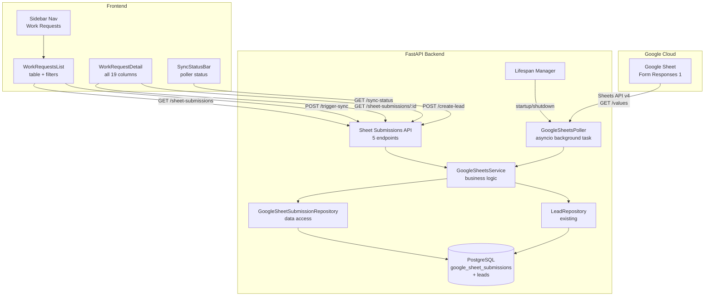
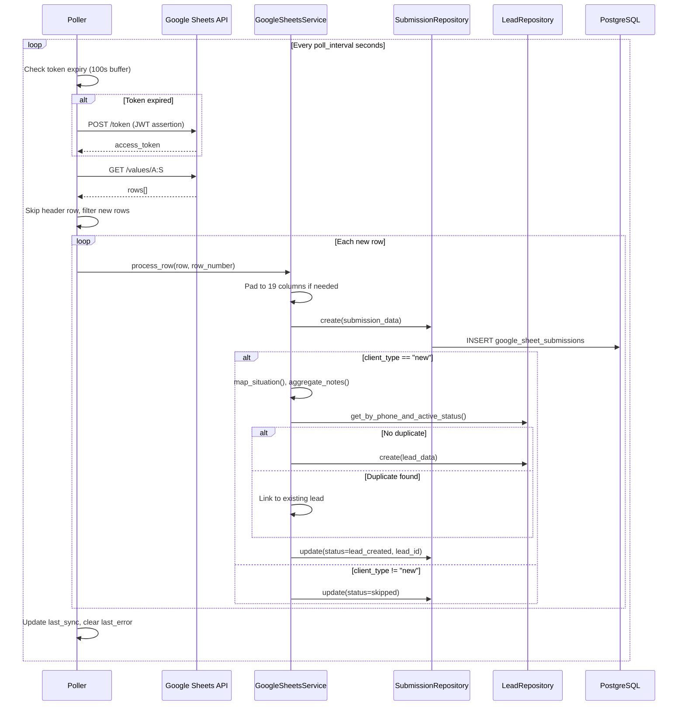
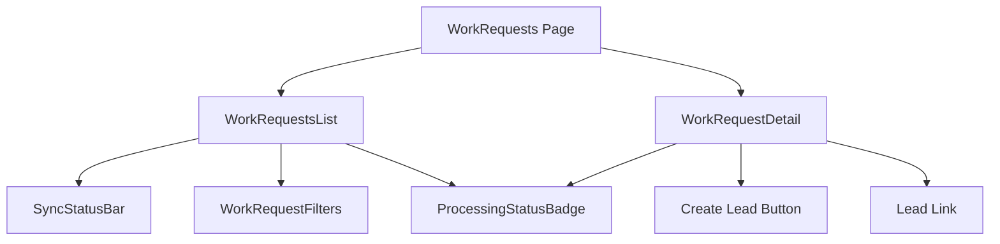

# Design Document: Google Sheets Work Requests

## Overview

This feature automates the ingestion of service request submissions from a Google Form-linked Google Sheet into the Grins Irrigation Platform. A background poller authenticates via a Google Cloud service account (JWT/RS256), fetches new rows from the sheet on a configurable interval, stores them in a `google_sheet_submissions` table, and auto-creates Lead records for new-client submissions. An admin "Work Requests" tab provides full visibility into all submissions with filtering, detail views, manual lead creation, and sync status monitoring.

The system is designed for resilience: transient API errors, rate limits, and individual row failures never crash the poller. Configuration is entirely environment-variable driven.

### Key Design Decisions

1. **Nullable zip_code on leads**: Google Sheet submissions lack zip codes. Rather than inventing data, `leads.zip_code` becomes nullable. The public form endpoint continues to require it.
2. **Poller as asyncio background task**: Runs inside the FastAPI lifespan — no external scheduler needed. Graceful startup/shutdown via the existing lifespan pattern.
3. **Raw storage + processing**: All 19 columns stored as raw strings. Processing (lead creation) is a separate step, enabling re-processing and manual lead creation.
4. **Deduplication by row number**: `sheet_row_number` UNIQUE constraint prevents duplicate imports. The poller tracks the max stored row number and only fetches beyond it.
5. **403 handling**: Logged with actionable message ("share with {email} as Viewer"), retried next cycle — same as 5xx errors.
6. **Extra columns beyond 19**: Silently ignored. Fewer than 19: padded with empty strings.
7. **Concurrency lock on polling**: An `asyncio.Lock` in the poller serializes poll cycles. Manual `trigger-sync` and the automatic poll loop both acquire this lock, preventing race conditions on `get_max_row_number()` when both run simultaneously.
8. **safe_normalize_phone wraps existing function**: Rather than duplicating phone normalization logic, `safe_normalize_phone()` wraps the existing `normalize_phone()` from `schemas/customer.py` in a try/except, catching its `ValueError` on invalid input and returning `"0000000000"`.

## Architecture



### Data Flow



## Components and Interfaces

### Backend Components

#### 1. GoogleSheetsPoller (Background Task)

Manages the polling lifecycle: authentication, scheduling, and graceful shutdown.

```python
class GoogleSheetsPoller:
    """Background poller for Google Sheets data.
    
    Runs as an asyncio task within the FastAPI lifespan.
    Handles JWT auth, token refresh, and periodic polling.
    """
    
    def __init__(
        self,
        service: GoogleSheetsService,
        db_manager: "DatabaseManager",
        spreadsheet_id: str,
        sheet_name: str = "Form Responses 1",
        poll_interval: int = 60,
        key_path: str = "",
    ) -> None: ...
    
    # Concurrency — serializes poll cycles (manual trigger + automatic loop)
    _poll_lock: asyncio.Lock
    
    # Lifecycle
    async def start(self) -> None: ...
    async def stop(self) -> None: ...
    
    # Auth
    async def _ensure_token(self) -> str: ...
    async def _request_token(self, assertion: str) -> str: ...
    def _build_jwt_assertion(self) -> str: ...
    
    # Polling
    async def _poll_loop(self) -> None: ...
    async def _fetch_sheet_data(self, token: str) -> list[list[str]]: ...
    
    # Status
    @property
    def sync_status(self) -> SyncStatusResponse: ...
```

#### 2. GoogleSheetsService (Business Logic)

Processes rows, creates leads, maps situations, aggregates notes.

```python
class GoogleSheetsService(LoggerMixin):
    """Business logic for Google Sheet submission processing."""
    
    DOMAIN = "sheets"
    
    def __init__(
        self,
        submission_repo: GoogleSheetSubmissionRepository,
        lead_repo: LeadRepository,
    ) -> None: ...
    
    async def process_row(
        self, row: list[str], row_number: int, session: AsyncSession,
    ) -> GoogleSheetSubmission: ...
    
    async def create_lead_from_submission(
        self, submission_id: UUID, session: AsyncSession,
    ) -> GoogleSheetSubmission: ...
    
    async def list_submissions(
        self, params: SubmissionListParams, session: AsyncSession,
    ) -> PaginatedSubmissionResponse: ...
    
    async def get_submission(
        self, submission_id: UUID, session: AsyncSession,
    ) -> GoogleSheetSubmission: ...
    
    async def trigger_sync(self) -> int: ...
    
    # Internal helpers
    @staticmethod
    def map_situation(row: list[str]) -> LeadSituation: ...
    
    @staticmethod
    def aggregate_notes(row: list[str]) -> str: ...
    
    @staticmethod
    def normalize_name(raw_name: str) -> str: ...
    
    @staticmethod
    def safe_normalize_phone(raw_phone: str) -> str: ...
```

**Implementation note — `safe_normalize_phone()`**: This function wraps the existing `normalize_phone()` from `grins_platform.schemas.customer`:

```python
@staticmethod
def safe_normalize_phone(raw_phone: str) -> str:
    """Normalize phone with fallback for invalid input.
    
    Wraps the existing normalize_phone() which raises ValueError
    on non-10-digit input. Returns "0000000000" on any failure.
    """
    if not raw_phone or not raw_phone.strip():
        return "0000000000"
    try:
        return normalize_phone(raw_phone)
    except ValueError:
        return "0000000000"
```

#### 3. GoogleSheetSubmissionRepository (Data Access)

```python
class GoogleSheetSubmissionRepository(LoggerMixin):
    """Repository for google_sheet_submissions table operations."""
    
    DOMAIN = "database"
    
    def __init__(self, session: AsyncSession) -> None: ...
    
    async def create(self, **kwargs: Any) -> GoogleSheetSubmission: ...
    async def get_by_id(self, submission_id: UUID) -> GoogleSheetSubmission | None: ...
    async def get_max_row_number(self) -> int: ...
    async def list_with_filters(
        self, params: SubmissionListParams,
    ) -> tuple[list[GoogleSheetSubmission], int]: ...
    async def update(
        self, submission_id: UUID, update_data: dict[str, Any],
    ) -> GoogleSheetSubmission | None: ...
```

#### 4. API Endpoints (Sheet Submissions Router)

| Method | Path | Auth | Description |
|--------|------|------|-------------|
| GET | `/api/v1/sheet-submissions` | Admin | Paginated list with filters |
| GET | `/api/v1/sheet-submissions/sync-status` | Admin | Poller status |
| GET | `/api/v1/sheet-submissions/{id}` | Admin | Single submission detail |
| POST | `/api/v1/sheet-submissions/{id}/create-lead` | Admin | Manual lead creation |
| POST | `/api/v1/sheet-submissions/trigger-sync` | Admin | Trigger immediate poll |

Note: `/sync-status` and `/trigger-sync` are registered before `/{id}` to avoid path parameter conflicts.

### Frontend Components

#### Component Hierarchy

The Work Requests nav item is inserted into the sidebar `navItems` array at index 3 (after Leads), using the `ClipboardList` icon from lucide-react:

```typescript
// In Layout.tsx navItems array, after the Leads entry:
{
  label: 'Work Requests',
  href: '/work-requests',
  icon: <ClipboardList className="h-5 w-5" />,
  testId: 'nav-work-requests',
},
```



#### Types (`features/work-requests/types/index.ts`)

```typescript
export type ProcessingStatus = 'imported' | 'lead_created' | 'skipped' | 'error';
export type SheetClientType = 'new' | 'existing';

export interface WorkRequest {
  id: string;
  sheet_row_number: number;
  timestamp: string | null;
  spring_startup: string | null;
  fall_blowout: string | null;
  summer_tuneup: string | null;
  repair_existing: string | null;
  new_system_install: string | null;
  addition_to_system: string | null;
  additional_services_info: string | null;
  date_work_needed_by: string | null;
  name: string | null;
  phone: string | null;
  email: string | null;
  city: string | null;
  address: string | null;
  additional_info: string | null;
  client_type: string | null;
  property_type: string | null;
  referral_source: string | null;
  landscape_hardscape: string | null;
  processing_status: ProcessingStatus;
  processing_error: string | null;
  lead_id: string | null;
  imported_at: string;
  created_at: string;
  updated_at: string;
}

export interface SyncStatus {
  last_sync: string | null;
  is_running: boolean;
  last_error: string | null;
}
```

#### API Client (`features/work-requests/api/workRequestApi.ts`)

```typescript
export const workRequestApi = {
  list: (params?: WorkRequestListParams) => Promise<PaginatedWorkRequestResponse>,
  getById: (id: string) => Promise<WorkRequest>,
  getSyncStatus: () => Promise<SyncStatus>,
  createLead: (id: string) => Promise<WorkRequest>,
  triggerSync: () => Promise<{ new_rows_imported: number }>,
};
```

#### TanStack Query Hooks (`features/work-requests/hooks/`)

```typescript
// useWorkRequests.ts
export function useWorkRequests(params?: WorkRequestListParams);
export function useWorkRequest(id: string);
export function useSyncStatus();
export function useCreateLeadFromSubmission();
export function useTriggerSync();
```


## Data Models

### Database: `google_sheet_submissions` Table

```sql
CREATE TABLE google_sheet_submissions (
    id UUID PRIMARY KEY DEFAULT gen_random_uuid(),
    sheet_row_number INTEGER NOT NULL UNIQUE,
    
    -- All 19 Google Sheet columns (nullable strings)
    timestamp VARCHAR(255),
    spring_startup VARCHAR(255),
    fall_blowout VARCHAR(255),
    summer_tuneup VARCHAR(255),
    repair_existing VARCHAR(255),
    new_system_install VARCHAR(255),
    addition_to_system VARCHAR(255),
    additional_services_info TEXT,
    date_work_needed_by VARCHAR(255),
    name VARCHAR(255),
    phone VARCHAR(255),
    email VARCHAR(255),
    city VARCHAR(255),
    address TEXT,
    additional_info TEXT,
    client_type VARCHAR(50),
    property_type VARCHAR(50),
    referral_source TEXT,
    landscape_hardscape TEXT,
    
    -- Processing metadata
    processing_status VARCHAR(20) NOT NULL DEFAULT 'imported',
    processing_error TEXT,
    lead_id UUID REFERENCES leads(id) ON DELETE SET NULL,
    
    -- Timestamps
    imported_at TIMESTAMPTZ NOT NULL DEFAULT NOW(),
    created_at TIMESTAMPTZ NOT NULL DEFAULT NOW(),
    updated_at TIMESTAMPTZ NOT NULL DEFAULT NOW()
);

CREATE INDEX idx_submissions_client_type ON google_sheet_submissions(client_type);
CREATE INDEX idx_submissions_processing_status ON google_sheet_submissions(processing_status);
CREATE INDEX idx_submissions_imported_at ON google_sheet_submissions(imported_at);
```

### SQLAlchemy Model: `GoogleSheetSubmission`

```python
class GoogleSheetSubmission(Base):
    __tablename__ = "google_sheet_submissions"

    id: Mapped[UUID] = mapped_column(PGUUID(as_uuid=True), primary_key=True, server_default=func.gen_random_uuid())
    sheet_row_number: Mapped[int] = mapped_column(Integer, nullable=False, unique=True)
    
    # 19 sheet columns — all nullable strings
    timestamp: Mapped[str | None] = mapped_column(String(255), nullable=True)
    spring_startup: Mapped[str | None] = mapped_column(String(255), nullable=True)
    fall_blowout: Mapped[str | None] = mapped_column(String(255), nullable=True)
    summer_tuneup: Mapped[str | None] = mapped_column(String(255), nullable=True)
    repair_existing: Mapped[str | None] = mapped_column(String(255), nullable=True)
    new_system_install: Mapped[str | None] = mapped_column(String(255), nullable=True)
    addition_to_system: Mapped[str | None] = mapped_column(String(255), nullable=True)
    additional_services_info: Mapped[str | None] = mapped_column(Text, nullable=True)
    date_work_needed_by: Mapped[str | None] = mapped_column(String(255), nullable=True)
    name: Mapped[str | None] = mapped_column(String(255), nullable=True)
    phone: Mapped[str | None] = mapped_column(String(255), nullable=True)
    email: Mapped[str | None] = mapped_column(String(255), nullable=True)
    city: Mapped[str | None] = mapped_column(String(255), nullable=True)
    address: Mapped[str | None] = mapped_column(Text, nullable=True)
    additional_info: Mapped[str | None] = mapped_column(Text, nullable=True)
    client_type: Mapped[str | None] = mapped_column(String(50), nullable=True)
    property_type: Mapped[str | None] = mapped_column(String(50), nullable=True)
    referral_source: Mapped[str | None] = mapped_column(Text, nullable=True)
    landscape_hardscape: Mapped[str | None] = mapped_column(Text, nullable=True)
    
    # Processing metadata
    processing_status: Mapped[str] = mapped_column(String(20), nullable=False, server_default="imported")
    processing_error: Mapped[str | None] = mapped_column(Text, nullable=True)
    lead_id: Mapped[UUID | None] = mapped_column(PGUUID(as_uuid=True), ForeignKey("leads.id", ondelete="SET NULL"), nullable=True)
    
    # Timestamps
    imported_at: Mapped[datetime] = mapped_column(DateTime(timezone=True), nullable=False, server_default=func.now())
    created_at: Mapped[datetime] = mapped_column(DateTime(timezone=True), nullable=False, server_default=func.now())
    updated_at: Mapped[datetime] = mapped_column(DateTime(timezone=True), nullable=False, server_default=func.now(), onupdate=func.now())
    
    # Relationship
    lead: Mapped["Lead" | None] = relationship("Lead", foreign_keys=[lead_id], lazy="selectin")
    
    __table_args__ = (
        Index("idx_submissions_client_type", "client_type"),
        Index("idx_submissions_processing_status", "processing_status"),
        Index("idx_submissions_imported_at", "imported_at"),
    )
```

### Migration: Make `leads.zip_code` Nullable

```python
# Alembic migration
def upgrade():
    op.alter_column("leads", "zip_code", nullable=True, existing_type=sa.String(10))

def downgrade():
    op.execute("UPDATE leads SET zip_code = '00000' WHERE zip_code IS NULL")
    op.alter_column("leads", "zip_code", nullable=False, existing_type=sa.String(10))
```

**Impact analysis — existing `zip_code` references**: The following code paths reference `lead.zip_code` and must handle `None` after this migration:
- `LeadResponse` schema: Must change `zip_code: str` → `zip_code: str | None` (Requirement 4.4)
- `Lead.to_dict()`: Already returns the raw value, so `None` passes through correctly
- `LeadSubmission` validator: Continues to require 5-digit zip_code for public form (no change needed)
- Frontend `LeadDetail` component: Must display "N/A" or similar when `zip_code` is null
- Dashboard metrics / lead list: No zip_code display, so no impact

### Pydantic Schemas

```python
class GoogleSheetSubmissionResponse(BaseModel):
    """Full submission response for API."""
    model_config = ConfigDict(from_attributes=True)
    
    id: UUID
    sheet_row_number: int
    timestamp: str | None
    spring_startup: str | None
    fall_blowout: str | None
    summer_tuneup: str | None
    repair_existing: str | None
    new_system_install: str | None
    addition_to_system: str | None
    additional_services_info: str | None
    date_work_needed_by: str | None
    name: str | None
    phone: str | None
    email: str | None
    city: str | None
    address: str | None
    additional_info: str | None
    client_type: str | None
    property_type: str | None
    referral_source: str | None
    landscape_hardscape: str | None
    processing_status: str
    processing_error: str | None
    lead_id: UUID | None
    imported_at: datetime
    created_at: datetime
    updated_at: datetime


class SubmissionListParams(BaseModel):
    """Query parameters for listing submissions."""
    page: int = Field(default=1, ge=1)
    page_size: int = Field(default=20, ge=1, le=100)
    processing_status: str | None = None
    client_type: str | None = None
    search: str | None = None
    sort_by: str = Field(default="imported_at")
    sort_order: str = Field(default="desc", pattern="^(asc|desc)$")


class PaginatedSubmissionResponse(BaseModel):
    """Paginated submission list response."""
    items: list[GoogleSheetSubmissionResponse]
    total: int
    page: int
    page_size: int
    total_pages: int


class SyncStatusResponse(BaseModel):
    """Poller sync status response."""
    last_sync: datetime | None
    is_running: bool
    last_error: str | None


class TriggerSyncResponse(BaseModel):
    """Response for manual sync trigger."""
    new_rows_imported: int
```

### Situation Mapping Logic

The `map_situation()` function checks columns B–G in priority order:

| Priority | Column | Sheet Value (non-empty) | LeadSituation |
|----------|--------|------------------------|---------------|
| 1 | F (index 5) | new_system_install | `new_system` |
| 2 | G (index 6) | addition_to_system | `upgrade` |
| 3 | E (index 4) | repair_existing | `repair` |
| 4 | B/C/D (1/2/3) | any seasonal | `exploring` |
| 5 | none | — | `exploring` |

```python
@staticmethod
def map_situation(row: list[str]) -> LeadSituation:
    if row[5].strip():  # new_system_install
        return LeadSituation.NEW_SYSTEM
    if row[6].strip():  # addition_to_system
        return LeadSituation.UPGRADE
    if row[4].strip():  # repair_existing
        return LeadSituation.REPAIR
    if any(row[i].strip() for i in (1, 2, 3)):  # seasonal
        return LeadSituation.EXPLORING
    return LeadSituation.EXPLORING
```

### Notes Aggregation Logic

Combines multiple sheet columns into a structured Lead notes string:

```python
@staticmethod
def aggregate_notes(row: list[str]) -> str:
    parts = []
    # Services requested with frequency
    services = []
    for idx, label in [(1, "Spring Startup"), (2, "Fall Blowout"), (3, "Summer Tuneup"),
                        (4, "Repair"), (5, "New System Install"), (6, "Addition to System")]:
        if row[idx].strip():
            services.append(f"{label}: {row[idx].strip()}")
    if services:
        parts.append("Services: " + "; ".join(services))
    
    # Other fields
    field_map = [
        (8, "Date needed by"), (7, "Additional services"),
        (12, "City"), (13, "Address"), (14, "Additional info"),
        (18, "Landscape/Hardscape"), (17, "Referral source"),
    ]
    for idx, label in field_map:
        if row[idx].strip():
            parts.append(f"{label}: {row[idx].strip()}")
    
    return "\n".join(parts) if parts else ""
```

### Configuration (Environment Variables)

| Variable | Required | Default | Description |
|----------|----------|---------|-------------|
| `GOOGLE_SHEETS_SPREADSHEET_ID` | Yes | — | Google Sheet ID |
| `GOOGLE_SHEETS_SHEET_NAME` | No | `Form Responses 1` | Sheet tab name |
| `GOOGLE_SHEETS_POLL_INTERVAL_SECONDS` | No | `60` | Poll interval in seconds |
| `GOOGLE_SERVICE_ACCOUNT_KEY_PATH` | Yes | — | Path to service account JSON key |

These are added to a `GoogleSheetsSettings` Pydantic settings class (or directly to the existing settings pattern), loaded from `.env`.

### Lifespan Integration

```python
async def lifespan(app: FastAPI) -> AsyncIterator[None]:
    # Existing startup...
    logger.info("app.startup_completed")
    
    # Start Google Sheets poller (if configured)
    poller = None
    settings = GoogleSheetsSettings()
    if settings.spreadsheet_id and settings.key_path:
        try:
            # The service needs the db_manager to create sessions
            # outside the request/response cycle
            db_manager = get_database_manager()
            sheets_service = GoogleSheetsService(
                submission_repo=None,  # Created per-session in poller
                lead_repo=None,        # Created per-session in poller
            )
            poller = GoogleSheetsPoller(
                service=sheets_service,
                db_manager=db_manager,
                spreadsheet_id=settings.spreadsheet_id,
                sheet_name=settings.sheet_name,
                poll_interval=settings.poll_interval,
                key_path=settings.key_path,
            )
            await poller.start()
            app.state.sheets_poller = poller
        except Exception as e:
            logger.error("app.sheets_poller.start_failed", error=str(e))
    else:
        logger.warning("app.sheets_poller.skipped", reason="missing configuration")
    
    yield
    
    # Shutdown poller
    if poller:
        await poller.stop()
    # Existing shutdown...
```

### Concurrency: Poll Lock

The poller uses an `asyncio.Lock` to serialize poll cycles. Both the automatic `_poll_loop()` and the manual `trigger_sync()` acquire this lock before executing a poll cycle:

```python
class GoogleSheetsPoller:
    def __init__(self, ...) -> None:
        ...
        self._poll_lock = asyncio.Lock()
    
    async def _poll_loop(self) -> None:
        while self._running:
            async with self._poll_lock:
                await self._execute_poll_cycle()
            await asyncio.sleep(self.poll_interval)
    
    async def trigger_sync(self) -> int:
        """Manual sync — acquires lock, waits if auto-poll is in progress."""
        async with self._poll_lock:
            return await self._execute_poll_cycle()
```

This prevents race conditions where `get_max_row_number()` returns the same value for two concurrent cycles, which could cause duplicate processing attempts (caught by the UNIQUE constraint but wasteful).

### Session Management in Background Poller

The poller runs outside the FastAPI request/response cycle and cannot use `Depends(get_db)`. Instead, it creates its own database sessions via `DatabaseManager` for each poll cycle:

```python
async def _execute_poll_cycle(self) -> int:
    async for session in self._db_manager.get_session():
        submission_repo = GoogleSheetSubmissionRepository(session)
        lead_repo = LeadRepository(session)
        # Process rows — each row committed individually for error isolation
        for row_number, row_data in new_rows:
            try:
                await self.service.process_row(row_data, row_number, session)
                await session.commit()
            except Exception as e:
                await session.rollback()
                # Mark as error, continue to next row
```

Each row is committed individually so that a failure on row K does not roll back rows processed before it (Property 10: error isolation).


## Correctness Properties

*A property is a characteristic or behavior that should hold true across all valid executions of a system — essentially, a formal statement about what the system should do. Properties serve as the bridge between human-readable specifications and machine-verifiable correctness guarantees.*

### Property 1: Row padding produces exactly 19 columns

*For any* list of strings with length between 0 and 19 (inclusive), padding the row should produce a list of exactly 19 elements where the original values are preserved in order and any added values are empty strings.

**Validates: Requirements 2.3**

### Property 2: New submission invariants

*For any* valid row of 19 string values and any unique row number, storing the row as a submission should produce a record where all 19 column values match the input, the `sheet_row_number` matches, `processing_status` is `"imported"`, `lead_id` is null, and `imported_at` is set.

**Validates: Requirements 2.1, 2.4**

### Property 3: Client type determines lead creation

*For any* submission, if `client_type` (trimmed, lowercased) equals `"new"`, then processing should result in `processing_status` = `"lead_created"` and a non-null `lead_id`. If `client_type` (trimmed, lowercased) is anything other than `"new"` (including empty, null, or `"existing"`), then processing should result in `processing_status` = `"skipped"` and `lead_id` remaining null.

**Validates: Requirements 3.1, 3.2, 3.8**

### Property 4: Situation mapping priority

*For any* combination of boolean flags for the six service columns (spring_startup, fall_blowout, summer_tuneup, repair_existing, new_system_install, addition_to_system), `map_situation()` should return: `new_system` if new_system_install is set (regardless of other flags), else `upgrade` if addition_to_system is set, else `repair` if repair_existing is set, else `exploring` if any seasonal flag is set, else `exploring`.

**Validates: Requirements 3.3**

### Property 5: Notes aggregation contains all non-empty fields

*For any* row of 19 strings, the output of `aggregate_notes()` should contain every non-empty, non-whitespace value from the service columns (with labels), date_work_needed_by, additional_services_info, city, address, additional_info, landscape_hardscape, and referral_source. If all relevant fields are empty, the result should be an empty string.

**Validates: Requirements 3.4**

### Property 6: Field fallbacks for missing data

*For any* name string that is empty or composed entirely of whitespace, `normalize_name()` should return `"Unknown"`. For any non-blank name, it should return the trimmed original. *For any* phone string that is empty, non-numeric, or fails the 10-digit normalization, `safe_normalize_phone()` should return `"0000000000"`. For any valid phone string, it should return the normalized 10-digit result.

**Validates: Requirements 3.9, 3.10**

### Property 7: Sheet-created leads have null zip_code

*For any* lead created from a Google Sheet submission, the lead's `zip_code` field should be `None`. The `LeadResponse` schema should serialize such a lead without error, producing `zip_code: null` in the JSON output.

**Validates: Requirements 3.5, 4.3, 4.4**

### Property 8: Public form submission still requires zip_code

*For any* `LeadSubmission` payload where `zip_code` is missing, empty, or not exactly 5 digits, Pydantic validation should reject the payload with a validation error. The nullable migration does not weaken the public form contract.

**Validates: Requirements 4.2**

### Property 9: Duplicate phone deduplication

*For any* submission with `client_type` = `"new"` and a phone number matching an existing active lead (status in new/contacted/qualified), processing should link the submission to the existing lead (`lead_id` = existing lead's ID) rather than creating a new lead. The total lead count should not increase.

**Validates: Requirements 3.6**

### Property 10: Row processing error isolation

*For any* batch of N rows where row K (1 ≤ K ≤ N) causes a processing error, the rows before and after K should still be processed successfully. Row K's submission should have `processing_status` = `"error"` and a non-empty `processing_error`.

**Validates: Requirements 3.7, 8.6**

### Property 11: Only new rows are processed

*For any* set of already-stored row numbers and any set of fetched row numbers, the poller should process only the rows whose numbers are not in the already-stored set. The count of processed rows should equal the size of the set difference.

**Validates: Requirements 1.4**

### Property 12: Token refresh triggers within expiry buffer

*For any* access token with an expiry timestamp, `_ensure_token()` should request a new token if the current time is within 100 seconds of expiry, and reuse the existing token otherwise.

**Validates: Requirements 1.5**

### Property 13: Header row detection

*For any* list of rows where the first row contains values matching expected header names (e.g., first cell contains "Timestamp" case-insensitively), the header detection logic should identify and skip that row. For rows where the first row does not match header patterns, no rows should be skipped.

**Validates: Requirements 1.8**

### Property 14: Submission list filtering

*For any* set of submissions and any combination of `processing_status` filter, `client_type` filter, and text search term, the returned list should contain only submissions matching all active filters. Text search should match against name, phone, email, or address fields (case-insensitive partial match). Results should be paginated with correct total count and page metadata.

**Validates: Requirements 5.1, 6.10**

### Property 15: Manual lead creation idempotency guard

*For any* submission that already has a non-null `lead_id`, calling the manual create-lead endpoint should return a 409 Conflict error without modifying the submission or creating a new lead.

**Validates: Requirements 5.5**

### Property 16: Concurrent poll cycles are serialized

*For any* two concurrent invocations of poll cycles (e.g., automatic poll + manual trigger-sync), the asyncio Lock ensures they execute sequentially. The second invocation should wait for the first to complete. No two poll cycles should execute `get_max_row_number()` simultaneously, preventing duplicate row processing attempts.

**Validates: Requirements 5.8**

### Property 17: safe_normalize_phone wraps normalize_phone

*For any* phone string, `safe_normalize_phone(raw_phone)` should return the same result as `normalize_phone(raw_phone)` when `normalize_phone` succeeds. When `normalize_phone` raises `ValueError`, `safe_normalize_phone` should return `"0000000000"`. The function should never raise an exception.

**Validates: Requirements 3.10, 17.3**

## Error Handling

### Poller Error Strategy

All poller errors follow a "log and retry next cycle" pattern. The poller never crashes the application.

| Error Scenario | Action | Status Update |
|---------------|--------|---------------|
| 403 Forbidden (sheet not shared) | Log error with "share with {service_account_email} as Viewer" message | Set `_last_error`, retry next cycle |
| 429 Rate Limited | Log warning | Set `_last_error`, retry next cycle |
| 5xx Server Error | Log error | Set `_last_error`, retry next cycle |
| Network Timeout (30s) | Log error | Set `_last_error`, retry next cycle |
| Invalid/missing service account key | Log error at startup | Don't start poller |
| Token refresh failure | Log error, clear cached token | Retry token on next cycle |
| Individual row processing failure | Log error with row context | Mark submission as `error`, continue to next row |
| Database connection failure | Let exception propagate to poll_loop catch-all | Log, set `_last_error`, retry next cycle |
| Duplicate row number (UNIQUE violation) | Caught by constraint | Skip silently |
| Extra columns beyond 19 | Ignore columns beyond index 18 | No error |
| Fewer than 19 columns | Pad with empty strings | No error |

### API Error Handling

| Scenario | HTTP Status | Response |
|----------|-------------|----------|
| Submission not found | 404 | `{"detail": "Submission not found"}` |
| Create lead on already-linked submission | 409 | `{"detail": "Submission already has a linked lead"}` |
| Unauthenticated request | 401 | `{"detail": "Not authenticated"}` |
| Invalid query parameters | 422 | Pydantic validation error |
| Lead creation fails during manual create | 500 | `{"detail": "Failed to create lead: {reason}"}` |

### Frontend Error Handling

- API errors on list/detail fetch → `ErrorMessage` component with retry button (matching Leads pattern)
- Trigger sync failure → toast notification with error message
- Create lead failure → toast notification with `variant: "destructive"` and failure reason
- Create lead success → toast notification with success message, query invalidation to refresh list

## Testing Strategy

### Property-Based Testing

Library: **Hypothesis** (Python) for backend property tests.

Each property test runs a minimum of 100 iterations and is tagged with a comment referencing the design property.

Tag format: `# Feature: google-sheets-work-requests, Property {N}: {title}`

Property tests focus on the pure logic functions and data transformation:
- `map_situation()` — Property 4
- `aggregate_notes()` — Property 5
- `normalize_name()` / `safe_normalize_phone()` — Property 6
- Row padding logic — Property 1
- Client type classification — Property 3
- Header row detection — Property 13

Each correctness property is implemented by a single property-based test function.

### Unit Tests (`tests/unit/`)

Marker: `@pytest.mark.unit` — all dependencies mocked.

| Test File | Coverage |
|-----------|----------|
| `test_sheets_service.py` | Service logic: process_row, create_lead_from_submission, map_situation, aggregate_notes, normalize_name, safe_normalize_phone |
| `test_sheets_repository.py` | Repository CRUD: create, get_by_id, get_max_row_number, list_with_filters, update |
| `test_sheets_api.py` | API endpoints: all 5 endpoints, auth checks, error responses |
| `test_sheets_poller.py` | Poller lifecycle: start/stop, token refresh, poll loop, error handling |
| `test_sheets_schemas.py` | Schema validation: SubmissionListParams, SyncStatusResponse |

### Functional Tests (`tests/functional/`)

Marker: `@pytest.mark.functional` — real database.

- Full polling cycle with mocked Google Sheets API → submissions stored, leads created
- Manual lead creation workflow → submission updated, lead linked
- Duplicate phone deduplication → existing lead linked
- Error isolation → failed row doesn't block others

### Integration Tests (`tests/integration/`)

Marker: `@pytest.mark.integration` — full system.

- End-to-end: poller startup → fetch → store → lead creation → API query
- Migration verification: zip_code nullable, existing data preserved
- API auth: all endpoints require authentication

### Frontend Tests (Vitest + React Testing Library)

| Test File | Coverage |
|-----------|----------|
| `WorkRequestsList.test.tsx` | Table rendering, pagination, filters, empty state, sync status |
| `WorkRequestDetail.test.tsx` | All 19 fields displayed, create lead button, lead link |
| `ProcessingStatusBadge.test.tsx` | Badge colors for each status |
| `SyncStatusBar.test.tsx` | Running/stopped states, last sync time |
| `workRequestApi.test.ts` | API client methods |


### agent-browser End-to-End Validation Scripts

Validation scripts use agent-browser to verify the full user workflow in a real browser. These scripts run against a local dev server at `http://localhost:5173`.

#### Script 1: Work Requests List Page

```bash
agent-browser open http://localhost:5173/work-requests
agent-browser wait --load networkidle
agent-browser is visible "[data-testid='work-requests-page']"
agent-browser is visible "[data-testid='work-requests-table']"
agent-browser is visible "[data-testid='sync-status-bar']"
agent-browser is visible "[data-testid='trigger-sync-btn']"
agent-browser close
```

#### Script 2: Trigger Sync

```bash
agent-browser open http://localhost:5173/work-requests
agent-browser wait --load networkidle
agent-browser click "[data-testid='trigger-sync-btn']"
agent-browser wait --text "rows imported"
agent-browser close
```

#### Script 3: Detail View Navigation

```bash
agent-browser open http://localhost:5173/work-requests
agent-browser wait --load networkidle
agent-browser click "[data-testid='work-request-row']:first-child"
agent-browser wait "[data-testid='work-request-detail']"
agent-browser is visible "[data-testid='work-request-detail']"
agent-browser close
```

#### Script 4: Create Lead from Detail

```bash
agent-browser open http://localhost:5173/work-requests
agent-browser wait --load networkidle
agent-browser click "[data-testid='work-request-row']:first-child"
agent-browser wait "[data-testid='work-request-detail']"
agent-browser is visible "[data-testid='create-lead-btn']"
agent-browser click "[data-testid='create-lead-btn']"
agent-browser wait --text "Success"
agent-browser close
```

#### Script 5: Filters

```bash
agent-browser open http://localhost:5173/work-requests
agent-browser wait --load networkidle
agent-browser click "[data-testid='filter-processing-status']"
agent-browser click "text=Lead Created"
agent-browser wait --load networkidle
agent-browser is visible "[data-testid='work-requests-table']"
agent-browser fill "[data-testid='search-input']" "John"
agent-browser wait --load networkidle
agent-browser close
```

### data-testid Convention Map

All frontend components use `data-testid` attributes following the project convention:

| Element | data-testid |
|---------|-------------|
| Work Requests page container | `work-requests-page` |
| Work Requests table | `work-requests-table` |
| Individual table row | `work-request-row` |
| Work Request detail view | `work-request-detail` |
| Sidebar nav item | `nav-work-requests` |
| Trigger Sync button | `trigger-sync-btn` |
| Create Lead button | `create-lead-btn` |
| Sync status bar | `sync-status-bar` |
| Processing status badge | `status-{value}` (e.g., `status-imported`, `status-lead_created`) |
| Filter: Processing Status | `filter-processing-status` |
| Filter: Client Type | `filter-client-type` |
| Text search input | `search-input` |
| Pagination controls | `pagination-controls` |
| Loading spinner | `loading-spinner` |
| Error message | `error-message` |
| Empty state | `empty-state` |
| Lead link (in detail view) | `lead-link` |
| Submission count | `submission-count` |

### Structured Logging Events

All components emit structured log events following the `{domain}.{component}.{action}_{state}` convention.

#### Poller Events (via `get_logger(__name__)`)

| Event | Level | Context Fields |
|-------|-------|----------------|
| `sheets.poller.start_completed` | INFO | poll_interval, sheet_name |
| `sheets.poller.stop_completed` | INFO | — |
| `sheets.poller.poll_started` | DEBUG | cycle_number |
| `sheets.poller.poll_completed` | INFO | new_rows_count, total_rows_fetched |
| `sheets.poller.poll_failed` | ERROR | error, cycle_number |
| `sheets.poller.auth_started` | DEBUG | — |
| `sheets.poller.auth_completed` | DEBUG | expires_in |
| `sheets.poller.auth_failed` | ERROR | error |
| `sheets.poller.auth_refreshed` | INFO | — |
| `sheets.poller.fetch_started` | DEBUG | range |
| `sheets.poller.fetch_completed` | DEBUG | row_count |
| `sheets.poller.fetch_failed` | ERROR | status_code, error |
| `sheets.poller.config_missing` | WARNING | reason |
| `sheets.poller.sheet_not_shared` | ERROR | service_account_email |

#### Service Events (via `LoggerMixin`, `DOMAIN = "sheets"`)

| Event | Level | Context Fields |
|-------|-------|----------------|
| `sheets.service.process_row_started` | INFO | row_number |
| `sheets.service.process_row_completed` | INFO | row_number, processing_status, lead_id |
| `sheets.service.process_row_failed` | ERROR | row_number, error |
| `sheets.service.lead_created` | INFO | submission_id, lead_id, phone |
| `sheets.service.lead_skipped` | INFO | submission_id, client_type |
| `sheets.service.lead_linked_existing` | INFO | submission_id, existing_lead_id, phone |
| `sheets.service.create_lead_from_submission_started` | INFO | submission_id |
| `sheets.service.create_lead_from_submission_completed` | INFO | submission_id, lead_id |
| `sheets.service.create_lead_from_submission_failed` | ERROR | submission_id, error |
| `sheets.service.trigger_sync_started` | INFO | — |
| `sheets.service.trigger_sync_completed` | INFO | new_rows_imported |

#### Repository Events (via `LoggerMixin`, `DOMAIN = "database"`)

| Event | Level | Context Fields |
|-------|-------|----------------|
| `database.submission_repository.create_completed` | DEBUG | submission_id, row_number |
| `database.submission_repository.get_by_id_completed` | DEBUG | submission_id |
| `database.submission_repository.get_max_row_completed` | DEBUG | max_row_number |
| `database.submission_repository.list_completed` | DEBUG | count, total |
| `database.submission_repository.update_completed` | DEBUG | submission_id |

#### API Events (via `DomainLogger.api_event()`)

| Event | Level | Context Fields |
|-------|-------|----------------|
| `api.sheet_submissions.list_started` | INFO | request_id, filters |
| `api.sheet_submissions.list_completed` | INFO | request_id, count, status_code=200 |
| `api.sheet_submissions.get_started` | INFO | request_id, submission_id |
| `api.sheet_submissions.get_completed` | INFO | request_id, submission_id, status_code=200 |
| `api.sheet_submissions.get_failed` | WARNING | request_id, submission_id, status_code=404 |
| `api.sheet_submissions.create_lead_started` | INFO | request_id, submission_id |
| `api.sheet_submissions.create_lead_completed` | INFO | request_id, submission_id, lead_id, status_code=200 |
| `api.sheet_submissions.create_lead_rejected` | WARNING | request_id, submission_id, status_code=409 |
| `api.sheet_submissions.create_lead_failed` | ERROR | request_id, submission_id, error, status_code=500 |
| `api.sheet_submissions.sync_status_completed` | INFO | request_id, status_code=200 |
| `api.sheet_submissions.trigger_sync_started` | INFO | request_id |
| `api.sheet_submissions.trigger_sync_completed` | INFO | request_id, new_rows_imported, status_code=200 |

### Quality Gate Commands

All code must pass these checks with zero errors before the feature is considered complete:

```bash
# Linting (zero violations required)
uv run ruff check --fix src/
uv run ruff format src/

# Type checking (zero errors required)
uv run mypy src/
uv run pyright src/

# Backend tests (all tiers)
uv run pytest -m unit -v
uv run pytest -m functional -v
uv run pytest -m integration -v
uv run pytest --cov=src/grins_platform

# Frontend tests
cd frontend && npm test && npm run test:coverage
```

### Test Fixtures

#### Backend Fixtures (`tests/conftest.py` additions)

```python
@pytest.fixture
def sample_sheet_row() -> list[str]:
    """A complete 19-column Google Sheet row."""
    return [
        "2025-01-15 10:30:00",  # timestamp (A)
        "Yes",                   # spring_startup (B)
        "",                      # fall_blowout (C)
        "",                      # summer_tuneup (D)
        "",                      # repair_existing (E)
        "",                      # new_system_install (F)
        "",                      # addition_to_system (G)
        "",                      # additional_services_info (H)
        "ASAP",                  # date_work_needed_by (I)
        "Jane Smith",            # name (J)
        "6125559876",            # phone (K)
        "jane@example.com",      # email (L)
        "Eden Prairie",          # city (M)
        "456 Oak Ave",           # address (N)
        "Large backyard",        # additional_info (O)
        "new",                   # client_type (P)
        "residential",           # property_type (Q)
        "Google",                # referral_source (R)
        "",                      # landscape_hardscape (S)
    ]


@pytest.fixture
def sample_sheet_row_factory():
    """Factory for generating varied sheet rows."""
    counter = 0

    def _create(
        client_type: str = "new",
        name: str | None = None,
        phone: str | None = None,
        services: dict[str, str] | None = None,
    ) -> list[str]:
        nonlocal counter
        counter += 1
        row = [""] * 19
        row[0] = f"2025-01-{counter:02d} 10:00:00"
        row[9] = name or f"Test User {counter}"
        row[10] = phone or f"612555{counter:04d}"
        row[11] = f"test{counter}@example.com"
        row[12] = "Eden Prairie"
        row[15] = client_type
        row[16] = "residential"
        if services:
            for key, val in services.items():
                idx = {"spring_startup": 1, "fall_blowout": 2, "summer_tuneup": 3,
                       "repair_existing": 4, "new_system_install": 5, "addition_to_system": 6}.get(key, -1)
                if idx >= 0:
                    row[idx] = val
        return row

    return _create


@pytest.fixture
def mock_sheets_service() -> AsyncMock:
    """Create a mock GoogleSheetsService."""
    return AsyncMock()


@pytest.fixture
def mock_sheets_repository() -> AsyncMock:
    """Create a mock GoogleSheetSubmissionRepository."""
    return AsyncMock()


@pytest.fixture
def sample_submission_model(sample_sheet_row: list[str]) -> MagicMock:
    """Create a mock GoogleSheetSubmission model instance."""
    sub = MagicMock()
    sub.id = uuid.uuid4()
    sub.sheet_row_number = 2
    sub.timestamp = sample_sheet_row[0]
    sub.name = sample_sheet_row[9]
    sub.phone = sample_sheet_row[10]
    sub.email = sample_sheet_row[11]
    sub.client_type = sample_sheet_row[15]
    sub.processing_status = "imported"
    sub.processing_error = None
    sub.lead_id = None
    sub.imported_at = datetime.now()
    sub.created_at = datetime.now()
    sub.updated_at = datetime.now()
    return sub
```

### Coverage Targets

| Layer | Target | Measurement |
|-------|--------|-------------|
| Backend unit tests | 90%+ line coverage | `uv run pytest -m unit --cov=src/grins_platform` |
| Backend functional tests | Key workflows covered | Manual review |
| Backend integration tests | All API endpoints + cross-feature | Manual review |
| Frontend components | 80%+ | `npm run test:coverage` |
| Frontend hooks | 85%+ | `npm run test:coverage` |
| Frontend utils | 90%+ | `npm run test:coverage` |
| Property-based tests | 100 iterations minimum per property | Hypothesis settings |

### Cross-Feature Integration Tests

Tests in `tests/integration/` verifying this feature works with existing components:

| Test | Description |
|------|-------------|
| `test_sheet_lead_appears_in_leads_api` | Lead created from sheet submission is returned by GET /api/v1/leads |
| `test_sheet_lead_included_in_dashboard_metrics` | Lead created from sheet submission is counted in dashboard metrics |
| `test_null_zip_lead_coexists_with_normal_leads` | Leads with null zip_code and leads with valid zip_code are both returned correctly |
| `test_existing_leads_unaffected_by_migration` | Existing leads with non-null zip_code serialize correctly after migration |
| `test_public_form_still_requires_zip_code` | POST /api/v1/leads rejects payloads without valid zip_code |
| `test_migration_downgrade_backfills_zip_code` | Downgrade migration sets null zip_codes to placeholder and restores NOT NULL |
| `test_unique_constraint_prevents_duplicate_rows` | Inserting a duplicate sheet_row_number raises IntegrityError (functional, real DB) |
| `test_db_connection_failure_during_batch` | Simulated DB failure mid-batch doesn't crash poller, error is logged |

### Security Considerations

1. **Service account key protection**: The key file path is read from env vars. The key contents, JWT assertions, and access tokens are NEVER logged at any level. Log messages reference the key path only in startup error messages.

2. **Token storage**: Access tokens are stored only in the `GoogleSheetsPoller` instance memory (`self._access_token`). They are never persisted to disk, database, or cache.

3. **API authentication**: All `/api/v1/sheet-submissions` endpoints use the `require_admin` dependency, consistent with other admin endpoints.

4. **Input sanitization**: Sheet data is stored as raw strings. When creating leads, the `normalize_name()` and `safe_normalize_phone()` functions sanitize input. The existing `strip_html_tags()` function from the lead schema is not applied to sheet data since it's not user-facing HTML input.

5. **File permission check**: Before parsing the service account key JSON, the poller verifies the file exists and is readable. If not, it logs an error (without the full path in production) and skips poller startup.
