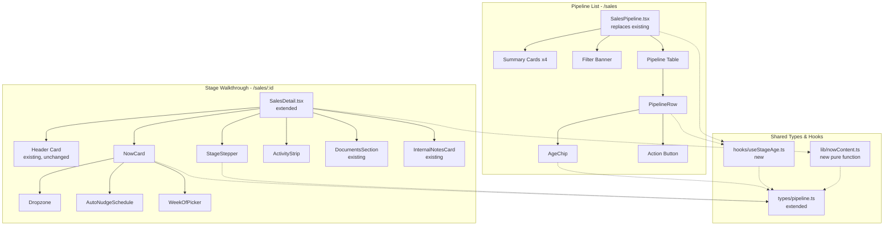
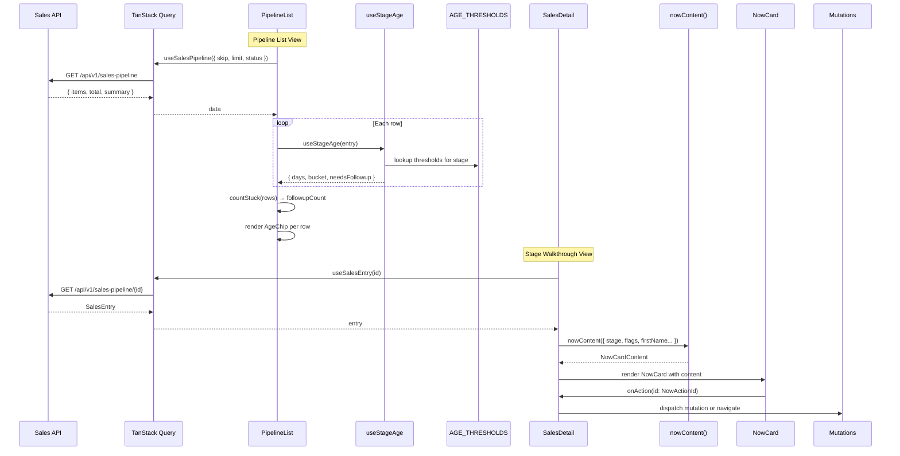

# Design Document: Handoff Stage Walkthrough and Pipeline

## Overview

This feature redesigns the Grins Irrigation Platform's sales pipeline across two interconnected views — the **Pipeline List** (`/sales`) and the **Stage Walkthrough** (`/sales/:id`) — to surface pipeline health signals and guide users through each stage with clear next-action guidance.

The Pipeline List replaces the existing `SalesPipeline.tsx` with a streamlined table that adds **age-in-stage chips** (fresh/stale/stuck) next to every status pill, a client-side "Needs Follow-Up" count driven by stuck thresholds, and compact stage-specific action buttons. The Stage Walkthrough extends `SalesDetail.tsx` by inserting a **StageStepper → NowCard → ActivityStrip** stack between the header card and the documents section, replacing the flat action-button layout with a guided walkthrough that makes the current stage and next action obvious at a glance.

This is a **frontend-only** feature. No backend changes, database migrations, or new npm dependencies are required. The implementation uses the existing stack: React 19, TypeScript, Tailwind 4, shadcn/Radix, TanStack Query, date-fns, lucide-react, and sonner. Where backend endpoints don't yet exist, actions are stubbed with sonner toasts and `TODO(backend)` comments.

### Key Design Decisions

| Decision | Rationale |
|---|---|
| `send_contract` DB enum stays; display label changes to "Convert to Job" | Avoids migration risk; display-layer alias only |
| Age computation uses `updated_at` fallback | No `stage_entered_at` column exists yet; `TODO(backend)` documents the future fix |
| Needs Follow-Up count is page-scoped in v1 | API paginates at 50; server-side aggregate endpoint is a future TODO |
| Week-Of persistence uses `localStorage` | No `target_week_of` column exists yet; `TODO(backend)` documents the future fix |
| Stubbed mutations use sonner toast + `TODO(backend)` | `sendConfirmationSMS`, `resendEstimate`, `pauseNudges` endpoints don't exist |
| NowCard is pure — host wires `onAction` to mutations | Keeps `nowContent()` fully testable without mocking |
| `nowContent()` is a pure function | All 7 NowCard variations are deterministic from `(stage, flags)` — ideal for property-based testing |

## Architecture

### Component Hierarchy



### Data Flow



## Components and Interfaces

### New Files

| File | Purpose | Drop Location |
|---|---|---|
| `AgeChip.tsx` | Colored age-in-stage pill (fresh/stale/stuck) | `frontend/src/features/sales/components/` |
| `StageStepper.tsx` | 5-step horizontal stepper with phase labels | `frontend/src/features/sales/components/` |
| `NowCard.tsx` | Stage-driven "what to do next" card with dropzone, nudge schedule, week picker | `frontend/src/features/sales/components/` |
| `AutoNudgeSchedule.tsx` | Fixed follow-up cadence display for pending_approval | `frontend/src/features/sales/components/` |
| `ActivityStrip.tsx` | One-line horizontal event feed | `frontend/src/features/sales/components/` |
| `useStageAge.ts` | Hook: derives `StageAge` from a `SalesEntry` | `frontend/src/features/sales/hooks/` |
| `nowContent.ts` | Pure function: `(stage, flags) → NowCardContent` | `frontend/src/features/sales/lib/` |

### Modified Files

| File | Changes |
|---|---|
| `types/pipeline.ts` | Add `StageKey`, `StageDef`, `STAGES`, `STAGE_INDEX`, `statusToStageKey`, `AgeBucket`, `AgeThresholds`, `AGE_THRESHOLDS`, `StageAge`, `ActivityEventKind`, `ActivityEvent`, `NowCardContent`, `NowAction`, `NowActionId`, `NowCardInputs`, `NudgeStep`, `NUDGE_CADENCE_DAYS`, `LucideIconName`. Update `SALES_STATUS_CONFIG.send_contract` label to "Convert to Job". |
| `SalesPipeline.tsx` | Full replacement with new PipelineList implementation (summary cards, age chips, compact actions, stuck filter). |
| `SalesDetail.tsx` | Insert StageStepper + NowCard + ActivityStrip between header and DocumentsSection. Remove StatusActionButton from header. Add closed_lost banner. Wire `handleNowAction` to mutations/navigation. |
| `components/index.ts` | Add exports for `AgeChip`, `StageStepper`, `NowCard`, `AutoNudgeSchedule`, `ActivityStrip`. |

### Component Interfaces

#### AgeChip

```typescript
interface AgeChipProps {
  age: StageAge;           // { days, bucket, needsFollowup }
  stageKey: string;        // for aria-label, e.g. "pending_approval"
  'data-testid'?: string;
}
```

Renders a `<span>` with bucket-colored styling, leading glyph (`●` fresh, `⚡` stale/stuck), and `{n}d` label. Not rendered for `closed_won` / `closed_lost` (caller responsibility).

#### StageStepper

```typescript
interface StageStepperProps {
  currentStage: StageKey;
  onOverrideClick: () => void;
  onMarkLost: () => void;
  visitScheduled?: boolean;
  visitLabel?: string;
}
```

Renders 5 steps from `STAGES` constant with phase labels (Plan, Sign, Close). Step states: `done` (emerald ✓), `active` (slate-900), `waiting` (dashed amber pulse, only for `pending_approval`), `future` (outlined slate-300). Footer has "change stage manually" and "Mark Lost" buttons.

#### NowCard

```typescript
interface NowCardProps {
  stageKey: string;
  content: NowCardContent;
  onAction: (id: NowActionId) => void;
  onFileDrop?: (file: File, kind: 'estimate' | 'agreement') => void;
  weekOfValue?: string | null;
  onWeekOfChange?: (weekOf: string) => void;
  estimateSentAt?: string;
  nudgesPaused?: boolean;
}
```

Pure rendering component. Never calls mutations directly. The host (`SalesDetail`) binds `onAction` to real hooks. Renders pill, title, copy (sanitized HTML), optional dropzone/nudge schedule/week picker, action buttons, and optional lock banner.

#### AutoNudgeSchedule

```typescript
interface AutoNudgeScheduleProps {
  estimateSentAt: string;   // ISO timestamp
  paused?: boolean;
}
```

Renders rows for day 0, 2, 5, 8 + weekly loop. Row states computed from `estimateSentAt`: `done` (past), `next` (first upcoming), `future`, `loop`. When `paused`, strikes through future/loop rows and shows a paused banner.

#### ActivityStrip

```typescript
interface ActivityStripProps {
  events: ActivityEvent[];  // pre-ordered, pre-filtered to current stage
}
```

Renders a horizontal flex-wrap row of event chips with glyphs and `·` separators. Returns `null` when events array is empty.

#### useStageAge Hook

```typescript
function useStageAge(entry: SalesEntry): StageAge
// Returns { days: number, bucket: AgeBucket, needsFollowup: boolean }
```

Memoized computation. Uses `updated_at` fallback (TODO for `stage_entered_at`). Returns `{ days: 0, bucket: 'fresh', needsFollowup: false }` for terminal statuses. Maps `estimate_scheduled` → `schedule_estimate` thresholds.

#### nowContent Pure Function

```typescript
function nowContent(
  inputs: NowCardInputs & { firstName: string; jobId?: string; sentDate?: string; docName?: string }
): NowCardContent | null
```

Pure lookup: `(stage, hasEstimateDoc, hasSignedAgreement, hasCustomerEmail, weekOf, firstName, ...) → NowCardContent`. Returns `null` for `closed_lost` (handled by caller with a banner). Covers 7 variations:

1. `schedule_estimate` — "Call {firstName}, schedule visit"
2. `send_estimate` (no doc) — dropzone empty, locked send button, lock banner
3. `send_estimate` (doc ready) — dropzone filled, primary send button (or locked if no email)
4. `pending_approval` — waiting on customer, nudge schedule, manual approve/decline
5. `send_contract` (no agreement) — dropzone empty, week picker, locked convert
6. `send_contract` (agreement uploaded) — dropzone filled, primary convert
7. `closed_won` — complete, view job/customer/schedule links

#### countStuck Utility

```typescript
function countStuck(rows: SalesEntry[]): number
```

Non-hook version of age computation for batch counting. Iterates rows, applies thresholds, counts entries where `days > staleMax`. Used by PipelineList for the Needs Follow-Up summary card.


## Data Models

### Type System Extensions (merged into `types/pipeline.ts`)

#### Stage Definitions

```typescript
export type StageKey =
  | 'schedule_estimate'   // step 1
  | 'send_estimate'       // step 2
  | 'pending_approval'    // step 3
  | 'send_contract'       // step 4 — labelled "Convert to Job"
  | 'closed_won';         // step 5

export type StagePhase = 'plan' | 'sign' | 'close';

export interface StageDef {
  key: StageKey;
  index: 0 | 1 | 2 | 3 | 4;
  shortLabel: string;
  phase: StagePhase;
}

export const STAGES: readonly StageDef[] = [
  { key: 'schedule_estimate', index: 0, shortLabel: 'Schedule Estimate',  phase: 'plan'  },
  { key: 'send_estimate',     index: 1, shortLabel: 'Send Estimate',      phase: 'sign'  },
  { key: 'pending_approval',  index: 2, shortLabel: 'Pending Approval',   phase: 'sign'  },
  { key: 'send_contract',     index: 3, shortLabel: 'Convert to Job',     phase: 'close' },
  { key: 'closed_won',        index: 4, shortLabel: 'Closed Won',         phase: 'close' },
] as const;

export const STAGE_INDEX: Record<StageKey, number> = {
  schedule_estimate: 0,
  send_estimate:     1,
  pending_approval:  2,
  send_contract:     3,
  closed_won:        4,
};

export function statusToStageKey(s: SalesEntryStatus): StageKey | null {
  if (s === 'closed_lost') return null;
  if (s === 'estimate_scheduled') return 'schedule_estimate';
  return s as StageKey;
}
```

#### Age-in-Stage Thresholds

```typescript
export type AgeBucket = 'fresh' | 'stale' | 'stuck';

export interface AgeThresholds {
  freshMax: number;   // ≤ this → fresh
  staleMax: number;   // ≤ this → stale; above → stuck
}

export const AGE_THRESHOLDS: Record<StageKey, AgeThresholds> = {
  schedule_estimate: { freshMax: 3, staleMax: 7  },
  send_estimate:     { freshMax: 3, staleMax: 7  },
  pending_approval:  { freshMax: 4, staleMax: 10 },
  send_contract:     { freshMax: 3, staleMax: 7  },
  closed_won:        { freshMax: 999, staleMax: 999 },
};

export interface StageAge {
  days: number;
  bucket: AgeBucket;
  needsFollowup: boolean;  // true when bucket === 'stuck'
}
```

#### Activity Event Model

```typescript
export type ActivityEventKind =
  | 'moved_from_leads' | 'visit_scheduled' | 'visit_completed'
  | 'estimate_sent' | 'estimate_viewed' | 'nudge_sent' | 'nudge_next'
  | 'approved' | 'declined' | 'agreement_uploaded'
  | 'converted' | 'job_created' | 'customer_created';

export interface ActivityEvent {
  kind: ActivityEventKind;
  at: string;                          // ISO timestamp
  tone: 'done' | 'wait' | 'neutral';  // visual treatment
  label: string;                       // pre-formatted display label
}
```

#### NowCard Content Contract

```typescript
export type NowPill =
  | { tone: 'you';  label: 'Your move' }
  | { tone: 'cust'; label: 'Waiting on customer' }
  | { tone: 'done'; label: 'Complete' };

export interface NowCardInputs {
  stage: StageKey;
  hasEstimateDoc: boolean;
  hasSignedAgreement: boolean;
  hasCustomerEmail: boolean;
  weekOf?: string | null;
}

export interface NowCardContent {
  pill: NowPill;
  title: string;
  copyHtml: string;
  dropzone?: { kind: 'estimate' | 'agreement'; filled: boolean };
  showNudgeSchedule?: boolean;
  showWeekOfPicker?: boolean;
  actions: NowAction[];
  lockBanner?: { textHtml: string };
}

export type NowAction =
  | { kind: 'primary';  label: string; testId: string; onClickId: NowActionId; disabled?: boolean; icon?: LucideIconName }
  | { kind: 'outline';  label: string; testId: string; onClickId: NowActionId; disabled?: boolean; icon?: LucideIconName }
  | { kind: 'ghost';    label: string; testId: string; onClickId: NowActionId; disabled?: boolean; icon?: LucideIconName }
  | { kind: 'danger';   label: string; testId: string; onClickId: NowActionId; disabled?: boolean; icon?: LucideIconName }
  | { kind: 'locked';   label: string; testId: string; reason: string };

export type NowActionId =
  | 'schedule_visit' | 'text_confirmation' | 'upload_estimate'
  | 'send_estimate_email' | 'add_customer_email' | 'skip_advance'
  | 'mark_approved_manual' | 'resend_estimate' | 'pause_nudges'
  | 'mark_declined' | 'upload_agreement' | 'convert_to_job'
  | 'view_job' | 'view_customer' | 'jump_to_schedule';

export type LucideIconName =
  | 'Calendar' | 'Mail' | 'MessageSquare' | 'Upload' | 'CheckCircle2'
  | 'XCircle' | 'RotateCw' | 'PauseCircle' | 'ArrowRight' | 'User' | 'Edit3' | 'Lock';
```

#### Auto-Nudge Schedule

```typescript
export interface NudgeStep {
  dayOffset: number;   // -1 for the Monday loop sentinel
  state: 'done' | 'next' | 'future' | 'loop';
  when: string;
  message: string;
}

export const NUDGE_CADENCE_DAYS: readonly number[] = [0, 2, 5, 8] as const;
```

#### Updated Status Config

The `SALES_STATUS_CONFIG` entry for `send_contract` changes its display label:

```typescript
send_contract: {
  label: 'Convert to Job',      // was 'Send Contract'
  className: 'bg-teal-100 text-teal-700',
  action: 'Convert to Job',     // was 'Convert to Job' — already correct
},
```

### State Management

| State | Location | Persistence |
|---|---|---|
| Pipeline list data | TanStack Query cache | Cache lifetime (default stale time) |
| Status filter | `useState` in PipelineList | Session only |
| Stuck filter | `useState` in PipelineList | Session only |
| Pagination | `useState` in PipelineList | Session only |
| Follow-up delta (WoW) | `localStorage` keyed on ISO week | Across sessions |
| Week-Of selection | `localStorage` keyed on entry ID | Across sessions (TODO: backend column) |
| NowCard content | Derived from `nowContent()` pure function | None — recomputed on render |
| Stage age | Derived from `useStageAge()` hook | Memoized per render cycle |

### File Structure (final)

```
frontend/src/features/sales/
├── api/
│   └── salesPipelineApi.ts          # unchanged
├── components/
│   ├── AgeChip.tsx                  # NEW
│   ├── StageStepper.tsx             # NEW
│   ├── NowCard.tsx                  # NEW (includes Dropzone, WeekOfPicker sub-components)
│   ├── AutoNudgeSchedule.tsx        # NEW
│   ├── ActivityStrip.tsx            # NEW
│   ├── SalesPipeline.tsx            # REPLACED (was old list, now new PipelineList)
│   ├── SalesDetail.tsx              # MODIFIED (stepper + NowCard + activity strip inserted)
│   ├── StatusActionButton.tsx       # KEPT (used inside NowCard action wiring, not in header)
│   ├── DocumentsSection.tsx         # unchanged
│   ├── SignWellEmbeddedSigner.tsx   # unchanged
│   └── index.ts                     # MODIFIED (add new exports)
├── hooks/
│   ├── index.ts                     # unchanged
│   ├── useSalesPipeline.ts          # unchanged
│   └── useStageAge.ts              # NEW
├── lib/
│   └── nowContent.ts               # NEW (pure function)
└── types/
    └── pipeline.ts                  # MODIFIED (add all new types)
```


## Correctness Properties

*A property is a characteristic or behavior that should hold true across all valid executions of a system — essentially, a formal statement about what the system should do. Properties serve as the bridge between human-readable specifications and machine-verifiable correctness guarantees.*

### Property 1: statusToStageKey Mapping Correctness

*For any* valid `SalesEntryStatus`, `statusToStageKey` SHALL return the correct `StageKey` or `null`: `estimate_scheduled` maps to `schedule_estimate`, `closed_lost` maps to `null`, and all other non-terminal statuses map to themselves as `StageKey`.

**Validates: Requirements 1.5, 1.6**

### Property 2: Age Bucket Classification

*For any* `SalesEntry` with a non-terminal status and *any* reference timestamp (`updated_at`), the `useStageAge` hook SHALL return a `StageAge` where: (a) `days` equals `floor((now - referenceTimestamp) / 86_400_000)`, (b) `bucket` is `'fresh'` when `days ≤ freshMax`, `'stale'` when `freshMax < days ≤ staleMax`, or `'stuck'` when `days > staleMax` for the entry's stage thresholds, and (c) `needsFollowup` equals `bucket === 'stuck'`. For terminal statuses (`closed_won`, `closed_lost`), the result SHALL always be `{ days: 0, bucket: 'fresh', needsFollowup: false }` regardless of timestamps.

**Validates: Requirements 2.1, 2.2, 2.3, 2.4, 2.5, 2.6**

### Property 3: AgeChip Rendering Correctness

*For any* `StageAge` and *any* `stageKey` string, the rendered `AgeChip` SHALL: (a) display the glyph `●` when `bucket === 'fresh'` or `⚡` when `bucket === 'stale'` or `'stuck'`, (b) display `Math.max(1, days)` followed by `d`, (c) apply the correct color tokens for the bucket (emerald for fresh, amber for stale, red for stuck), and (d) include an `aria-label` matching the pattern `"{BUCKET_LABEL} — {days} days in {stage name with underscores replaced by spaces}"`.

**Validates: Requirements 3.1, 3.2, 3.3, 3.4, 3.5, 3.6**

### Property 4: countStuck Correctness

*For any* array of `SalesEntry` objects, `countStuck` SHALL return the exact count of entries where: the status is not `closed_won` or `closed_lost`, AND the number of days since `updated_at` (or `created_at` fallback) exceeds the `staleMax` threshold for the entry's stage (with `estimate_scheduled` using `schedule_estimate` thresholds).

**Validates: Requirements 4.4**

### Property 5: StageStepper Step State Computation

*For any* valid `StageKey` as the current stage, the StageStepper SHALL assign step states such that: (a) all steps with `index < currentStageIndex` have state `'done'`, (b) the step at `index === currentStageIndex` has state `'active'` (or `'waiting'` if the stage is `pending_approval`), and (c) all steps with `index > currentStageIndex` have state `'future'`.

**Validates: Requirements 7.2, 7.3, 7.4, 7.5**

### Property 6: sanitizeCopy HTML Allowlist

*For any* HTML string input, the `sanitizeCopy` function SHALL produce output that contains no HTML tags other than `<em>`, `</em>`, `<b>`, and `</b>`. All other tags and their attributes SHALL be stripped.

**Validates: Requirements 8.4**

### Property 7: nowContent Output Structure

*For any* valid combination of `NowCardInputs` (stage × hasEstimateDoc × hasSignedAgreement × hasCustomerEmail) and *any* `firstName` string, the `nowContent` function SHALL return a `NowCardContent` object where: (a) the `pill.tone` matches the expected tone for the stage (`'you'` for schedule_estimate/send_estimate/send_contract, `'cust'` for pending_approval, `'done'` for closed_won), (b) the `title` contains the `firstName`, (c) `actions` is a non-empty array, (d) when `hasEstimateDoc` is false and stage is `send_estimate`, `lockBanner` is defined and `dropzone.filled` is false, (e) when `hasSignedAgreement` is false and stage is `send_contract`, the convert action is locked, and (f) calling `nowContent` twice with identical inputs produces deeply equal results (determinism).

**Validates: Requirements 9.2, 9.3, 9.4, 9.5, 9.6, 9.7, 9.8, 9.9, 9.10**

### Property 8: computeSteps Nudge State Assignment

*For any* `estimateSentAt` ISO timestamp, the `computeSteps` function SHALL produce a list of `NudgeStep` objects where: (a) at most one step has `state === 'next'`, (b) all steps with `dayOffset < daysSinceEstimateSent` have `state === 'done'`, (c) all steps after the `'next'` step (if any) have `state === 'future'`, (d) the last step always has `state === 'loop'` and `dayOffset === -1`, and (e) the states form a valid sequence: zero or more `'done'`, then zero or one `'next'`, then zero or more `'future'`, then exactly one `'loop'`.

**Validates: Requirements 11.2, 11.3, 11.4, 11.5**

### Property 9: generateWeeks Produces Consecutive Monday-Anchored Weeks

*For any* starting date, `generateWeeks(5)` SHALL return exactly 5 formatted week labels where each successive label represents a date exactly 7 days after the previous one, and the first label represents the Monday of the week containing the starting date.

**Validates: Requirements 14.1**

## Error Handling

### Pipeline List

| Scenario | Handling |
|---|---|
| API fetch fails | Existing `<ErrorMessage>` component with retry button (unchanged) |
| Empty result set | Existing `<Inbox>` illustration with "No sales entries found." (unchanged) |
| `updated_at` is null | `useStageAge` falls back to `created_at` |
| `created_at` is null | Should not happen (DB constraint), but `daysSince` would return `NaN` → treat as 0 days (fresh) |
| `localStorage` unavailable | `FollowupDelta` catches and returns `count` as prev (delta = 0, shows "same as last week") |
| Invalid ISO week computation | `getIsoWeek` uses UTC-safe calculation; edge cases around year boundaries handled by the standard algorithm |

### Stage Walkthrough

| Scenario | Handling |
|---|---|
| Entry fetch fails | Existing `<ErrorMessage>` component with retry button (unchanged) |
| Entry not found | Existing `<ErrorMessage>` with "Not found" error (unchanged) |
| `closed_lost` status | Hide stepper + NowCard + ActivityStrip; show slate banner with `closed_reason` |
| `nowContent` returns null | Should not happen for valid StageKey inputs; caller guards with `statusToStageKey` null check |
| Non-PDF file dropped | Sonner toast "PDF only." — file rejected, no state change |
| Missing backend endpoint | Sonner toast "Not wired yet — TODO" for `text_confirmation`, `resend_estimate`, `pause_nudges` |
| `estimateSentAt` missing for AutoNudgeSchedule | Component only rendered when `showNudgeSchedule` is true (pending_approval stage); host must provide the timestamp |
| `weekOf` not set | WeekOfPicker renders with no chip selected; localStorage returns null on first visit |
| `customer_name` is null | `firstName` defaults to `'Customer'` in the host before passing to `nowContent` |

### HTML Sanitization

The `sanitizeCopy` function in NowCard strips all HTML tags except `<em>` and `<b>`. This prevents XSS from any content that flows through `copyHtml`. The function also strips attributes from allowed tags.

## Testing Strategy

### Dual Testing Approach

This feature uses both **unit tests** (specific examples, edge cases, integration points) and **property-based tests** (universal properties across generated inputs). The frontend testing stack is **Vitest** + **React Testing Library** + **fast-check** for property-based testing.

### Property-Based Tests

Each correctness property maps to a single property-based test with a minimum of 100 iterations. Tests are tagged with the property they validate.

| Property | Test File | Generator Strategy |
|---|---|---|
| P1: statusToStageKey | `nowContent.test.ts` | Generate from `SalesEntryStatus` union (7 values) |
| P2: Age bucket classification | `useStageAge.test.ts` | Generate `{ status, updated_at, created_at }` with random timestamps 0–30 days ago, random non-terminal statuses |
| P3: AgeChip rendering | `AgeChip.test.tsx` | Generate `StageAge` with random `days` (0–100), random `bucket`, random `stageKey` strings |
| P4: countStuck | `useStageAge.test.ts` | Generate arrays of 0–20 `SalesEntry` objects with random statuses and timestamps |
| P5: Step state computation | `StageStepper.test.tsx` | Generate random `StageKey` values, verify all 5 step states |
| P6: sanitizeCopy | `NowCard.test.tsx` | Generate random HTML strings with mixed valid/invalid tags |
| P7: nowContent structure | `nowContent.test.ts` | Generate all combinations of `{ stage, hasEstimateDoc, hasSignedAgreement, hasCustomerEmail }` × random `firstName` strings |
| P8: computeSteps | `AutoNudgeSchedule.test.tsx` | Generate random `estimateSentAt` timestamps 0–30 days ago |
| P9: generateWeeks | `NowCard.test.tsx` | Generate random starting dates across different months/years |

**PBT Library:** `fast-check` (already available in the project's test infrastructure via Vitest).

**Configuration:** Each property test runs with `{ numRuns: 100 }` minimum.

**Tag format:** `// Feature: handoff-stage-walkthrough-pipeline, Property {N}: {title}`

### Unit Tests (Example-Based)

| Component / Module | Key Test Cases |
|---|---|
| `types/pipeline.ts` | Threshold values match spec (3/7, 4/10); `STAGES` has 5 entries; `NUDGE_CADENCE_DAYS` is `[0, 2, 5, 8]`; `SALES_STATUS_CONFIG.send_contract.label` is "Convert to Job" |
| `AgeChip` | Does not render for `closed_won`/`closed_lost` (caller test); displays `1d` for 0-day age |
| `PipelineList` | 4 summary cards render; clicking Needs Follow-Up toggles stuck filter; both filters active simultaneously; Clear removes all filters; row click navigates; no action button for `closed_lost`; address tooltip on customer name |
| `StageStepper` | 5 steps + 3 phase labels render; override button calls `onOverrideClick`; Mark Lost calls `onMarkLost`; calendar badge renders when `visitScheduled` |
| `NowCard` | Lock banner renders when set; dropzone empty/filled states; action buttons call `onAction` with correct ID; pill tone colors |
| `AutoNudgeSchedule` | 5 rows render (4 cadence + 1 loop); paused state shows banner and strikes through future rows |
| `ActivityStrip` | Returns null for empty events; renders correct glyphs per event kind; tone classes applied correctly |
| `SalesDetail` integration | Stepper + NowCard + ActivityStrip render between header and documents; `closed_lost` shows banner, hides walkthrough; StatusActionButton removed from header |
| Click-handler wiring | Each `NowActionId` triggers correct mutation or navigation; stubbed actions show "Not wired yet" toast |
| `WeekOfPicker` | 5 week chips render; selected chip has correct styling; localStorage persistence works |

### Test File Locations

All test files are co-located with their components following the project convention:

```
frontend/src/features/sales/
├── components/
│   ├── AgeChip.test.tsx
│   ├── StageStepper.test.tsx
│   ├── NowCard.test.tsx
│   ├── AutoNudgeSchedule.test.tsx
│   ├── ActivityStrip.test.tsx
│   └── SalesDetail.test.tsx        # integration tests for walkthrough layout
├── hooks/
│   └── useStageAge.test.ts
└── lib/
    └── nowContent.test.ts
```

### Test Commands

```bash
# Run all frontend tests
cd frontend && npm test

# Run specific test file
cd frontend && npx vitest --run src/features/sales/lib/nowContent.test.ts

# Run with coverage
cd frontend && npx vitest --run --coverage
```

### Coverage Targets

- Pure functions (`nowContent`, `countStuck`, `computeSteps`, `sanitizeCopy`, `generateWeeks`, `statusToStageKey`): **90%+**
- Hooks (`useStageAge`): **85%+**
- Components (`AgeChip`, `StageStepper`, `NowCard`, `AutoNudgeSchedule`, `ActivityStrip`): **80%+**
