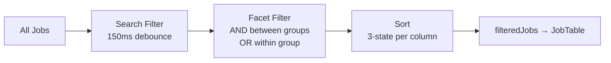

# Design Document: Pick Jobs Scheduler

## Overview

The Pick Jobs Scheduler is a frontend-only feature that replaces the existing `JobPickerPopup` modal with a full-page job picker at `/schedule/pick-jobs`. The core design insight is inverting the workflow: the scheduling tray (date, staff, time, duration) is **always visible** at the bottom of the viewport, so users set scheduling context first and then pick jobs — matching their natural workflow.

The page is a three-region CSS grid:
- **Facet Rail** (left) — five filter groups with relaxed-count logic
- **Job Table** (center) — sortable, searchable, selectable table
- **Scheduling Tray** (bottom) — persistent assignment controls with per-job time adjustments

No backend changes are required. The feature reuses three existing hooks (`useJobsReadyToSchedule`, `useStaff`, `useCreateAppointment`) and all existing shadcn/ui primitives.

### Key Design Decisions

1. **Page-local state only** — all filter, selection, and tray state lives in `useState` inside `PickJobsPage`. No URL sync for filters in v1 (only `?date` and `?staff` are read once on mount).
2. **Selection survives filtering** — `selectedJobIds` is never pruned by facet or search changes. Hidden selections are surfaced in the tray header.
3. **Sequential mutation** — `createAppointment.mutateAsync` is called one job at a time in a loop, not in parallel. The backend's conflict check benefits from sequential ordering.
4. **Relaxed facet counts** — each facet value's count reflects matches with that group's filter removed, the standard e-commerce pattern that prevents all unchecked values from reading "0".
5. **Cascade time computation** — per-job times are computed by walking forward from `startTime`, respecting per-job overrides as anchor points.

## Architecture

### Page-Level Data Flow

```mermaid
graph TD
    A[useJobsReadyToSchedule] -->|jobs[]| B[PickJobsPage]
    C[useStaff] -->|staff[]| B
    B -->|jobs, facets| D[FacetRail]
    B -->|filteredJobs, selection| E[JobTable]
    B -->|selection, staff, times| F[SchedulingTray]
    D -->|onChange facets| B
    E -->|onToggleJob, onSort| B
    F -->|onAssign| G[useCreateAppointment]
    G -->|mutateAsync per job| H[Backend API]
    H -->|success| I[toast + navigate /schedule]
```

### Filtering Pipeline



The pipeline is implemented as chained `useMemo` hooks:

1. **Search** — case-insensitive substring match against `customer_name`, `address`, `city`, `job_type`, `job_id`. Debounced at 150ms via `useEffect` + `setTimeout`.
2. **Facets** — each non-empty facet Set filters with OR within the group, AND across groups. An empty Set is a pass-through.
3. **Sort** — 3-state cycle: asc → desc → default (`priority desc, requested_week asc`). Applied via `Array.prototype.sort` with a comparator.

### Component Hierarchy

```
PickJobsPage
├── <header>           — page title, subtitle, "← Back to schedule"
├── <aside>            — FacetRail (lg: inline, md: Sheet)
│   ├── FacetGroup "City"
│   ├── FacetGroup "Tags"
│   ├── FacetGroup "Job type"
│   ├── FacetGroup "Priority"
│   └── FacetGroup "Requested week"
├── <main>             — JobTable
│   ├── Search toolbar
│   ├── <thead>        — sticky, sortable headers, tri-state checkbox
│   ├── <tbody>        — job rows + inline notes rows
│   └── Empty state
└── <footer>           — SchedulingTray
    ├── Header         — "Schedule N jobs" / idle text
    ├── Fields row     — Date, Staff, Start time, Duration
    ├── PerJobTimeAdjustments — collapsible table
    └── Assign action  — button + helper text
```

### File Structure

All new files live in `features/schedule/`:

```
features/schedule/
├── pages/
│   └── PickJobsPage.tsx              NEW — page shell, state, filtering, assign
├── components/
│   ├── FacetRail.tsx                 NEW — facet groups with relaxed counts
│   ├── JobTable.tsx                  NEW — sortable table with search
│   ├── SchedulingTray.tsx            NEW — persistent tray with fields + assign
│   └── JobPickerPopup.tsx            EXISTING — mark @deprecated
├── types/
│   └── pick-jobs.ts                  NEW — FacetState, PerJobTime, SortKey, etc.
└── hooks/
    └── (reuse existing — no new hooks)
```

### Responsive Layout

| Breakpoint | Grid | Facet Rail | Tray Fields |
|---|---|---|---|
| ≥ 1024px (`lg`) | `grid-cols-[240px_1fr]` | Inline 240px column | Single row |
| 768–1023px (`md`) | `grid-cols-1` | Sheet from left, triggered by "Filters" button | 2×2 grid |
| < 768px (`sm`) | `grid-cols-1` | Sheet (same as md) | 2×2 grid, full-width Assign |

## Components and Interfaces

### PickJobsPage

The page shell that owns all state and orchestrates the three child components.

```typescript
// pages/PickJobsPage.tsx
export function PickJobsPage(): JSX.Element
```

**State owned:**
- `search: string` — raw search input
- `debouncedSearch: string` — debounced (150ms) search value
- `facets: FacetState` — five facet Sets
- `selectedJobIds: Set<string>` — persists across filter changes
- `perJobTimes: PerJobTimeMap` — per-job time overrides
- `showTimeAdjust: boolean` — toggle for per-job table
- `assignDate: string` — tray date field (default: `?date` param or today)
- `assignStaffId: string` — tray staff field (default: `?staff` param or empty)
- `startTime: string` — tray start time (default: `'08:00'`)
- `duration: number` — tray default duration (default: `60`)
- `sortKey: SortKey` — active sort column (default: `'priority'`)
- `sortDir: SortDir` — sort direction (default: `'desc'`)

**Derived values (useMemo):**
- `filteredJobs` — search + facet pipeline applied to `jobs`
- `sortedJobs` — sort applied to `filteredJobs`

**Key functions:**
- `toggleJob(jobId)` — add/remove from `selectedJobIds`; prune `perJobTimes` on remove
- `toggleAllVisible()` — select/deselect all `sortedJobs` IDs
- `clearSelection()` — reset `selectedJobIds` and `perJobTimes`
- `clearAllFilters()` — reset `facets` to `initialFacets` (does NOT clear search)
- `handleBulkAssign()` — sequential mutation loop with toast + navigate

### FacetRail

```typescript
interface FacetRailProps {
  jobs:       JobReadyToSchedule[];  // unfiltered jobs (for relaxed counts)
  facets:     FacetState;
  onChange:   (next: FacetState) => void;
  onClearAll: () => void;
}
```

**Relaxed count algorithm:**
For each facet value in group G, count jobs that match:
1. The current search filter
2. All active facet filters **except** group G
3. The specific value being counted

This is computed by creating a relaxed copy of `FacetState` with group G's Set emptied, then filtering `jobs` against that relaxed state AND checking the specific value match.

```typescript
function relaxedCount(group: FacetKey, value: string): number {
  const relaxed: FacetState = { ...facets, [group]: new Set() };
  return jobs.filter(j => matches(j, relaxed) && matchesValue(j, group, value)).length;
}
```

**Note:** The `jobs` prop receives the full unfiltered list from `useJobsReadyToSchedule`, not the filtered list. The search filter must also be applied inside `relaxedCount` for accurate counts when search is active. The scaffold passes `jobs` (unfiltered) — the implementation must incorporate the debounced search into the relaxed count computation.

### JobTable

```typescript
interface JobTableProps {
  jobs:               JobReadyToSchedule[];  // sorted + filtered
  searchRef:          RefObject<HTMLInputElement>;
  search:             string;
  onSearchChange:     (s: string) => void;
  selectedJobIds:     Set<string>;
  onToggleJob:        (id: string) => void;
  onToggleAllVisible: () => void;
  sortKey:            SortKey;
  sortDir:            SortDir;
  onSort:             (key: SortKey, dir: SortDir) => void;
  anyFilterActive:    boolean;
  onClearAllFilters:  () => void;
}
```

**Columns:** Checkbox | Customer (+address) | Job type | Tags | City | Requested | Priority | Duration | Equipment

**Sorting:** 3-state cycle per sortable column (Customer, City, Requested, Priority, Duration). Default sort: `priority desc, requested_week asc`.

```typescript
function handleSort(key: SortKey) {
  if (sortKey !== key) { onSort(key, 'asc'); return; }
  if (sortDir === 'asc') onSort(key, 'desc');
  else onSort('priority', 'desc'); // revert to default
}
```

**Tri-state header checkbox:**
- Checked: all visible rows selected
- Indeterminate: some visible rows selected
- Unchecked: no visible rows selected

### SchedulingTray

```typescript
interface SchedulingTrayProps {
  selectedJobIds:        Set<string>;
  selectedJobs:          JobReadyToSchedule[];  // visible + selected
  totalSelectedCount:    number;                // includes hidden-by-filter
  staff:                 Staff[];

  assignDate:            string;
  onAssignDateChange:    (s: string) => void;
  assignStaffId:         string;
  onAssignStaffIdChange: (s: string) => void;
  startTime:             string;
  onStartTimeChange:     (s: string) => void;
  duration:              number;
  onDurationChange:      (n: number) => void;

  perJobTimes:           PerJobTimeMap;
  onPerJobTimesChange:   (f: PerJobTimeMap | ((prev: PerJobTimeMap) => PerJobTimeMap)) => void;
  showTimeAdjust:        boolean;
  onShowTimeAdjustChange:(b: boolean) => void;

  isAssigning:           boolean;
  onAssign:              () => void;
  onClearSelection:      () => void;
}
```

**Cascade time computation (`computeJobTimes`):**

```typescript
function computeJobTimes(
  selectedJobs: JobReadyToSchedule[],
  startTime: string,          // 'HH:MM'
  defaultDuration: number,    // minutes
  perJobTimes: PerJobTimeMap  // user overrides
): Record<string, { start: string; end: string }> {
  const result: Record<string, { start: string; end: string }> = {};
  let cursor = timeToMinutes(startTime);

  for (const job of selectedJobs) {
    const override = perJobTimes[job.job_id];
    if (override?.start) {
      // User override — use as anchor
      const start = timeToMinutes(override.start);
      const dur = override.end
        ? timeToMinutes(override.end) - start
        : (job.estimated_duration_minutes || defaultDuration);
      result[job.job_id] = {
        start: override.start,
        end: override.end || minutesToTime(start + dur),
      };
      cursor = timeToMinutes(result[job.job_id].end);
    } else {
      // Auto-cascade from cursor
      const dur = job.estimated_duration_minutes || defaultDuration;
      result[job.job_id] = {
        start: minutesToTime(cursor),
        end: minutesToTime(cursor + dur),
      };
      cursor += dur;
    }
  }
  return result;
}
```

**Assign disabled when ANY of:**
- `selectedJobIds.size === 0`
- `assignStaffId === ''`
- `createAppointment.isPending`
- Any per-job override has `end ≤ start`

**Helper text logic:**
- No selection → "Pick jobs above to continue"
- No staff → "Pick a staff member to continue"
- Time overlap → "Selected job times overlap — review per-job adjustments"
- Otherwise → "N jobs selected"

### Mutation Flow (handleBulkAssign)

```typescript
async function handleBulkAssign() {
  const times = computeJobTimes(selectedJobs, startTime, duration, perJobTimes);
  let ok = 0, fail = 0;

  for (const jobId of selectedJobIds) {
    const t = times[jobId];
    if (!t) { fail++; continue; }
    try {
      await createAppointment.mutateAsync({
        job_id: jobId,
        staff_id: assignStaffId,
        scheduled_date: assignDate,
        time_window_start: `${t.start}:00`,  // HH:MM → HH:MM:SS
        time_window_end: `${t.end}:00`,
      });
      ok++;
    } catch { fail++; }
  }

  if (ok > 0) toast.success(`Assigned ${ok} job${ok !== 1 ? 's' : ''} to schedule`);
  if (fail > 0) toast.error(`Failed to assign ${fail} job${fail !== 1 ? 's' : ''}`);
  clearSelection();
  if (ok > 0) {
    suppressGuardRef.current = true;
    navigate(`/schedule?date=${assignDate}`);
  }
}
```

**Query invalidations** (verify these exist in `useCreateAppointment`'s `onSuccess`):
- `['jobs-ready-to-schedule']`
- `appointmentKeys.all` (covers daily, weekly, staffDaily)
- `['dashboard', 'today-schedule']` — add if missing

## Data Models

### Existing Types (reused, not redefined)

**`JobReadyToSchedule`** (from `features/schedule/types/index.ts`):
```typescript
interface JobReadyToSchedule {
  job_id: string;
  customer_id: string;
  customer_name: string;
  job_type: string;
  city: string;
  priority: string;           // stringified priority_level: '0' (normal), '1' (high), '2' (urgent)
  estimated_duration_minutes: number;
  requires_equipment: string[];
  status: string;
}
```

**Note:** The scaffold files reference additional fields (`address`, `tags`, `requested_week`, `notes`, `priority_level`) that are not on the current `JobReadyToSchedule` type. These fields must be added to the backend response and the frontend type before implementation. The design assumes these fields will be available.

**Important — Real Tags:** The handoff's placeholder `TAG_COLORS` map (vip, commercial, hoa, prepaid, needs-ladder, dog-on-site, gated) does NOT match the actual tags in the codebase. The real tags are:
- **Customer tags** (`CustomerTag` from `features/jobs/types`): `priority`, `red_flag`, `slow_payer`, `new_customer` — styled via `CUSTOMER_TAG_CONFIG`
- **Property tags** (derived from property fields): `residential`, `commercial`, `hoa`, `subscription` — styled via `PropertyTags` component (`shared/components/PropertyTags.tsx`)

**Important — Real Priority Levels:** The handoff uses `'high' | 'normal'` for priority, but the actual system uses numeric `priority_level` values:
- `0` = Normal
- `1` = High
- `2` = Urgent
The backend API returns `priority` as a stringified integer (e.g. `"0"`, `"1"`, `"2"`). The Priority facet group and column must use these real values. The priority indicator should show a filled amber star for levels 1 (high) and 2 (urgent), and an em-dash for level 0 (normal). The default sort should order by `priority_level` descending (urgent first, then high, then normal).

The Tags column and Tags facet group should use `customer_tags` (from the job's associated customer) rather than a standalone `tags` field. The implementation must import and reuse `CUSTOMER_TAG_CONFIG` and `PropertyTags` styling rather than the handoff's placeholder `TAG_COLORS`.

**Extended `JobReadyToSchedule`** (fields to add):
```typescript
interface JobReadyToSchedule {
  // ... existing fields ...
  address?: string;
  customer_tags?: CustomerTag[];    // 'priority' | 'red_flag' | 'slow_payer' | 'new_customer'
  property_type?: 'residential' | 'commercial' | null;
  property_is_hoa?: boolean;
  property_is_subscription?: boolean;
  requested_week?: string;    // ISO date of Monday, e.g. '2026-04-27'
  notes?: string;
  priority_level?: number;    // numeric for sorting (0=normal, 1=high, 2=urgent)
}
```

**`Staff`** (from `features/staff/types/index.ts`):
```typescript
interface Staff {
  id: string;
  name: string;
  phone: string;
  email: string | null;
  role: StaffRole;
  is_active: boolean;
  // ... other fields
}
```

**`AppointmentCreate`** (from `features/schedule/types/index.ts`):
```typescript
interface AppointmentCreate {
  job_id: string;
  staff_id: string;
  scheduled_date: string;       // YYYY-MM-DD
  time_window_start: string;    // HH:MM:SS
  time_window_end: string;      // HH:MM:SS
  notes?: string;
}
```

### New Types (in `features/schedule/types/pick-jobs.ts`)

```typescript
export type PriorityLevel = '0' | '1' | '2';  // 0=normal, 1=high, 2=urgent (matches Job.priority_level)

/** Facet groups rendered in the left rail. */
export interface FacetState {
  city:          Set<string>;
  tags:          Set<string>;          // customer tags: 'priority', 'red_flag', 'slow_payer', 'new_customer'
  jobType:       Set<string>;
  priority:      Set<string>;          // numeric string from priority_level: '0' (normal), '1' (high), '2' (urgent)
  requestedWeek: Set<string>;          // ISO date of Monday
}

export const initialFacets: FacetState = {
  city:          new Set(),
  tags:          new Set(),
  jobType:       new Set(),
  priority:      new Set(),
  requestedWeek: new Set(),
};

/** Per-job time override in the scheduling tray. */
export interface PerJobTime {
  start: string;  // 'HH:MM'
  end:   string;  // 'HH:MM'
}

export type PerJobTimeMap = Record<string, PerJobTime>;

export type SortKey = 'customer' | 'city' | 'requested_week' | 'priority' | 'duration';
export type SortDir = 'asc' | 'desc';
```

### State Shape Summary

| State Variable | Type | Default | Persists Across Filters? |
|---|---|---|---|
| `search` | `string` | `''` | N/A |
| `debouncedSearch` | `string` | `''` | N/A |
| `facets` | `FacetState` | all empty Sets | N/A |
| `selectedJobIds` | `Set<string>` | empty Set | **Yes** |
| `perJobTimes` | `PerJobTimeMap` | `{}` | **Yes** (pruned on deselect) |
| `showTimeAdjust` | `boolean` | `false` | Yes |
| `assignDate` | `string` | `?date` param or today | Yes |
| `assignStaffId` | `string` | `?staff` param or `''` | Yes |
| `startTime` | `string` | `'08:00'` | Yes |
| `duration` | `number` | `60` | Yes |
| `sortKey` | `SortKey` | `'priority'` | Yes |
| `sortDir` | `SortDir` | `'desc'` | Yes |


## Correctness Properties

*A property is a characteristic or behavior that should hold true across all valid executions of a system — essentially, a formal statement about what the system should do. Properties serve as the bridge between human-readable specifications and machine-verifiable correctness guarantees.*

### Property 1: Facet filter contract (AND between groups, OR within group)

*For any* list of jobs and *any* FacetState where some groups have selected values, the filtered output SHALL contain exactly the jobs that satisfy: for every non-empty facet group, the job matches at least one selected value in that group (OR within group), AND this holds across all non-empty groups simultaneously (AND between groups). A job excluded from the output SHALL fail at least one non-empty facet group.

**Validates: Requirements 3.3, 3.8**

### Property 2: Relaxed count correctness

*For any* list of jobs, *any* FacetState, and *any* facet group G with value V, the relaxed count for V in G SHALL equal the number of jobs that match all active facet filters except G's filter AND also match value V. Furthermore, for any facet group G, the sum of relaxed counts across all values in G SHALL be greater than or equal to the total filtered count (since values within a group use OR semantics and a job may match multiple values).

**Validates: Requirements 3.4**

### Property 3: Search filter correctness

*For any* list of jobs and *any* non-empty search query string, the search-filtered output SHALL contain exactly the jobs where at least one of the searchable fields (customer_name, address, city, job_type, job_id) contains the query as a case-insensitive substring. Every excluded job SHALL have no searchable field containing the query.

**Validates: Requirements 5.3**

### Property 4: Selection persistence across filter changes

*For any* set of selectedJobIds and *any* change to the FacetState (adding values, removing values, or clearing groups), the selectedJobIds set SHALL remain identical before and after the facet change. No facet operation SHALL add to or remove from the selection set.

**Validates: Requirements 3.10, 12.1**

### Property 5: Select-all only affects visible rows

*For any* set of currently visible (filtered) job IDs, *any* set of existing selectedJobIds (which may include IDs not in the visible set), toggling select-all SHALL: (a) if not all visible are selected, add all visible IDs to the selection while preserving all previously selected hidden IDs; (b) if all visible are selected, remove only the visible IDs from the selection while preserving all hidden selected IDs. In both cases, IDs not in the visible set SHALL remain unchanged in selectedJobIds.

**Validates: Requirements 4.5, 12.3**

### Property 6: Sort ordering correctness

*For any* list of jobs, *any* sortable column key (customer, city, requested_week, priority, duration), and *any* sort direction (asc or desc), the sorted output SHALL be ordered such that for every adjacent pair (jobs[i], jobs[i+1]), the comparison of the sort key values respects the specified direction. When sort is in default state, jobs SHALL be ordered by priority descending first, then by requested_week ascending as a tiebreaker.

**Validates: Requirements 4.6**

### Property 7: Cascade time computation is sequential and respects overrides

*For any* ordered list of selected jobs with positive durations, *any* valid start time, *any* positive default duration, and *any* set of per-job time overrides (where overridden start < overridden end), the computed times SHALL satisfy: (a) for auto-mode jobs (no override), each job's start equals the previous job's end (or the global start time for the first auto-mode job after the last override); (b) for overridden jobs, the computed start and end match the override values; (c) no two jobs have overlapping time windows; (d) all computed end times are strictly greater than their start times.

**Validates: Requirements 9.4, 9.5**

### Property 8: Override cleanup on deselect

*For any* PerJobTimeMap and *any* job ID that is deselected, after the deselect operation the PerJobTimeMap SHALL not contain an entry for that job ID, and all other entries SHALL remain unchanged (same keys, same values).

**Validates: Requirements 9.6**

### Property 9: Overlap detection correctness

*For any* PerJobTimeMap, the overlap detection function SHALL return true (indicating an overlap/invalid state) if and only if at least one entry has an end time less than or equal to its start time. If all entries have end > start (or the map is empty), the function SHALL return false.

**Validates: Requirements 11.4**

## Error Handling

### Data Loading Errors

| Scenario | Handling |
|---|---|
| `useJobsReadyToSchedule` returns error | Render error message: "Failed to load jobs. Retry?" with retry action. Facet rail and tray remain visible but non-functional. |
| `useStaff` returns error | Staff dropdown shows empty state. Assign button disabled with helper: "Unable to load staff." |
| `useJobsReadyToSchedule` returns empty `jobs[]` | Show empty state: "All jobs are scheduled. Nice work." (no filters) or "No jobs match these filters." (filters active). |

### Mutation Errors

| Scenario | Handling |
|---|---|
| Individual `createAppointment` call fails | Increment failure counter, continue loop. After loop: `toast.error('Failed to assign M jobs')`. |
| All calls fail | `toast.error('Failed to assign N jobs')`. No navigation. Selection preserved so user can retry. |
| Partial success | Both `toast.success` and `toast.error` fire. Navigate to schedule (at least some jobs landed). Clear selection. |
| Network error during loop | Caught by try/catch per iteration. Counted as failure. Loop continues for remaining jobs. |

### Input Validation

| Scenario | Handling |
|---|---|
| Per-job override with end ≤ start | Assign button disabled. Helper text: "Selected job times overlap — review per-job adjustments." |
| No staff selected | Assign button disabled. Helper text: "Pick a staff member to continue." |
| No jobs selected | Assign button disabled. Helper text: "Pick jobs above to continue." |
| Duration < 15 or non-multiple of 15 | `<Input type="number" min={15} step={15}>` constrains at the HTML level. `onChange` handler floors to nearest valid value. |

### Navigation Guard

| Scenario | Handling |
|---|---|
| Browser back/sidebar nav with selections | `beforeunload` event handler prevents immediate leave. In-app navigation blocked by `useBlocker()` → `<AlertDialog>` with "You have N selected jobs that haven't been scheduled. Leave anyway?" |
| Assign-triggered navigation | Guard suppressed via `suppressGuardRef.current = true` before `navigate()`. |
| User confirms leave | Navigation proceeds. Selection is lost (acceptable — user chose to leave). |
| User cancels leave | Navigation blocked. User stays on page with selection intact. |

## Testing Strategy

### Testing Framework

- **Unit/Component tests:** Vitest + React Testing Library (co-located in `features/schedule/`)
- **Property-based tests:** [fast-check](https://github.com/dubzzz/fast-check) for TypeScript PBT (already compatible with Vitest)
- Minimum **100 iterations** per property test

### Dual Testing Approach

**Property-based tests** verify the universal correctness properties defined above. They generate random inputs (job lists, facet states, search queries, time overrides) and assert that invariants hold across all generated cases. These are the primary correctness guarantee for the pure logic functions.

**Example-based unit tests** verify specific UI behaviors, rendering states, accessibility attributes, and integration points that don't vary meaningfully with input.

### Property Test Plan

Each property test references its design document property and uses the tag format:

| Property | Test File | Tag |
|---|---|---|
| P1: Facet filter contract | `FacetRail.test.tsx` | `Feature: pick-jobs-scheduler, Property 1: Facet filter AND/OR` |
| P2: Relaxed count correctness | `FacetRail.test.tsx` | `Feature: pick-jobs-scheduler, Property 2: Relaxed count` |
| P3: Search filter correctness | `JobTable.test.tsx` | `Feature: pick-jobs-scheduler, Property 3: Search filter` |
| P4: Selection persistence | `PickJobsPage.test.tsx` | `Feature: pick-jobs-scheduler, Property 4: Selection persistence` |
| P5: Select-all visible only | `PickJobsPage.test.tsx` | `Feature: pick-jobs-scheduler, Property 5: Select-all visible` |
| P6: Sort ordering | `JobTable.test.tsx` | `Feature: pick-jobs-scheduler, Property 6: Sort ordering` |
| P7: Cascade time computation | `SchedulingTray.test.tsx` | `Feature: pick-jobs-scheduler, Property 7: Cascade times` |
| P8: Override cleanup | `SchedulingTray.test.tsx` | `Feature: pick-jobs-scheduler, Property 8: Override cleanup` |
| P9: Overlap detection | `SchedulingTray.test.tsx` | `Feature: pick-jobs-scheduler, Property 9: Overlap detection` |

### Generator Strategy

For fast-check generators:

```typescript
// Job generator — uses real customer tags and property tags from the codebase
const arbJob = fc.record({
  job_id: fc.uuid(),
  customer_name: fc.string({ minLength: 1, maxLength: 50 }),
  address: fc.option(fc.string({ minLength: 1, maxLength: 100 })),
  city: fc.constantFrom('Plymouth', 'Minnetonka', 'Golden Valley', 'Edina'),
  job_type: fc.constantFrom('spring_startup', 'fall_winterization', 'repair', 'inspection'),
  customer_tags: fc.array(fc.constantFrom('priority', 'red_flag', 'slow_payer', 'new_customer'), { maxLength: 3 }),
  property_type: fc.constantFrom('residential', 'commercial', null),
  property_is_hoa: fc.boolean(),
  property_is_subscription: fc.boolean(),
  priority: fc.constantFrom('0', '1', '2'),
  requested_week: fc.constantFrom('2026-04-27', '2026-05-04', '2026-05-11'),
  estimated_duration_minutes: fc.integer({ min: 15, max: 180 }),
  notes: fc.option(fc.string({ maxLength: 200 })),
});

// FacetState generator — tags facet uses real customer tags
const arbFacetState = fc.record({
  city: fc.array(fc.constantFrom('Plymouth', 'Minnetonka', 'Golden Valley', 'Edina')).map(a => new Set(a)),
  tags: fc.array(fc.constantFrom('priority', 'red_flag', 'slow_payer', 'new_customer')).map(a => new Set(a)),
  jobType: fc.array(fc.constantFrom('spring_startup', 'fall_winterization', 'repair')).map(a => new Set(a)),
  priority: fc.array(fc.constantFrom('0', '1', '2')).map(a => new Set(a)),
  requestedWeek: fc.array(fc.constantFrom('2026-04-27', '2026-05-04')).map(a => new Set(a)),
});

// Time override generator (valid: end > start)
const arbTimeOverride = fc.integer({ min: 0, max: 22 * 60 }).chain(startMin =>
  fc.integer({ min: startMin + 15, max: 23 * 60 + 45 }).map(endMin => ({
    start: minutesToTime(startMin),
    end: minutesToTime(endMin),
  }))
);
```

### Example-Based Unit Test Plan

| Test | Component | Validates |
|---|---|---|
| Renders empty state with zero jobs | PickJobsPage | Req 6.1 |
| Renders rows with multiple jobs | JobTable | Req 4.1 |
| Row click toggles selection | JobTable | Req 4.2 |
| Facet click filters rows, preserves selection | FacetRail + PickJobsPage | Req 3.3, 12.1 |
| Tri-state checkbox reflects selection state | JobTable | Req 4.4 |
| Assign disabled without staff | SchedulingTray | Req 11.2 |
| Assign calls createAppointment per job | PickJobsPage | Req 10.1 |
| Success toast + navigation on assign | PickJobsPage | Req 10.2, 10.4 |
| Search debounce + filter | JobTable | Req 5.2 |
| Per-job override persists across toggles | SchedulingTray | Req 9.5 |
| URL `?date=...&staff=...` prefill | PickJobsPage | Req 1.4, 1.5 |
| Leave guard on navigate-away | PickJobsPage | Req 13.1 |
| Inline notes row for jobs with notes | JobTable | Req 4.8 |
| Tag pills use CUSTOMER_TAG_CONFIG + PropertyTags | JobTable | Req 4.9 |
| Priority star (1,2) vs em-dash (0) | JobTable | Req 4.10 |
| Tray always rendered (idle + active) | SchedulingTray | Req 8.1 |
| Hidden selections note in tray | SchedulingTray | Req 8.4 |
| Keyboard `/` focuses search | PickJobsPage | Req 5.4 |
| Keyboard `Esc` clears search | JobTable | Req 5.5 |
| `Cmd+Enter` triggers assign | PickJobsPage | Req 15.7 |
| Landmark elements present | PickJobsPage | Req 15.1 |
| aria-sort on sort headers | JobTable | Req 15.4 |
| aria-live on tray header | SchedulingTray | Req 15.6 |

### Test IDs

All interactive elements use `data-testid` following existing kebab-case conventions:

```
pick-jobs-page
facet-rail
facet-group-city | facet-group-tags | facet-group-job-type | facet-group-priority | facet-group-week
facet-value-<facet>-<value>
job-table
job-search
job-table-select-all
job-row-<job_id>
job-row-checkbox-<job_id>
scheduling-tray
tray-date | tray-staff | tray-start-time | tray-duration
tray-time-adjust-toggle
tray-time-adjust-table
tray-assign-btn
tray-clear-selection
```
