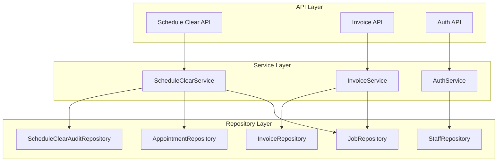

# Design Document: Schedule Workflow Improvements (Phase 8)

## Introduction

This document provides the technical design for the Schedule Workflow Improvements feature of Grin's Irrigation Platform. It defines the database schema, API endpoints, service layer architecture, and implementation patterns for three major priorities: Schedule Clear & Reset Features, Invoice Management System, and Authentication & Login System.

## Design Overview

The Schedule Workflow Improvements feature follows the established layered architecture pattern:

```
┌─────────────────────────────────────────────────────────────┐
│                      API Layer                               │
│  FastAPI endpoints with Pydantic request/response models     │
├─────────────────────────────────────────────────────────────┤
│                    Service Layer                             │
│  ScheduleClearService, InvoiceService, AuthService           │
│  with LoggerMixin for business logic                         │
├─────────────────────────────────────────────────────────────┤
│                   Repository Layer                           │
│  ScheduleClearAuditRepository, InvoiceRepository             │
├─────────────────────────────────────────────────────────────┤
│                    Database Layer                            │
│  PostgreSQL with SQLAlchemy async models                     │
└─────────────────────────────────────────────────────────────┘
```

## Architecture

### Component Relationships



## Database Schema

### schedule_clear_audit Table

```sql
CREATE TABLE schedule_clear_audit (
    id UUID PRIMARY KEY DEFAULT gen_random_uuid(),
    
    -- Clear Operation Details
    schedule_date DATE NOT NULL,
    appointments_data JSONB NOT NULL,
    jobs_reset UUID[] NOT NULL,
    appointment_count INTEGER NOT NULL,
    
    -- Audit Info
    cleared_by UUID REFERENCES staff(id),
    cleared_at TIMESTAMP WITH TIME ZONE DEFAULT NOW(),
    notes TEXT,
    
    -- Timestamps
    created_at TIMESTAMP WITH TIME ZONE DEFAULT NOW()
);

-- Indexes
CREATE INDEX idx_schedule_clear_audit_date ON schedule_clear_audit(schedule_date);
CREATE INDEX idx_schedule_clear_audit_cleared_at ON schedule_clear_audit(cleared_at);
```


### invoices Table

```sql
CREATE TABLE invoices (
    id UUID PRIMARY KEY DEFAULT gen_random_uuid(),
    
    -- References
    job_id UUID NOT NULL REFERENCES jobs(id),
    customer_id UUID NOT NULL REFERENCES customers(id),
    
    -- Invoice Identity
    invoice_number VARCHAR(50) UNIQUE NOT NULL,
    
    -- Amounts
    amount DECIMAL(10, 2) NOT NULL,
    late_fee_amount DECIMAL(10, 2) DEFAULT 0,
    total_amount DECIMAL(10, 2) NOT NULL,
    
    -- Dates
    invoice_date DATE NOT NULL DEFAULT CURRENT_DATE,
    due_date DATE NOT NULL,
    
    -- Status
    status VARCHAR(50) NOT NULL DEFAULT 'draft',
    
    -- Payment Info
    payment_method VARCHAR(50),
    payment_reference VARCHAR(255),
    paid_at TIMESTAMP WITH TIME ZONE,
    paid_amount DECIMAL(10, 2),
    
    -- Reminders
    reminder_count INTEGER DEFAULT 0,
    last_reminder_sent TIMESTAMP WITH TIME ZONE,
    
    -- Lien Tracking
    lien_eligible BOOLEAN DEFAULT FALSE,
    lien_warning_sent TIMESTAMP WITH TIME ZONE,
    lien_filed_date DATE,
    
    -- Content
    line_items JSONB,
    notes TEXT,
    
    -- Timestamps
    created_at TIMESTAMP WITH TIME ZONE DEFAULT NOW(),
    updated_at TIMESTAMP WITH TIME ZONE DEFAULT NOW(),
    
    -- Constraints
    CONSTRAINT valid_invoice_status CHECK (status IN (
        'draft', 'sent', 'viewed', 'paid', 'partial', 
        'overdue', 'lien_warning', 'lien_filed', 'cancelled'
    )),
    CONSTRAINT valid_payment_method CHECK (payment_method IS NULL OR payment_method IN (
        'cash', 'check', 'venmo', 'zelle', 'stripe'
    )),
    CONSTRAINT positive_amount CHECK (amount >= 0),
    CONSTRAINT positive_late_fee CHECK (late_fee_amount >= 0),
    CONSTRAINT positive_total CHECK (total_amount >= 0),
    CONSTRAINT positive_paid CHECK (paid_amount IS NULL OR paid_amount >= 0)
);

-- Indexes
CREATE INDEX idx_invoices_job ON invoices(job_id);
CREATE INDEX idx_invoices_customer ON invoices(customer_id);
CREATE INDEX idx_invoices_status ON invoices(status);
CREATE INDEX idx_invoices_invoice_date ON invoices(invoice_date);
CREATE INDEX idx_invoices_due_date ON invoices(due_date);
CREATE INDEX idx_invoices_lien_eligible ON invoices(lien_eligible);

-- Sequence for invoice numbers
CREATE SEQUENCE invoice_number_seq START 1;
```


### Staff Table Authentication Extensions

```sql
-- Add authentication columns to existing staff table
ALTER TABLE staff ADD COLUMN username VARCHAR(50) UNIQUE;
ALTER TABLE staff ADD COLUMN password_hash VARCHAR(255);
ALTER TABLE staff ADD COLUMN is_login_enabled BOOLEAN DEFAULT FALSE;
ALTER TABLE staff ADD COLUMN last_login TIMESTAMP WITH TIME ZONE;
ALTER TABLE staff ADD COLUMN failed_login_attempts INTEGER DEFAULT 0;
ALTER TABLE staff ADD COLUMN locked_until TIMESTAMP WITH TIME ZONE;

-- Index for username lookups
CREATE INDEX idx_staff_username ON staff(username) WHERE username IS NOT NULL;
```

### Job Table Extension

```sql
-- Add payment tracking to jobs table
ALTER TABLE jobs ADD COLUMN payment_collected_on_site BOOLEAN DEFAULT FALSE;
```

## Components and Interfaces

### API Endpoints

#### Schedule Clear Endpoints (3 endpoints)

| Method | Endpoint | Description | Request Body | Response |
|--------|----------|-------------|--------------|----------|
| POST | `/api/v1/schedule/clear` | Clear appointments for a date | ScheduleClearRequest | ScheduleClearResponse |
| GET | `/api/v1/schedule/clear/recent` | Get recently cleared schedules | Query params | ScheduleClearAuditResponse[] |
| GET | `/api/v1/schedule/clear/{audit_id}` | Get clear audit details | - | ScheduleClearAuditDetailResponse |

#### Invoice Endpoints (12 endpoints)

| Method | Endpoint | Description | Request Body | Response |
|--------|----------|-------------|--------------|----------|
| POST | `/api/v1/invoices` | Create invoice | InvoiceCreate | InvoiceResponse |
| GET | `/api/v1/invoices/{id}` | Get invoice by ID | - | InvoiceDetailResponse |
| PUT | `/api/v1/invoices/{id}` | Update invoice | InvoiceUpdate | InvoiceResponse |
| DELETE | `/api/v1/invoices/{id}` | Cancel invoice | - | 204 No Content |
| GET | `/api/v1/invoices` | List invoices | Query params | PaginatedInvoiceResponse |
| POST | `/api/v1/invoices/{id}/send` | Send invoice | - | InvoiceResponse |
| POST | `/api/v1/invoices/{id}/payment` | Record payment | PaymentRecord | InvoiceResponse |
| POST | `/api/v1/invoices/{id}/reminder` | Send reminder | - | InvoiceResponse |
| POST | `/api/v1/invoices/{id}/lien-warning` | Send lien warning | - | InvoiceResponse |
| POST | `/api/v1/invoices/{id}/lien-filed` | Mark lien filed | LienFiledRequest | InvoiceResponse |
| GET | `/api/v1/invoices/overdue` | List overdue invoices | Query params | PaginatedInvoiceResponse |
| GET | `/api/v1/invoices/lien-deadlines` | Get lien deadline invoices | - | LienDeadlineResponse |
| POST | `/api/v1/invoices/generate-from-job/{job_id}` | Generate from job | - | InvoiceResponse |


#### Authentication Endpoints (5 endpoints)

| Method | Endpoint | Description | Request Body | Response |
|--------|----------|-------------|--------------|----------|
| POST | `/api/v1/auth/login` | Authenticate user | LoginRequest | LoginResponse |
| POST | `/api/v1/auth/logout` | Logout user | - | 204 No Content |
| POST | `/api/v1/auth/refresh` | Refresh access token | - | TokenResponse |
| GET | `/api/v1/auth/me` | Get current user | - | UserResponse |
| POST | `/api/v1/auth/change-password` | Change password | ChangePasswordRequest | 204 No Content |

## Data Models

### Enum Types

```python
from enum import Enum

class InvoiceStatus(str, Enum):
    """Invoice status enumeration."""
    DRAFT = "draft"
    SENT = "sent"
    VIEWED = "viewed"
    PAID = "paid"
    PARTIAL = "partial"
    OVERDUE = "overdue"
    LIEN_WARNING = "lien_warning"
    LIEN_FILED = "lien_filed"
    CANCELLED = "cancelled"

class PaymentMethod(str, Enum):
    """Payment method enumeration."""
    CASH = "cash"
    CHECK = "check"
    VENMO = "venmo"
    ZELLE = "zelle"
    STRIPE = "stripe"

class UserRole(str, Enum):
    """User role enumeration for access control."""
    ADMIN = "admin"
    MANAGER = "manager"
    TECH = "tech"
```

### Pydantic Schemas

#### Schedule Clear Schemas

```python
from pydantic import BaseModel, Field
from typing import Optional, List
from datetime import date, datetime
from uuid import UUID

class ScheduleClearRequest(BaseModel):
    schedule_date: date
    notes: Optional[str] = None

class ScheduleClearResponse(BaseModel):
    audit_id: UUID
    schedule_date: date
    appointments_deleted: int
    jobs_reset: int
    cleared_at: datetime

class ScheduleClearAuditResponse(BaseModel):
    id: UUID
    schedule_date: date
    appointment_count: int
    cleared_at: datetime
    cleared_by: Optional[UUID]
    notes: Optional[str]

    class Config:
        from_attributes = True

class ScheduleClearAuditDetailResponse(ScheduleClearAuditResponse):
    appointments_data: List[dict]
    jobs_reset: List[UUID]
```


#### Invoice Schemas

```python
class InvoiceLineItem(BaseModel):
    description: str
    quantity: int = Field(default=1, ge=1)
    unit_price: Decimal = Field(..., ge=0)
    total: Decimal = Field(..., ge=0)

class InvoiceCreate(BaseModel):
    job_id: UUID
    amount: Decimal = Field(..., ge=0)
    late_fee_amount: Decimal = Field(default=Decimal("0"), ge=0)
    due_date: Optional[date] = None  # Defaults to 14 days from now
    line_items: Optional[List[InvoiceLineItem]] = None
    notes: Optional[str] = None

class InvoiceUpdate(BaseModel):
    amount: Optional[Decimal] = Field(None, ge=0)
    late_fee_amount: Optional[Decimal] = Field(None, ge=0)
    due_date: Optional[date] = None
    line_items: Optional[List[InvoiceLineItem]] = None
    notes: Optional[str] = None

class PaymentRecord(BaseModel):
    amount: Decimal = Field(..., gt=0)
    payment_method: PaymentMethod
    payment_reference: Optional[str] = None

class LienFiledRequest(BaseModel):
    filing_date: date
    notes: Optional[str] = None

class InvoiceResponse(BaseModel):
    id: UUID
    job_id: UUID
    customer_id: UUID
    invoice_number: str
    amount: Decimal
    late_fee_amount: Decimal
    total_amount: Decimal
    invoice_date: date
    due_date: date
    status: InvoiceStatus
    payment_method: Optional[PaymentMethod]
    payment_reference: Optional[str]
    paid_at: Optional[datetime]
    paid_amount: Optional[Decimal]
    reminder_count: int
    last_reminder_sent: Optional[datetime]
    lien_eligible: bool
    lien_warning_sent: Optional[datetime]
    lien_filed_date: Optional[date]
    line_items: Optional[List[InvoiceLineItem]]
    notes: Optional[str]
    created_at: datetime
    updated_at: datetime

    class Config:
        from_attributes = True

class InvoiceDetailResponse(InvoiceResponse):
    job: 'JobResponse'
    customer: 'CustomerResponse'

class LienDeadlineResponse(BaseModel):
    approaching_45_day: List[InvoiceResponse]
    approaching_120_day: List[InvoiceResponse]

class InvoiceListParams(BaseModel):
    page: int = Field(default=1, ge=1)
    page_size: int = Field(default=20, ge=1, le=100)
    status: Optional[InvoiceStatus] = None
    customer_id: Optional[UUID] = None
    date_from: Optional[date] = None
    date_to: Optional[date] = None
    lien_eligible: Optional[bool] = None
    sort_by: str = Field(default="invoice_date")
    sort_order: str = Field(default="desc")

class PaginatedInvoiceResponse(BaseModel):
    items: List[InvoiceResponse]
    total: int
    page: int
    page_size: int
    total_pages: int
```


#### Authentication Schemas

```python
class LoginRequest(BaseModel):
    username: str = Field(..., min_length=1)
    password: str = Field(..., min_length=1)
    remember_me: bool = False

class LoginResponse(BaseModel):
    access_token: str
    token_type: str = "bearer"
    expires_in: int
    user: 'UserResponse'

class TokenResponse(BaseModel):
    access_token: str
    token_type: str = "bearer"
    expires_in: int

class UserResponse(BaseModel):
    id: UUID
    username: str
    name: str
    email: Optional[str]
    role: UserRole
    is_active: bool

    class Config:
        from_attributes = True

class ChangePasswordRequest(BaseModel):
    current_password: str = Field(..., min_length=1)
    new_password: str = Field(..., min_length=8)

    @field_validator('new_password')
    @classmethod
    def validate_password_strength(cls, v: str) -> str:
        if not any(c.isupper() for c in v):
            raise ValueError('Password must contain at least one uppercase letter')
        if not any(c.islower() for c in v):
            raise ValueError('Password must contain at least one lowercase letter')
        if not any(c.isdigit() for c in v):
            raise ValueError('Password must contain at least one number')
        return v
```

## Service Layer Design

### ScheduleClearService

```python
from grins_platform.logging import LoggerMixin

class ScheduleClearService(LoggerMixin):
    """Service for schedule clear operations."""
    
    DOMAIN = "schedule"
    
    def __init__(
        self,
        audit_repository: ScheduleClearAuditRepository,
        appointment_repository: AppointmentRepository,
        job_repository: JobRepository,
    ):
        self.audit_repository = audit_repository
        self.appointment_repository = appointment_repository
        self.job_repository = job_repository
    
    async def clear_schedule(
        self, 
        schedule_date: date, 
        cleared_by: Optional[UUID] = None,
        notes: Optional[str] = None
    ) -> ScheduleClearResponse:
        """Clear all appointments for a specific date."""
        self.log_started("clear_schedule", schedule_date=str(schedule_date))
        
        # Get appointments to be deleted
        appointments = await self.appointment_repository.find_by_date(schedule_date)
        if not appointments:
            self.log_completed("clear_schedule", appointments_deleted=0)
            return ScheduleClearResponse(
                audit_id=None,
                schedule_date=schedule_date,
                appointments_deleted=0,
                jobs_reset=0,
                cleared_at=datetime.now(timezone.utc),
            )
        
        # Serialize appointment data for audit
        appointments_data = [apt.to_dict() for apt in appointments]
        
        # Get unique job IDs with status 'scheduled'
        job_ids = list(set(apt.job_id for apt in appointments))
        jobs_to_reset = await self.job_repository.find_by_ids_and_status(
            job_ids, JobStatus.SCHEDULED
        )
        jobs_reset_ids = [job.id for job in jobs_to_reset]
        
        # Create audit log before deletion
        audit = await self.audit_repository.create(
            schedule_date=schedule_date,
            appointments_data=appointments_data,
            jobs_reset=jobs_reset_ids,
            appointment_count=len(appointments),
            cleared_by=cleared_by,
            notes=notes,
        )
        
        # Delete appointments
        await self.appointment_repository.delete_by_date(schedule_date)
        
        # Reset job statuses to 'approved'
        for job in jobs_to_reset:
            await self.job_repository.update(
                job.id, 
                {"status": JobStatus.APPROVED.value, "scheduled_at": None}
            )
        
        self.log_completed(
            "clear_schedule",
            audit_id=str(audit.id),
            appointments_deleted=len(appointments),
            jobs_reset=len(jobs_reset_ids),
        )
        
        return ScheduleClearResponse(
            audit_id=audit.id,
            schedule_date=schedule_date,
            appointments_deleted=len(appointments),
            jobs_reset=len(jobs_reset_ids),
            cleared_at=audit.cleared_at,
        )
    
    async def get_recent_clears(self, hours: int = 24) -> List[ScheduleClearAudit]:
        """Get schedule clears from the last N hours."""
        self.log_started("get_recent_clears", hours=hours)
        
        cutoff = datetime.now(timezone.utc) - timedelta(hours=hours)
        clears = await self.audit_repository.find_since(cutoff)
        
        self.log_completed("get_recent_clears", count=len(clears))
        return clears
    
    async def get_clear_details(self, audit_id: UUID) -> ScheduleClearAudit:
        """Get detailed audit log for a clear operation."""
        self.log_started("get_clear_details", audit_id=str(audit_id))
        
        audit = await self.audit_repository.get_by_id(audit_id)
        if not audit:
            self.log_rejected("get_clear_details", reason="not_found")
            raise ScheduleClearAuditNotFoundError(audit_id)
        
        self.log_completed("get_clear_details", audit_id=str(audit_id))
        return audit
```


### InvoiceService

```python
class InvoiceService(LoggerMixin):
    """Service for invoice management operations."""
    
    DOMAIN = "invoice"
    
    # Lien-eligible job types (per business requirements)
    # Only installations and major repairs qualify for mechanic's lien
    LIEN_ELIGIBLE_TYPES = {"installation", "major_repair"}
    
    def __init__(
        self,
        invoice_repository: InvoiceRepository,
        job_repository: JobRepository,
        customer_repository: CustomerRepository,
    ):
        self.invoice_repository = invoice_repository
        self.job_repository = job_repository
        self.customer_repository = customer_repository
    
    async def create_invoice(self, data: InvoiceCreate) -> Invoice:
        """Create a new invoice."""
        self.log_started("create_invoice", job_id=str(data.job_id))
        
        # Validate job exists
        job = await self.job_repository.get_by_id(data.job_id)
        if not job or job.is_deleted:
            self.log_rejected("create_invoice", reason="job_not_found")
            raise JobNotFoundError(data.job_id)
        
        # Generate invoice number
        invoice_number = await self._generate_invoice_number()
        
        # Calculate total
        total_amount = data.amount + data.late_fee_amount
        
        # Determine due date (default 14 days)
        due_date = data.due_date or (date.today() + timedelta(days=14))
        
        # Determine lien eligibility
        lien_eligible = job.job_type.lower() in self.LIEN_ELIGIBLE_TYPES
        
        invoice = await self.invoice_repository.create(
            job_id=data.job_id,
            customer_id=job.customer_id,
            invoice_number=invoice_number,
            amount=data.amount,
            late_fee_amount=data.late_fee_amount,
            total_amount=total_amount,
            due_date=due_date,
            lien_eligible=lien_eligible,
            line_items=[item.model_dump() for item in data.line_items] if data.line_items else None,
            notes=data.notes,
        )
        
        self.log_completed("create_invoice", invoice_id=str(invoice.id), invoice_number=invoice_number)
        return invoice
    
    async def _generate_invoice_number(self) -> str:
        """Generate unique invoice number."""
        year = date.today().year
        sequence = await self.invoice_repository.get_next_sequence()
        return f"INV-{year}-{sequence:04d}"
    
    async def record_payment(self, invoice_id: UUID, data: PaymentRecord) -> Invoice:
        """Record a payment against an invoice."""
        self.log_started("record_payment", invoice_id=str(invoice_id), amount=float(data.amount))
        
        invoice = await self.invoice_repository.get_by_id(invoice_id)
        if not invoice:
            self.log_rejected("record_payment", reason="not_found")
            raise InvoiceNotFoundError(invoice_id)
        
        if invoice.status == InvoiceStatus.CANCELLED:
            self.log_rejected("record_payment", reason="invoice_cancelled")
            raise InvalidInvoiceOperationError("Cannot record payment on cancelled invoice")
        
        # Calculate new paid amount
        current_paid = invoice.paid_amount or Decimal("0")
        new_paid = current_paid + data.amount
        
        # Determine new status
        if new_paid >= invoice.total_amount:
            new_status = InvoiceStatus.PAID
        else:
            new_status = InvoiceStatus.PARTIAL
        
        updated = await self.invoice_repository.update(
            invoice_id,
            {
                "paid_amount": new_paid,
                "paid_at": datetime.now(timezone.utc),
                "payment_method": data.payment_method.value,
                "payment_reference": data.payment_reference,
                "status": new_status.value,
            }
        )
        
        self.log_completed("record_payment", invoice_id=str(invoice_id), new_status=new_status.value)
        return updated
    
    async def send_invoice(self, invoice_id: UUID) -> Invoice:
        """Mark invoice as sent."""
        self.log_started("send_invoice", invoice_id=str(invoice_id))
        
        invoice = await self.invoice_repository.get_by_id(invoice_id)
        if not invoice:
            self.log_rejected("send_invoice", reason="not_found")
            raise InvoiceNotFoundError(invoice_id)
        
        if invoice.status != InvoiceStatus.DRAFT:
            self.log_rejected("send_invoice", reason="invalid_status")
            raise InvalidInvoiceOperationError("Can only send draft invoices")
        
        updated = await self.invoice_repository.update(
            invoice_id,
            {"status": InvoiceStatus.SENT.value}
        )
        
        self.log_completed("send_invoice", invoice_id=str(invoice_id))
        return updated
    
    async def send_reminder(self, invoice_id: UUID) -> Invoice:
        """Send payment reminder."""
        self.log_started("send_reminder", invoice_id=str(invoice_id))
        
        invoice = await self.invoice_repository.get_by_id(invoice_id)
        if not invoice:
            self.log_rejected("send_reminder", reason="not_found")
            raise InvoiceNotFoundError(invoice_id)
        
        updated = await self.invoice_repository.update(
            invoice_id,
            {
                "reminder_count": invoice.reminder_count + 1,
                "last_reminder_sent": datetime.now(timezone.utc),
            }
        )
        
        self.log_completed("send_reminder", invoice_id=str(invoice_id), reminder_count=updated.reminder_count)
        return updated
    
    async def send_lien_warning(self, invoice_id: UUID) -> Invoice:
        """Send lien warning notification."""
        self.log_started("send_lien_warning", invoice_id=str(invoice_id))
        
        invoice = await self.invoice_repository.get_by_id(invoice_id)
        if not invoice:
            self.log_rejected("send_lien_warning", reason="not_found")
            raise InvoiceNotFoundError(invoice_id)
        
        if not invoice.lien_eligible:
            self.log_rejected("send_lien_warning", reason="not_lien_eligible")
            raise InvalidInvoiceOperationError("Invoice is not lien-eligible")
        
        updated = await self.invoice_repository.update(
            invoice_id,
            {
                "lien_warning_sent": datetime.now(timezone.utc),
                "status": InvoiceStatus.LIEN_WARNING.value,
            }
        )
        
        self.log_completed("send_lien_warning", invoice_id=str(invoice_id))
        return updated
    
    async def mark_lien_filed(self, invoice_id: UUID, data: LienFiledRequest) -> Invoice:
        """Mark lien as filed."""
        self.log_started("mark_lien_filed", invoice_id=str(invoice_id))
        
        invoice = await self.invoice_repository.get_by_id(invoice_id)
        if not invoice:
            self.log_rejected("mark_lien_filed", reason="not_found")
            raise InvoiceNotFoundError(invoice_id)
        
        if not invoice.lien_eligible:
            self.log_rejected("mark_lien_filed", reason="not_lien_eligible")
            raise InvalidInvoiceOperationError("Invoice is not lien-eligible")
        
        updated = await self.invoice_repository.update(
            invoice_id,
            {
                "lien_filed_date": data.filing_date,
                "status": InvoiceStatus.LIEN_FILED.value,
                "notes": f"{invoice.notes or ''}\nLien filed: {data.notes or ''}".strip(),
            }
        )
        
        self.log_completed("mark_lien_filed", invoice_id=str(invoice_id))
        return updated
    
    async def get_lien_deadlines(self) -> LienDeadlineResponse:
        """Get invoices approaching lien deadlines."""
        self.log_started("get_lien_deadlines")
        
        today = date.today()
        
        # 45-day warning: invoices 40-45 days past due without warning sent
        warning_start = today - timedelta(days=45)
        warning_end = today - timedelta(days=40)
        approaching_45 = await self.invoice_repository.find_lien_warning_due(
            warning_start, warning_end
        )
        
        # 120-day filing: invoices 115-120 days past due without lien filed
        filing_start = today - timedelta(days=120)
        filing_end = today - timedelta(days=115)
        approaching_120 = await self.invoice_repository.find_lien_filing_due(
            filing_start, filing_end
        )
        
        self.log_completed(
            "get_lien_deadlines",
            approaching_45=len(approaching_45),
            approaching_120=len(approaching_120),
        )
        
        return LienDeadlineResponse(
            approaching_45_day=approaching_45,
            approaching_120_day=approaching_120,
        )
    
    async def generate_from_job(self, job_id: UUID) -> Invoice:
        """Generate invoice from completed job."""
        self.log_started("generate_from_job", job_id=str(job_id))
        
        job = await self.job_repository.get_by_id(job_id)
        if not job or job.is_deleted:
            self.log_rejected("generate_from_job", reason="job_not_found")
            raise JobNotFoundError(job_id)
        
        if job.payment_collected_on_site:
            self.log_rejected("generate_from_job", reason="payment_already_collected")
            raise InvalidInvoiceOperationError("Payment was collected on-site")
        
        # Use final_amount or quoted_amount
        amount = job.final_amount or job.quoted_amount
        if not amount:
            self.log_rejected("generate_from_job", reason="no_amount")
            raise InvalidInvoiceOperationError("Job has no quoted or final amount")
        
        # Create line items from job
        line_items = [
            InvoiceLineItem(
                description=f"{job.job_type} - {job.description or 'Service'}",
                quantity=1,
                unit_price=amount,
                total=amount,
            )
        ]
        
        invoice_data = InvoiceCreate(
            job_id=job_id,
            amount=amount,
            line_items=line_items,
        )
        
        invoice = await self.create_invoice(invoice_data)
        
        self.log_completed("generate_from_job", invoice_id=str(invoice.id))
        return invoice
```


### AuthService

```python
import bcrypt
import jwt
from datetime import datetime, timedelta, timezone

class AuthService(LoggerMixin):
    """Service for authentication operations."""
    
    DOMAIN = "auth"
    
    ACCESS_TOKEN_EXPIRE_MINUTES = 15
    REFRESH_TOKEN_EXPIRE_DAYS = 7
    MAX_FAILED_ATTEMPTS = 5
    LOCKOUT_MINUTES = 15
    BCRYPT_COST = 12
    
    def __init__(
        self,
        staff_repository: StaffRepository,
        secret_key: str,
        algorithm: str = "HS256",
    ):
        self.staff_repository = staff_repository
        self.secret_key = secret_key
        self.algorithm = algorithm
    
    async def authenticate(self, username: str, password: str) -> Tuple[Staff, str, str]:
        """Authenticate user and return tokens."""
        self.log_started("authenticate", username=username)
        
        # Find user by username
        user = await self.staff_repository.find_by_username(username)
        if not user or not user.is_login_enabled:
            self.log_rejected("authenticate", reason="user_not_found")
            raise InvalidCredentialsError()
        
        # Check if account is locked
        if user.locked_until and user.locked_until > datetime.now(timezone.utc):
            self.log_rejected("authenticate", reason="account_locked")
            raise AccountLockedError(user.locked_until)
        
        # Verify password
        if not self._verify_password(password, user.password_hash):
            # Increment failed attempts
            failed_attempts = user.failed_login_attempts + 1
            update_data = {"failed_login_attempts": failed_attempts}
            
            if failed_attempts >= self.MAX_FAILED_ATTEMPTS:
                update_data["locked_until"] = datetime.now(timezone.utc) + timedelta(
                    minutes=self.LOCKOUT_MINUTES
                )
                self.log_rejected("authenticate", reason="account_locked_after_attempts")
            
            await self.staff_repository.update(user.id, update_data)
            raise InvalidCredentialsError()
        
        # Reset failed attempts on successful login
        await self.staff_repository.update(
            user.id,
            {
                "failed_login_attempts": 0,
                "locked_until": None,
                "last_login": datetime.now(timezone.utc),
            }
        )
        
        # Generate tokens
        access_token = self._create_access_token(user)
        refresh_token = self._create_refresh_token(user)
        
        self.log_completed("authenticate", user_id=str(user.id))
        return user, access_token, refresh_token
    
    def _verify_password(self, plain_password: str, hashed_password: str) -> bool:
        """Verify password against hash."""
        return bcrypt.checkpw(
            plain_password.encode('utf-8'),
            hashed_password.encode('utf-8')
        )
    
    def _hash_password(self, password: str) -> str:
        """Hash password using bcrypt."""
        salt = bcrypt.gensalt(rounds=self.BCRYPT_COST)
        return bcrypt.hashpw(password.encode('utf-8'), salt).decode('utf-8')
    
    def _create_access_token(self, user: Staff) -> str:
        """Create JWT access token."""
        expire = datetime.now(timezone.utc) + timedelta(minutes=self.ACCESS_TOKEN_EXPIRE_MINUTES)
        payload = {
            "sub": str(user.id),
            "username": user.username,
            "role": user.role,
            "type": "access",
            "exp": expire,
        }
        return jwt.encode(payload, self.secret_key, algorithm=self.algorithm)
    
    def _create_refresh_token(self, user: Staff) -> str:
        """Create JWT refresh token."""
        expire = datetime.now(timezone.utc) + timedelta(days=self.REFRESH_TOKEN_EXPIRE_DAYS)
        payload = {
            "sub": str(user.id),
            "type": "refresh",
            "exp": expire,
        }
        return jwt.encode(payload, self.secret_key, algorithm=self.algorithm)
    
    def verify_access_token(self, token: str) -> dict:
        """Verify and decode access token."""
        try:
            payload = jwt.decode(token, self.secret_key, algorithms=[self.algorithm])
            if payload.get("type") != "access":
                raise InvalidTokenError("Invalid token type")
            return payload
        except jwt.ExpiredSignatureError:
            raise TokenExpiredError()
        except jwt.InvalidTokenError:
            raise InvalidTokenError()
    
    def verify_refresh_token(self, token: str) -> dict:
        """Verify and decode refresh token."""
        try:
            payload = jwt.decode(token, self.secret_key, algorithms=[self.algorithm])
            if payload.get("type") != "refresh":
                raise InvalidTokenError("Invalid token type")
            return payload
        except jwt.ExpiredSignatureError:
            raise TokenExpiredError()
        except jwt.InvalidTokenError:
            raise InvalidTokenError()
    
    async def refresh_access_token(self, refresh_token: str) -> str:
        """Generate new access token from refresh token."""
        self.log_started("refresh_access_token")
        
        payload = self.verify_refresh_token(refresh_token)
        user_id = UUID(payload["sub"])
        
        user = await self.staff_repository.get_by_id(user_id)
        if not user or not user.is_login_enabled or not user.is_active:
            self.log_rejected("refresh_access_token", reason="user_invalid")
            raise InvalidTokenError("User not found or inactive")
        
        access_token = self._create_access_token(user)
        
        self.log_completed("refresh_access_token", user_id=str(user_id))
        return access_token
    
    async def change_password(
        self, 
        user_id: UUID, 
        current_password: str, 
        new_password: str
    ) -> None:
        """Change user password."""
        self.log_started("change_password", user_id=str(user_id))
        
        user = await self.staff_repository.get_by_id(user_id)
        if not user:
            self.log_rejected("change_password", reason="user_not_found")
            raise UserNotFoundError(user_id)
        
        if not self._verify_password(current_password, user.password_hash):
            self.log_rejected("change_password", reason="invalid_current_password")
            raise InvalidCredentialsError("Current password is incorrect")
        
        new_hash = self._hash_password(new_password)
        await self.staff_repository.update(user_id, {"password_hash": new_hash})
        
        self.log_completed("change_password", user_id=str(user_id))
    
    async def get_current_user(self, user_id: UUID) -> Staff:
        """Get current authenticated user."""
        user = await self.staff_repository.get_by_id(user_id)
        if not user or not user.is_active:
            raise UserNotFoundError(user_id)
        return user
```


## CSRF Protection

For cookie-based authentication (refresh tokens stored as HttpOnly cookies), CSRF protection is required.

### Implementation Strategy

```python
from fastapi import Request, HTTPException
from fastapi.middleware.cors import CORSMiddleware
import secrets

class CSRFMiddleware:
    """CSRF protection middleware for cookie-based authentication."""
    
    CSRF_HEADER = "X-CSRF-Token"
    CSRF_COOKIE = "csrf_token"
    
    def __init__(self, app):
        self.app = app
    
    async def __call__(self, scope, receive, send):
        if scope["type"] != "http":
            await self.app(scope, receive, send)
            return
        
        request = Request(scope, receive)
        
        # Skip CSRF check for safe methods
        if request.method in ("GET", "HEAD", "OPTIONS"):
            await self.app(scope, receive, send)
            return
        
        # Verify CSRF token for state-changing requests
        csrf_cookie = request.cookies.get(self.CSRF_COOKIE)
        csrf_header = request.headers.get(self.CSRF_HEADER)
        
        if not csrf_cookie or not csrf_header or csrf_cookie != csrf_header:
            raise HTTPException(status_code=403, detail="CSRF token validation failed")
        
        await self.app(scope, receive, send)
    
    @staticmethod
    def generate_token() -> str:
        """Generate a secure CSRF token."""
        return secrets.token_urlsafe(32)
```

### Token Flow

1. **On Login**: Generate CSRF token, set as cookie (not HttpOnly) and return in response
2. **On Requests**: Frontend reads cookie, sends in `X-CSRF-Token` header
3. **Validation**: Middleware compares cookie value with header value
4. **On Logout**: Clear CSRF cookie along with refresh token


## Role-Based Access Control

### Permission Matrix

| Operation | Admin | Manager | Tech |
|-----------|-------|---------|------|
| Dashboard (full) | ✅ | ✅ | ❌ |
| Dashboard (limited) | ✅ | ✅ | ✅ |
| View Customers | ✅ | ✅ | ✅ |
| Edit Customers | ✅ | ✅ | ❌ |
| View Jobs (all) | ✅ | ✅ | ❌ |
| View Jobs (assigned) | ✅ | ✅ | ✅ |
| Update Job Status | ✅ | ✅ | ✅ (assigned only) |
| Generate Schedule | ✅ | ✅ | ❌ |
| Clear Schedule | ✅ | ✅ | ❌ |
| View Invoices | ✅ | ✅ | ❌ |
| Create Invoice | ✅ | ✅ | ❌ |
| Record Payment | ✅ | ✅ | ✅ (on-site only) |
| Send Lien Warning | ✅ | ❌ | ❌ |
| Manage Staff | ✅ | ❌ | ❌ |

### Permission Decorator

```python
from functools import wraps
from fastapi import HTTPException, status

def require_roles(*allowed_roles: UserRole):
    """Decorator to require specific roles for endpoint access."""
    def decorator(func):
        @wraps(func)
        async def wrapper(*args, current_user: Staff, **kwargs):
            user_role = UserRole(current_user.role)
            if user_role not in allowed_roles:
                raise HTTPException(
                    status_code=status.HTTP_403_FORBIDDEN,
                    detail="Insufficient permissions"
                )
            return await func(*args, current_user=current_user, **kwargs)
        return wrapper
    return decorator

# Usage example
@router.post("/schedule/clear")
@require_roles(UserRole.ADMIN, UserRole.MANAGER)
async def clear_schedule(
    request: ScheduleClearRequest,
    current_user: Staff = Depends(get_current_user),
    service: ScheduleClearService = Depends(get_schedule_clear_service),
):
    return await service.clear_schedule(
        request.schedule_date,
        cleared_by=current_user.id,
        notes=request.notes,
    )
```

## Frontend Components

### Schedule Clear Components

```typescript
// ClearResultsButton.tsx
interface ClearResultsButtonProps {
  onClear: () => void;
  disabled?: boolean;
}

export function ClearResultsButton({ onClear, disabled }: ClearResultsButtonProps) {
  return (
    <Button
      variant="outline"
      onClick={onClear}
      disabled={disabled}
      data-testid="clear-results-btn"
    >
      <X className="h-4 w-4 mr-2" />
      Clear Results
    </Button>
  );
}

// JobSelectionControls.tsx
interface JobSelectionControlsProps {
  onSelectAll: () => void;
  onDeselectAll: () => void;
}

export function JobSelectionControls({ onSelectAll, onDeselectAll }: JobSelectionControlsProps) {
  return (
    <div className="flex gap-2 text-sm" data-testid="job-selection-controls">
      <button
        onClick={onSelectAll}
        className="text-blue-600 hover:underline"
        data-testid="select-all-btn"
      >
        Select All
      </button>
      <span className="text-gray-400">|</span>
      <button
        onClick={onDeselectAll}
        className="text-blue-600 hover:underline"
        data-testid="deselect-all-btn"
      >
        Deselect All
      </button>
    </div>
  );
}

// ClearDayDialog.tsx
interface ClearDayDialogProps {
  open: boolean;
  onOpenChange: (open: boolean) => void;
  selectedDate: Date;
  appointmentCount: number;
  affectedJobs: Job[];
  onConfirm: () => void;
  isLoading?: boolean;
}

export function ClearDayDialog({
  open,
  onOpenChange,
  selectedDate,
  appointmentCount,
  affectedJobs,
  onConfirm,
  isLoading,
}: ClearDayDialogProps) {
  const displayedJobs = affectedJobs.slice(0, 5);
  const remainingCount = affectedJobs.length - displayedJobs.length;

  return (
    <Dialog open={open} onOpenChange={onOpenChange}>
      <DialogContent data-testid="clear-day-dialog">
        <DialogHeader>
          <DialogTitle className="flex items-center gap-2">
            <AlertTriangle className="h-5 w-5 text-yellow-500" />
            Clear Schedule for {format(selectedDate, 'MMMM d, yyyy')}?
          </DialogTitle>
        </DialogHeader>
        
        <div className="space-y-4">
          <p>This will delete <strong>{appointmentCount}</strong> appointments.</p>
          
          <div>
            <p className="font-medium mb-2">Affected Jobs:</p>
            <ul className="list-disc list-inside text-sm">
              {displayedJobs.map(job => (
                <li key={job.id}>{job.job_type} - {job.customer?.name}</li>
              ))}
              {remainingCount > 0 && (
                <li className="text-gray-500">and {remainingCount} more...</li>
              )}
            </ul>
          </div>
          
          <Alert>
            <AlertDescription>
              Jobs will be reset to "approved" status and can be rescheduled.
              This action is logged for recovery purposes.
            </AlertDescription>
          </Alert>
        </div>
        
        <DialogFooter>
          <Button variant="outline" onClick={() => onOpenChange(false)}>
            Cancel
          </Button>
          <Button
            variant="destructive"
            onClick={onConfirm}
            disabled={isLoading}
            data-testid="confirm-clear-btn"
          >
            {isLoading ? 'Clearing...' : 'Clear Schedule'}
          </Button>
        </DialogFooter>
      </DialogContent>
    </Dialog>
  );
}
```


### Invoice Components

```typescript
// InvoiceList.tsx
export function InvoiceList() {
  const [params, setParams] = useState<InvoiceListParams>({
    page: 1,
    page_size: 20,
  });
  const { data, isLoading } = useInvoices(params);

  return (
    <div data-testid="invoice-list">
      <PageHeader
        title="Invoices"
        action={<InvoiceFilters params={params} onChange={setParams} />}
      />
      <DataTable
        data={data?.items ?? []}
        columns={invoiceColumns}
        pagination={{
          page: params.page,
          pageSize: params.page_size,
          total: data?.total ?? 0,
          onPageChange: (page) => setParams(p => ({ ...p, page })),
        }}
      />
    </div>
  );
}

// InvoiceStatusBadge.tsx
const statusColors: Record<InvoiceStatus, string> = {
  draft: 'bg-gray-100 text-gray-800',
  sent: 'bg-blue-100 text-blue-800',
  viewed: 'bg-purple-100 text-purple-800',
  paid: 'bg-green-100 text-green-800',
  partial: 'bg-yellow-100 text-yellow-800',
  overdue: 'bg-red-100 text-red-800',
  lien_warning: 'bg-orange-100 text-orange-800',
  lien_filed: 'bg-red-200 text-red-900',
  cancelled: 'bg-gray-200 text-gray-600',
};

export function InvoiceStatusBadge({ status }: { status: InvoiceStatus }) {
  return (
    <span
      className={cn('px-2 py-1 rounded-full text-xs font-medium', statusColors[status])}
      data-testid={`invoice-status-${status}`}
    >
      {status.replace('_', ' ').toUpperCase()}
    </span>
  );
}

// PaymentDialog.tsx
export function PaymentDialog({
  invoice,
  open,
  onOpenChange,
  onSuccess,
}: PaymentDialogProps) {
  const recordPayment = useRecordPayment();
  const form = useForm<PaymentRecord>({
    resolver: zodResolver(paymentSchema),
    defaultValues: {
      amount: invoice.total_amount - (invoice.paid_amount ?? 0),
      payment_method: 'cash',
    },
  });

  const onSubmit = async (data: PaymentRecord) => {
    await recordPayment.mutateAsync({ invoiceId: invoice.id, data });
    onSuccess?.();
    onOpenChange(false);
  };

  return (
    <Dialog open={open} onOpenChange={onOpenChange}>
      <DialogContent data-testid="payment-dialog">
        <DialogHeader>
          <DialogTitle>Record Payment</DialogTitle>
        </DialogHeader>
        <Form {...form}>
          <form onSubmit={form.handleSubmit(onSubmit)} className="space-y-4">
            <FormField
              control={form.control}
              name="amount"
              render={({ field }) => (
                <FormItem>
                  <FormLabel>Amount</FormLabel>
                  <FormControl>
                    <Input type="number" step="0.01" {...field} />
                  </FormControl>
                  <FormMessage />
                </FormItem>
              )}
            />
            <FormField
              control={form.control}
              name="payment_method"
              render={({ field }) => (
                <FormItem>
                  <FormLabel>Payment Method</FormLabel>
                  <Select onValueChange={field.onChange} defaultValue={field.value}>
                    <SelectTrigger>
                      <SelectValue />
                    </SelectTrigger>
                    <SelectContent>
                      <SelectItem value="cash">Cash</SelectItem>
                      <SelectItem value="check">Check</SelectItem>
                      <SelectItem value="venmo">Venmo</SelectItem>
                      <SelectItem value="zelle">Zelle</SelectItem>
                      <SelectItem value="stripe">Stripe</SelectItem>
                    </SelectContent>
                  </Select>
                  <FormMessage />
                </FormItem>
              )}
            />
            <FormField
              control={form.control}
              name="payment_reference"
              render={({ field }) => (
                <FormItem>
                  <FormLabel>Reference (optional)</FormLabel>
                  <FormControl>
                    <Input placeholder="Check #, Transaction ID" {...field} />
                  </FormControl>
                  <FormMessage />
                </FormItem>
              )}
            />
            <DialogFooter>
              <Button type="submit" disabled={recordPayment.isPending}>
                {recordPayment.isPending ? 'Recording...' : 'Record Payment'}
              </Button>
            </DialogFooter>
          </form>
        </Form>
      </DialogContent>
    </Dialog>
  );
}

// LienDeadlinesWidget.tsx
export function LienDeadlinesWidget() {
  const { data, isLoading } = useLienDeadlines();

  if (isLoading) return <Skeleton className="h-32" />;

  const total = (data?.approaching_45_day.length ?? 0) + (data?.approaching_120_day.length ?? 0);

  if (total === 0) return null;

  return (
    <Card data-testid="lien-deadlines-widget">
      <CardHeader>
        <CardTitle className="flex items-center gap-2">
          <AlertTriangle className="h-5 w-5 text-orange-500" />
          Lien Deadlines
        </CardTitle>
      </CardHeader>
      <CardContent>
        {data?.approaching_45_day.length > 0 && (
          <div className="mb-4">
            <h4 className="font-medium text-sm mb-2">45-Day Warning Due</h4>
            <ul className="space-y-1">
              {data.approaching_45_day.map(inv => (
                <li key={inv.id} className="text-sm flex justify-between">
                  <span>{inv.invoice_number}</span>
                  <Button size="sm" variant="outline">Send Warning</Button>
                </li>
              ))}
            </ul>
          </div>
        )}
        {data?.approaching_120_day.length > 0 && (
          <div>
            <h4 className="font-medium text-sm mb-2">120-Day Filing Due</h4>
            <ul className="space-y-1">
              {data.approaching_120_day.map(inv => (
                <li key={inv.id} className="text-sm flex justify-between">
                  <span>{inv.invoice_number}</span>
                  <Button size="sm" variant="destructive">Mark Filed</Button>
                </li>
              ))}
            </ul>
          </div>
        )}
      </CardContent>
    </Card>
  );
}
```


### Authentication Components

```typescript
// LoginPage.tsx
export function LoginPage() {
  const { login, isLoading, error } = useAuth();
  const navigate = useNavigate();
  
  const form = useForm<LoginRequest>({
    resolver: zodResolver(loginSchema),
    defaultValues: {
      username: '',
      password: '',
      remember_me: false,
    },
  });

  const onSubmit = async (data: LoginRequest) => {
    const success = await login(data);
    if (success) {
      navigate('/dashboard');
    }
  };

  return (
    <div className="min-h-screen flex items-center justify-center bg-gray-50" data-testid="login-page">
      <Card className="w-full max-w-md">
        <CardHeader className="text-center">
          
          <CardTitle>Sign In</CardTitle>
        </CardHeader>
        <CardContent>
          {error && (
            <Alert variant="destructive" className="mb-4" data-testid="login-error">
              <AlertDescription>{error}</AlertDescription>
            </Alert>
          )}
          <Form {...form}>
            <form onSubmit={form.handleSubmit(onSubmit)} className="space-y-4">
              <FormField
                control={form.control}
                name="username"
                render={({ field }) => (
                  <FormItem>
                    <FormLabel>Username</FormLabel>
                    <FormControl>
                      <Input {...field} data-testid="username-input" />
                    </FormControl>
                    <FormMessage />
                  </FormItem>
                )}
              />
              <FormField
                control={form.control}
                name="password"
                render={({ field }) => (
                  <FormItem>
                    <FormLabel>Password</FormLabel>
                    <FormControl>
                      <PasswordInput {...field} data-testid="password-input" />
                    </FormControl>
                    <FormMessage />
                  </FormItem>
                )}
              />
              <FormField
                control={form.control}
                name="remember_me"
                render={({ field }) => (
                  <FormItem className="flex items-center gap-2">
                    <FormControl>
                      <Checkbox
                        checked={field.value}
                        onCheckedChange={field.onChange}
                        data-testid="remember-me-checkbox"
                      />
                    </FormControl>
                    <FormLabel className="!mt-0">Remember me</FormLabel>
                  </FormItem>
                )}
              />
              <Button
                type="submit"
                className="w-full"
                disabled={isLoading}
                data-testid="login-btn"
              >
                {isLoading ? 'Signing in...' : 'Sign In'}
              </Button>
            </form>
          </Form>
        </CardContent>
      </Card>
    </div>
  );
}

// AuthProvider.tsx
interface AuthContextType {
  user: User | null;
  isAuthenticated: boolean;
  isLoading: boolean;
  login: (data: LoginRequest) => Promise<boolean>;
  logout: () => Promise<void>;
  refreshToken: () => Promise<void>;
}

const AuthContext = createContext<AuthContextType | null>(null);

export function AuthProvider({ children }: { children: React.ReactNode }) {
  const [user, setUser] = useState<User | null>(null);
  const [accessToken, setAccessToken] = useState<string | null>(null);
  const [isLoading, setIsLoading] = useState(true);

  useEffect(() => {
    // Try to refresh token on mount
    refreshToken().finally(() => setIsLoading(false));
  }, []);

  const login = async (data: LoginRequest): Promise<boolean> => {
    try {
      const response = await authApi.login(data);
      setAccessToken(response.access_token);
      setUser(response.user);
      return true;
    } catch (error) {
      return false;
    }
  };

  const logout = async () => {
    try {
      await authApi.logout();
    } finally {
      setAccessToken(null);
      setUser(null);
    }
  };

  const refreshToken = async () => {
    try {
      const response = await authApi.refresh();
      setAccessToken(response.access_token);
      const userResponse = await authApi.me();
      setUser(userResponse);
    } catch {
      setAccessToken(null);
      setUser(null);
    }
  };

  return (
    <AuthContext.Provider
      value={{
        user,
        isAuthenticated: !!user,
        isLoading,
        login,
        logout,
        refreshToken,
      }}
    >
      {children}
    </AuthContext.Provider>
  );
}

// ProtectedRoute.tsx
interface ProtectedRouteProps {
  children: React.ReactNode;
  allowedRoles?: UserRole[];
}

export function ProtectedRoute({ children, allowedRoles }: ProtectedRouteProps) {
  const { user, isAuthenticated, isLoading } = useAuth();
  const location = useLocation();

  if (isLoading) {
    return <LoadingSpinner />;
  }

  if (!isAuthenticated) {
    return <Navigate to="/login" state={{ from: location }} replace />;
  }

  if (allowedRoles && !allowedRoles.includes(user!.role)) {
    return <AccessDenied />;
  }

  return <>{children}</>;
}

// UserMenu.tsx
export function UserMenu() {
  const { user, logout } = useAuth();

  return (
    <DropdownMenu>
      <DropdownMenuTrigger asChild>
        <Button variant="ghost" className="flex items-center gap-2" data-testid="user-menu">
          <User className="h-4 w-4" />
          <span>{user?.name}</span>
          <ChevronDown className="h-4 w-4" />
        </Button>
      </DropdownMenuTrigger>
      <DropdownMenuContent align="end">
        <DropdownMenuLabel>{user?.username}</DropdownMenuLabel>
        <DropdownMenuSeparator />
        <DropdownMenuItem onClick={() => navigate('/settings')}>
          Settings
        </DropdownMenuItem>
        <DropdownMenuItem onClick={logout} data-testid="logout-btn">
          Sign Out
        </DropdownMenuItem>
      </DropdownMenuContent>
    </DropdownMenu>
  );
}
```
