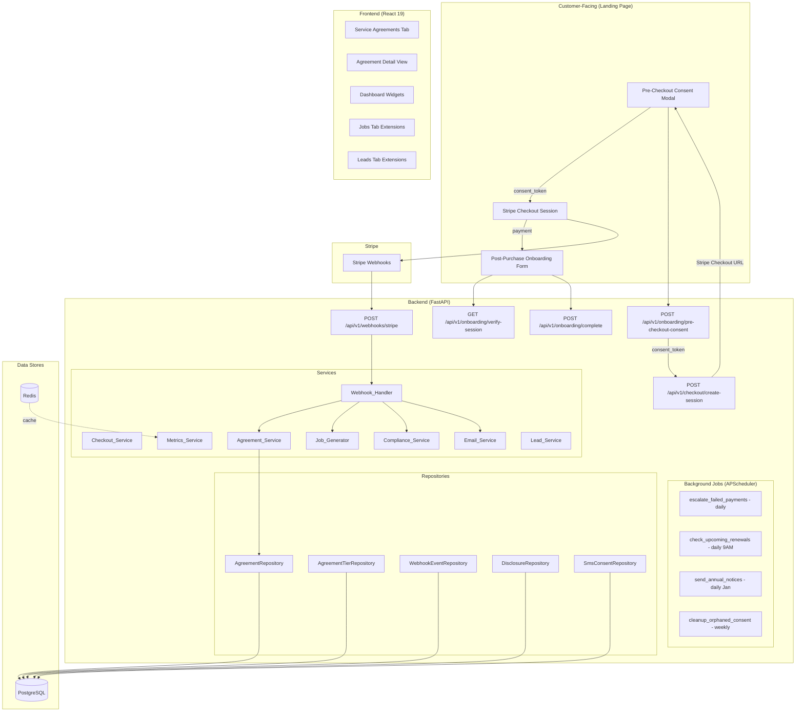
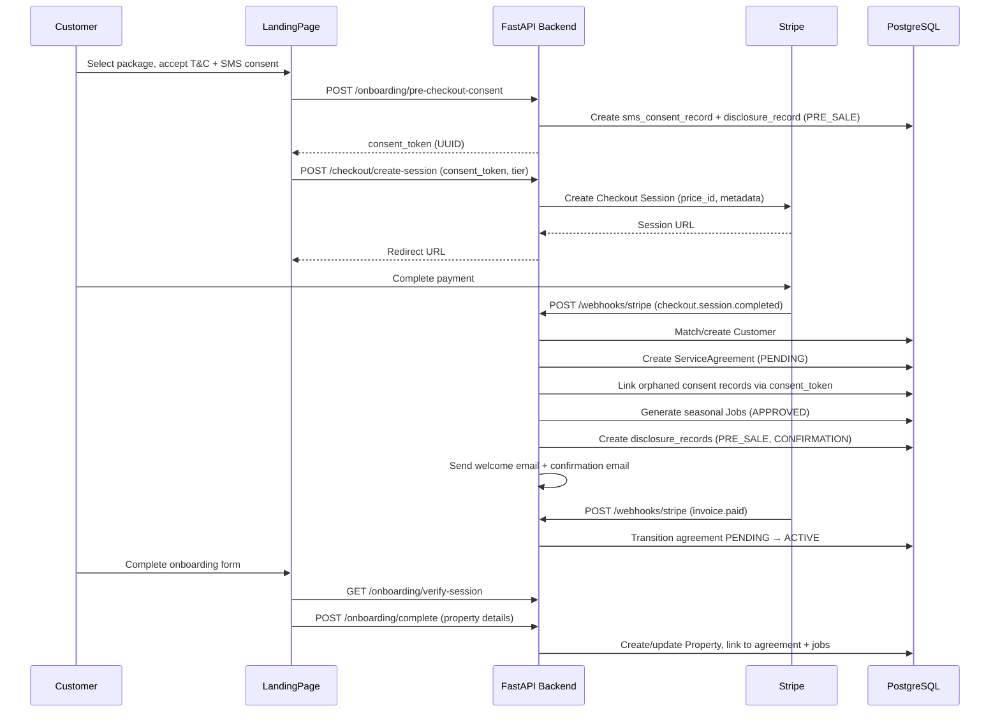
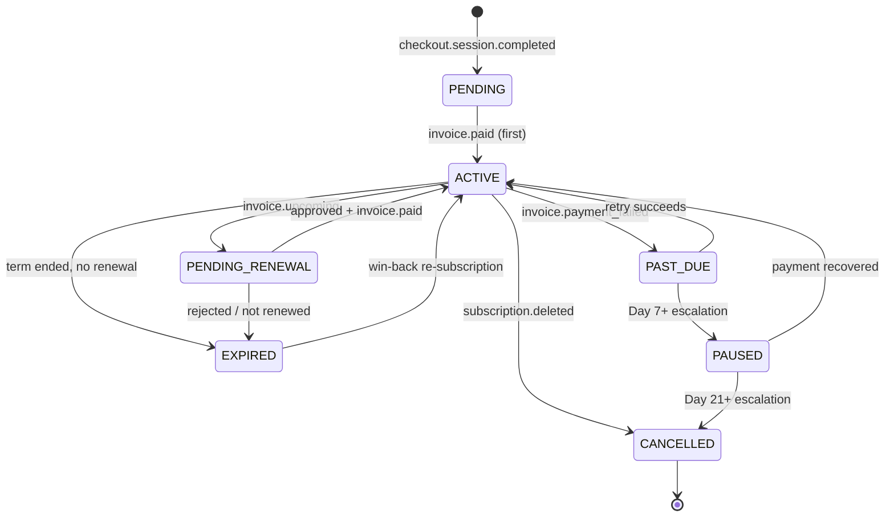
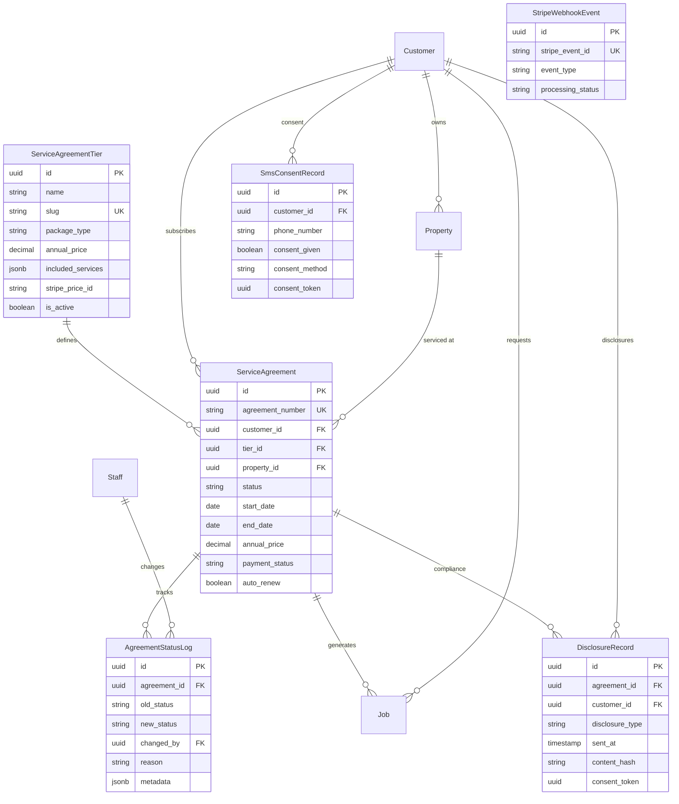
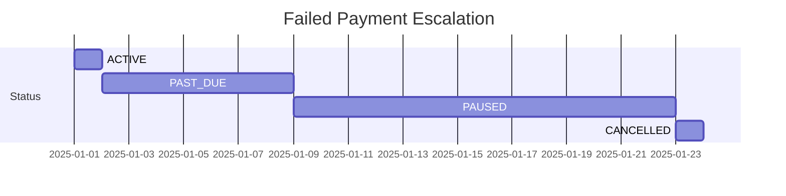

# Design Document — Service Package Purchases

## Overview

This feature builds the end-to-end pipeline for service package purchases in the Grins Irrigation Platform: from pre-checkout consent capture through Stripe Checkout, webhook processing, customer/agreement/job creation, post-purchase onboarding, compliance audit trails, and admin dashboard management. It also enhances the Leads pipeline with source tracking, intake tagging, follow-up queues, and submission confirmations.

The system currently has zero Stripe integration, no service agreement tracking, no seasonal job auto-generation, and no compliance audit trail. The existing Leads tab lacks source attribution and intake routing. This design closes those gaps across 70 requirements spanning backend models, services, APIs, background jobs, email/SMS delivery, and frontend features.

### Key Design Decisions

1. **Tier templates vs instances**: `ServiceAgreementTier` (what packages exist) is separated from `ServiceAgreement` (a customer's subscription). Tier price changes don't affect existing agreements because `annual_price` is locked at purchase time.

2. **Three-step purchase flow**: Pre-checkout consent (Step 1) → Stripe Checkout (Step 2) → Post-purchase onboarding (Step 3). A `consent_token` UUID bridges orphaned consent/disclosure records to the Customer and ServiceAgreement created after payment.

3. **Jobs generated at checkout**: All seasonal jobs for the year are created immediately at APPROVED status (skipping REQUESTED since they're pre-paid). Viktor sees the full workload upfront.

4. **Renewal gate with safe default**: Renewals auto-charge by default (preserving revenue). Viktor gets a 30-day review window via `invoice.upcoming` webhook. Jobs only generate for the new term after `invoice.paid`.

5. **No mid-season tier changes**: Simplifies job generation and pricing consistency. Tier changes only at renewal.

6. **Idempotent webhook handling**: Every Stripe event is deduplicated via `stripe_webhook_events` table. Handlers check existing state before mutating.

7. **Immutable compliance records**: `disclosure_records` and `sms_consent_records` are INSERT-ONLY with 7-year retention for TCPA and MN auto-renewal law compliance.

8. **Transactional vs commercial email separation**: Compliance emails use `noreply@` sender with no promotional content. Commercial emails use a separate sender with full CAN-SPAM compliance (unsubscribe link, physical address).

9. **APScheduler with PostgreSQL job store**: Background tasks (failed payment escalation, renewal checks, annual notices, orphaned consent cleanup) persist across restarts.

10. **Vertical slice architecture**: New backend services follow the existing pattern — `agreements/` feature slice with routes, service, repository, models, schemas. Frontend gets `features/agreements/` and extensions to `features/leads/`, `features/dashboard/`, `features/jobs/`.

## Architecture



### Request Flow: Purchase Pipeline



### Agreement Status Lifecycle




## Components and Interfaces

### Backend Components

#### 1. Webhook Handler (`agreements/webhook_handler.py`)

Receives all Stripe webhook events at `POST /api/v1/webhooks/stripe`. Responsibilities:
- Verify Stripe signature using raw request body + `STRIPE_WEBHOOK_SECRET`
- Deduplicate events via `stripe_webhook_events` table
- Route to event-specific handlers
- Return HTTP 200 within 5 seconds regardless of outcome
- Excluded from CSRF middleware

```python
# Event routing map
EVENT_HANDLERS = {
    "checkout.session.completed": handle_checkout_completed,
    "invoice.paid": handle_invoice_paid,
    "invoice.payment_failed": handle_invoice_payment_failed,
    "invoice.upcoming": handle_invoice_upcoming,
    "customer.subscription.updated": handle_subscription_updated,
    "customer.subscription.deleted": handle_subscription_deleted,
}
```

#### 2. Agreement Service (`agreements/service.py`)

Core business logic for service agreement lifecycle. Uses `LoggerMixin` with `DOMAIN = "agreements"`.

Key methods:
- `create_agreement(customer_id, tier_id, stripe_data) → ServiceAgreement` — Creates agreement with PENDING status, locks annual_price from tier
- `transition_status(agreement_id, new_status, actor, reason) → ServiceAgreement` — Validates transition against allowed map, creates AgreementStatusLog
- `approve_renewal(agreement_id, staff_id) → ServiceAgreement` — Records approval, allows Stripe auto-charge
- `reject_renewal(agreement_id, staff_id) → ServiceAgreement` — Calls Stripe API to set `cancel_at_period_end`, transitions to EXPIRED at term end
- `cancel_agreement(agreement_id, reason) → ServiceAgreement` — Cancels future APPROVED jobs, computes prorated refund, preserves SCHEDULED/IN_PROGRESS/COMPLETED jobs
- `generate_agreement_number() → str` — Format: `AGR-YYYY-NNN` with sequential counter per year

Status transition map:
```python
VALID_TRANSITIONS: dict[AgreementStatus, set[AgreementStatus]] = {
    AgreementStatus.PENDING: {AgreementStatus.ACTIVE},
    AgreementStatus.ACTIVE: {
        AgreementStatus.PAST_DUE,
        AgreementStatus.PENDING_RENEWAL,
        AgreementStatus.CANCELLED,
        AgreementStatus.EXPIRED,
    },
    AgreementStatus.PAST_DUE: {AgreementStatus.ACTIVE, AgreementStatus.PAUSED},
    AgreementStatus.PAUSED: {AgreementStatus.ACTIVE, AgreementStatus.CANCELLED},
    AgreementStatus.PENDING_RENEWAL: {AgreementStatus.ACTIVE, AgreementStatus.EXPIRED},
    AgreementStatus.EXPIRED: {AgreementStatus.ACTIVE},  # win-back
}
```

#### 3. Job Generator (`agreements/job_generator.py`)

Creates seasonal jobs based on tier's `included_services` definition. Uses `LoggerMixin` with `DOMAIN = "agreements"`.

Tier-to-jobs mapping:
| Tier | Jobs | Date Ranges |
|------|------|-------------|
| Essential | 2 | Spring Startup (Apr 1-30), Fall Winterization (Oct 1-31) |
| Professional | 3 | Spring Startup (Apr 1-30), Mid-Season Inspection (Jul 1-31), Fall Winterization (Oct 1-31) |
| Premium | 7 | Spring Startup (Apr 1-30), Monthly Visit × 5 (May-Sep), Fall Winterization (Oct 1-31) |

All jobs created with:
- `status`: APPROVED (skip REQUESTED — pre-paid)
- `category`: READY_TO_SCHEDULE
- `service_agreement_id`: linked to agreement
- `source`: "subscription"
- `customer_id`: from agreement
- `property_id`: from agreement (if available)

#### 4. Checkout Service (`agreements/checkout_service.py`)

Creates dynamic Stripe Checkout Sessions replacing static Payment Links.

Key methods:
- `create_checkout_session(tier, type, consent_token, utm_params) → str` — Returns Stripe Checkout URL
  - Validates consent_token matches a recent Disclosure_Record (< 2 hours)
  - Validates tier exists and is_active with non-null stripe_price_id
  - Creates session with: subscription mode, phone_number_collection, billing_address_collection, consent_collection (terms_of_service), automatic_tax enabled
  - Embeds consent_token + package metadata in session.metadata and subscription_data.metadata

#### 5. Onboarding Service (`agreements/onboarding_service.py`)

Handles post-purchase property collection.

Key methods:
- `verify_session(session_id) → SessionInfo` — Verifies Stripe session, returns customer/package info
- `complete_onboarding(session_id, property_data) → Property` — Creates/updates Property, links to agreement + jobs

#### 6. Compliance Service (`agreements/compliance_service.py`)

Manages MN auto-renewal disclosure records and TCPA SMS consent records.

Key methods:
- `create_disclosure(type, agreement_id, customer_id, content, sent_via) → DisclosureRecord`
- `create_sms_consent(phone, consent_given, method, language_shown, token) → SmsConsentRecord`
- `link_orphaned_records(consent_token, customer_id, agreement_id)` — Bridges pre-checkout records to post-purchase entities
- `get_compliance_status(agreement_id) → ComplianceStatus` — Returns which disclosures are recorded/missing

#### 7. Email Service (`shared/email_service.py`)

Sends transactional and commercial emails via Resend/SendGrid. Placed in `shared/` since it will be used by 3+ features (agreements, leads, invoices).

Key methods:
- `send_welcome_email(customer, agreement, tier)` — Customer-friendly overview
- `send_confirmation_email(customer, agreement, tier)` — MN-required auto-renewal terms
- `send_renewal_notice(customer, agreement)` — Pre-renewal notice with cancellation instructions
- `send_annual_notice(customer, agreement)` — Annual notice per MN Stat. 325G.59
- `send_cancellation_confirmation(customer, agreement)` — Cancellation effective date + refund info
- `send_lead_confirmation(lead)` — Lead submission acknowledgment

Email classification:
- **TRANSACTIONAL** (noreply@): confirmations, compliance notices, invoices, onboarding reminders, failed payment notices
- **COMMERCIAL** (info@/marketing@): seasonal reminders, promotional offers, newsletters — requires CAN-SPAM compliance (unsubscribe link, physical address, ad identification)

Templates: Jinja2 HTML stored in `templates/emails/`.

#### 8. Metrics Service (`agreements/metrics_service.py`)

Computes business KPIs from agreement data.

Metrics:
- **Active Agreement Count**: COUNT where status = ACTIVE
- **MRR**: SUM(annual_price / 12) for ACTIVE agreements
- **ARPA**: MRR / active count
- **Renewal Rate**: renewed / up-for-renewal over trailing 90 days
- **Churn Rate**: cancelled / total active at period start over trailing 90 days
- **Past Due Amount**: SUM(annual_price) where payment_status IN (PAST_DUE, FAILED)

#### Payment History (Phase 14 Open Question 3)

Payment history is **pulled from the Stripe API on-demand** via `stripe.Invoice.list(customer=stripe_customer_id)` — not cached locally. Rationale:
- Stripe is the source of truth for all payment/invoice data.
- Avoids data synchronization complexity and stale cache issues.
- Invoice list calls are fast enough for admin detail views (< 200ms p95).
- If performance becomes an issue, a Redis cache with short TTL (5 min) can be added later without schema changes.

#### 9. Lead Service Extensions (`leads/service.py` — modified)

Extends existing Lead_Service with:
- `lead_source` and `source_detail` on creation
- `intake_tag` defaulting (SCHEDULE for website, NULL for from-call)
- Follow-up queue query (intake_tag=FOLLOW_UP, status IN NEW/CONTACTED/QUALIFIED, sorted oldest-first)
- Work request auto-promotion (all client types → Lead)
- SMS/email submission confirmations (gated on consent)
- Consent field carry-over on lead-to-customer conversion

#### 10. Background Job Scheduler (`core/scheduler.py`)

APScheduler with PostgreSQL job store, started on FastAPI lifespan startup.

Registered jobs:
| Job | Schedule | Description |
|-----|----------|-------------|
| `escalate_failed_payments` | Daily | Day 7 → PAUSED (pause Stripe collection), Day 21 → CANCELLED (cancel Stripe sub) |
| `check_upcoming_renewals` | Daily 9 AM | Query agreements approaching renewal_date, trigger urgency alerts |
| `send_annual_notices` | Daily (January) | Query ACTIVE agreements needing annual notices, send via Email_Service |
| `cleanup_orphaned_consent_records` | Weekly | Mark consent records > 30 days with no linked customer as abandoned |

### API Endpoints

#### Public Endpoints (rate-limited, no auth)

| Method | Path | Service | Purpose |
|--------|------|---------|---------|
| POST | `/api/v1/onboarding/pre-checkout-consent` | Checkout_Service | Capture SMS consent + MN disclosure, return consent_token |
| POST | `/api/v1/checkout/create-session` | Checkout_Service | Create Stripe Checkout Session |
| GET | `/api/v1/onboarding/verify-session` | Onboarding_Service | Verify Stripe session for onboarding form |
| POST | `/api/v1/onboarding/complete` | Onboarding_Service | Submit property details post-purchase |
| POST | `/api/v1/webhooks/stripe` | Webhook_Handler | Stripe webhook receiver (signature-verified) |
| GET | `/api/v1/email/unsubscribe` | Email_Service | CAN-SPAM one-click unsubscribe |

#### Admin Endpoints (authenticated)

| Method | Path | Service | Purpose |
|--------|------|---------|---------|
| GET | `/api/v1/agreement-tiers` | AgreementTier_Repository | List active tiers |
| GET | `/api/v1/agreement-tiers/{id}` | AgreementTier_Repository | Tier detail |
| GET | `/api/v1/agreements` | Agreement_Service | List agreements (filterable) |
| GET | `/api/v1/agreements/{id}` | Agreement_Service | Agreement detail with jobs, logs, compliance |
| PATCH | `/api/v1/agreements/{id}/status` | Agreement_Service | Status transition |
| POST | `/api/v1/agreements/{id}/approve-renewal` | Agreement_Service | Approve renewal |
| POST | `/api/v1/agreements/{id}/reject-renewal` | Agreement_Service | Reject renewal → Stripe cancel_at_period_end |
| GET | `/api/v1/agreements/metrics` | Metrics_Service | Business KPIs |
| GET | `/api/v1/agreements/renewal-pipeline` | Agreement_Service | PENDING_RENEWAL queue |
| GET | `/api/v1/agreements/failed-payments` | Agreement_Service | PAST_DUE/FAILED queue |
| GET | `/api/v1/agreements/annual-notice-due` | Compliance_Service | Agreements needing annual notice |
| GET | `/api/v1/agreements/{id}/compliance` | Compliance_Service | Disclosure history for agreement |
| GET | `/api/v1/compliance/customer/{customer_id}` | Compliance_Service | All disclosures for customer |
| GET | `/api/v1/dashboard/summary` | Dashboard_Service | Extended with agreement + lead metrics |
| POST | `/api/v1/leads/from-call` | Lead_Service | Create lead from phone/text interaction |
| GET | `/api/v1/leads/follow-up-queue` | Lead_Service | Follow-up queue (paginated) |
| GET | `/api/v1/leads/metrics/by-source` | Lead_Service | Lead counts by source channel |

### Frontend Components

#### New Feature Slice: `features/agreements/`

```
features/agreements/
├── api/
│   └── agreementsApi.ts          # API client functions
├── components/
│   ├── AgreementsList.tsx         # Main list with status tabs + table
│   ├── AgreementDetail.tsx        # Detail view with jobs timeline
│   ├── BusinessMetricsCards.tsx    # KPI cards (Active, MRR, Renewal Rate, Churn, Past Due)
│   ├── MrrChart.tsx               # MRR Over Time line chart (Recharts)
│   ├── TierDistributionChart.tsx  # Agreements by Tier chart
│   ├── RenewalPipelineQueue.tsx   # Renewal approval queue
│   ├── FailedPaymentsQueue.tsx    # Failed payments queue
│   ├── UnscheduledVisitsQueue.tsx # Unscheduled subscription jobs
│   ├── OnboardingIncompleteQueue.tsx # Pending onboarding
│   ├── ComplianceLog.tsx          # Disclosure history section
│   └── JobsTimeline.tsx           # Visual jobs progress
├── hooks/
│   ├── useAgreements.ts           # List query hook
│   ├── useAgreement.ts            # Detail query hook
│   ├── useAgreementMetrics.ts     # Metrics query hook
│   ├── useRenewalPipeline.ts      # Renewal queue hook
│   ├── useFailedPayments.ts       # Failed payments hook
│   ├── useUpdateAgreementStatus.ts # Status mutation hook
│   ├── useApproveRenewal.ts       # Approve mutation hook
│   └── useRejectRenewal.ts        # Reject mutation hook
├── types/
│   └── index.ts                   # Agreement, Tier, StatusLog types
└── index.ts                       # Public API exports
```

#### Modified Features

- `features/dashboard/` — New widgets: Active Agreements, MRR, Renewal Pipeline, Failed Payments, Leads Awaiting Contact, Follow-Up Queue, Leads by Source chart
- `features/jobs/` — Subscription source badge, target date columns, target date filter, subscription source filter
- `features/leads/` — LeadSourceBadge, IntakeTagBadge, source filter dropdown, intake tag quick-filter tabs, Follow-Up Queue collapsible panel, consent indicators
- `features/work-requests/` — "Promoted to Lead" badge with link, promoted_at timestamp

#### TanStack Query Key Factory

```typescript
export const agreementKeys = {
  all: ['agreements'] as const,
  lists: () => [...agreementKeys.all, 'list'] as const,
  list: (params: AgreementListParams) => [...agreementKeys.lists(), params] as const,
  detail: (id: string) => [...agreementKeys.all, 'detail', id] as const,
  metrics: () => [...agreementKeys.all, 'metrics'] as const,
  renewalPipeline: () => [...agreementKeys.all, 'renewal-pipeline'] as const,
  failedPayments: () => [...agreementKeys.all, 'failed-payments'] as const,
};

export const tierKeys = {
  all: ['agreement-tiers'] as const,
  list: () => [...tierKeys.all, 'list'] as const,
  detail: (id: string) => [...tierKeys.all, 'detail', id] as const,
};
```


## Data Models

### New Enums

```python
class AgreementStatus(str, Enum):
    """Service agreement lifecycle status."""
    PENDING = "pending"
    ACTIVE = "active"
    PAST_DUE = "past_due"
    PAUSED = "paused"
    PENDING_RENEWAL = "pending_renewal"
    CANCELLED = "cancelled"
    EXPIRED = "expired"

class PaymentStatus(str, Enum):
    """Agreement payment status."""
    CURRENT = "current"
    PAST_DUE = "past_due"
    FAILED = "failed"

class PackageType(str, Enum):
    """Service package type."""
    RESIDENTIAL = "residential"
    COMMERCIAL = "commercial"

class BillingFrequency(str, Enum):
    """Billing frequency."""
    ANNUAL = "annual"

class DisclosureType(str, Enum):
    """MN auto-renewal compliance disclosure type."""
    PRE_SALE = "pre_sale"
    CONFIRMATION = "confirmation"
    RENEWAL_NOTICE = "renewal_notice"
    ANNUAL_NOTICE = "annual_notice"
    MATERIAL_CHANGE = "material_change"
    CANCELLATION_CONF = "cancellation_conf"

class WebhookProcessingStatus(str, Enum):
    """Stripe webhook event processing status."""
    SUCCESS = "success"
    FAILED = "failed"
    SKIPPED_DUPLICATE = "skipped_duplicate"

class EmailType(str, Enum):
    """Email classification for CAN-SPAM compliance."""
    TRANSACTIONAL = "transactional"
    COMMERCIAL = "commercial"

class IntakeTag(str, Enum):
    """Lead intake routing tag."""
    SCHEDULE = "schedule"
    FOLLOW_UP = "follow_up"

class LeadSourceExtended(str, Enum):
    """Extended lead source enum replacing the existing LeadSource."""
    WEBSITE = "website"
    GOOGLE_FORM = "google_form"
    PHONE_CALL = "phone_call"
    TEXT_MESSAGE = "text_message"
    GOOGLE_AD = "google_ad"
    SOCIAL_MEDIA = "social_media"
    QR_CODE = "qr_code"
    EMAIL_CAMPAIGN = "email_campaign"
    TEXT_CAMPAIGN = "text_campaign"
    REFERRAL = "referral"
    OTHER = "other"
```

### New Tables

#### `service_agreement_tiers` (Template Table)

Defines what each package includes. Seeded with 6 records via migration.

| Column | Type | Constraints | Notes |
|--------|------|-------------|-------|
| id | UUID | PK, default gen_random_uuid() | |
| name | VARCHAR(100) | NOT NULL | "Essential", "Professional", "Premium" |
| slug | VARCHAR(50) | UNIQUE, NOT NULL | "essential-residential", etc. |
| description | TEXT | | |
| package_type | VARCHAR(20) | NOT NULL | RESIDENTIAL / COMMERCIAL |
| annual_price | DECIMAL(10,2) | NOT NULL | |
| billing_frequency | VARCHAR(20) | NOT NULL, default "annual" | |
| included_services | JSONB | NOT NULL | `[{service_type, frequency, description}]` |
| perks | JSONB | | `["perk1", "perk2"]` |
| stripe_product_id | VARCHAR(255) | nullable | Differs between test/live |
| stripe_price_id | VARCHAR(255) | nullable | Differs between test/live |
| is_active | BOOLEAN | NOT NULL, default true | |
| display_order | INTEGER | NOT NULL | |
| created_at | TIMESTAMP(tz) | NOT NULL, default now() | |
| updated_at | TIMESTAMP(tz) | NOT NULL, default now() | |

Seed data (6 records):
| Name | Type | Price |
|------|------|-------|
| Essential Residential | RESIDENTIAL | $170 |
| Essential Commercial | COMMERCIAL | $225 |
| Professional Residential | RESIDENTIAL | $250 |
| Professional Commercial | COMMERCIAL | $375 |
| Premium Residential | RESIDENTIAL | $700 |
| Premium Commercial | COMMERCIAL | $850 |

#### `service_agreements` (Instance Table)

| Column | Type | Constraints | Notes |
|--------|------|-------------|-------|
| id | UUID | PK | |
| agreement_number | VARCHAR(50) | UNIQUE, NOT NULL | "AGR-YYYY-NNN" |
| customer_id | UUID | FK → customers, NOT NULL | |
| tier_id | UUID | FK → service_agreement_tiers, NOT NULL | |
| property_id | UUID | FK → properties, nullable | Linked after onboarding |
| stripe_subscription_id | VARCHAR(255) | | |
| stripe_customer_id | VARCHAR(255) | | |
| status | VARCHAR(30) | NOT NULL, default "pending" | AgreementStatus enum |
| start_date | DATE | | |
| end_date | DATE | | start_date + 1 year |
| renewal_date | DATE | | |
| auto_renew | BOOLEAN | NOT NULL, default true | |
| cancelled_at | TIMESTAMP(tz) | nullable | |
| cancellation_reason | TEXT | nullable | |
| cancellation_refund_amount | DECIMAL(10,2) | nullable | Prorated refund |
| cancellation_refund_processed_at | TIMESTAMP(tz) | nullable | |
| pause_reason | TEXT | nullable | |
| annual_price | DECIMAL(10,2) | NOT NULL | Locked at purchase time |
| payment_status | VARCHAR(20) | NOT NULL, default "current" | PaymentStatus enum |
| last_payment_date | TIMESTAMP(tz) | nullable | |
| last_payment_amount | DECIMAL(10,2) | nullable | |
| renewal_approved_by | UUID | FK → staff, nullable | |
| renewal_approved_at | TIMESTAMP(tz) | nullable | |
| consent_recorded_at | TIMESTAMP(tz) | nullable | |
| consent_method | VARCHAR(50) | nullable | "web_form", "stripe_checkout", "in_person" |
| disclosure_version | VARCHAR(20) | nullable | T&C version shown at signup |
| last_annual_notice_sent | TIMESTAMP(tz) | nullable | MN annual notice tracking |
| last_renewal_notice_sent | TIMESTAMP(tz) | nullable | 5-30 day pre-renewal notice |
| notes | TEXT | nullable | |
| created_at | TIMESTAMP(tz) | NOT NULL, default now() | |
| updated_at | TIMESTAMP(tz) | NOT NULL, default now() | |

Indexes: `customer_id`, `tier_id`, `status`, `payment_status`, `renewal_date`.

#### `agreement_status_logs` (Audit Trail)

| Column | Type | Constraints | Notes |
|--------|------|-------------|-------|
| id | UUID | PK | |
| agreement_id | UUID | FK → service_agreements, NOT NULL | |
| old_status | VARCHAR(30) | NOT NULL | |
| new_status | VARCHAR(30) | NOT NULL | |
| changed_by | UUID | FK → staff, nullable | NULL = system-triggered |
| reason | TEXT | nullable | |
| metadata | JSONB | nullable | Stripe event ID, etc. |
| created_at | TIMESTAMP(tz) | NOT NULL, default now() | |

Index: `agreement_id`.

#### `stripe_webhook_events` (Idempotency)

| Column | Type | Constraints | Notes |
|--------|------|-------------|-------|
| id | UUID | PK | |
| stripe_event_id | VARCHAR(255) | UNIQUE, NOT NULL | |
| event_type | VARCHAR(100) | NOT NULL | |
| processing_status | VARCHAR(30) | NOT NULL | success/failed/skipped_duplicate |
| error_message | TEXT | nullable | |
| event_data | JSONB | nullable | |
| processed_at | TIMESTAMP(tz) | NOT NULL, default now() | |

Index: `stripe_event_id`.

#### `disclosure_records` (MN Compliance — INSERT-ONLY)

| Column | Type | Constraints | Notes |
|--------|------|-------------|-------|
| id | UUID | PK | |
| agreement_id | UUID | FK → service_agreements, nullable | NULL for pre-checkout |
| customer_id | UUID | FK → customers, nullable | NULL for pre-checkout |
| disclosure_type | VARCHAR(30) | NOT NULL | DisclosureType enum |
| sent_at | TIMESTAMP(tz) | NOT NULL | |
| sent_via | VARCHAR(20) | NOT NULL | "email", "sms", "web_form", "pending" |
| recipient_email | VARCHAR(255) | nullable | |
| recipient_phone | VARCHAR(20) | nullable | |
| content_hash | VARCHAR(64) | NOT NULL | SHA-256 of disclosure content |
| content_snapshot | TEXT | nullable | Full text or template version |
| consent_token | UUID | nullable, indexed | Links pre-checkout to purchase |
| delivery_confirmed | BOOLEAN | NOT NULL, default false | |
| created_at | TIMESTAMP(tz) | NOT NULL, default now() | |

Indexes: `agreement_id`, `customer_id`, `(disclosure_type, sent_at)`, `consent_token`.
Retention: 7 years minimum.

#### `sms_consent_records` (TCPA Compliance — INSERT-ONLY)

| Column | Type | Constraints | Notes |
|--------|------|-------------|-------|
| id | UUID | PK | |
| customer_id | UUID | FK → customers, nullable | NULL before purchase |
| phone_number | VARCHAR(20) | NOT NULL | |
| consent_type | VARCHAR(20) | NOT NULL | TRANSACTIONAL/MARKETING/BOTH |
| consent_given | BOOLEAN | NOT NULL | |
| consent_timestamp | TIMESTAMP(tz) | NOT NULL | |
| consent_method | VARCHAR(50) | NOT NULL | "web_form", "stripe_checkout", etc. |
| consent_language_shown | TEXT | NOT NULL | Exact TCPA text shown |
| consent_form_version | VARCHAR(20) | nullable | |
| consent_ip_address | VARCHAR(45) | nullable | |
| consent_user_agent | VARCHAR(500) | nullable | |
| consent_token | UUID | nullable, indexed | |
| opt_out_timestamp | TIMESTAMP(tz) | nullable | |
| opt_out_method | VARCHAR(50) | nullable | |
| opt_out_processed_at | TIMESTAMP(tz) | nullable | |
| opt_out_confirmation_sent | BOOLEAN | NOT NULL, default false | |
| created_at | TIMESTAMP(tz) | NOT NULL, default now() | |

Indexes: `phone_number`, `customer_id`, `consent_token`.
Retention: 7 years minimum. INSERT-ONLY — opt-outs create new rows.

##### SMS Opt-Out Processing (TCPA Compliance)

When a customer sends an SMS opt-out:
- **STOP keyword**: Automatic opt-out. A new `sms_consent_record` is created with `consent_given=false`, `opt_out_method="keyword_STOP"`, `opt_out_timestamp=now()`. Confirmation reply: "You have been unsubscribed from Grins Irrigation SMS messages. Reply START to re-subscribe."
- **Informal opt-out detection**: Messages containing "unsubscribe", "cancel", "stop texting", "opt out" (case-insensitive) are treated as opt-out requests and processed identically to STOP.
- **Opt-out confirmation**: `opt_out_confirmation_sent = true` after sending the confirmation reply.
- **Time restrictions**: No SMS messages sent before **8:00 AM** or after **9:00 PM Central Time**. Messages queued outside this window are held until the next valid send window.
- **Immediate effect**: Once opt-out is processed, no further SMS messages are sent to that phone number until a new opt-in is recorded.

#### `email_suppression_list` (CAN-SPAM — permanent)

| Column | Type | Constraints | Notes |
|--------|------|-------------|-------|
| id | UUID | PK | |
| email | VARCHAR(255) | UNIQUE, NOT NULL | |
| customer_id | UUID | FK → customers, nullable | |
| suppressed_at | TIMESTAMP(tz) | NOT NULL, default now() | |
| reason | VARCHAR(50) | NOT NULL | "unsubscribe", "bounce", "complaint" |

No expiration — permanent suppression.

### Modified Tables

#### `jobs` — New Columns

| Column | Type | Constraints | Notes |
|--------|------|-------------|-------|
| service_agreement_id | UUID | FK → service_agreements, nullable | Links subscription jobs |
| target_start_date | DATE | nullable | Earliest scheduling date |
| target_end_date | DATE | nullable | Latest scheduling date |

#### `customers` — New Columns

| Column | Type | Notes |
|--------|------|-------|
| stripe_customer_id | VARCHAR(255) | nullable, unique (when not null), indexed |
| terms_accepted | BOOLEAN | default false |
| terms_accepted_at | TIMESTAMP(tz) | nullable |
| terms_version | VARCHAR(20) | nullable |
| sms_opt_in_at | TIMESTAMP(tz) | nullable |
| sms_opt_in_source | VARCHAR(50) | nullable |
| sms_consent_language_version | VARCHAR(20) | nullable |
| preferred_service_times | JSONB | nullable |
| internal_notes | TEXT | nullable |
| email_opt_in_at | TIMESTAMP(tz) | nullable |
| email_opt_out_at | TIMESTAMP(tz) | nullable |
| email_opt_in_source | VARCHAR(50) | nullable |

##### Customer Email Consent Handling Notes

- **Req 68.2 — Webhook sets email_opt_in on checkout**: When `checkout.session.completed` fires, the webhook handler sets `email_opt_in_at = now()` and `email_opt_in_source = "stripe_checkout"` on the Customer record (the customer provided their email to Stripe during checkout, implying transactional email consent).
- **Req 68.3 — Lead-to-customer email consent carry-over**: When a Lead with an email converts to a Customer, the email consent state carries over. If the lead provided email during intake, set `email_opt_in_at` to the lead's `created_at` and `email_opt_in_source = "lead_form"`.
- **Req 68.4 — Migration default for existing records**: The migration adding these columns sets `email_opt_in_at = NULL` for all existing customer records (no retroactive consent assumed). Existing customers must explicitly opt in before receiving COMMERCIAL emails.

#### `leads` — New Columns

| Column | Type | Notes |
|--------|------|-------|
| lead_source | VARCHAR(50) | NOT NULL, default 'website', indexed |
| source_detail | VARCHAR(255) | nullable |
| intake_tag | VARCHAR(20) | nullable, indexed |
| sms_consent | BOOLEAN | default false |
| terms_accepted | BOOLEAN | default false |

#### `work_requests` — New Columns

| Column | Type | Notes |
|--------|------|-------|
| promoted_to_lead_id | UUID | FK → leads, nullable |
| promoted_at | TIMESTAMP(tz) | nullable |

### Entity Relationship Diagram



### Migration Strategy

Migrations are created via Alembic and executed in order:

1. **Migration 1**: Add new enums (AgreementStatus, PaymentStatus, PackageType, etc.)
2. **Migration 2**: Create `service_agreement_tiers` table + seed 6 tier records
3. **Migration 3**: Create `service_agreements` table with all FKs and indexes
4. **Migration 4**: Create `agreement_status_logs` table
5. **Migration 5**: Create `stripe_webhook_events` table
6. **Migration 6**: Create `disclosure_records` table with indexes
7. **Migration 7**: Create `sms_consent_records` table with indexes
8. **Migration 8**: Create `email_suppression_list` table
9. **Migration 9**: Add `service_agreement_id`, `target_start_date`, `target_end_date` to `jobs`
10. **Migration 10**: Add new columns to `customers` (stripe_customer_id, terms_*, sms_*, email_*, etc.)
11. **Migration 11**: Add `lead_source`, `source_detail`, `intake_tag`, `sms_consent`, `terms_accepted` to `leads` (set lead_source='website' for existing rows)
12. **Migration 12**: Add `promoted_to_lead_id`, `promoted_at` to `work_requests` (if work_requests table exists)


## Stripe Configuration & Tax

### Environment Variables

| Variable | Required | Description |
|----------|----------|-------------|
| `STRIPE_SECRET_KEY` | Yes | Stripe API authentication key |
| `STRIPE_WEBHOOK_SECRET` | Yes | Webhook signature verification secret |
| `STRIPE_PUBLISHABLE_KEY` | Yes | Client-side Stripe.js key (frontend) |
| `STRIPE_CUSTOMER_PORTAL_URL` | Yes | Base URL for customer-facing Stripe portal links |
| `STRIPE_TAX_ENABLED` | No | Boolean (default `true`). Set `false` in test environments without Stripe Tax configured |

If `STRIPE_SECRET_KEY` or `STRIPE_WEBHOOK_SECRET` is missing at startup, the platform logs a warning and disables Stripe integration rather than crashing.

### Stripe Tax Configuration

Stripe Tax handles MN sales tax collection automatically at checkout:

- **Tax behavior**: Exclusive — tax is added on top of the listed tier price. The displayed prices ($170, $250, $700, etc.) remain the base price; tax is calculated and added during checkout.
- **MN state rate**: 6.875% base + applicable local taxes based on customer billing address.
- **Checkout Session**: Created with `automatic_tax: { enabled: true }` (gated on `STRIPE_TAX_ENABLED`).
- **Stripe Dashboard setup** (documented, not automated):
  1. Enable Stripe Tax in Settings → Tax
  2. Set business origin address to company physical address in MN
  3. Add MN tax registration with MN Tax ID from MN Department of Revenue
  4. Set tax behavior to "exclusive" on all Prices
- **Landing page**: Pricing cards display "+ applicable tax" alongside annual price.

### Customer Portal Configuration

Documented requirements for Stripe Customer Portal setup:
- Cancellation enabled (satisfies MN Stat. 325G.59 click-to-cancel requirement)
- "Collect cancellation reason" turned on
- Portal URL stored in `STRIPE_CUSTOMER_PORTAL_URL` env var
- Used in: renewal notices, cancellation confirmations, agreement detail view

### Webhook Timing

The `invoice.upcoming` webhook must be configured in Stripe to fire **30 days before renewal** (Stripe default is 3 days). This satisfies:
- MN Stat. 325G.59's 5–30 day pre-renewal notice requirement
- Adequate time for Admin review in the Renewal Pipeline queue


## Pre-Checkout Consent Flow

### Endpoint: `POST /api/v1/onboarding/pre-checkout-consent`

**Public endpoint** — no authentication required.
**Rate limit**: 5 requests per IP per minute.

#### Request Body

```python
class PreCheckoutConsentRequest(BaseModel):
    package_tier: str          # "essential", "professional", "premium"
    package_type: PackageType  # RESIDENTIAL or COMMERCIAL
    sms_consent: bool
    terms_accepted: bool
    consent_ip: str
    consent_user_agent: str
    consent_language_version: str
```

#### Validation

- Both `sms_consent` AND `terms_accepted` must be `true` → HTTP 422 if either is `false`.

#### Processing

1. Create `sms_consent_record`:
   - `consent_given` = `sms_consent`
   - `consent_method` = `"web_form"`
   - `consent_language_shown` = exact TCPA-compliant consent text from the modal
   - `consent_ip_address`, `consent_user_agent` from request
   - `customer_id` = NULL (not yet known)
   - Generate `consent_token` UUID

2. Create `disclosure_record`:
   - `disclosure_type` = `PRE_SALE`
   - `customer_id` = NULL
   - `sent_via` = `"web_form"`
   - `content_hash` = SHA-256 of MN auto-renewal disclosure text
   - `consent_token` = same UUID

3. Return `{ consent_token: UUID }`.

The `consent_token` bridges these orphaned records to the Customer and ServiceAgreement created after Stripe payment completes.


## Checkout Session Creation

### Endpoint: `POST /api/v1/checkout/create-session`

**Public endpoint** — no authentication required.
**Rate limit**: 5 requests per IP per minute.

#### Request Body

```python
class CreateCheckoutSessionRequest(BaseModel):
    package_tier: str
    package_type: PackageType
    consent_token: UUID
    utm_params: Optional[UtmParams] = None  # source, medium, campaign

class UtmParams(BaseModel):
    source: Optional[str] = None
    medium: Optional[str] = None
    campaign: Optional[str] = None
```

#### Processing

1. **Validate consent_token**: Must match a `disclosure_record` created within the last 2 hours. HTTP 422 if expired or not found.
2. **Look up tier**: Find `ServiceAgreementTier` by `package_tier` + `package_type`. Must exist and `is_active = true`.
3. **Check stripe_price_id**: If NULL → HTTP 503 with "Stripe is not yet configured for this tier".
4. **Create Stripe Checkout Session**:

```python
session = stripe.checkout.Session.create(
    mode="subscription",
    line_items=[{"price": tier.stripe_price_id, "quantity": 1}],
    phone_number_collection={"enabled": True},
    billing_address_collection="required",
    consent_collection={"terms_of_service": "required"},
    automatic_tax={"enabled": settings.STRIPE_TAX_ENABLED},
    custom_text={
        "submit": {
            "message": "By subscribing, you agree to an auto-renewing annual subscription..."
        }
    },
    metadata={
        "consent_token": str(consent_token),
        "package_tier": package_tier,
        "package_type": package_type,
        "utm_source": utm_params.source if utm_params else None,
        "utm_medium": utm_params.medium if utm_params else None,
        "utm_campaign": utm_params.campaign if utm_params else None,
    },
    subscription_data={
        "metadata": {
            "consent_token": str(consent_token),
            "package_tier": package_tier,
            "package_type": package_type,
        }
    },
    success_url=f"{settings.LANDING_PAGE_URL}?session_id={{CHECKOUT_SESSION_ID}}",
    cancel_url=f"{settings.LANDING_PAGE_URL}/services",
)
```

5. Return `{ checkout_url: session.url }`.


## Post-Purchase Onboarding

### Endpoint: `GET /api/v1/onboarding/verify-session`

**Public endpoint**. Accepts `session_id` query parameter.

Calls Stripe API to verify the Checkout Session, returns:
- `customer_name`, `email`, `phone`, `billing_address`
- `package_tier`, `package_type`, `payment_status`

HTTP 404 if session not found or not completed.

### Endpoint: `POST /api/v1/onboarding/complete`

**Public endpoint**, rate-limited.

#### Request Body

```python
class OnboardingCompleteRequest(BaseModel):
    session_id: str
    service_address_same_as_billing: bool
    service_address: Optional[AddressSchema] = None  # street, city, state, zip
    zone_count: Optional[int] = None
    gate_code: Optional[str] = None
    has_dogs: Optional[bool] = None
    access_instructions: Optional[str] = None
    preferred_times: PreferredTimes  # MORNING, AFTERNOON, NO_PREFERENCE
```

#### Processing

1. Look up ServiceAgreement by `session_id` (stored in Stripe metadata). HTTP 404 if not found.
2. **Property creation**:
   - If `service_address_same_as_billing` is `true` → use billing address from Stripe session
   - If `false` → use provided `service_address`
3. Create or update Property record with address + zone_count, gate_code, has_dogs, access_instructions.
4. Link Property to Customer.
5. Update `ServiceAgreement.property_id`.
6. Update all linked Seasonal_Jobs with `property_id`.
7. Update `Customer.preferred_service_times` from `preferred_times`.


## Email Service Architecture

### Email Classification

| Classification | Sender | CAN-SPAM Required | Examples |
|---------------|--------|-------------------|----------|
| **TRANSACTIONAL** | `noreply@grinsirrigation.com` | No | Confirmations, compliance notices, invoices, onboarding reminders, failed payment notices |
| **COMMERCIAL** | `info@` or `marketing@grinsirrigation.com` | Yes | Seasonal reminders, promotional offers, newsletters, renewal notices with upsell content |

Separate sender identities protect transactional deliverability from commercial opt-out issues.

### Compliance Email Content Rules

Compliance email templates (`CONFIRMATION`, `RENEWAL_NOTICE`, `ANNUAL_NOTICE`, `CANCELLATION_CONF`) must contain:
- **Zero promotional content** — no upsell offers, discount codes, "upgrade your plan" CTAs, or links to promotional landing pages
- Transactional sender identity only (`noreply@`)
- **No unsubscribe link** — these are legally required communications (a "Manage your subscription" Stripe Customer Portal link is permitted)

If a future requirement requests promotional content in a compliance email, it must be sent as a separate COMMERCIAL email with full CAN-SPAM compliance.

### Email Templates

Jinja2 HTML templates stored in `templates/emails/`:

| Template | Trigger | Type | Content |
|----------|---------|------|---------|
| `welcome.html` | `checkout.session.completed` | TRANSACTIONAL | Tier name, price, included services, portal link, onboarding link |
| `confirmation.html` | `checkout.session.completed` | TRANSACTIONAL | All 5 MN-required auto-renewal terms |
| `renewal_notice.html` | `invoice.upcoming` | TRANSACTIONAL | Renewal date, price, cancellation instructions, service summary |
| `annual_notice.html` | `send_annual_notices` job | TRANSACTIONAL | Current terms, termination instructions |
| `cancellation_conf.html` | `customer.subscription.deleted` | TRANSACTIONAL | Effective date, reason, remaining visits, refund amount |
| `lead_confirmation.html` | Lead creation | TRANSACTIONAL | Receipt acknowledgment, expected response time |

All templates include Grins Irrigation business name, contact info, and Stripe Customer Portal link.

### Welcome Email vs Confirmation Email

Both are sent on `checkout.session.completed` — they serve different purposes:
- **Welcome email**: Customer-friendly overview (tier, price, services, next steps)
- **Confirmation email**: Legally required MN auto-renewal terms (5 specific disclosures)

May be sent as two separate emails or combined into one that includes all MN-required terms alongside welcome content.

### CAN-SPAM Infrastructure

#### Unsubscribe Endpoint: `GET /api/v1/email/unsubscribe`

**Public endpoint** — no authentication required.

Accepts a `token` query parameter (signed, time-limited):
1. Decode token → extract `customer_id` and `email`
2. Set `customer.email_opt_in` = `false`, record `email_opt_out_at`
3. Add email to `email_suppression_list` (permanent, never expires)
4. Render confirmation page: "You've been unsubscribed from marketing emails. You'll still receive transactional emails."

#### Unsubscribe Token Generation

```python
def generate_unsubscribe_token(customer_id: UUID, email: str) -> str:
    """Generate signed token valid for 30+ days per CAN-SPAM."""
    ...
```

Tokens are signed (HMAC or JWT) with 30-day minimum validity.

#### Opt-Out Processing Timeline (Requirement 67.8)

- Opt-out requests (via unsubscribe link) must be honored within **10 business days** per CAN-SPAM.
- Target: **same-day processing** — the unsubscribe endpoint immediately adds the email to the suppression list and sets `email_opt_out_at` on the customer record.
- No further COMMERCIAL emails are sent after the opt-out is processed.

#### Record Retention Periods (Requirement 67.9)

| Record Type | Retention Period |
|-------------|-----------------|
| Email consent records (`email_opt_in_at`, `email_opt_in_source`) | 5 years minimum |
| Campaign archives (email templates, send metadata) | 5 years minimum |
| Send logs (delivery confirmations, bounce/complaint records) | 5 years minimum |
| Suppression lists (`email_suppression_list`) | **Permanent** — never deleted |

Retention is enforced at the database level — no automated purge jobs for these records within the retention window.

#### Suppression List

- `email_suppression_list` table (already defined in Data Models)
- Permanent — once added, never removed unless customer explicitly re-subscribes
- Checked before every COMMERCIAL email send
- Reasons: `"unsubscribe"`, `"bounce"`, `"complaint"`

#### Commercial Email Requirements

Every COMMERCIAL email must include:
1. Company physical postal address (via `COMPANY_PHYSICAL_ADDRESS` env var)
2. Working unsubscribe link (single-click, no login, functional 30+ days)
3. Identification as advertisement/promotional
4. Accurate "From" header identifying Grins Irrigation

If `COMPANY_PHYSICAL_ADDRESS` is not configured → refuse to send COMMERCIAL emails, log critical warning.

### Email Environment Variables

| Variable | Required | Description |
|----------|----------|-------------|
| `EMAIL_API_KEY` | Yes | API key for email provider (Resend/SendGrid) |
| `COMPANY_PHYSICAL_ADDRESS` | Yes (for commercial) | Physical postal address for CAN-SPAM footer |

If `EMAIL_API_KEY` is missing at startup → log warning, disclosure records still created with `sent_via="pending"` and `delivery_confirmed=false`.

### DNS Configuration (Documented Requirement)

Before launch, the sending domain must have:
- **SPF** record authorizing the email provider
- **DKIM** signing configured
- **DMARC** policy set

This is a manual DNS configuration step, documented in the deployment instructions.


## Compliance Automation Details

### Minnesota Cancellation Save Offer Restrictions

Per Minnesota consumer protection regulations, the following restrictions apply during the cancellation flow:
- **No save offers or retention tactics** may be presented during the cancellation process. When a customer initiates cancellation (via Stripe Customer Portal, phone, or email), the system must process the cancellation without interposing discount offers, downgrade suggestions, or "are you sure?" friction screens.
- The Stripe Customer Portal cancellation flow satisfies this — it collects a cancellation reason and processes immediately.
- If a future "win-back" campaign is implemented, it must be a **separate, post-cancellation** outreach (COMMERCIAL email with full CAN-SPAM compliance), not part of the cancellation flow itself.
- This is documented as a compliance note for any future UI changes to the cancellation experience.

### Disclosure Logging by Event

| Stripe Event | Disclosure Type | Content | Sent Via |
|-------------|----------------|---------|----------|
| `checkout.session.completed` | `PRE_SALE` | MN auto-renewal disclosure text shown in pre-checkout modal | `"web_form"` |
| `checkout.session.completed` | `CONFIRMATION` | All 5 MN-required auto-renewal terms: (a) service continues until terminated, (b) cancellation policy with portal/phone/email, (c) recurring charge amount + frequency, (d) renewal term length, (e) minimum purchase obligations | `"email"` |
| `invoice.upcoming` | `RENEWAL_NOTICE` | Renewal date, price, cancellation instructions, service summary for current term | `"email"` |
| `customer.subscription.deleted` | `CANCELLATION_CONF` | Cancellation effective date, reason, remaining scheduled visits honored, prorated refund amount | `"email"` |
| `send_annual_notices` job | `ANNUAL_NOTICE` | Current terms of service, termination/management instructions | `"email"` |

### Annual Notice Tracking

- `ServiceAgreement.last_annual_notice_sent` tracks when the last annual notice was sent
- `GET /api/v1/agreements/annual-notice-due` returns ACTIVE agreements where:
  - `last_annual_notice_sent IS NULL`, OR
  - `YEAR(last_annual_notice_sent) < current calendar year`
- Background job `send_annual_notices` runs daily in January, queries this endpoint, sends notices via Email_Service
- On send: creates `ANNUAL_NOTICE` disclosure record, updates `last_annual_notice_sent`

### Compliance Audit API

| Endpoint | Returns |
|----------|---------|
| `GET /api/v1/agreements/{id}/compliance` | All disclosure records for the agreement, sorted by `sent_at` DESC |
| `GET /api/v1/compliance/customer/{customer_id}` | All disclosure records across all customer agreements, sorted by `sent_at` DESC |

Each record includes: `disclosure_type`, `sent_at`, `sent_via`, `content_snapshot` (or `content_hash`), `delivery_confirmed`.


## Failed Payment Escalation Details

### Escalation Timeline



### Day 7: Pause Collection

When a ServiceAgreement has been `PAST_DUE` for 7+ days with all Stripe retries exhausted:

1. Call Stripe API: `stripe.Subscription.modify(sub_id, pause_collection={"behavior": "keep_as_draft"})`
2. Transition agreement → `PAUSED`
3. Set `pause_reason` = "Payment failed — all retries exhausted"
4. Stop generating new jobs for the agreement

### Day 21: Cancel Subscription

When a ServiceAgreement has been `PAUSED` for 14+ days (Day 21+ from initial failure):

1. Call Stripe API: `stripe.Subscription.cancel(sub_id)`
2. Transition agreement → `CANCELLED`
3. Cancel all APPROVED jobs (preserve SCHEDULED/IN_PROGRESS/COMPLETED)
4. Send cancellation confirmation email + create `CANCELLATION_CONF` disclosure

### Daily Background Job Query

```python
# escalate_failed_payments - runs daily
async def escalate_failed_payments(db: Session):
    # Day 7 escalation
    day_7_candidates = db.query(ServiceAgreement).filter(
        ServiceAgreement.payment_status == PaymentStatus.PAST_DUE,
        ServiceAgreement.status == AgreementStatus.PAST_DUE,
        ServiceAgreement.updated_at <= datetime.utcnow() - timedelta(days=7),
    ).all()

    # Day 21 escalation
    day_21_candidates = db.query(ServiceAgreement).filter(
        ServiceAgreement.status == AgreementStatus.PAUSED,
        ServiceAgreement.updated_at <= datetime.utcnow() - timedelta(days=14),
    ).all()
```

Each escalation is logged with structured logging: `agreement_id`, escalation step (`day_7_pause` or `day_21_cancel`), Stripe API response.


## Lead Service Extensions Detail

### Lead Source Enum

Already defined in Data Models section — 11 values: `WEBSITE`, `GOOGLE_FORM`, `PHONE_CALL`, `TEXT_MESSAGE`, `GOOGLE_AD`, `SOCIAL_MEDIA`, `QR_CODE`, `EMAIL_CAMPAIGN`, `TEXT_CAMPAIGN`, `REFERRAL`, `OTHER`.

Fields `lead_source` (NOT NULL, default `'website'`, indexed) and `source_detail` (nullable) on the `leads` table — already in Modified Tables section.

### Intake Tagging

`intake_tag` field (nullable, indexed) on `leads` — already defined. Values: `SCHEDULE`, `FOLLOW_UP`.

Defaulting logic:
- Website form submissions → `intake_tag = SCHEDULE`
- `POST /api/v1/leads/from-call` → `intake_tag = NULL` (staff/AI sets explicitly)

### From-Call Endpoint: `POST /api/v1/leads/from-call`

**Authenticated, admin-only.**

```python
class FromCallLeadRequest(BaseModel):
    name: str
    phone: str
    email: Optional[str] = None
    zip_code: Optional[str] = None
    situation: str
    notes: Optional[str] = None
    lead_source: LeadSourceExtended = LeadSourceExtended.PHONE_CALL
    intake_tag: Optional[IntakeTag] = None
```

- `source_detail` defaults to "Inbound call" or "AI agent interaction" when not provided
- Returns created Lead with `id`

### Follow-Up Queue

**Endpoint**: `GET /api/v1/leads/follow-up-queue` (authenticated, admin-only, paginated)

Query: `intake_tag = FOLLOW_UP AND status IN (NEW, CONTACTED, QUALIFIED)`
Sort: `created_at ASC` (oldest first)

Response includes computed `time_since_created` field (hours) for urgency display.

### Work Request Auto-Promotion (Requirement 52)

**All** work request submissions are auto-promoted to Leads, regardless of whether the submitter is a new or existing client:

- **New client submissions**: `lead_source = GOOGLE_FORM`, `source_detail = "New client work request"`. Standard lead creation flow — appears in Leads tab for follow-up.
- **Existing client submissions**: `lead_source = GOOGLE_FORM`, `source_detail = "Existing client work request"`. The system matches the submitter to an existing Customer record (by email or phone) but still creates a Lead for tracking and routing purposes. The lead's `intake_tag` defaults based on the standard rules (website form → SCHEDULE).
- In both cases, the WorkRequest record is updated with `promoted_to_lead_id` (FK to the new Lead) and `promoted_at` (timestamp).
- The promotion happens synchronously during work request creation — no background job needed.

### SMS Confirmation on Lead Creation

Gated on `sms_consent = true` AND phone number present (TCPA compliant):
- Message: "Hi {name}! Your request has been received by Grins Irrigation. We'll be in touch within 2 hours during business hours."
- Uses `LEAD_CONFIRMATION` MessageType
- If `sms_consent = false` or no phone → skip, log reason

### Email Confirmation on Lead Creation

Sent when lead has an email address:
- Subject: "Your request has been received — Grins Irrigation"
- Uses `LEAD_CONFIRMATION` MessageType
- If no email → skip, log reason

### Consent Field Carry-Over

When a Lead converts to a Customer:
- `sms_consent = true` → carry to Customer, create `sms_consent_record` with `consent_method="lead_form"`
- `terms_accepted = true` → carry to Customer, set `terms_accepted_at`

### Lead Metrics Endpoint

`GET /api/v1/leads/metrics/by-source` — returns lead counts grouped by `lead_source` for a configurable date range (default trailing 30 days).


## Frontend Specifications

### Service Agreements Tab (Requirements 22-23)

#### KPI Cards Layout

Top of the Agreements tab, horizontal row:
- **Active Agreements** — count with trend vs prior month
- **MRR** — formatted currency with month-over-month change
- **Renewal Rate** — percentage (trailing 90 days)
- **Churn Rate** — percentage (trailing 90 days)
- **Past Due Amount** — formatted currency

#### Charts

- **MRR Over Time**: Recharts `LineChart`, trailing 12 months, monthly data points
- **Agreements by Tier**: Recharts `BarChart` or `PieChart`, count of active agreements per tier

#### Status Filter Tabs

Horizontal tabs above the agreements table:
`All` | `Active` | `Pending` | `Pending Renewal` | `Past Due` | `Expiring Soon` | `Cancelled` | `Expired`

"Expiring Soon" = agreements within 30 days of `renewal_date` that have not yet entered `PENDING_RENEWAL`.

#### Agreement Table Columns

| Column | Source |
|--------|--------|
| Agreement Number | `agreement_number` |
| Customer Name | `customer.name` (linked) |
| Tier | `tier.name` |
| Package Type | `tier.package_type` |
| Status | `status` (badge) |
| Annual Price | `annual_price` (formatted) |
| Start Date | `start_date` |
| Renewal Date | `renewal_date` |
| Jobs Progress | "X of Y visits completed" |

#### Operational Queues

Below the main table, collapsible sections:

1. **Renewal Pipeline** — `PENDING_RENEWAL` agreements with Approve/Reject buttons, urgency alerts at 7 days and 1 day
2. **Failed Payments** — `PAST_DUE`/`PAUSED` agreements with Resume/Cancel buttons
3. **Unscheduled Visits** — APPROVED Seasonal_Jobs (not yet SCHEDULED), grouped by month and service type, link to Schedule tab
4. **Onboarding Incomplete** — `PENDING` agreements with no `property_id`

### Agreement Detail View (Requirement 24)

#### Layout Sections

1. **Info Section**: Tier name, package type, status badge, annual price, start/end/renewal dates, auto_renew flag, property address, customer name (linked)
2. **Jobs Timeline**: Visual timeline of all linked Seasonal_Jobs with status indicators (completed ✓, scheduled 📅, upcoming ○)
3. **Jobs Progress**: Summary bar "X of Y visits completed"
4. **Status Log**: Chronological `AgreementStatusLog` entries with timestamps, actors, reasons
5. **Admin Notes**: Editable text field
6. **Compliance Log**: Disclosure records (see below)

#### Context-Sensitive Action Buttons

| Agreement Status | Available Actions |
|-----------------|-------------------|
| ACTIVE | Pause, Cancel |
| PAUSED | Resume, Cancel |
| PENDING_RENEWAL | Approve Renewal, Reject Renewal |

Cancel always requires a cancellation reason before submitting.

#### External Links

- **"View in Stripe Dashboard"** — opens Stripe subscription page
- **"Customer Portal"** — opens `STRIPE_CUSTOMER_PORTAL_URL` for the customer

### Agreement Detail — Compliance Section (Requirement 39)

#### Compliance Log

Chronological list of `DisclosureRecord` entries for the agreement:
- Each entry shows: `disclosure_type` as labeled badge ("Pre-Sale", "Confirmation", "Renewal Notice", "Annual Notice", "Cancellation"), `sent_at` date, `sent_via` method, `delivery_confirmed` status

#### Compliance Status Summary

| Disclosure | Status |
|-----------|--------|
| PRE_SALE | Recorded ✓ / Missing ⚠ |
| CONFIRMATION | Sent ✓ / Missing ⚠ |
| RENEWAL_NOTICE | Last sent: [date] / Never ⚠ |
| ANNUAL_NOTICE | Last sent: [date] / Overdue ⚠ |

Warning indicators display when disclosures are missing or overdue (e.g., no `ANNUAL_NOTICE` in current calendar year for ACTIVE agreement).

### Dashboard Widgets (Requirements 25, 59-61)

#### Subscription Widgets

| Widget | Data | Extras |
|--------|------|--------|
| Active Agreements | Count of ACTIVE agreements | Trend indicator vs prior month |
| MRR | Current MRR value | Month-over-month change |
| Renewal Pipeline | Count of PENDING_RENEWAL | Links to Agreements tab |
| Failed Payments | Count + total $ at risk | Links to Agreements tab |

#### Lead Widgets

| Widget | Data | Extras | `data-testid` |
|--------|------|--------|---------------|
| Leads Awaiting Contact | Count of NEW leads | Urgency: time since oldest NEW lead | `widget-leads-awaiting-contact` |
| Follow-Up Queue | Count of FOLLOW_UP leads (active statuses) | Links to Leads tab | `widget-follow-up-queue` |
| Leads by Source | Pie/bar chart, trailing 30 days | Recharts | `widget-leads-by-source` |

### Jobs Tab Enhancements (Requirement 26)

- **Subscription source badge**: Displayed on jobs with non-null `service_agreement_id`
- **Target date range columns**: `target_start_date` and `target_end_date` added to table
- **Target date range filter**: Date range picker filtering by target scheduling window
- **Subscription source filter**: Toggle to show only subscription-originated jobs

### Leads Tab Enhancements (Requirements 46, 49, 51, 53, 58)

#### LeadSourceBadge Component

Distinct color per source channel. `data-testid`: `lead-source-{value}`.

#### Lead Source Filter

Multi-select dropdown allowing filtering by one or more `lead_source` values.

#### IntakeTagBadge Component

- Green: `SCHEDULE`
- Orange: `FOLLOW_UP`
- Gray: untagged (NULL)

`data-testid`: `intake-tag-{value}`.

#### Intake Tag Quick-Filter Tabs

Above leads table: `All` | `Schedule` | `Follow Up`

#### Follow-Up Queue Panel

Collapsible panel above the main leads table:
- Each lead shows: name, phone, situation, time since created (hours/days), urgency indicator
  - Yellow: 2–12 hours
  - Red: 12+ hours
- One-click actions: "Move to Schedule" (PATCH intake_tag=SCHEDULE), "Mark Lost" (status=LOST), "Add Notes"
- `data-testid`: `follow-up-queue` (container), `follow-up-lead-{id}` (rows)

#### Work Requests Tab

- "Promoted to Lead" badge on rows with non-null `promoted_to_lead_id`
- Clickable link to lead detail view
- `promoted_at` timestamp displayed

#### Consent Indicators

On each lead row:
- SMS icon: green ✓ (`sms_consent=true`) / gray — (`false`)
- Terms icon: green ✓ (`terms_accepted=true`) / gray — (`false`)
- `data-testid`: `sms-consent-{id}`, `terms-accepted-{id}`


## Accessibility Requirements

All customer-facing pages in the purchase flow (pre-checkout modal, post-purchase onboarding form) must meet WCAG 2.2 Level AA.

### Semantic HTML

- Heading hierarchy: `h1 > h2 > h3` with no skipped levels
- Landmark roles: `dialog` role on modals
- All form inputs associated with visible labels (not placeholder-only)
- Required fields marked with `aria-required="true"` + visual indicator
- Form validation errors announced via ARIA live regions

### Keyboard Navigation

- Focus trapped within modal while open
- Modal closable with Escape key
- Tab order follows visual/logical order
- All interactive elements have visible focus indicators

### Color & Contrast

- 4.5:1 minimum contrast ratio for normal text
- 3:1 for large text (18px+ or 14px+ bold)
- Color never the sole indicator of status — icons or text labels accompany color

### Touch Targets

- Minimum 44×44px for all interactive elements (mobile accessibility)

### Accessible Labels

- "Continue to Checkout" button uses descriptive label: "Continue to Checkout — [tier_name] Plan, $[price]/year"
- Disabled state announced to screen readers when consent checkboxes unchecked
- Stripe Customer Portal links announce "Opens in new tab" via `aria-label`

### Pre-Launch Validation (Documented)

Before launch:
1. Run WAVE accessibility checker on pre-checkout modal and onboarding form
2. Complete keyboard-only navigation test of full purchase flow
3. Test with VoiceOver (macOS) or comparable screen reader

Agent-browser scripts verify: all inputs have labels, all images have alt attributes, focus visible on interactive elements, modal traps focus.


## Environment Variables Summary

### Backend (Railway)

| Variable | Required | Description |
|----------|----------|-------------|
| `DATABASE_URL` | Yes | PostgreSQL connection string |
| `REDIS_URL` | Yes | Redis connection string |
| `STRIPE_SECRET_KEY` | Yes | Stripe API key |
| `STRIPE_WEBHOOK_SECRET` | Yes | Webhook signature verification |
| `STRIPE_CUSTOMER_PORTAL_URL` | Yes | Customer portal base URL |
| `STRIPE_TAX_ENABLED` | No | Enable Stripe Tax (default `true`) |
| `EMAIL_API_KEY` | Yes | Email provider API key (Resend/SendGrid) |
| `COMPANY_PHYSICAL_ADDRESS` | Yes | Physical address for CAN-SPAM footer |
| `TWILIO_ACCOUNT_SID` | Yes | Twilio SMS account SID |
| `TWILIO_AUTH_TOKEN` | Yes | Twilio SMS auth token |
| `LANDING_PAGE_URL` | Yes | Base URL for checkout success/cancel redirects |

### Frontend (Vercel)

| Variable | Required | Description |
|----------|----------|-------------|
| `VITE_API_BASE_URL` | Yes | Railway backend URL |
| `VITE_STRIPE_PUBLISHABLE_KEY` | Yes | Stripe publishable key for client-side |


## Dependencies Summary

### New Python Packages (backend)

| Package | Purpose |
|---------|---------|
| `stripe` | Stripe API client for checkout sessions, subscriptions, webhooks |
| `apscheduler` | Background job scheduler with PostgreSQL job store |
| `jinja2` | HTML email template rendering |

### New npm Packages (frontend)

| Package | Purpose |
|---------|---------|
| `recharts` | Charts for MRR Over Time, Agreements by Tier, Leads by Source |


## Deployment Strategy

### Deployment Order

1. **Database migrations** — Run all 12 Alembic migrations in order
2. **Seed data** — Verify 6 ServiceAgreementTier records are present
3. **Backend deploy** — Deploy to Railway with all env vars configured
4. **Frontend deploy** — Deploy to Vercel with env vars pointing to Railway backend

### Post-Deployment Verification

1. Verify all new tables exist with correct columns via CLI
2. Verify 6 tier seed records present with correct prices and `included_services`
3. Verify all required env vars configured on Railway and Vercel
4. Verify `/api/v1/health` returns HTTP 200 with DB + Redis connectivity
5. Verify Vercel deployment status is "Ready" and production URL accessible
6. Agent-browser: load app, navigate to Agreements tab, verify table renders
7. Agent-browser: navigate to Leads tab, verify source filters and Follow-Up Queue
8. Agent-browser: navigate to Dashboard, verify subscription + lead metrics widgets

### Rollback Instructions

1. Alembic downgrade commands for each migration in reverse order (12 → 1)
2. Remove new environment variables
3. Deactivate Stripe webhook endpoint
4. Remove APScheduler registered jobs
5. Redeploy frontend to previous version

### Deployment Instructions Document

On feature completion, generate `deployment-instructions/service-package-purchases.md` containing:
- Database changes (table names, migration file names, execution order, seed commands)
- Environment variables (name, description, example, required/optional)
- New dependencies (package, version)
- Stripe configuration (webhook URL, events, products/prices, portal, tax)
- Infrastructure changes (APScheduler, email service, DNS records)
- Deployment order with explicit steps
- Post-deployment verification commands
- Rollback instructions

All values extracted from actual implemented source code — no placeholders.


## Code Quality Gate

All code changes must pass the following quality checks with zero errors before merge (Requirement 43):

### Backend Quality Commands

```bash
uv run ruff check --fix src/   # Lint — zero violations required
uv run ruff format src/        # Format — 88 char lines, PEP 8 via Ruff
uv run mypy src/               # Type check — zero errors required
uv run pyright src/            # Type check — zero errors required
uv run pytest -v               # All tests passing
```

### Frontend Quality Commands

```bash
cd frontend
npx eslint src/ --max-warnings 0   # Lint — zero warnings required
npx tsc --noEmit                    # TypeScript — zero errors required
npm test                            # All tests passing
```

### Enforcement

- All quality commands are run as part of the task completion checklist for every implementation task.
- No task is considered complete until all commands pass with zero errors/violations.
- Type hints required on all Python functions (parameters + return types). No implicit `Any`.


## Error Handling

### Webhook Error Handling

- **Signature verification failure**: Return HTTP 400, log `stripe.webhook.signature_failed`
- **Duplicate event**: Return HTTP 200 with `"already_processed"`, log `stripe.webhook.duplicate_skipped`
- **Handler exception**: Catch, log error with stack trace, record `processing_status=FAILED` in `stripe_webhook_events`, return HTTP 200 (Stripe retries on non-200)
- **Unknown event type**: Log warning, return HTTP 200 (ignore gracefully)

### Checkout Error Handling

- **Expired consent_token** (> 2 hours): HTTP 422 with descriptive message
- **Inactive/missing tier**: HTTP 404
- **NULL stripe_price_id**: HTTP 503 "Stripe not configured for this tier"
- **Stripe API failure**: HTTP 502, log `checkout.stripe_api.create_session_failed`

### Payment Escalation Error Handling

- **Stripe API failure during pause/cancel**: Log error, retry on next daily run
- **Agreement already in target state**: Skip (idempotent), log info

### Email Error Handling

- **Missing EMAIL_API_KEY**: Log warning, create disclosure records with `sent_via="pending"`, `delivery_confirmed=false`
- **Email send failure**: Log error, disclosure record created with `delivery_confirmed=false`
- **Missing COMPANY_PHYSICAL_ADDRESS**: Refuse COMMERCIAL emails, log critical warning

### Onboarding Error Handling

- **Invalid session_id**: HTTP 404
- **Session not completed**: HTTP 422
- **Agreement not found for session**: HTTP 404

### General Patterns

All services use `LoggerMixin` with domain-specific logging:
```python
# Pattern: {domain}.{component}.{action}_{state}
self.log_started("create_agreement", customer_id=customer_id)
self.log_completed("create_agreement", agreement_id=agreement.id)
self.log_failed("create_agreement", error=str(e))
```


## Correctness Properties

*A property is a characteristic or behavior that should hold true across all valid executions of a system — essentially, a formal statement about what the system should do. Properties serve as the bridge between human-readable specifications and machine-verifiable correctness guarantees.*

### Property 1: Job Generation Produces Correct Count and Non-Overlapping Date Ranges

*For any* valid ServiceAgreementTier (Essential, Professional, or Premium) and any valid agreement, the Job_Generator should produce exactly the tier-specified number of jobs (2, 3, or 7 respectively), each with a valid target_start_date ≤ target_end_date, and no two jobs should have overlapping date ranges.

**Validates: Requirements 9.1, 9.2, 9.3**

### Property 2: Generated Job Invariants

*For any* job produced by the Job_Generator, the job should have status APPROVED, category READY_TO_SCHEDULE, a non-null service_agreement_id matching the source agreement, a non-null customer_id matching the agreement's customer, and (when the agreement has a property_id) a matching property_id.

**Validates: Requirements 9.4, 9.5, 9.6, 9.7**

### Property 3: Agreement Number Format and Sequentiality

*For any* generated agreement number, it should match the regex `^AGR-\d{4}-\d{3}$` where the 4-digit year equals the current year, and for any two agreement numbers generated in the same year, the sequential portion should be strictly increasing.

**Validates: Requirements 2.3**

### Property 4: Status Transition Validity

*For any* pair of (current_status, target_status) from the AgreementStatus enum, the Agreement_Service should accept the transition if and only if target_status is in the valid transitions map for current_status. All invalid transitions should be rejected with a descriptive error identifying both statuses, and every accepted transition should produce an AgreementStatusLog record with the old status, new status, actor, and reason.

**Validates: Requirements 5.1, 5.2, 3.2**

### Property 5: MRR Calculation Correctness

*For any* set of ServiceAgreements with varying statuses and annual_price values, the reported MRR should equal the sum of `annual_price / 12` for exactly those agreements with status ACTIVE, and ARPA should equal MRR divided by the count of ACTIVE agreements.

**Validates: Requirements 20.1**

### Property 6: Webhook Idempotency

*For any* Stripe webhook event processed twice (same stripe_event_id), the second processing should be skipped, the system state should be identical to the state after the first processing, and a stripe_webhook_event record should exist with the event's stripe_event_id regardless of processing outcome.

**Validates: Requirements 7.2, 7.3**

### Property 7: Consent Token Linkage

*For any* pre-checkout consent flow followed by a checkout.session.completed event with the same consent_token, the orphaned sms_consent_records and disclosure_records (where customer_id IS NULL and consent_token matches) should be linked to the newly created Customer and ServiceAgreement after webhook processing.

**Validates: Requirements 8.7, 30.4**

### Property 8: Compliance Disclosure Completeness

*For any* ACTIVE ServiceAgreement that has gone through the full lifecycle (checkout → first payment → at least one renewal cycle), the agreement should have at minimum a PRE_SALE disclosure record and a CONFIRMATION disclosure record. For any agreement that has entered PENDING_RENEWAL, a RENEWAL_NOTICE disclosure should exist. For any CANCELLED agreement, a CANCELLATION_CONF disclosure should exist.

**Validates: Requirements 34.1, 34.3, 35.1, 36.1**

### Property 9: Email Classification Correctness

*For any* compliance email template (CONFIRMATION, RENEWAL_NOTICE, ANNUAL_NOTICE, CANCELLATION_CONF), the rendered content should contain zero promotional elements (no upsell offers, discount codes, "upgrade" CTAs, or promotional landing page links), should use the transactional sender identity (noreply@), and should not contain an unsubscribe link.

**Validates: Requirements 67.1, 70.1, 70.2, 70.3**

### Property 10: Suppression List Enforcement

*For any* customer whose email appears in the email_suppression_list, the Email_Service should never send a COMMERCIAL email to that address. The suppression entry should never be automatically removed — once added, it persists permanently.

**Validates: Requirements 67.5, 67.7**

### Property 11: Annual Price Lock at Purchase

*For any* ServiceAgreement, the annual_price stored on the agreement at creation time should remain unchanged regardless of subsequent modifications to the linked ServiceAgreementTier's annual_price.

**Validates: Requirements 2.4**

### Property 12: Prorated Refund Calculation

*For any* cancelled ServiceAgreement, the cancellation_refund_amount should equal `annual_price × (remaining_visits / total_visits)` where remaining_visits is the count of linked jobs NOT in COMPLETED status and total_visits is the total job count for the tier.

**Validates: Requirements 14.4**

### Property 13: Cancellation Preserves Non-APPROVED Jobs

*For any* cancelled ServiceAgreement, all linked jobs with status APPROVED should be cancelled, while all linked jobs with status SCHEDULED, IN_PROGRESS, or COMPLETED should remain unchanged.

**Validates: Requirements 14.2, 14.3**

### Property 14: Immutable Compliance and Consent Records

*For any* existing disclosure_record or sms_consent_record, UPDATE and DELETE operations should fail. New opt-outs for SMS consent should be recorded as new rows with consent_given=false rather than modifying existing rows.

**Validates: Requirements 29.2, 33.2**

### Property 15: Pre-Checkout Consent Validation

*For any* pre-checkout consent request where sms_consent is false OR terms_accepted is false, the endpoint should return HTTP 422 and no records should be created. For any request where both are true, both an sms_consent_record and a PRE_SALE disclosure_record should be created and linked by the same consent_token.

**Validates: Requirements 30.2, 30.3, 30.5**

### Property 16: Follow-Up Queue Correctness

*For any* set of leads with varying intake_tag and status values, the follow-up queue endpoint should return exactly those leads where intake_tag equals FOLLOW_UP AND status is one of NEW, CONTACTED, or QUALIFIED, sorted by created_at ascending (oldest first).

**Validates: Requirements 50.1, 50.2**

### Property 17: Lead Source Defaulting

*For any* lead created via the standard POST /api/v1/leads endpoint without an explicit lead_source, the lead_source should default to WEBSITE. For any lead created via POST /api/v1/leads/from-call without an explicit lead_source, the lead_source should default to PHONE_CALL.

**Validates: Requirements 45.2, 45.4**

### Property 18: Intake Tag Defaulting

*For any* lead created from a website form submission without an explicit intake_tag, the intake_tag should default to SCHEDULE. For any lead created via /api/v1/leads/from-call without an explicit intake_tag, the intake_tag should remain NULL.

**Validates: Requirements 48.2, 48.3**

### Property 19: SMS Confirmation Consent Gating

*For any* newly created lead, SMS confirmation should be sent if and only if the lead has a phone number AND sms_consent is true. When either condition is false, no SMS should be sent and the skip should be logged.

**Validates: Requirements 54.1, 54.3, 54.4**

### Property 20: Consent Field Carry-Over on Conversion

*For any* lead with sms_consent=true converting to a Customer, the Customer should have sms_consent set and an sms_consent_record created with consent_method="lead_form". For any lead with terms_accepted=true, the Customer should have terms_accepted=true and terms_accepted_at set.

**Validates: Requirements 57.2, 57.3**

### Property 21: Lead Metrics by Source Accuracy

*For any* set of leads created within a date range, the metrics/by-source endpoint should return counts grouped by lead_source where the sum of all group counts equals the total number of leads in that date range.

**Validates: Requirements 61.3**

### Property 22: Inactive Tier Exclusion

*For any* ServiceAgreementTier with is_active=false, the checkout session creation and agreement creation should reject the tier and return an appropriate error.

**Validates: Requirements 1.4**

### Property 23: Failed Payment Escalation Timeline

*For any* ServiceAgreement that has been in PAST_DUE status for 7 or more days, the daily escalation job should transition it to PAUSED. For any agreement that has been in PAUSED status for 14 or more days, the escalation job should transition it to CANCELLED.

**Validates: Requirements 15.2, 15.3**


## Testing Strategy

### Testing Framework

- **Backend**: pytest with `@pytest.mark.unit`, `@pytest.mark.functional`, `@pytest.mark.integration` markers
- **Property-based testing**: Hypothesis (Python) — minimum 100 iterations per property test
- **Frontend**: Vitest + React Testing Library
- **E2E**: agent-browser validation scripts
- **Coverage targets**: 90% backend, 80% components, 85% hooks

### Property-Based Testing Configuration

Property-based tests use Hypothesis with the following configuration:

```python
from hypothesis import given, settings, strategies as st

@settings(max_examples=100)
```

Each property test must reference its design document property via a tag comment:
```python
# Feature: service-package-purchases, Property 1: Job Generation Produces Correct Count and Non-Overlapping Date Ranges
```

Each correctness property above is implemented by a single property-based test. Unit tests complement property tests by covering specific examples, edge cases, and error conditions.

### Backend Unit Tests (`@pytest.mark.unit`)

All dependencies mocked. Scope:
- **Agreement_Service**: All status transitions (valid + invalid), renewal approval/rejection, tier change rejection during ACTIVE, agreement number generation
- **Webhook_Handler**: All 6 event types, signature verification, idempotency (duplicate skip)
- **Job_Generator**: Correct job counts and date ranges per tier (Essential=2, Professional=3, Premium=7)
- **Metrics_Service**: MRR, ARPA, renewal rate, churn rate calculations
- **Compliance_Service**: Disclosure record creation for each disclosure type, annual notice due query
- **Checkout_Service**: Session creation, consent_token validation (valid, expired, missing), tier lookup, automatic_tax configuration, NULL stripe_price_id handling
- **Onboarding_Service**: Session verification, property creation (same_as_billing true/false), consent_token linkage
- **Email_Service**: Correct email sent for each compliance event, template rendering, delivery status handling, skip behavior when EMAIL_API_KEY unavailable, commercial email suppression list check, COMPANY_PHYSICAL_ADDRESS missing behavior
- **Lead_Service**: Creation with all LeadSource values, intake tag defaulting, follow-up queue filtering/sorting, work request auto-promotion, SMS confirmation with consent gating, email confirmation, consent carry-over

### Backend Functional Tests (`@pytest.mark.functional`)

Real database. Scope:
- Full agreement lifecycle: PENDING → ACTIVE → PENDING_RENEWAL → ACTIVE (renewal)
- Checkout webhook → customer + agreement + jobs creation pipeline
- Failed payment escalation: ACTIVE → PAST_DUE → PAUSED → CANCELLED
- Renewal approval and rejection workflows
- Seasonal job generation with correct linking to agreement, customer, property
- Portal payment recovery: PAUSED → ACTIVE via subscription.updated
- Compliance email dispatch pipeline: checkout → welcome + confirmation, renewal → renewal notice, cancellation → cancellation confirmation
- Lead creation with source and intake tag persisted correctly
- Follow-up queue endpoint returning correct filtered and sorted results
- Work request auto-promotion creating linked lead records
- PATCH lead intake_tag changing tag and updating follow-up queue membership
- Lead consent fields carrying over to customer on conversion

### Backend Integration Tests (`@pytest.mark.integration`)

Full system. Scope:
- Stripe webhook endpoint receiving simulated Stripe payloads with signature verification
- Agreement CRUD API endpoints with filtering and pagination
- Metrics API returning correct computed values
- Dashboard summary extension including agreement + lead data
- GET /api/v1/leads with lead_source multi-select filter
- GET /api/v1/leads with intake_tag filter
- POST /api/v1/leads/from-call with authentication
- GET /api/v1/leads/follow-up-queue with pagination
- GET /api/v1/leads/metrics/by-source with date range

### Property-Based Tests (Hypothesis)

Each maps to a Correctness Property above:

| Property | Test Description | Generator Strategy |
|----------|-----------------|-------------------|
| 1 | Job generation count and date ranges | Random tier selection, random agreement dates |
| 2 | Generated job invariants | Random tier + agreement combinations |
| 3 | Agreement number format | Multiple sequential generations |
| 4 | Status transition validity | All (current, target) status pairs |
| 5 | MRR calculation | Random sets of agreements with random statuses and prices |
| 6 | Webhook idempotency | Random event payloads processed twice |
| 7 | Consent token linkage | Random consent tokens with orphaned records |
| 8 | Compliance disclosure completeness | Random agreement lifecycle sequences |
| 9 | Email classification | All compliance email templates |
| 10 | Suppression list enforcement | Random suppressed emails + commercial send attempts |
| 11 | Price lock | Random tier price changes after agreement creation |
| 12 | Prorated refund | Random agreements with random job completion states |
| 13 | Cancellation job preservation | Random agreements with jobs in various statuses |
| 14 | Immutable records | Random update/delete attempts on existing records |
| 15 | Pre-checkout validation | Random combinations of sms_consent and terms_accepted |
| 16 | Follow-up queue | Random lead sets with varying tags and statuses |
| 17 | Lead source defaulting | Random lead creation with/without explicit source |
| 18 | Intake tag defaulting | Random lead creation via different endpoints |
| 19 | SMS consent gating | Random leads with/without phone and consent |
| 20 | Consent carry-over | Random leads with various consent states converting |
| 21 | Lead metrics by source | Random lead sets in date ranges |
| 22 | Inactive tier exclusion | Random tiers with is_active toggled |
| 23 | Payment escalation timeline | Random agreements at various days past due |

### Frontend Component Tests (Vitest + React Testing Library)

Scope:
- **AgreementsList**: Status tab filtering, table rendering, pagination, loading/error/empty states
- **AgreementDetail**: Info display, jobs timeline, status action buttons per status, compliance log, admin notes
- **RenewalPipelineQueue**: Approve/reject actions, urgency alerts at 7 days and 1 day
- **FailedPaymentsQueue**: Resume/cancel actions
- **UnscheduledVisitsQueue**: Grouping by month, link to schedule
- **OnboardingIncompleteQueue**: Send reminder action
- **BusinessMetricsCards**: KPI values, trend indicators
- **MrrChart**: Chart rendering with data
- **TierDistributionChart**: Chart rendering
- **ComplianceLog**: Disclosure entries display
- **DashboardWidgets**: Active agreements, MRR, renewal pipeline, failed payments, leads awaiting contact, follow-up queue, leads by source
- **LeadSourceBadge**: Correct color per source
- **IntakeTagBadge**: Green/orange/gray per tag
- **Follow-Up Queue section**: Leads sorted by age, urgency indicators, one-click actions
- **Consent indicators**: SMS and terms icons

All hooks tested: useAgreements, useAgreement, useAgreementMetrics, useRenewalPipeline, useFailedPayments, useUpdateAgreementStatus, useApproveRenewal, useRejectRenewal.

### Agent-Browser Validation Scripts

Scope:
- **Agreements tab**: Page loads, KPI cards render, charts render, status tabs filter, table columns correct, row click navigates to detail
- **Agreement Detail**: Info section, jobs timeline, compliance log, action buttons per status, modals on action click
- **Operational Queues**: Renewal pipeline with approve/reject, failed payments with resume/cancel, unscheduled visits grouped by month, onboarding incomplete with reminder
- **Dashboard**: Subscription widgets (active agreements, MRR, renewal pipeline, failed payments), lead widgets (awaiting contact, follow-up queue, leads by source chart)
- **Jobs tab**: Subscription badge, target date columns, date range filter, source filter
- **Leads tab**: Source badges, source filter dropdown, intake tag badges, quick-filter tabs, follow-up queue panel, consent indicators
