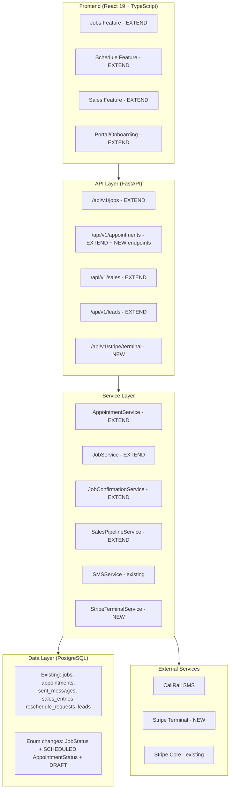
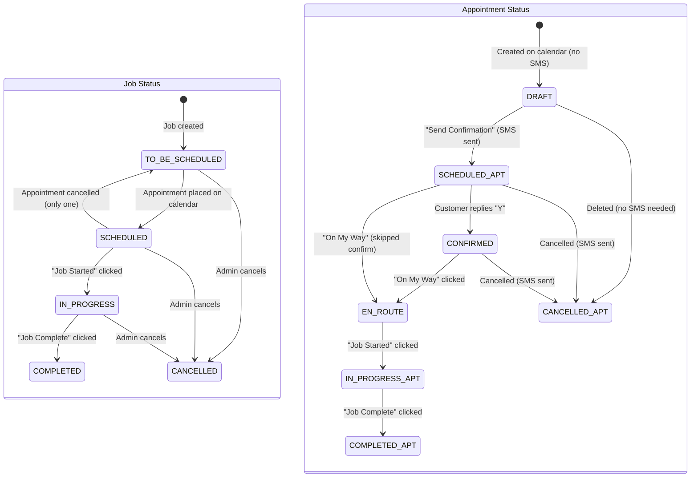
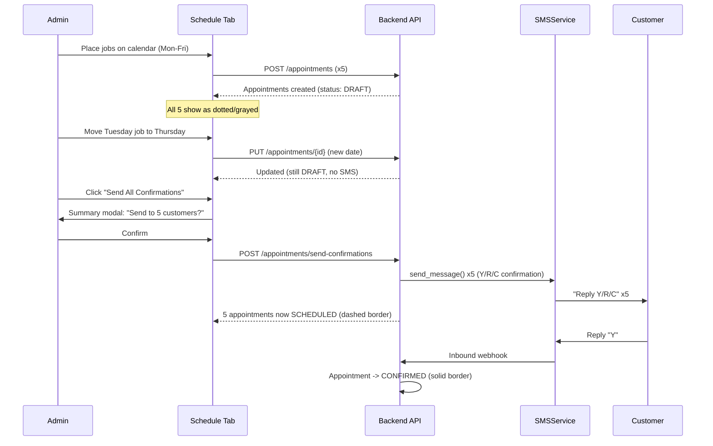
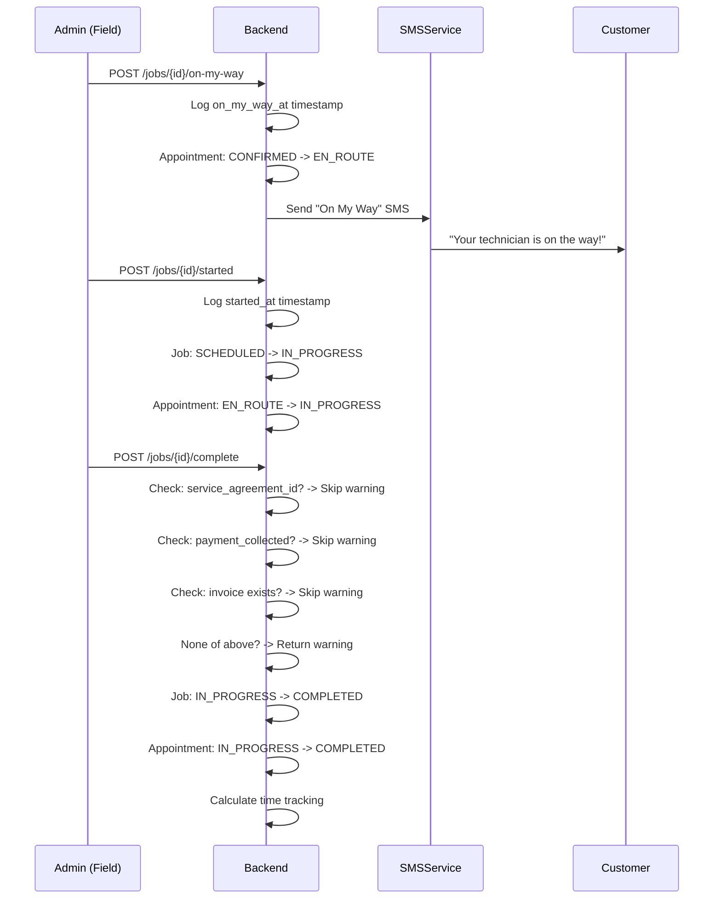
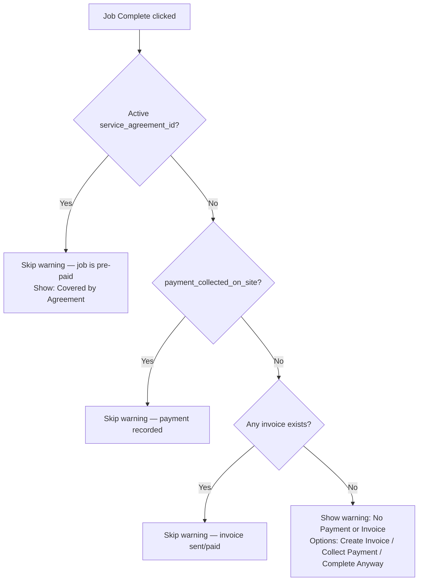
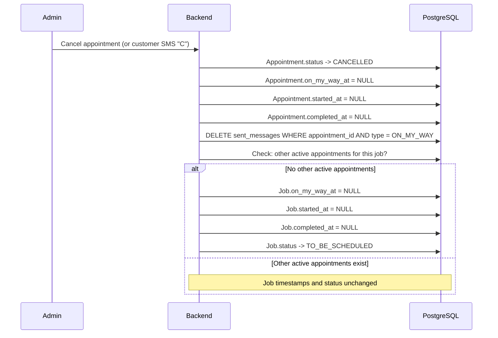
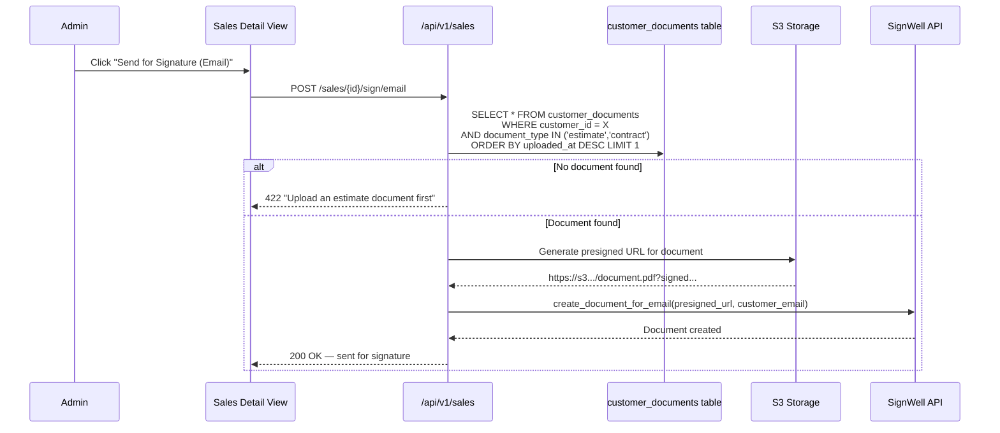

# Design Document: Smoothing Out After Update 2

## Overview

Smoothing Out After Update 2 addresses bugs, status model gaps, workflow friction, and UX issues discovered after the CRM Changes Update 2 implementation. The work spans four domains:

1. **Bugs & Data Integrity** (Req 1-4, 18): Google Review SMS fix, cancellation data cleanup, on-site status wiring, auth guard, appointment edit button wiring
2. **Workflow & Logic Gaps** (Req 5-10): Scheduled job status, no-estimate-jobs enforcement, payment warning fix, schedule draft mode, signing wiring, estimate calendar sync
3. **UX Improvements** (Req 11-15, 20): Job selector upgrade, mobile on-site view, onboarding week picker consolidation, reschedule follow-up SMS, cancellation SMS details, table horizontal scroll fix
4. **Payment Feature** (Req 16-17): Stripe Tap-to-Pay integration, payment path UI differentiation

External integration provisioning (email provider, SignWell API keys, S3 config, Twilio stub) is explicitly out of scope.

**Critical implementation ordering:**
- Req 4 (auth guard on POST /api/v1/jobs) is a security fix — do first
- Req 2 (cancellation data cleanup) and Req 3 (on-site status wiring) should be done before Req 5 (Scheduled status) since they modify the same transition tables
- Req 5 (Scheduled status) and Req 8 (draft mode) change the appointment creation flow together and should be implemented as a pair
- Req 7 (payment warning fix) is a quick win that unblocks daily workflow — prioritize early

## Architecture

The update modifies the existing vertical-slice architecture. No new slices are created — all changes extend existing services, endpoints, and components. One new external integration is added (Stripe Terminal for tap-to-pay).



### Cross-Cutting Concerns

- **Status transitions**: All job and appointment status changes go through the existing `VALID_STATUS_TRANSITIONS` / `VALID_APPOINTMENT_TRANSITIONS` dicts in `src/grins_platform/api/v1/jobs.py` (lines 45-57) and `src/grins_platform/api/v1/appointments.py` (lines 29-56). Both dicts are modified in this update.
- **SMS**: All outbound SMS (On My Way, confirmation, reschedule follow-up, cancellation detail, review push) routes through the existing `SMSService` -> `BaseSMSProvider` abstraction
- **Audit logging**: Force-completion overrides, Move-to-Jobs overrides for estimate-required jobs, and payment warning skips write to the existing audit log
- **Auth**: All endpoints use `CurrentActiveUser` dependency — the unguarded `POST /api/v1/jobs` is fixed in Req 4

## Components and Interfaces

### Modified Backend Services

#### 1. AppointmentService (`src/grins_platform/services/appointment_service.py`)

**Current state**: `request_google_review()` (lines 1050-1134) has consent check and 30-day dedup but never calls `sms_service.send_message()`. Appointment creation (lines 146-195) sets status to `SCHEDULED` and does not send SMS.

**Changes:**
- `request_google_review()`: Add `sms_service.send_message()` call with `MessageType.GOOGLE_REVIEW_REQUEST` and configurable review URL from `GOOGLE_REVIEW_URL` env var
- `create_appointment()`: Change initial status from `SCHEDULED` to `DRAFT`. Remove any SMS send from creation path.
- `cancel_appointment()`: Add logic to nullify on-site timestamps (`on_my_way_at`, `started_at`, `completed_at`) on the appointment and parent job. Clear related "On My Way" SMS send records.
- New method `send_confirmation(appointment_id)`: Send Y/R/C SMS and transition appointment from DRAFT to SCHEDULED
- New method `send_confirmations_bulk(appointment_ids_or_date_range)`: Batch send for multiple DRAFT appointments

#### 2. JobConfirmationService (`src/grins_platform/services/job_confirmation_service.py`)

**Current state**: `_handle_reschedule()` (lines 187-215) creates reschedule request and sends generic ack. `_handle_cancel()` (lines 217-241) transitions appointment to CANCELLED with generic auto-reply.

**Changes:**
- `_handle_reschedule()`: After creating reschedule request and sending acknowledgment, send a second follow-up SMS: "We'd be happy to reschedule. Please reply with 2-3 dates and times that work for you and we'll get you set up."
- `_handle_cancel()`: Replace generic auto-reply with detailed message including service type, original date/time, and business phone number from `BUSINESS_PHONE_NUMBER` env var

#### 3. On-Site Endpoints in jobs.py (`src/grins_platform/api/v1/jobs.py`)

**Current state**: `on_my_way` (lines 1092-1152) only logs timestamp and sends SMS. `started` (lines 1155-1186) only logs timestamp. `complete` (lines 912-1036) transitions job to COMPLETED but not appointment. Payment check only looks at `payment_collected_on_site` and invoice count — does not check `service_agreement_id`.

**Changes to `POST /api/v1/jobs/{job_id}/on-my-way`:**
- After logging timestamp and sending SMS, transition appointment status: CONFIRMED -> EN_ROUTE (also allow SCHEDULED -> EN_ROUTE for unconfirmed appointments)

**Changes to `POST /api/v1/jobs/{job_id}/started`:**
- After logging timestamp, transition job status: current -> IN_PROGRESS
- Transition appointment status: EN_ROUTE -> IN_PROGRESS (also allow CONFIRMED -> IN_PROGRESS for skipped On My Way)

**Changes to `POST /api/v1/jobs/{job_id}/complete`:**
- After transitioning job to COMPLETED, also transition appointment to COMPLETED
- Add service agreement check before payment warning: if `job.service_agreement_id` exists and agreement is active, skip the warning entirely
- Updated check order: (1) active service agreement -> skip, (2) payment_collected_on_site -> skip, (3) any invoice exists -> skip, (4) show warning

**Changes to `POST /api/v1/jobs/{job_id}/review-push`:**
- Currently uses hardcoded URL `"https://g.page/r/grins-irrigations/review"` (line 1371). Change to read from `GOOGLE_REVIEW_URL` env var with the hardcoded value as fallback.

#### 4. Job Creation in jobs.py (`src/grins_platform/api/v1/jobs.py`)

**Current state**: `POST /api/v1/jobs` (lines 515-571) has no auth guard — `CurrentActiveUser` dependency is missing.

**Changes:**
- Add `_user: CurrentActiveUser` parameter to the `create_job` endpoint function signature
- Add `requires_estimate_warning` flag to the response when auto-categorization results in `REQUIRES_ESTIMATE` and no `quoted_amount` is provided

#### 5. Lead Move-to-Jobs in leads.py

**Current state**: `POST /api/v1/leads/{id}/move-to-jobs` creates a job without checking if the lead's situation maps to `requires_estimate`.

**Changes:**
- Add a response field `requires_estimate_warning: bool` when the job type maps to `requires_estimate`
- Frontend consumes this to show a confirmation modal before proceeding

#### 6. SalesPipelineService / sales_pipeline.py (`src/grins_platform/api/v1/sales_pipeline.py`)

**Current state**: Email signing (line 241) and embedded signing (line 282) use hardcoded `pdf_url=f"/api/v1/sales/{entry_id}/contract.pdf"`.

**Changes:**
- Replace hardcoded URL with lookup: query `customer_documents` for the most recent document with `document_type` in ('estimate', 'contract') for the given sales entry's customer
- Generate S3 presigned URL for the found document
- Return 422 with message "Upload an estimate document first" if no qualifying document exists

#### 7. Sales Calendar Event Creation

**Current state**: Creating a calendar event on the Estimate Calendar does not affect the Sales_Entry status.

**Changes:**
- After creating a `sales_calendar_events` record, check if the linked `sales_entry` is at `schedule_estimate` status. If so, auto-advance to `estimate_scheduled`.

#### 8. NEW: StripeTerminalService (`src/grins_platform/services/stripe_terminal.py`)

New service for Stripe Terminal tap-to-pay integration:
- `create_connection_token() -> str`: Create Stripe Terminal connection token for the frontend SDK
- `create_payment_intent(amount_cents, currency, description) -> PaymentIntent`: Create a PaymentIntent for in-person collection
- `confirm_payment(payment_intent_id, invoice_id) -> dict`: Record confirmed payment on the invoice

### New and Modified API Endpoints

#### Jobs (modifications)
| Method | Path | Change |
|--------|------|--------|
| POST | `/api/v1/jobs` | **Add auth guard** (CurrentActiveUser dependency) |
| POST | `/api/v1/jobs/{id}/on-my-way` | **Add** appointment CONFIRMED/SCHEDULED -> EN_ROUTE transition |
| POST | `/api/v1/jobs/{id}/started` | **Add** job -> IN_PROGRESS, appointment -> IN_PROGRESS transitions |
| POST | `/api/v1/jobs/{id}/complete` | **Add** appointment -> COMPLETED transition, service agreement payment check |
| POST | `/api/v1/jobs/{id}/review-push` | **Fix** to actually send SMS via sms_service, use configurable review URL |

#### Appointments (new endpoints)
| Method | Path | Purpose |
|--------|------|---------|
| POST | `/api/v1/appointments/{id}/send-confirmation` | Send Y/R/C SMS, transition DRAFT -> SCHEDULED |
| POST | `/api/v1/appointments/send-confirmations` | Bulk send for list of IDs or date range filter |

#### Leads (modification)
| Method | Path | Change |
|--------|------|--------|
| POST | `/api/v1/leads/{id}/move-to-jobs` | **Add** `requires_estimate_warning` response flag |

#### Sales (modification)
| Method | Path | Change |
|--------|------|--------|
| POST | `/api/v1/sales/{id}/sign/email` | **Replace** hardcoded PDF URL with real uploaded document |
| POST | `/api/v1/sales/{id}/sign/embedded` | **Replace** hardcoded PDF URL with real uploaded document |
| POST | `/api/v1/sales/calendar/events` | **Add** auto-advance sales entry to "estimate_scheduled" |

#### Stripe Terminal (new)
| Method | Path | Purpose |
|--------|------|---------|
| POST | `/api/v1/stripe/terminal/connection-token` | Return Stripe Terminal connection token |
| POST | `/api/v1/stripe/terminal/create-payment-intent` | Create PaymentIntent for tap-to-pay |

### Frontend Component Changes

#### Jobs Feature (`frontend/src/features/jobs/components/`)

**OnSiteOperations.tsx** (lines 33-237):
- No functional changes needed — status transitions happen on the backend. The existing `useOnMyWay`, `useJobStarted`, `useCompleteJobWithWarning` hooks call the same endpoints; the backend now does more work per call.
- Add "Covered by Service Agreement - [name]" display when `job.service_agreement_id` is present, hiding "Create Invoice" and "Collect Payment" buttons
- Add responsive CSS media queries for mobile viewport (< 768px): stack buttons vertically, full-width, minimum 48px height

**JobDetail.tsx**:
- Add "Estimate Needed" amber badge when `job.category === "requires_estimate"`
- Add "Prepaid" / "Agreement" green badge when `job.service_agreement_id` is present
- Add conditional payment section rendering based on payment path (agreement / invoice / on-site)
- Add `tel:` link on customer phone number
- Add responsive CSS for mobile viewport

**JobList.tsx**:
- Add "Estimate Needed" badge column/indicator for `requires_estimate` jobs
- Add "Prepaid" badge for service-agreement-linked jobs
- Add "Schedule" quick-action button on TO_BE_SCHEDULED jobs that opens appointment creation pre-filled with job data
- Add filter option for `REQUIRES_ESTIMATE` category

#### Schedule Feature (`frontend/src/features/schedule/components/`)

**AppointmentForm.tsx** (job selector):
- Replace plain dropdown with searchable combobox
- Each option formatted as: "Customer Name - Job Type (Week of M/D)"
- Include customer address, property tags as small badges, service preference notes as secondary text
- Default sort by Week Of date (soonest first)

**Calendar visual states** (CSS changes):
- **DRAFT**: dotted border, grayed-out/opacity-reduced background
- **SCHEDULED** (unconfirmed): dashed border, muted color (existing)
- **CONFIRMED**: solid border, full color (existing)

**AppointmentDetail.tsx** (lines 432-440) — Edit button fix:
- The Edit button currently renders with no `onClick` handler — it is completely inert
- Add `onClick` handler that sets `editingAppointmentId` state in the parent `SchedulePage.tsx`
- Close the detail modal and open `AppointmentForm` in edit mode, pre-populated with the appointment's current data (date, time, job, staff, notes)
- On save, call `useUpdateAppointment()` mutation (`PUT /api/v1/appointments/{id}`), refresh the calendar, and re-open the detail modal with updated data
- The `AppointmentForm` component already supports edit mode (accepts optional `appointment` prop, sets `isEditing = !!appointment`)
- The `useUpdateAppointment()` hook and `appointmentApi.update()` are already implemented — only the wiring in `SchedulePage.tsx` is missing

**SchedulePage.tsx** — State management for edit flow:
- Add `editingAppointment: Appointment | null` state
- When Edit is clicked in `AppointmentDetail`, set `editingAppointment` to the current appointment, close the detail dialog, open the edit dialog
- On successful save or cancel, clear `editingAppointment`, refresh calendar queries
- If the edited appointment is SCHEDULED or CONFIRMED and the date/time changed, the backend handles sending a reschedule SMS (per draft mode rules, Req 8)

**New: SendConfirmationButton.tsx** — Per-appointment "Send Confirmation" icon/button on draft appointment cards

**New: SendDayConfirmationsButton.tsx** — "Send Confirmations for [Day]" button on each day column header

**New: SendAllConfirmationsButton.tsx** — Top-level "Send All Confirmations" button with count badge and summary modal

**PaymentCollector.tsx** (lines 37-153):
- Split into two paths: "Pay with Card (Tap to Pay)" and "Record Other Payment"
- "Pay with Card" triggers Stripe Terminal flow: create PaymentIntent -> discover reader -> collect payment
- "Record Other Payment" retains existing manual form (cash, check, venmo, zelle)
- Add Stripe Terminal SDK integration with `tap_to_pay` reader discovery

#### Sales Feature (`frontend/src/features/sales/components/`)

**StatusActionButton.tsx**:
- When current status is `schedule_estimate`: instead of calling `advance()` directly, open the calendar event creation dialog pre-filled with customer/property details. On save, backend handles status advance.

**Sign buttons (email/embedded)**:
- Disable with tooltip "Upload an estimate document first" when no estimate/contract document exists for the entry
- On multiple documents, show dropdown to select which one to sign

#### Portal/Onboarding Feature (`frontend/src/features/portal/components/`)

**WeekPickerStep.tsx** (lines 48-95):
- This is the surviving component — it already has per-service pickers restricted to valid month ranges via `SERVICE_MONTH_RANGES` (lines 14-23)
- Ensure it receives the correct service list from `services_with_types` based on the customer's selected tier
- Add "No preference" / "Assign for me" option per picker
- Remove or demote the general `preferred_schedule` (ASAP / 1-2 Weeks / etc.) selector if it exists in the onboarding flow

**Note:** The source doc mentioned a `ServiceWeekPreferences.tsx` component in the landing page repo (Grins_irrigation). Codebase search confirms this component does NOT exist in the platform frontend — only `WeekPickerStep.tsx` exists. The consolidation work is limited to ensuring `WeekPickerStep` is correctly wired and the landing page repo uses it (or its equivalent).

## Data Models

### Enum Modifications

#### JobStatus — Add SCHEDULED

```python
# In src/grins_platform/models/enums.py
class JobStatus(str, Enum):
    TO_BE_SCHEDULED = "to_be_scheduled"
    SCHEDULED = "scheduled"           # NEW — appointment created on calendar
    IN_PROGRESS = "in_progress"
    COMPLETED = "completed"
    CANCELLED = "cancelled"
```

#### AppointmentStatus — Add DRAFT

```python
# In src/grins_platform/models/enums.py
class AppointmentStatus(str, Enum):
    PENDING = "pending"
    DRAFT = "draft"                   # NEW — on calendar, no SMS sent yet
    SCHEDULED = "scheduled"
    CONFIRMED = "confirmed"
    EN_ROUTE = "en_route"
    IN_PROGRESS = "in_progress"
    COMPLETED = "completed"
    CANCELLED = "cancelled"
    NO_SHOW = "no_show"
```

### Transition Table Modifications

#### VALID_STATUS_TRANSITIONS (jobs.py lines 45-57)

```python
# Current
VALID_STATUS_TRANSITIONS: dict[str, list[str]] = {
    "to_be_scheduled": ["in_progress", "cancelled"],
    "in_progress": ["completed", "cancelled", "to_be_scheduled"],
    "completed": [],
    "cancelled": [],
}

# After update
VALID_STATUS_TRANSITIONS: dict[str, list[str]] = {
    "to_be_scheduled": ["scheduled", "in_progress", "cancelled"],
    "scheduled": ["in_progress", "to_be_scheduled", "cancelled"],
    "in_progress": ["completed", "cancelled"],
    "completed": [],
    "cancelled": [],
}
```

Key changes:
- `to_be_scheduled` can now reach `scheduled` (when appointment is created)
- `scheduled` is new — can go to `in_progress` (Job Started), back to `to_be_scheduled` (appointment cancelled), or `cancelled`
- `in_progress` no longer goes back to `to_be_scheduled` (use `cancelled` instead)

#### VALID_APPOINTMENT_TRANSITIONS (appointments.py lines 29-56)

```python
# After update — additions marked with # NEW
VALID_APPOINTMENT_TRANSITIONS: dict[str, list[str]] = {
    "pending": ["draft", "scheduled", "cancelled"],         # draft is NEW target
    "draft": ["scheduled", "cancelled"],                    # NEW status entirely
    "scheduled": ["confirmed", "en_route", "cancelled"],    # en_route is NEW target
    "confirmed": ["en_route", "in_progress", "cancelled", "no_show"],
    "en_route": ["in_progress", "cancelled", "no_show"],
    "in_progress": ["completed", "cancelled"],
    "completed": [],
    "cancelled": [],
    "no_show": [],
}
```

Key changes:
- `draft` is a new status: created on calendar, no SMS sent. Transitions to `scheduled` when confirmation is sent.
- `scheduled` can now reach `en_route` directly (On My Way clicked on unconfirmed appointment)

### Database Migration

One Alembic migration is needed for the enum changes:

#### Migration: `add_scheduled_and_draft_statuses`

```sql
-- Add SCHEDULED to JobStatus enum
ALTER TYPE jobstatus ADD VALUE IF NOT EXISTS 'scheduled' AFTER 'to_be_scheduled';

-- Add DRAFT to AppointmentStatus enum  
ALTER TYPE appointmentstatus ADD VALUE IF NOT EXISTS 'draft' AFTER 'pending';
```

No new tables. No new columns. The on-site timestamp fields (`on_my_way_at`, `started_at`, `completed_at`) already exist on the job and appointment models.

### Key Data Flow Diagrams

#### Complete Job + Appointment Lifecycle (Req 3, 5, 8, 18)



#### Schedule Draft Mode Flow (Req 8)



#### On-Site Status Progression (Req 3)



#### Payment Warning Decision Tree (Req 7, 17)



#### Cancellation Data Cleanup (Req 2)



#### Signing to Uploaded Documents Wiring (Req 9)



## Detailed Service Design

### On-Site Status Wiring (Req 3)

The core change is adding status transitions to three existing endpoints that currently only log timestamps. Each endpoint's existing behavior is preserved — status transitions are added alongside.

**on_my_way endpoint** (`src/grins_platform/api/v1/jobs.py` lines 1092-1152):

```python
# After existing timestamp logging and SMS send:
# Transition appointment to EN_ROUTE
appointment = await get_active_appointment_for_job(session, job_id)
if appointment and appointment.status in (
    AppointmentStatus.CONFIRMED.value,
    AppointmentStatus.SCHEDULED.value,  # Allow from unconfirmed too
):
    appointment.status = AppointmentStatus.EN_ROUTE.value
    await session.flush()
```

**started endpoint** (`src/grins_platform/api/v1/jobs.py` lines 1155-1186):

```python
# After existing timestamp logging:
# Transition job to IN_PROGRESS
if job.status in (JobStatus.TO_BE_SCHEDULED.value, JobStatus.SCHEDULED.value):
    job.status = JobStatus.IN_PROGRESS.value

# Transition appointment to IN_PROGRESS
appointment = await get_active_appointment_for_job(session, job_id)
if appointment and appointment.status in (
    AppointmentStatus.EN_ROUTE.value,
    AppointmentStatus.CONFIRMED.value,  # Skip scenario: On My Way was skipped
):
    appointment.status = AppointmentStatus.IN_PROGRESS.value
    await session.flush()
```

**complete endpoint** (`src/grins_platform/api/v1/jobs.py` lines 912-1036):

```python
# After existing job -> COMPLETED transition:
# Also complete the appointment
appointment = await get_active_appointment_for_job(session, job_id)
if appointment and appointment.status not in (
    AppointmentStatus.COMPLETED.value,
    AppointmentStatus.CANCELLED.value,
    AppointmentStatus.NO_SHOW.value,
):
    appointment.status = AppointmentStatus.COMPLETED.value
    await session.flush()
```

**Helper function needed:**

```python
async def get_active_appointment_for_job(session, job_id) -> Appointment | None:
    """Get the most recent non-terminal appointment for a job."""
    terminal = {AppointmentStatus.COMPLETED.value, AppointmentStatus.CANCELLED.value, AppointmentStatus.NO_SHOW.value}
    stmt = (
        select(Appointment)
        .where(Appointment.job_id == job_id)
        .where(Appointment.status.not_in(terminal))
        .order_by(Appointment.created_at.desc())
        .limit(1)
    )
    result = await session.execute(stmt)
    return result.scalar_one_or_none()
```

### Cancellation Data Cleanup (Req 2)

When a job or appointment is cancelled, on-site timestamps must be reset to prevent stale data from carrying over to rescheduled work.

**Location:** Add cleanup logic to the existing cancellation handlers:
- `src/grins_platform/api/v1/appointments.py` — appointment cancel endpoint
- `src/grins_platform/services/job_confirmation_service.py` — `_handle_cancel()` (lines 217-241)
- `src/grins_platform/api/v1/jobs.py` — job cancel endpoint

**Cleanup function:**

```python
async def clear_on_site_data(session, appointment: Appointment, job: Job | None = None):
    """Reset on-site operation fields after cancellation."""
    # Clear appointment timestamps
    appointment.on_my_way_at = None
    appointment.started_at = None
    appointment.completed_at = None

    # Clear On My Way SMS records so replacement appointment can send new SMS
    await session.execute(
        delete(SentMessage).where(
            SentMessage.appointment_id == appointment.id,
            SentMessage.message_type == MessageType.ON_MY_WAY.value,
        )
    )

    # If job provided and no other active appointments, clear job timestamps too
    if job:
        active_count = await count_active_appointments(session, job.id, exclude=appointment.id)
        if active_count == 0:
            job.on_my_way_at = None
            job.started_at = None
            job.completed_at = None

    await session.flush()
```

### Payment Warning Enhancement (Req 7)

Modify the existing payment check in `complete_job()` (jobs.py lines 947-972):

```python
# NEW: Check service agreement first
if job.service_agreement_id:
    agreement = await session.get(ServiceAgreement, job.service_agreement_id)
    if agreement and agreement.status == "active" and not agreement.is_expired:
        # Pre-paid via service agreement — skip warning entirely
        # Proceed directly to completion
        pass  # fall through to completion logic
    else:
        # Agreement exists but is expired/cancelled — proceed with normal check
        pass

# Existing check (only reached if no active agreement)
has_payment = bool(job.payment_collected_on_site)
if not has_payment:
    inv_count = await count_invoices_for_job(session, job_id)
    has_invoice = inv_count > 0
else:
    has_invoice = True

if not has_payment and not has_invoice and not force:
    return JobCompleteResponse(
        completed=False,
        warning="No Payment or Invoice on File",
        job=None,
    )
```

### Schedule Draft Mode (Req 8)

**Appointment creation change:**

Currently `create_appointment()` in `appointment_service.py` (line 170) sets:
```python
status=AppointmentStatus.SCHEDULED.value
```

Change to:
```python
status=AppointmentStatus.DRAFT.value
```

**New endpoint — send single confirmation:**

```python
@router.post("/api/v1/appointments/{appointment_id}/send-confirmation")
async def send_confirmation(
    appointment_id: UUID,
    user: CurrentActiveUser,
    service: AppointmentService = Depends(get_appointment_service),
):
    """Send Y/R/C confirmation SMS and transition DRAFT -> SCHEDULED."""
    appointment = await service.get_appointment(appointment_id)
    if appointment.status != AppointmentStatus.DRAFT.value:
        raise HTTPException(422, "Appointment is not in DRAFT status")

    await service.send_confirmation_sms(appointment)
    appointment.status = AppointmentStatus.SCHEDULED.value
    return {"sent": True, "appointment_id": appointment_id}
```

**New endpoint — bulk send:**

```python
@router.post("/api/v1/appointments/send-confirmations")
async def send_confirmations_bulk(
    request: BulkSendRequest,  # {appointment_ids?: list[UUID], date_range?: {start, end}}
    user: CurrentActiveUser,
    service: AppointmentService = Depends(get_appointment_service),
):
    """Send confirmations for multiple DRAFT appointments."""
    drafts = await service.get_draft_appointments(request.appointment_ids, request.date_range)
    sent_count = 0
    for appointment in drafts:
        await service.send_confirmation_sms(appointment)
        appointment.status = AppointmentStatus.SCHEDULED.value
        sent_count += 1
    return {"sent_count": sent_count, "total": len(drafts)}
```

**Post-send reschedule detection:**

When a SCHEDULED or CONFIRMED appointment's date/time is modified:
```python
# In appointment update endpoint
if old_status in ("scheduled", "confirmed") and (date_changed or time_changed):
    await sms_service.send_message(
        to=customer.phone,
        body=f"Your appointment has been moved to {new_date} at {new_time}. Reply Y/R/C.",
        message_type=MessageType.APPOINTMENT_CONFIRMATION,
    )
    appointment.status = AppointmentStatus.SCHEDULED.value  # Reset to unconfirmed
```

### Stripe Tap-to-Pay Integration (Req 16)

**New service:** `src/grins_platform/services/stripe_terminal.py`

```python
class StripeTerminalService:
    def __init__(self, stripe_settings):
        self.stripe = stripe_settings

    async def create_connection_token(self) -> str:
        """Create a connection token for the Stripe Terminal SDK."""
        token = stripe.terminal.ConnectionToken.create()
        return token.secret

    async def create_payment_intent(
        self, amount_cents: int, currency: str = "usd", description: str = ""
    ) -> stripe.PaymentIntent:
        """Create a PaymentIntent for in-person tap-to-pay collection."""
        return stripe.PaymentIntent.create(
            amount=amount_cents,
            currency=currency,
            description=description,
            payment_method_types=["card_present"],
            capture_method="automatic",
        )
```

**Frontend integration in PaymentCollector.tsx:**

The existing component (lines 37-153) supports payment methods: credit_card, cash, check, venmo, zelle, send_invoice. The change splits this into two entry points:

1. **"Pay with Card (Tap to Pay)"** — New flow:
   - Call `POST /api/v1/stripe/terminal/connection-token` to initialize Terminal SDK
   - Call `POST /api/v1/stripe/terminal/create-payment-intent` with invoice amount
   - Discover reader via `discoverReaders({ simulated: false, method: 'tap_to_pay' })`
   - Collect payment via `collectPaymentMethod(paymentIntent.client_secret)`
   - On success: update invoice to PAID, show receipt option

2. **"Record Other Payment"** — Existing manual form (cash, check, venmo, zelle)

### No-Estimate-Jobs Enforcement (Req 6)

**Backend — Move to Jobs guard:**

In the leads move-to-jobs endpoint, after determining the job type:
```python
job_category = auto_categorize_job_type(lead.situation)
if job_category == "requires_estimate":
    return MoveToJobsResponse(
        success=True,
        job=created_job,
        requires_estimate_warning=True,
        message="This job type typically requires an estimate.",
    )
```

**Frontend — Confirmation modal in Leads tab:**

When `requires_estimate_warning` is true in the response, show a modal:
- Title: "This job type requires an estimate"
- Body: "Move to Jobs anyway, or move to Sales for the estimate workflow?"
- Buttons: "Move to Jobs" (proceed), "Move to Sales" (redirect), "Cancel"

**Frontend — Visual badge in Jobs tab:**

In `JobList.tsx`, add an amber "Estimate Needed" badge when `job.category === "requires_estimate"`.

### Estimate Calendar / Pipeline Sync (Req 10)

**Backend change** in sales calendar event creation endpoint:

```python
# After creating the calendar event:
sales_entry = await session.get(SalesEntry, event.sales_entry_id)
if sales_entry.status == SalesEntryStatus.SCHEDULE_ESTIMATE.value:
    sales_entry.status = SalesEntryStatus.ESTIMATE_SCHEDULED.value
    sales_entry.updated_at = datetime.utcnow()
```

**Frontend change** in `StatusActionButton.tsx`:

When `status === "schedule_estimate"`, instead of calling `advance()`:
- Open the calendar event creation dialog pre-filled with customer name, property address
- On save, the backend handles the status advance automatically

### Job Selector Upgrade (Req 11)

**Backend:** Verify the jobs list endpoint used by the scheduler returns customer name, address, property tags, and service preferences along with job data. The existing `GET /api/v1/jobs` likely includes customer joins — verify and extend if needed.

**Frontend:** Replace the plain `<select>` in `AppointmentForm.tsx` with a searchable combobox:

```typescript
// Option rendering
const formatJobOption = (job: Job) => ({
  label: `${job.customer_name} — ${job.job_type} (Week of ${job.week_of})`,
  sublabel: `${job.customer_address} ${job.property_tags.join(' ')}`,
  hint: job.service_preference_notes,
  value: job.id,
});
```

### Mobile On-Site View (Req 12)

Responsive CSS changes to `OnSiteOperations.tsx` and `JobDetail.tsx`:

```css
@media (max-width: 768px) {
  .on-site-buttons {
    display: flex;
    flex-direction: column;
    gap: 12px;
    order: -1; /* Move to top */
  }

  .on-site-buttons button {
    width: 100%;
    min-height: 48px;
    font-size: 16px; /* Prevent iOS zoom */
  }

  .job-info-section {
    order: 1;
  }

  .photo-input {
    /* Trigger device camera */
    capture: environment;
  }
}
```

Key mobile changes:
- Status buttons stacked vertically, full-width, at top of page
- Minimum 48px button height for tap targets
- `capture="environment"` on photo input for camera access
- `tel:` link on customer phone number
- Payment warning modal properly constrained to viewport

### Table Horizontal Scroll Fix (Req 20)

**Root cause:** The shared table container in `frontend/src/components/ui/table.tsx` (line 7-9) uses `overflow-hidden`, which clips any content that extends beyond the container width. On the Leads tab (12 columns including action buttons on the far right), this makes the Source column and action buttons unreachable on smaller viewports.

**Fix:** One-line CSS change in the shared `table.tsx` component:

```diff
- overflow-hidden bg-white rounded-2xl shadow-sm border border-slate-100
+ overflow-x-auto bg-white rounded-2xl shadow-sm border border-slate-100
```

This change applies globally to all tables using the shared component (Leads, Jobs, Invoices, Customers, Sales), giving them horizontal scroll when content overflows. On wide viewports where all columns fit, no scrollbar appears.

**Rounded corner preservation:** Tailwind's `overflow-x-auto` preserves `border-radius` and `box-shadow` on the container. The inner table content scrolls while the outer container keeps its rounded shape and border. No additional wrappers needed.

## Error Handling

### New/Modified Error Scenarios

| Scenario | HTTP Status | Error |
|----------|-------------|-------|
| Unauthenticated `POST /api/v1/jobs` | 401 Unauthorized | `not_authenticated` |
| Send confirmation on non-DRAFT appointment | 422 Unprocessable | `invalid_appointment_status` |
| Sign document with no uploaded estimate | 422 Unprocessable | `no_document_to_sign` |
| Stripe Terminal connection failure | 502 Bad Gateway | `stripe_terminal_error` |
| PaymentIntent creation failure | 502 Bad Gateway | `payment_intent_failed` |
| Cancel already-terminal appointment/job | 422 Unprocessable | `invalid_status_transition` (existing) |

### SMS Error Handling

All SMS sends in this update (On My Way, confirmation, reschedule follow-up, cancellation detail, review push) follow the existing pattern: errors are logged but do not block the operation. If the SMS fails to send, the status transition and timestamp logging still succeed. The admin sees a toast notification about the SMS failure.

## Security Considerations

### Authentication
- **Critical fix (Req 4):** `POST /api/v1/jobs` gets `CurrentActiveUser` dependency. This is a one-line change that closes an unauthenticated endpoint.
- All new endpoints (`/appointments/send-confirmation`, `/appointments/send-confirmations`, `/stripe/terminal/*`) require `CurrentActiveUser`.

### Stripe Terminal
- Connection tokens are short-lived (server-generated, not stored)
- PaymentIntents use `card_present` payment method type only (in-person)
- `STRIPE_TERMINAL_LOCATION_ID` stored as env var (never in code)
- All Stripe Terminal SDK calls happen client-side over Stripe's secure connection

### Data Integrity
- On-site timestamp cleanup (Req 2) runs within the same database transaction as the cancellation, ensuring atomic cleanup
- Status transitions are validated against `VALID_STATUS_TRANSITIONS` / `VALID_APPOINTMENT_TRANSITIONS` dicts — invalid transitions raise 422

## Correctness Properties (Property-Based Testing)

### Property 1: Job Status Transition Validity (Req 3, 5, 18)
```
FOR ALL job status transitions triggered by on-site buttons:
  new_status IN VALID_STATUS_TRANSITIONS[current_status]
```

### Property 2: Appointment Status Transition Validity (Req 3, 8, 18)
```
FOR ALL appointment status transitions:
  new_status IN VALID_APPOINTMENT_TRANSITIONS[current_status]
```

### Property 3: Job-Appointment Status Consistency (Req 18)
```
FOR ALL on-site button clicks:
  both job and appointment transition in the same database transaction
  IF job transitions, appointment also transitions (or is already terminal)
```

### Property 4: Cancellation Cleanup Completeness (Req 2)
```
FOR ALL cancelled appointments:
  appointment.on_my_way_at IS NULL
  appointment.started_at IS NULL
  appointment.completed_at IS NULL
  IF no other active appointments for job:
    job.on_my_way_at IS NULL
    job.started_at IS NULL
    job.completed_at IS NULL
```

### Property 5: Draft Appointment SMS Silence (Req 8)
```
FOR ALL DRAFT appointments:
  creating appointment sends 0 SMS
  moving/deleting appointment sends 0 SMS
  ONLY send_confirmation() triggers SMS
```

### Property 6: Payment Warning Skip for Agreements (Req 7)
```
FOR ALL jobs WHERE service_agreement_id IS NOT NULL AND agreement.status = 'active':
  complete_job(force=false) returns completed=true (no warning)
```

### Property 7: Scheduled Status Revert (Req 5)
```
FOR ALL jobs in SCHEDULED status:
  IF last active appointment is cancelled:
    job.status = TO_BE_SCHEDULED
  IF other active appointments remain:
    job.status = SCHEDULED (unchanged)
```

### Property 8: Auth Guard Enforcement (Req 4)
```
FOR ALL requests to POST /api/v1/jobs without valid auth token:
  response.status_code = 401
```

## Testing Strategy

### Unit Tests

- `test_on_site_status_transitions.py` — On My Way/Started/Complete transitions for both job and appointment, skip scenarios, edge cases
- `test_cancellation_cleanup.py` — Timestamp nullification, SMS record cleanup, multi-appointment scenarios
- `test_payment_warning_logic.py` — Service agreement skip, payment skip, invoice skip, warning shown
- `test_draft_appointment_flow.py` — Draft creation (no SMS), send confirmation (SMS + status change), bulk send
- `test_google_review_sms.py` — SMS actually sent, consent check, 30-day dedup
- `test_job_creation_auth.py` — Unauthenticated returns 401, authenticated succeeds
- `test_signing_document_wiring.py` — Real document lookup, presigned URL generation, 422 when no document
- `test_estimate_calendar_sync.py` — Calendar event auto-advances sales entry status
- `test_reschedule_followup_sms.py` — Follow-up SMS sent after reschedule request creation
- `test_cancellation_sms_details.py` — Cancellation SMS includes service type, date, time, phone number

### Functional Tests (Real DB)

- `test_on_site_full_flow_functional.py` — Create appointment -> On My Way -> Started -> Complete with status verification at each step
- `test_draft_to_confirmed_functional.py` — Create DRAFT -> send confirmation -> customer Y reply -> CONFIRMED
- `test_cancellation_rescheduling_functional.py` — Create appointment -> cancel -> verify cleanup -> create new appointment -> verify clean state

### Integration Tests

- `test_stripe_terminal_integration.py` — Connection token, PaymentIntent creation (Stripe test mode)
- `test_job_selector_data.py` — Jobs list endpoint returns customer name, address, tags for selector

## Performance Considerations

- **Status transitions**: Each on-site button click now does 1-2 additional status updates (job + appointment) within the existing transaction. Negligible performance impact — both updates hit indexed primary keys.
- **Draft appointment queries**: "Send All Confirmations" may query all DRAFT appointments for a week. Index on `appointments.status` already exists. Expected: <50 appointments per week for a single-admin operation.
- **Cancellation cleanup**: Deleting On My Way SMS records uses `appointment_id` index. Counting active appointments uses `job_id` index. Both are fast.
- **Job selector combobox**: Loading all TO_BE_SCHEDULED jobs with customer joins for the searchable dropdown. Expected: <100 jobs at any time for this business scale. If this grows, add server-side search.
- **Stripe Terminal**: Connection tokens and PaymentIntents are single Stripe API calls (~200ms each). Reader discovery happens client-side.

## Out of Scope (Req 19)

The following are explicitly excluded from this spec:
- Email provider integration (AWS SES / SendGrid / Postmark) — `_send_email()` placeholder remains
- SignWell API key provisioning — operational task, code is ready
- S3 bucket/credential configuration — operational task, code is ready
- Twilio SMS provider implementation — CallRail is active, stub remains
- Staff/admin RBAC — single-admin scope continues
- AI routing / Generate Routes — separate team
