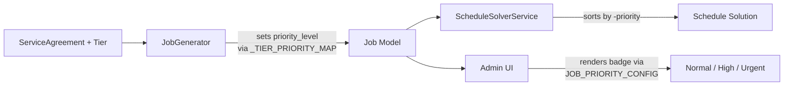

# Design Document: Tier-Priority Scheduling

## Overview

The platform advertises tier-based priority scheduling for Professional and Premium service agreement customers, but the `JobGenerator` never sets `priority_level` during job creation — all jobs default to 0 (normal). The scheduler and UI already consume `priority_level` correctly, so the fix is surgical: add a `_TIER_PRIORITY_MAP` constant to `job_generator.py` and use it when constructing `Job` objects.

This is a one-file backend change. The scheduler (`schedule_solver_service.py`) already sorts by `-j.priority` descending. The frontend (`JobList.tsx`, `JobDetail.tsx`) already renders priority badges via `JOB_PRIORITY_CONFIG`. No schema migrations, no API changes, no frontend changes.

## Architecture



The change sits entirely in the `JobGenerator → Job` edge. Everything downstream already works.

### What exists and needs NO changes

| Component | File | Why it's already done |
|---|---|---|
| Job model | `models/job.py` | `priority_level: Mapped[int]` with `server_default="0"` already exists |
| Schedule solver | `services/schedule_solver_service.py` | Sorts by `(-j.priority, j.location.city)` in greedy assignment |
| Job-to-ScheduleJob converter | `services/schedule_solver_service.py` | `job_to_schedule_job()` maps `job.priority_level` → `ScheduleJob.priority` |
| Job list UI | `frontend/.../JobList.tsx` | Priority column with Normal/High/Urgent badges |
| Job detail UI | `frontend/.../JobDetail.tsx` | Priority badge via `getJobPriorityConfig()` |
| Frontend types | `frontend/.../types/index.ts` | `JOB_PRIORITY_CONFIG` maps 0→Normal, 1→High, 2→Urgent |

### What needs to change

| Component | File | Change |
|---|---|---|
| Job generator | `services/job_generator.py` | Add `_TIER_PRIORITY_MAP` constant, use it in `generate_jobs()` |

## Components and Interfaces

### `_TIER_PRIORITY_MAP` (new constant)

A module-level dictionary in `job_generator.py` mapping tier names to priority levels:

```python
_TIER_PRIORITY_MAP: dict[str, int] = {
    "Essential": 0,      # normal
    "Professional": 1,   # high
    "Premium": 2,        # urgent
}
```

Winterization-only tiers are not in this map — they default to 0 (normal) via explicit handling.

### `JobGenerator.generate_jobs()` (modified method)

The method already resolves `tier_name = agreement.tier.name` and `tier_slug = agreement.tier.slug`. The change adds priority resolution after job spec lookup:

```python
# Resolve priority from tier
if tier_slug.startswith("winterization-only-"):
    priority = 0
else:
    priority = _TIER_PRIORITY_MAP.get(tier_name, 0)
```

Then passes `priority_level=priority` to the `Job()` constructor inside the loop.

### Interface contract

- Input: `agreement.tier.name` (str) — one of "Essential", "Professional", "Premium"
- Input: `agreement.tier.slug` (str) — may start with "winterization-only-"
- Output: `job.priority_level` (int) — 0, 1, or 2
- Invariant: all jobs from the same agreement get the same `priority_level`

## Data Models

### No schema changes required

The `Job` model already has:

```python
priority_level: Mapped[int] = mapped_column(
    Integer,
    nullable=False,
    server_default="0",
)
```

### `_TIER_PRIORITY_MAP` values

| Tier Name | Slug Pattern | priority_level | Badge Label |
|---|---|---|---|
| Essential | `essential-*` | 0 | Normal |
| Professional | `professional-*` | 1 | High |
| Premium | `premium-*` | 2 | Urgent |
| *(winterization-only)* | `winterization-only-*` | 0 | Normal |

### Round-trip mapping

The mapping is invertible for the three main tiers:

| priority_level | Tier Name |
|---|---|
| 0 | Essential (or winterization-only) |
| 1 | Professional |
| 2 | Premium |

Note: priority_level 0 maps to both Essential and winterization-only tiers. The round-trip property (Requirement 4.3) holds for the three main tiers (Essential, Professional, Premium) but winterization-only is a special case that shares priority 0 with Essential.


## Correctness Properties

*A property is a characteristic or behavior that should hold true across all valid executions of a system — essentially, a formal statement about what the system should do. Properties serve as the bridge between human-readable specifications and machine-verifiable correctness guarantees.*

### Property 1: Tier-to-priority mapping correctness

*For any* service agreement with a valid tier name (Essential, Professional, or Premium), all jobs generated by `JobGenerator.generate_jobs()` shall have a `priority_level` equal to `_TIER_PRIORITY_MAP[tier_name]`. Specifically: Essential→0, Professional→1, Premium→2. For winterization-only tiers (detected by slug prefix), `priority_level` shall be 0.

Additionally, *for any* single agreement that produces multiple jobs, all jobs in the batch shall have the same `priority_level` value.

**Validates: Requirements 1.1, 1.2, 1.3, 1.4, 1.5, 4.2**

### Property 2: Scheduler priority ordering

*For any* list of jobs with varying `priority_level` values, the schedule solver's greedy assignment shall process jobs in descending `priority_level` order. When two jobs have equal `priority_level`, secondary sort by city shall determine order.

**Validates: Requirements 2.1, 2.2, 2.3**

### Property 3: Priority badge label mapping

*For any* valid `priority_level` value (0, 1, or 2), the `JOB_PRIORITY_CONFIG` lookup shall return the correct label: 0→"Normal", 1→"High", 2→"Urgent". Both the job list and job detail views use this same config.

**Validates: Requirements 3.1, 3.2, 3.3, 3.4, 3.5**

### Property 4: Priority persistence through lifecycle

*For any* job created with a `priority_level` by the generator, the `priority_level` value shall remain unchanged after scheduling, status transitions (approved → scheduled → in_progress → completed → closed), and completion.

**Validates: Requirements 4.1**

### Property 5: Tier-priority mapping round-trip

*For any* of the three main tier names (Essential, Professional, Premium), mapping tier→priority via `_TIER_PRIORITY_MAP` and then mapping priority→tier via the inverse map shall produce the original tier name. This confirms the mapping is bijective for the main tiers.

**Validates: Requirements 4.3**

## Error Handling

### Unknown tier name

If `agreement.tier.name` is not found in `_TIER_PRIORITY_MAP` and the slug does not start with `"winterization-only-"`, the existing `ValueError` is raised before priority resolution is needed (the `job_specs` lookup fails first). No additional error handling is required for the priority mapping itself.

If a defensive approach is desired, `_TIER_PRIORITY_MAP.get(tier_name, 0)` provides a safe fallback to priority 0 for any unexpected tier name. This is the recommended approach since it matches the database `server_default="0"`.

### Invalid priority_level values

The `priority_level` field is an integer with `server_default="0"`. The `_TIER_PRIORITY_MAP` only produces values 0, 1, or 2. The frontend `getJobPriorityConfig()` already falls back to `JOB_PRIORITY_CONFIG[0]` for unknown values. No additional validation is needed.

## Testing Strategy

### Dual testing approach

This feature requires both unit tests and property-based tests:

- **Unit tests** (pytest): Verify specific examples, edge cases (winterization-only), and the error path for unknown tiers
- **Property-based tests** (Hypothesis): Verify universal properties across randomly generated tier/agreement combinations

### Property-based testing configuration

- Library: **Hypothesis** (already in use in the project, see `.hypothesis/` directory)
- Minimum iterations: **100 per property test**
- Each property test must reference its design document property with a tag comment
- Tag format: `# Feature: tier-priority-scheduling, Property {number}: {property_text}`

### Test plan

| Test Type | Property | What to test | File |
|---|---|---|---|
| PBT | Property 1 | Generate random tier names from {Essential, Professional, Premium}, create mock agreements, run `generate_jobs()`, verify all jobs get correct `priority_level` | `tests/unit/test_pbt_tier_priority.py` |
| PBT | Property 2 | Generate random job lists with varying priorities, run solver, verify assignment order respects priority descending | `tests/unit/test_pbt_tier_priority.py` |
| PBT | Property 3 | Generate random priority_level values from {0, 1, 2}, verify `JOB_PRIORITY_CONFIG` returns correct label | `tests/unit/test_pbt_tier_priority.py` |
| Unit | Property 1 edge case | Winterization-only tier gets priority 0 | `tests/unit/test_pbt_tier_priority.py` |
| Unit | Property 5 | Round-trip: tier→priority→tier for all three main tiers | `tests/unit/test_pbt_tier_priority.py` |
| Unit | Property 4 | Create job with priority, simulate status transitions, verify priority unchanged | `tests/unit/test_pbt_tier_priority.py` |

### What NOT to test (already covered)

- Scheduler sorting logic — already implemented and tested in `schedule_solver_service.py`
- Frontend badge rendering — already implemented and tested in `JobList.test.tsx` and `JobDetail.tsx`
- Job model schema — no changes to the model

### Each correctness property must be implemented by a SINGLE property-based test

- Property 1 → one `@given` test with random tier selection
- Property 2 → one `@given` test with random job list generation (verification only, solver is already implemented)
- Property 3 → one `@given` test with random priority level selection
- Property 4 → unit test (lifecycle is integration-level, mock status transitions)
- Property 5 → unit test (only 3 values to round-trip, exhaustive is sufficient)
